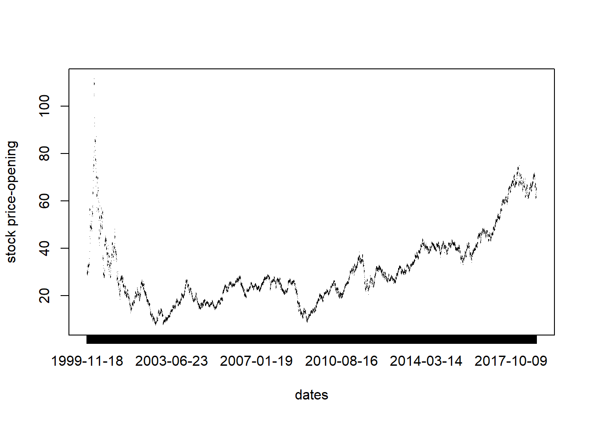
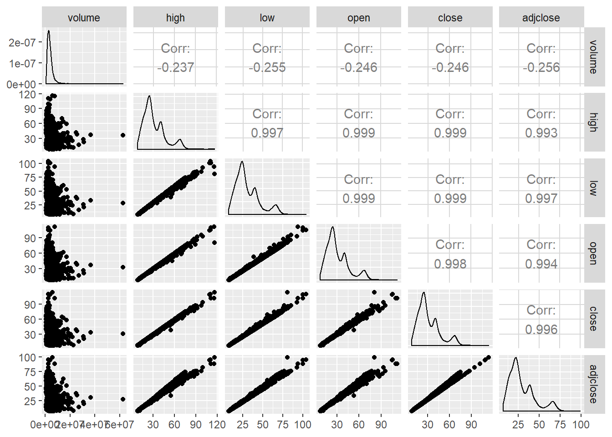

## Libraries


```r
library(GGally)
```

```
## Loading required package: ggplot2
```

```
## Registered S3 method overwritten by 'GGally':
##   method from   
##   +.gg   ggplot2
```


## Setup

```r
a <- read.csv("../datasets/A.csv")
dim(a)
```

```
## [1] 4771    7
```

```r
head(a, 5)
```

```
##         date  volume  open close  high   low adjclose
## 1 2018-11-02 2272100 65.80 65.93 66.61 65.44    65.93
## 2 2018-11-01 1882400 65.07 65.22 65.34 64.58    65.22
## 3 2018-10-31 3820700 64.35 64.79 65.98 64.19    64.79
## 4 2018-10-30 3076700 62.35 63.64 63.72 61.68    63.64
## 5 2018-10-29 2919900 63.65 62.08 64.17 61.13    62.08
```

```r
print(a)
```

```
##            date   volume       open      close       high        low  adjclose
## 1    2018-11-02  2272100  65.800003  65.930000  66.610001  65.440002 65.930000
## 2    2018-11-01  1882400  65.070000  65.220001  65.339996  64.580002 65.220001
## 3    2018-10-31  3820700  64.349998  64.790001  65.980003  64.190002 64.790001
## 4    2018-10-30  3076700  62.349998  63.639999  63.720001  61.680000 63.639999
## 5    2018-10-29  2919900  63.650002  62.080002  64.169998  61.130001 62.080002
## 6    2018-10-26  3119900  61.820000  62.730000  63.110001  61.130001 62.730000
## 7    2018-10-25  3318300  61.490002  62.610001  62.889999  61.070000 62.610001
## 8    2018-10-24  3481200  62.919998  61.130001  63.759998  61.009998 61.130001
## 9    2018-10-23  4219800  62.820000  62.730000  63.130001  61.380001 62.730000
## 10   2018-10-22  2227900  64.690002  64.279999  64.839996  63.540001 64.279999
## 11   2018-10-19  2418300  65.809998  64.470001  66.239998  64.239998 64.470001
## 12   2018-10-18  2327300  67.120003  65.750000  67.199997  65.260002 65.750000
## 13   2018-10-17  1991200  67.169998  67.199997  67.459999  66.309998 67.199997
## 14   2018-10-16  1868300  66.250000  67.459999  67.570000  65.989998 67.459999
## 15   2018-10-15  1602800  65.919998  65.629997  66.349998  65.360001 65.629997
## 16   2018-10-12  3669500  66.099998  66.239998  67.029999  65.300003 66.239998
## 17   2018-10-11  3624200  66.639999  64.889999  66.970001  64.620003 64.889999
## 18   2018-10-10  3055700  69.410004  66.669998  69.410004  66.610001 66.669998
## 19   2018-10-09  2179200  69.339996  69.410004  69.629997  68.709999 69.410004
## 20   2018-10-08  2179400  69.959999  69.500000  70.050003  68.970001 69.500000
## 21   2018-10-05  2376800  70.669998  70.300003  71.180000  69.449997 70.300003
## 22   2018-10-04  2961800  71.919998  70.660004  72.129997  70.480003 70.660004
## 23   2018-10-03  3203100  71.680000  72.120003  72.370003  71.599998 72.120003
## 24   2018-10-02  2617500  71.239998  71.680000  71.730003  70.980003 71.680000
## 25   2018-10-01  2837500  70.680000  71.260002  71.580002  70.650002 71.260002
## 26   2018-09-28  2248100  70.690002  70.540001  71.000000  70.459999 70.390999
## 27   2018-09-27  1581700  70.580002  70.800003  70.849998  70.099998 70.650452
## 28   2018-09-26  1830300  70.570000  70.330002  70.989998  70.050003 70.181442
## 29   2018-09-25  2090200  70.169998  70.379997  70.830002  69.910004 70.231339
## 30   2018-09-24  2333600  70.680000  69.949997  70.680000  69.699997 69.802246
## 31   2018-09-21  3119700  71.430000  70.720001  71.459999  70.559998 70.570625
## 32   2018-09-20  2865600  69.730003  71.129997  71.160004  69.699997 70.979752
## 33   2018-09-19  1183400  69.040001  69.559998  69.639999  68.879997 69.413071
## 34   2018-09-18  1780400  69.099998  68.930000  69.269997  68.410004 68.784401
## 35   2018-09-17  1816600  69.639999  69.080002  69.660004  69.000000 68.934090
## 36   2018-09-14  1461100  69.279999  68.849998  69.410004  68.559998 68.704567
## 37   2018-09-13  2495000  68.099998  69.330002  69.660004  67.989998 69.183556
## 38   2018-09-12  1125400  67.599998  67.910004  68.010002  67.250000 67.766556
## 39   2018-09-11  1676700  67.699997  67.620003  68.059998  67.489998 67.477173
## 40   2018-09-10  2065700  67.820000  67.930000  68.410004  67.720001 67.786514
## 41   2018-09-07  1585500  67.150002  67.400002  67.830002  67.029999 67.257637
## 42   2018-09-06  1031500  67.000000  67.360001  67.550003  66.830002 67.217720
## 43   2018-09-05  1859600  67.279999  66.959999  67.400002  66.760002 66.818558
## 44   2018-09-04  1728000  67.339996  67.269997  67.559998  66.849998 67.127907
## 45   2018-08-31  1582400  67.139999  67.540001  67.550003  67.050003 67.397339
## 46   2018-08-30  2246300  67.000000  67.260002  67.650002  66.860001 67.117928
## 47   2018-08-29  1852100  66.690002  67.010002  67.279999  66.400002 66.868462
## 48   2018-08-28  2284300  66.410004  66.690002  67.300003  66.349998 66.549133
## 49   2018-08-27  1158800  66.330002  66.080002  66.349998  65.860001 65.940422
## 50   2018-08-24  1904200  65.739998  65.980003  66.260002  65.589996 65.840637
## 51   2018-08-23  2287700  65.690002  65.690002  65.989998  65.529999 65.551247
## 52   2018-08-22  2565600  64.739998  65.650002  65.870003  64.550003 65.511330
## 53   2018-08-21  2982800  64.739998  64.930000  65.400002  64.620003 64.792854
## 54   2018-08-20  1619900  64.570000  64.470001  65.110001  64.459999 64.333824
## 55   2018-08-17  2449200  65.480003  64.660004  65.480003  64.279999 64.523422
## 56   2018-08-16  3149500  65.040001  65.500000  65.669998  64.809998 65.361649
## 57   2018-08-15  6071500  65.940002  64.730003  66.389999  64.220001 64.593277
## 58   2018-08-14  3110100  66.050003  66.750000  67.260002  66.050003 66.609009
## 59   2018-08-13  2983100  66.440002  65.940002  66.989998  65.669998 65.800720
## 60   2018-08-10  2165900  66.820000  66.260002  66.870003  65.930000 66.120041
## 61   2018-08-09  1727800  67.480003  66.690002  67.620003  66.610001 66.549133
## 62   2018-08-08  1681900  67.739998  67.379997  68.150002  67.339996 67.237671
## 63   2018-08-07  2829000  66.830002  67.660004  67.940002  66.629997 67.517090
## 64   2018-08-06  2873100  65.699997  66.510002  66.660004  65.330002 66.369514
## 65   2018-08-03  1857300  65.500000  65.730003  65.790001  64.959999 65.591164
## 66   2018-08-02  2263200  64.750000  65.290001  65.389999  64.500000 65.152092
## 67   2018-08-01  2679200  65.839996  64.980003  66.169998  64.629997 64.842751
## 68   2018-07-31  2539200  64.930000  66.040001  66.690002  64.540001 65.900505
## 69   2018-07-30  1601200  65.870003  64.629997  66.070000  64.510002 64.493484
## 70   2018-07-27  2638900  66.650002  65.750000  66.769997  65.360001 65.611115
## 71   2018-07-26  2583500  66.000000  66.750000  66.830002  65.820000 66.609009
## 72   2018-07-25  2925800  65.139999  65.959999  66.040001  64.839996 65.820671
## 73   2018-07-24  2454400  63.939999  64.790001  65.349998  63.689999 64.653145
## 74   2018-07-23  1417500  63.700001  63.720001  64.000000  63.369999 63.585407
## 75   2018-07-20  1619900  63.830002  63.849998  64.330002  63.680000 63.715130
## 76   2018-07-19  1726700  63.610001  64.150002  64.650002  63.400002 64.014496
## 77   2018-07-18  1202300  63.029999  62.990002  63.230000  62.750000 62.856949
## 78   2018-07-17  1469800  62.520000  63.040001  63.259998  62.150002 62.906845
## 79   2018-07-16   929300  63.230000  62.720001  63.230000  62.630001 62.587521
## 80   2018-07-13   963700  63.520000  63.380001  63.830002  63.209999 63.246124
## 81   2018-07-12  1748100  63.330002  63.450001  63.779999  63.290001 63.315979
## 82   2018-07-11  1780500  62.590000  62.860001  63.279999  62.590000 62.727222
## 83   2018-07-10  1924400  63.369999  63.669998  63.740002  63.070000 63.535511
## 84   2018-07-09  1508600  62.430000  63.119999  63.320000  62.430000 62.986671
## 85   2018-07-06  2269700  61.919998  62.290001  62.400002  61.650002 62.158428
## 86   2018-07-05  2247500  61.480000  61.799999  61.889999  60.910000 61.669460
## 87   2018-07-03   864400  61.930000  61.250000  62.090000  61.060001 61.120625
## 88   2018-07-02  1526500  61.360001  61.470001  61.480000  60.790001 61.340160
## 89   2018-06-29  1913800  61.680000  61.840000  62.470001  61.570000 61.560692
## 90   2018-06-28  1564100  61.130001  61.290001  61.639999  60.419998 61.013176
## 91   2018-06-27  2025800  62.259998  61.139999  63.000000  61.099998 60.863853
## 92   2018-06-26  3655600  61.230000  61.980000  62.320000  61.020000 61.700062
## 93   2018-06-25  2426800  62.459999  61.200001  62.689999  60.799999 60.923580
## 94   2018-06-22  2893800  63.580002  62.790001  63.689999  62.730000 62.506401
## 95   2018-06-21  4319400  62.810001  63.040001  63.220001  62.270000 62.755272
## 96   2018-06-20  4942100  63.540001  62.790001  63.570000  62.630001 62.506401
## 97   2018-06-19  4621400  64.220001  63.520000  64.449997  63.200001 63.233105
## 98   2018-06-18  2563100  65.480003  64.970001  65.540001  64.529999 64.676552
## 99   2018-06-15  4113200  66.110001  66.129997  66.239998  65.190002 65.831306
## 100  2018-06-14  3487900  66.449997  66.309998  66.449997  65.709999 66.010498
## 101  2018-06-13  4357700  66.599998  66.260002  66.680000  65.970001 65.960724
## 102  2018-06-12  2007000  65.970001  66.320000  66.550003  65.629997 66.020462
## 103  2018-06-11  3316700  65.680000  66.129997  66.750000  65.589996 65.831306
## 104  2018-06-08  3853800  65.349998  65.730003  66.370003  65.150002 65.433121
## 105  2018-06-07  2977200  65.410004  65.230003  66.089996  64.800003 64.935379
## 106  2018-06-06  3177600  63.750000  65.190002  65.190002  63.060001 64.895569
## 107  2018-06-05  1889500  63.459999  63.520000  63.869999  63.090000 63.233105
## 108  2018-06-04  1957300  63.169998  63.380001  63.509998  62.759998 63.093735
## 109  2018-06-01  2199200  62.470001  62.779999  63.230000  62.439999 62.496445
## 110  2018-05-31  2510400  62.650002  61.919998  62.830002  61.849998 61.640327
## 111  2018-05-30  1731500  62.240002  62.689999  63.060001  62.000000 62.406849
## 112  2018-05-29  3454600  62.630001  61.849998  62.669998  61.299999 61.570644
## 113  2018-05-25  1742000  63.939999  63.150002  64.110001  62.840000 62.864777
## 114  2018-05-24  1525800  64.620003  64.120003  65.000000  64.070000 63.830399
## 115  2018-05-23  3194600  64.209999  64.529999  65.000000  64.209999 64.238541
## 116  2018-05-22  3415500  65.620003  64.839996  65.889999  64.690002 64.547134
## 117  2018-05-21  4527300  64.750000  65.550003  65.989998  64.680000 65.253937
## 118  2018-05-18  4163500  63.630001  64.320000  64.599998  63.509998 64.029488
## 119  2018-05-17  5211300  61.980000  63.590000  63.910000  61.759998 63.302788
## 120  2018-05-16  5872500  62.509998  61.939999  62.990002  61.650002 61.660240
## 121  2018-05-15 14451200  61.840000  62.500000  64.099998  60.700001 62.217712
## 122  2018-05-14  3322600  69.730003  69.209999  70.449997  69.000000 68.897408
## 123  2018-05-11  1524200  69.190002  69.449997  69.599998  68.910004 69.136314
## 124  2018-05-10  1844900  68.120003  68.860001  68.879997  68.120003 68.548981
## 125  2018-05-09  2108500  67.379997  68.129997  68.410004  67.150002 67.822281
## 126  2018-05-08  1916100  67.080002  67.370003  67.440002  66.839996 67.065720
## 127  2018-05-07  1468700  67.160004  67.389999  67.980003  67.070000 67.085617
## 128  2018-05-04  1330800  66.029999  67.000000  67.250000  65.540001 66.697380
## 129  2018-05-03  2365900  65.769997  66.339996  66.459999  64.860001 66.040359
## 130  2018-05-02  2240500  66.000000  65.910004  66.860001  65.769997 65.612312
## 131  2018-05-01  3135100  65.629997  66.239998  66.349998  65.489998 65.940819
## 132  2018-04-30  2277700  66.489998  65.739998  66.660004  65.730003 65.443069
## 133  2018-04-27  1189200  66.339996  66.279999  66.559998  65.959999 65.980637
## 134  2018-04-26  1978600  66.220001  66.370003  66.760002  65.900002 66.070236
## 135  2018-04-25  4451600  66.690002  65.800003  67.080002  64.910004 65.502808
## 136  2018-04-24  3701600  66.389999  66.639999  67.910004  66.040001 66.339012
## 137  2018-04-23  2260600  67.709999  68.070000  68.669998  67.529999 67.762550
## 138  2018-04-20  1917200  68.040001  67.550003  68.260002  67.320000 67.244904
## 139  2018-04-19  2435100  69.480003  67.970001  69.589996  67.360001 67.663010
## 140  2018-04-18  2678300  69.120003  69.550003  70.290001  68.650002 69.235870
## 141  2018-04-17  2682600  68.599998  68.440002  68.849998  68.070000 68.130882
## 142  2018-04-16  2887800  67.830002  68.169998  68.370003  67.489998 67.862099
## 143  2018-04-13  2043900  67.500000  67.209999  67.669998  66.879997 66.906433
## 144  2018-04-12  2180900  66.559998  67.199997  67.639999  66.449997 66.896477
## 145  2018-04-11  1391400  65.980003  66.080002  66.599998  65.820000 65.781540
## 146  2018-04-10  1872800  66.139999  66.639999  66.790001  65.900002 66.339012
## 147  2018-04-09  2639800  64.919998  65.190002  66.250000  64.080002 64.895569
## 148  2018-04-06  3578600  65.010002  63.650002  65.559998  63.380001 63.362518
## 149  2018-04-05  2120200  65.820000  65.680000  66.309998  65.500000 65.383347
## 150  2018-04-04  5084100  64.150002  65.449997  65.650002  63.650002 65.154388
## 151  2018-04-03  2286100  64.940002  65.419998  65.879997  64.620003 65.124519
## 152  2018-04-02  3085800  66.650002  64.430000  66.970001  63.730000 64.138992
## 153  2018-03-29  2711300  66.750000  66.900002  67.580002  66.110001 66.449516
## 154  2018-03-28  2267800  67.220001  66.400002  67.379997  65.809998 65.952881
## 155  2018-03-27  2104500  68.480003  67.000000  68.629997  66.540001 66.548836
## 156  2018-03-26  2263800  67.199997  68.199997  68.290001  66.660004 67.740753
## 157  2018-03-23  2594100  67.580002  66.059998  67.730003  65.940002 65.615166
## 158  2018-03-22  1690000  68.699997  67.470001  69.199997  67.330002 67.015671
## 159  2018-03-21  1583200  69.879997  69.400002  70.089996  69.360001 68.932678
## 160  2018-03-20  2379100  69.769997  69.849998  70.070000  69.449997 69.379639
## 161  2018-03-19  2639400  69.790001  69.339996  70.309998  69.059998 68.873085
## 162  2018-03-16  3378100  69.919998  69.900002  70.339996  69.050003 69.429314
## 163  2018-03-15  2530400  70.089996  70.180000  70.660004  69.870003 69.707420
## 164  2018-03-14  1866300  71.070000  69.919998  71.160004  69.690002 69.449173
## 165  2018-03-13  1728100  71.000000  70.680000  71.519997  70.419998 70.204063
## 166  2018-03-12  2049400  71.199997  70.709999  71.529999  70.669998 70.233849
## 167  2018-03-09  2061200  70.269997  71.129997  71.500000  70.000000 70.651024
## 168  2018-03-08  2453400  69.720001  69.849998  70.269997  69.190002 69.379639
## 169  2018-03-07  3125800  67.360001  69.699997  69.860001  67.300003 69.230652
## 170  2018-03-06  2944600  67.779999  68.110001  68.419998  67.449997 67.651360
## 171  2018-03-05  1890900  67.250000  67.550003  67.849998  66.510002 67.095139
## 172  2018-03-02  2057300  66.820000  67.510002  67.680000  66.650002 67.055405
## 173  2018-03-01  2401800  68.470001  67.379997  68.800003  66.790001 66.926277
## 174  2018-02-28  3289200  69.419998  68.589996  70.000000  68.570000 68.128128
## 175  2018-02-27  3370500  70.750000  69.000000  70.919998  69.000000 68.535370
## 176  2018-02-26  5947400  71.000000  70.580002  71.209999  70.010002 70.104729
## 177  2018-02-23  4227000  71.150002  70.699997  71.370003  70.059998 70.223915
## 178  2018-02-22  2403400  71.720001  70.680000  71.760002  70.510002 70.204063
## 179  2018-02-21  1995600  71.120003  71.250000  72.699997  70.970001 70.770226
## 180  2018-02-20  2580400  71.500000  71.080002  71.849998  70.699997 70.601364
## 181  2018-02-16  2887100  71.970001  71.970001  72.699997  71.620003 71.485367
## 182  2018-02-15  4899100  74.940002  72.019997  74.989998  71.220001 71.535034
## 183  2018-02-14  3637800  67.800003  69.699997  69.889999  67.620003 69.230652
## 184  2018-02-13  1825500  67.970001  68.339996  68.489998  67.660004 67.879807
## 185  2018-02-12  4227600  67.459999  68.430000  69.050003  67.370003 67.969215
## 186  2018-02-09  4517000  66.400002  66.980003  67.529999  65.290001 66.528976
## 187  2018-02-08  4163400  68.089996  65.050003  68.160004  65.029999 64.611969
## 188  2018-02-07  1988100  68.190002  68.059998  69.080002  67.910004 67.601700
## 189  2018-02-06  4121200  66.959999  68.449997  68.830002  66.129997 67.989067
## 190  2018-02-05  2860700  70.860001  68.220001  71.480003  68.180000 67.760628
## 191  2018-02-02  1955700  72.320000  71.250000  72.760002  71.220001 70.770226
## 192  2018-02-01  2008200  73.180000  72.830002  73.779999  72.510002 72.339577
## 193  2018-01-31  2032800  73.769997  73.430000  74.389999  73.239998 72.935539
## 194  2018-01-30  1817000  73.989998  72.989998  74.080002  72.930000 72.498505
## 195  2018-01-29  1321900  74.480003  74.529999  75.000000  74.300003 74.028130
## 196  2018-01-26  2386900  74.300003  74.820000  74.830002  73.589996 74.316177
## 197  2018-01-25  1664100  74.169998  73.860001  74.489998  73.650002 73.362640
## 198  2018-01-24  1754300  73.660004  73.580002  73.860001  73.050003 73.084534
## 199  2018-01-23  1213400  74.050003  73.440002  74.080002  73.250000 72.945473
## 200  2018-01-22  1963700  73.169998  73.480003  73.550003  72.599998 72.985199
## 201  2018-01-19  2266100  72.480003  73.070000  73.220001  72.059998 72.577965
## 202  2018-01-18  1828300  72.199997  72.190002  72.500000  71.669998 71.703896
## 203  2018-01-17  1781800  71.720001  72.059998  72.309998  71.589996 71.574768
## 204  2018-01-16  1702700  72.019997  71.230003  72.470001  71.059998 70.750351
## 205  2018-01-12  1448100  70.730003  71.730003  71.860001  70.500000 71.246994
## 206  2018-01-11  1511100  70.919998  70.800003  71.180000  70.300003 70.323250
## 207  2018-01-10  2957200  71.449997  70.790001  71.449997  70.110001 70.313316
## 208  2018-01-09  2666100  70.680000  71.769997  72.330002  70.169998 71.286713
## 209  2018-01-08  1613400  69.730003  70.050003  70.330002  69.550003 69.578300
## 210  2018-01-05  1632500  68.730003  69.900002  70.099998  68.730003 69.429314
## 211  2018-01-04  2230700  69.540001  68.800003  69.820000  68.779999 68.336716
## 212  2018-01-03  1698900  67.620003  69.320000  69.489998  67.599998 68.853210
## 213  2018-01-02  1047800  67.419998  67.599998  67.889999  67.339996 67.144791
## 214  2017-12-29  1064900  67.500000  66.970001  67.580002  66.930000 66.519043
## 215  2017-12-28   607000  67.440002  67.449997  67.480003  67.019997 66.847801
## 216  2017-12-27  1038600  67.209999  67.300003  67.459999  67.150002 66.699158
## 217  2017-12-26   532700  67.309998  67.250000  67.449997  67.050003 66.649590
## 218  2017-12-22  1221300  67.410004  67.349998  67.540001  66.860001 66.748703
## 219  2017-12-21  1502200  67.510002  67.519997  67.870003  67.269997 66.917183
## 220  2017-12-20  1363000  67.809998  67.400002  68.139999  67.160004 66.798264
## 221  2017-12-19  1469400  67.940002  67.750000  68.050003  67.489998 67.145126
## 222  2017-12-18  2306300  67.889999  67.660004  68.510002  67.480003 67.055931
## 223  2017-12-15  2871900  67.000000  67.610001  67.860001  66.690002 67.006386
## 224  2017-12-14  1774600  66.680000  66.510002  67.089996  66.370003 65.916206
## 225  2017-12-13  1684600  67.230003  66.680000  67.660004  66.639999 66.084686
## 226  2017-12-12  2181000  67.000000  67.059998  67.160004  66.500000 66.461288
## 227  2017-12-11  2438600  67.430000  67.000000  67.750000  66.480003 66.401825
## 228  2017-12-08  2195600  66.940002  67.379997  67.550003  66.650002 66.778419
## 229  2017-12-07  2294500  65.910004  66.709999  66.879997  65.769997 66.114418
## 230  2017-12-06  1690100  65.879997  65.889999  66.250000  65.599998 65.301735
## 231  2017-12-05  2384000  66.199997  65.830002  67.000000  65.730003 65.242279
## 232  2017-12-04  2899400  68.940002  66.239998  69.169998  66.180000 65.648605
## 233  2017-12-01  2516500  69.190002  68.690002  70.000000  67.230003 68.076744
## 234  2017-11-30  1922500  68.970001  69.239998  69.589996  68.209999 68.621834
## 235  2017-11-29  1904000  70.500000  68.690002  70.839996  68.449997 68.076744
## 236  2017-11-28  2473400  69.559998  70.589996  70.930000  69.419998 69.959778
## 237  2017-11-27  1439300  69.220001  69.309998  69.489998  69.169998 68.691208
## 238  2017-11-24  1015400  68.839996  69.360001  69.389999  68.779999 68.740753
## 239  2017-11-22  3041600  69.139999  68.690002  69.370003  68.300003 68.076744
## 240  2017-11-21  5330000  70.050003  69.910004  70.809998  67.699997 69.285858
## 241  2017-11-20  4143500  69.279999  69.959999  70.230003  68.949997 69.335396
## 242  2017-11-17  1823100  68.529999  68.790001  69.089996  68.290001 68.175850
## 243  2017-11-16  2300400  67.500000  68.739998  68.949997  67.449997 68.126297
## 244  2017-11-15  2042300  67.290001  67.309998  67.559998  66.910004 66.709061
## 245  2017-11-14  2426200  66.980003  67.459999  67.800003  66.889999 66.857712
## 246  2017-11-13  1536400  66.449997  67.129997  67.389999  66.250000 66.530663
## 247  2017-11-10  1704300  67.349998  66.809998  67.580002  66.699997 66.213524
## 248  2017-11-09  1665000  67.919998  67.470001  67.980003  66.910004 66.867630
## 249  2017-11-08   977600  68.099998  68.110001  68.330002  67.769997 67.501923
## 250  2017-11-07   956500  68.320000  68.250000  68.639999  68.040001 67.640663
## 251  2017-11-06   995700  68.269997  68.220001  68.449997  67.870003 67.610931
## 252  2017-11-03  1072300  68.089996  68.370003  68.669998  68.010002 67.759598
## 253  2017-11-02  1856900  68.080002  68.129997  68.379997  67.809998 67.521736
## 254  2017-11-01  1357300  68.199997  68.019997  68.440002  67.839996 67.412720
## 255  2017-10-31  1614400  67.739998  68.029999  68.169998  67.540001 67.422630
## 256  2017-10-30   846600  67.800003  67.489998  67.930000  67.099998 66.887451
## 257  2017-10-27  1441000  67.809998  67.970001  68.010002  67.410004 67.363159
## 258  2017-10-26  1417900  67.529999  67.709999  67.830002  67.199997 67.105492
## 259  2017-10-25  1795000  67.900002  67.389999  68.519997  67.029999 66.788345
## 260  2017-10-24  1975700  67.309998  67.320000  67.550003  66.879997 66.718971
## 261  2017-10-23  1267600  67.449997  67.019997  67.680000  66.930000 66.421654
## 262  2017-10-20  1506100  67.190002  67.250000  67.529999  67.070000 66.649590
## 263  2017-10-19  1359100  66.440002  66.879997  66.970001  66.059998 66.282898
## 264  2017-10-18  1150500  66.379997  66.440002  66.580002  66.070000 65.846832
## 265  2017-10-17  1711800  66.680000  66.120003  66.680000  65.989998 65.529686
## 266  2017-10-16  1473400  67.199997  66.910004  67.370003  66.769997 66.312630
## 267  2017-10-13   943100  67.629997  66.989998  67.820000  66.889999 66.391907
## 268  2017-10-12  1455000  66.650002  67.540001  67.599998  66.540001 66.937004
## 269  2017-10-11  1794800  66.680000  66.620003  66.970001  66.339996 66.025215
## 270  2017-10-10  1143100  66.680000  66.599998  66.860001  66.220001 66.005402
## 271  2017-10-09  1542300  66.489998  66.559998  66.769997  66.019997 65.965752
## 272  2017-10-06  1405100  65.680000  66.360001  66.379997  65.660004 65.767540
## 273  2017-10-05  1974100  65.849998  65.699997  65.989998  65.519997 65.113441
## 274  2017-10-04   745600  65.150002  65.830002  65.870003  65.150002 65.242279
## 275  2017-10-03  1216400  65.059998  65.150002  65.779999  65.059998 64.568344
## 276  2017-10-02  1693900  64.290001  64.870003  65.070000  64.209999 64.290848
## 277  2017-09-29  1672800  64.000000  64.199997  64.279999  63.720001 63.496006
## 278  2017-09-28  1126200  64.250000  63.980000  64.620003  63.970001 63.278419
## 279  2017-09-27  1272500  64.269997  64.389999  64.660004  64.050003 63.683922
## 280  2017-09-26  1615200  64.650002  64.110001  64.900002  63.910000 63.406990
## 281  2017-09-25  1841800  65.800003  64.730003  65.900002  64.440002 64.020195
## 282  2017-09-22  1296200  65.849998  65.779999  66.269997  65.709999 65.058685
## 283  2017-09-21   874800  65.879997  65.919998  66.139999  65.629997 65.197136
## 284  2017-09-20  1186000  66.309998  66.089996  66.360001  65.769997 65.365280
## 285  2017-09-19  1238000  66.250000  66.169998  66.449997  66.000000 65.444405
## 286  2017-09-18  1562000  66.089996  66.080002  66.300003  65.699997 65.355392
## 287  2017-09-15  2296000  65.680000  65.959999  66.129997  65.620003 65.236702
## 288  2017-09-14  1481000  65.309998  65.680000  65.870003  65.160004 64.959770
## 289  2017-09-13  2042600  65.910004  65.440002  66.220001  65.410004 64.722412
## 290  2017-09-12  1081900  66.269997  66.139999  66.419998  65.889999 65.414726
## 291  2017-09-11  1770000  65.500000  66.110001  66.269997  65.379997 65.385063
## 292  2017-09-08  1587700  65.150002  65.019997  65.680000  64.830002 64.307007
## 293  2017-09-07  1075800  64.849998  65.139999  65.250000  64.489998 64.425697
## 294  2017-09-06   974500  64.559998  64.709999  64.809998  64.050003 64.000412
## 295  2017-09-05   910200  64.019997  64.290001  64.480003  63.810001 63.585018
## 296  2017-09-01  1224600  64.900002  64.379997  65.180000  64.209999 63.674023
## 297  2017-08-31  1930100  64.000000  64.720001  64.830002  63.900002 64.010307
## 298  2017-08-30  1072500  63.400002  63.900002  63.930000  63.389999 63.199295
## 299  2017-08-29  1206600  63.040001  63.490002  63.630001  63.020000 62.793785
## 300  2017-08-28  1290400  63.099998  63.459999  63.580002  62.970001 62.764122
## 301  2017-08-25  1352800  63.060001  62.900002  63.139999  62.669998 62.210262
## 302  2017-08-24  1584500  62.869999  62.680000  63.150002  62.349998 61.992672
## 303  2017-08-23  1445700  62.720001  62.770000  63.369999  62.599998 62.081684
## 304  2017-08-22  1666400  61.869999  62.959999  63.020000  61.849998 62.269600
## 305  2017-08-21  1486100  61.090000  61.740002  62.000000  60.959999 61.062984
## 306  2017-08-18  2357900  60.759998  61.250000  61.720001  60.279999 60.578354
## 307  2017-08-17  3501600  62.000000  60.860001  62.070000  60.779999 60.192627
## 308  2017-08-16  6892000  62.150002  62.139999  62.419998  60.759998 61.458595
## 309  2017-08-15  2933300  59.700001  59.380001  59.880001  59.110001 58.728859
## 310  2017-08-14  2403000  59.799999  59.619999  60.040001  59.549999 58.966225
## 311  2017-08-11  1511600  58.700001  59.330002  59.700001  58.689999 58.679409
## 312  2017-08-10  2471500  59.349998  58.570000  59.500000  58.220001 57.927738
## 313  2017-08-09  1965000  60.070000  59.680000  60.230000  59.380001 59.025570
## 314  2017-08-08  1162300  60.669998  60.139999  60.980000  60.080002 59.480522
## 315  2017-08-07   975700  60.160000  60.869999  60.889999  60.009998 60.202522
## 316  2017-08-04   778800  60.520000  60.130001  60.740002  60.009998 59.470634
## 317  2017-08-03   982900  60.150002  60.369999  60.439999  59.970001 59.707996
## 318  2017-08-02  1121500  60.000000  60.200001  60.330002  59.520000 59.539867
## 319  2017-08-01  1323600  60.040001  59.939999  60.290001  59.810001 59.282719
## 320  2017-07-31  1038700  60.320000  59.790001  60.619999  59.759998 59.134361
## 321  2017-07-28  1236400  59.910000  60.080002  60.230000  59.610001 59.421181
## 322  2017-07-27  1945000  59.820000  59.910000  60.240002  59.599998 59.253044
## 323  2017-07-26  2520700  60.580002  59.720001  60.810001  59.389999 59.065132
## 324  2017-07-25  1692000  61.570000  60.540001  61.660000  60.380001 59.876144
## 325  2017-07-24   973800  61.380001  61.500000  61.580002  61.250000 60.825611
## 326  2017-07-21  1283200  60.830002  61.369999  61.599998  60.759998 60.697037
## 327  2017-07-20  2009400  61.450001  60.980000  61.549999  60.810001 60.311314
## 328  2017-07-19  1512200  61.320000  61.380001  61.639999  61.169998 60.706932
## 329  2017-07-18  1520100  61.430000  61.209999  61.540001  60.950001 60.538792
## 330  2017-07-17  1332700  61.599998  61.549999  61.840000  61.400002 60.875065
## 331  2017-07-14  1285500  61.279999  61.520000  61.660000  60.919998 60.845394
## 332  2017-07-13  2059600  61.250000  61.189999  61.310001  60.669998 60.519005
## 333  2017-07-12  1439400  60.330002  60.730000  60.990002  60.160000 60.064060
## 334  2017-07-11  2976000  59.990002  59.799999  60.160000  59.459999 59.144253
## 335  2017-07-10  1146000  59.480000  59.860001  60.049999  59.380001 59.203598
## 336  2017-07-07   965400  59.529999  59.630001  60.070000  59.330002 58.976116
## 337  2017-07-06  2249500  59.459999  59.220001  59.770000  59.070000 58.570614
## 338  2017-07-05  1639000  59.189999  59.770000  60.049999  59.189999 59.114582
## 339  2017-07-03  1489600  59.590000  59.130001  59.980000  59.130001 58.481602
## 340  2017-06-30  1593800  59.000000  59.310001  59.570000  58.840000 58.659626
## 341  2017-06-29  1356800  59.349998  58.799999  59.630001  58.490002 58.155220
## 342  2017-06-28  1191500  59.270000  59.400002  59.700001  59.200001 58.618088
## 343  2017-06-27  1060300  59.130001  58.880001  59.570000  58.840000 58.104931
## 344  2017-06-26  1535500  59.790001  59.240002  59.950001  59.150002 58.460190
## 345  2017-06-23  2879800  60.590000  59.770000  60.590000  59.500000 58.983212
## 346  2017-06-22  3473200  59.939999  60.610001  60.799999  59.610001 59.812157
## 347  2017-06-21  2247900  60.310001  59.790001  60.529999  59.669998 59.002953
## 348  2017-06-20  1821700  60.549999  60.330002  60.919998  60.299999 59.535847
## 349  2017-06-19  2383700  59.580002  60.549999  60.669998  59.580002 59.752949
## 350  2017-06-16  2157500  59.369999  59.509998  59.790001  59.240002 58.726635
## 351  2017-06-15  1091800  59.220001  59.209999  59.290001  58.820000 58.430592
## 352  2017-06-14  1202800  59.540001  59.380001  59.779999  59.049999 58.598351
## 353  2017-06-13  1527000  59.070000  59.279999  59.639999  58.930000 58.499660
## 354  2017-06-12  2579600  59.139999  58.990002  59.410000  58.119999 58.213486
## 355  2017-06-09  2352300  60.310001  59.209999  60.450001  59.130001 58.430592
## 356  2017-06-08  3481600  60.630001  60.150002  60.730000  59.709999 59.358215
## 357  2017-06-07  1617500  60.259998  60.630001  60.770000  59.980000 59.831898
## 358  2017-06-06  1968000  60.139999  60.099998  60.549999  60.099998 59.308868
## 359  2017-06-05  1473300  60.799999  60.400002  60.840000  60.330002 59.604923
## 360  2017-06-02  1665500  60.799999  60.810001  61.150002  60.759998 60.009525
## 361  2017-06-01  2100400  60.009998  60.730000  60.770000  59.810001 59.930576
## 362  2017-05-31  2552400  59.450001  60.340000  60.810001  59.450001 59.545712
## 363  2017-05-30  2576400  59.540001  60.369999  60.480000  59.410000 59.575317
## 364  2017-05-26  1534400  59.230000  59.509998  59.720001  59.040001 58.726635
## 365  2017-05-25  2772200  59.529999  59.299999  59.700001  58.919998 58.519405
## 366  2017-05-24  4060100  58.500000  59.230000  59.340000  58.070000 58.450325
## 367  2017-05-23  7510600  59.799999  58.660000  59.980000  58.000000 57.887821
## 368  2017-05-22  4264800  56.520000  56.080002  56.520000  55.849998 55.341789
## 369  2017-05-19  1654400  56.090000  56.130001  56.320000  55.860001 55.391132
## 370  2017-05-18  1935000  55.900002  55.849998  56.270000  55.599998 55.114819
## 371  2017-05-17  1839700  56.830002  55.770000  56.830002  55.669998 55.035870
## 372  2017-05-16  1032600  58.380001  56.830002  58.380001  56.450001 56.081917
## 373  2017-05-15  1472200  56.070000  56.700001  56.759998  56.009998 55.953629
## 374  2017-05-12  1578300  56.160000  56.160000  56.400002  55.959999 55.420734
## 375  2017-05-11  1347600  56.130001  56.230000  56.380001  55.799999 55.489815
## 376  2017-05-10  1566300  56.849998  56.270000  56.939999  56.080002 55.529289
## 377  2017-05-09  1559200  56.419998  56.869999  56.889999  56.290001 56.121391
## 378  2017-05-08  2190000  56.650002  56.320000  56.820000  55.930000 55.578625
## 379  2017-05-05  1571500  56.849998  56.639999  56.959999  56.590000 55.894413
## 380  2017-05-04  2615600  56.200001  56.700001  56.750000  56.160000 55.953629
## 381  2017-05-03  1702600  55.680000  56.160000  56.259998  55.610001 55.420734
## 382  2017-05-02  1693100  55.849998  55.930000  55.970001  55.509998 55.193764
## 383  2017-05-01  1897000  55.500000  55.799999  55.990002  55.360001 55.065479
## 384  2017-04-28  3076600  55.310001  55.049999  55.349998  54.840000 54.325348
## 385  2017-04-27  1529000  54.930000  55.430000  55.509998  54.830002 54.700344
## 386  2017-04-26  1835000  55.000000  54.830002  55.330002  54.810001 54.108246
## 387  2017-04-25  2181900  54.750000  54.810001  55.189999  54.509998 54.088505
## 388  2017-04-24  2257700  53.930000  54.439999  54.529999  53.910000 53.723377
## 389  2017-04-21  2189400  53.259998  53.270000  53.389999  52.840000 52.568779
## 390  2017-04-20  1570000  53.330002  53.130001  53.400002  52.790001 52.430622
## 391  2017-04-19  2095700  53.349998  53.070000  53.419998  52.950001 52.371410
## 392  2017-04-18  1241000  53.020000  53.029999  53.599998  52.680000 52.331936
## 393  2017-04-17  1569200  52.630001  53.459999  53.709999  52.430000 52.756279
## 394  2017-04-13   864000  52.430000  52.330002  52.740002  52.310001 51.641151
## 395  2017-04-12  1258200  52.849998  52.549999  53.029999  52.470001 51.858257
## 396  2017-04-11  1520700  52.700001  52.830002  52.900002  52.369999 52.134567
## 397  2017-04-10  1025200  52.900002  52.720001  53.259998  52.680000 52.026020
## 398  2017-04-07  1243600  53.070000  52.840000  53.070000  52.700001 52.144440
## 399  2017-04-06  1548200  52.700001  53.150002  53.230000  52.259998 52.450359
## 400  2017-04-05  1778300  52.720001  52.709999  53.220001  52.700001 52.016148
## 401  2017-04-04  2017100  53.200001  52.619999  53.240002  52.480000 51.927334
## 402  2017-04-03  1550200  52.900002  53.200001  53.209999  52.730000 52.499702
## 403  2017-03-31  1705600  53.070000  52.869999  53.230000  52.810001 52.174042
## 404  2017-03-30  1627400  53.130001  53.320000  53.430000  52.900002 52.487862
## 405  2017-03-29  1469900  53.259998  53.119999  53.419998  52.779999 52.290977
## 406  2017-03-28  1312700  53.290001  53.439999  53.610001  53.099998 52.605980
## 407  2017-03-27  1446500  52.599998  53.240002  53.340000  52.419998 52.409107
## 408  2017-03-24  2015300  54.049999  53.080002  54.049999  52.840000 52.251606
## 409  2017-03-23  1717900  53.040001  53.180000  53.779999  52.720001 52.350052
## 410  2017-03-22  1257100  52.790001  53.130001  53.470001  52.650002 52.300827
## 411  2017-03-21  1492700  53.279999  52.660000  53.730000  52.480000 51.838158
## 412  2017-03-20  1221400  53.310001  53.150002  53.630001  53.000000 52.320511
## 413  2017-03-17  1936900  53.060001  53.310001  53.529999  52.919998 52.478016
## 414  2017-03-16  2676900  53.430000  53.049999  54.049999  52.830002 52.222065
## 415  2017-03-15  4118000  53.310001  54.099998  54.820000  53.020000 53.255688
## 416  2017-03-14  1203400  52.220001  52.209999  52.259998  51.959999 51.395176
## 417  2017-03-13  1376200  52.139999  52.450001  52.459999  51.990002 51.631435
## 418  2017-03-10  1860500  51.689999  52.150002  52.360001  51.480000 51.336113
## 419  2017-03-09  1259400  51.419998  51.430000  51.580002  51.130001 50.627361
## 420  2017-03-08  1517600  51.259998  51.410000  51.570000  50.950001 50.607666
## 421  2017-03-07  2233600  51.060001  51.209999  51.450001  50.860001 50.410789
## 422  2017-03-06  1883700  51.639999  51.250000  51.820000  51.180000 50.450157
## 423  2017-03-03  1824400  51.380001  51.980000  52.040001  51.150002 51.168774
## 424  2017-03-02  1706400  52.040001  51.380001  52.080002  51.330002 50.578136
## 425  2017-03-01  2026600  51.619999  52.040001  52.259998  51.619999 51.227833
## 426  2017-02-28  1417800  51.520000  51.299999  51.650002  51.230000 50.499374
## 427  2017-02-27  1195100  51.740002  51.660000  51.939999  51.459999 50.853764
## 428  2017-02-24  1612700  51.380001  51.740002  51.830002  51.330002 50.932518
## 429  2017-02-23  1006900  51.439999  51.470001  51.599998  51.200001 50.666737
## 430  2017-02-22  1632400  51.310001  51.340000  51.720001  51.189999 50.538757
## 431  2017-02-21  2037000  51.660000  51.349998  51.799999  51.169998 50.548607
## 432  2017-02-17  2195500  50.650002  51.630001  51.639999  50.580002 50.824234
## 433  2017-02-16  2550400  51.680000  50.840000  51.680000  50.560001 50.046558
## 434  2017-02-15  5724500  51.139999  51.619999  51.840000  50.619999 50.814384
## 435  2017-02-14  3521100  50.240002  50.389999  50.680000  50.090000 49.603584
## 436  2017-02-13  1568300  50.630001  50.520000  50.889999  50.419998 49.731556
## 437  2017-02-10  2092500  50.509998  50.360001  50.590000  50.020000 49.574055
## 438  2017-02-09  2557700  49.930000  50.470001  50.799999  49.930000 49.682339
## 439  2017-02-08  2107100  49.369999  49.930000  50.029999  49.230000 49.150772
## 440  2017-02-07  2170700  49.419998  49.639999  49.779999  49.259998 48.865288
## 441  2017-02-06   952100  49.130001  49.270000  49.380001  48.959999 48.501064
## 442  2017-02-03  1191800  49.090000  49.380001  49.470001  49.060001 48.609344
## 443  2017-02-02  1352200  48.880001  48.900002  49.000000  48.470001 48.136833
## 444  2017-02-01  2244600  48.930000  49.259998  49.810001  48.680000 48.491219
## 445  2017-01-31  2552600  48.040001  48.970001  49.150002  48.009998 48.205750
## 446  2017-01-30  2266500  48.480000  47.669998  48.549999  47.389999 46.926029
## 447  2017-01-27  1527800  48.320000  48.650002  48.830002  48.299999 47.890739
## 448  2017-01-26  1895400  48.419998  48.169998  48.430000  47.919998 47.418228
## 449  2017-01-25  3073200  47.599998  48.410000  48.419998  47.410000 47.654484
## 450  2017-01-24  2741900  47.770000  47.349998  48.209999  47.049999 46.611027
## 451  2017-01-23  2013900  47.599998  47.389999  47.830002  47.230000 46.650406
## 452  2017-01-20  1701700  47.830002  47.619999  47.930000  47.410000 46.876816
## 453  2017-01-19  1346100  48.040001  47.639999  48.090000  47.509998 46.896503
## 454  2017-01-18  1523500  48.669998  48.250000  48.730000  48.000000 47.496983
## 455  2017-01-17  1938800  48.369999  48.320000  48.720001  48.180000 47.565895
## 456  2017-01-13  1568500  48.599998  48.689999  48.849998  48.410000 47.930115
## 457  2017-01-12  3276900  48.900002  48.520000  48.900002  47.980000 47.762764
## 458  2017-01-11  5624300  48.029999  49.250000  49.480000  47.950001 48.481377
## 459  2017-01-10  1560500  48.340000  48.099998  48.540001  47.820000 47.349327
## 460  2017-01-09  2575300  48.009998  48.139999  48.560001  47.910000 47.388699
## 461  2017-01-06  2883400  46.630001  47.990002  48.070000  46.560001 47.241043
## 462  2017-01-05  1503700  47.049999  46.540001  47.070000  46.360001 45.813671
## 463  2017-01-04  1821300  46.930000  47.099998  47.380001  46.820000 46.364933
## 464  2017-01-03  1739600  45.930000  46.490002  46.750000  45.740002 45.764454
## 465  2016-12-30  1216100  45.759998  45.560001  45.820000  45.380001 44.848965
## 466  2016-12-29   891000  45.680000  45.639999  46.000000  45.570000 44.927715
## 467  2016-12-28  1177300  46.509998  45.720001  46.700001  45.680000 44.876534
## 468  2016-12-27  1535500  46.369999  46.509998  46.660000  46.320000 45.651955
## 469  2016-12-23   727700  46.080002  46.200001  46.230000  45.930000 45.347672
## 470  2016-12-22   968300  45.930000  45.970001  46.130001  45.799999 45.121918
## 471  2016-12-21  1652300  46.209999  46.040001  46.360001  45.860001 45.190628
## 472  2016-12-20  1552400  45.750000  46.209999  46.310001  45.540001 45.357491
## 473  2016-12-19  1084200  45.889999  45.430000  46.220001  45.360001 44.591885
## 474  2016-12-16  1920100  46.610001  45.910000  46.919998  45.810001 45.063026
## 475  2016-12-15  1338900  46.080002  46.560001  46.770000  45.919998 45.701035
## 476  2016-12-14  2044100  46.430000  46.139999  46.790001  46.000000 45.288776
## 477  2016-12-13  1734700  46.310001  46.389999  46.610001  46.160000 45.534172
## 478  2016-12-12  1851500  46.180000  46.139999  46.750000  46.110001 45.288776
## 479  2016-12-09  1937500  45.910000  46.299999  46.320000  45.849998 45.445827
## 480  2016-12-08  1848400  44.990002  45.799999  45.830002  44.770000 44.955055
## 481  2016-12-07  1815200  44.560001  44.990002  44.990002  44.110001 44.160004
## 482  2016-12-06  1136700  44.580002  44.840000  44.900002  44.200001 44.012760
## 483  2016-12-05  2495000  44.209999  44.529999  44.689999  44.209999 43.708477
## 484  2016-12-02  2153200  43.270000  44.029999  44.090000  43.270000 43.217712
## 485  2016-12-01  2823100  44.080002  43.209999  44.099998  42.919998 42.412830
## 486  2016-11-30  2238600  44.790001  43.980000  44.900002  43.939999 43.168633
## 487  2016-11-29  1951900  43.599998  44.480000  44.630001  43.520000 43.659405
## 488  2016-11-28  2241800  44.520000  43.599998  44.689999  43.580002 42.795635
## 489  2016-11-25   877100  44.740002  44.889999  45.009998  44.619999 44.061840
## 490  2016-11-23  1926300  44.180000  44.650002  44.779999  43.970001 43.826267
## 491  2016-11-22  2831200  44.939999  44.459999  45.160000  43.770000 43.639774
## 492  2016-11-21  2540100  45.220001  44.970001  45.240002  44.650002 44.140366
## 493  2016-11-18  3148500  45.910000  45.040001  46.200001  45.009998 44.209076
## 494  2016-11-17  2070600  46.160000  45.939999  46.160000  45.549999 45.092464
## 495  2016-11-16  4025500  46.299999  46.180000  47.799999  46.150002 45.328033
## 496  2016-11-15  4710200  45.330002  45.400002  46.000000  44.950001 44.562431
## 497  2016-11-14  3441500  46.660000  45.330002  46.730000  45.180000 44.493729
## 498  2016-11-11  2219300  46.770000  46.369999  46.869999  46.209999 45.514534
## 499  2016-11-10  2558700  46.599998  47.029999  47.380001  46.340000 46.162357
## 500  2016-11-09  3501200  45.410000  45.939999  46.090000  44.490002 45.092464
## 501  2016-11-08  2136700  45.480000  45.619999  45.959999  45.320000 44.778370
## 502  2016-11-07  1724000  44.990002  45.709999  45.759998  44.950001 44.866711
## 503  2016-11-04  2220900  43.689999  44.320000  44.919998  43.689999 43.502361
## 504  2016-11-03  2510100  43.330002  43.660000  44.000000  43.180000 42.854530
## 505  2016-11-02  2240300  43.470001  43.259998  43.730000  43.240002 42.461910
## 506  2016-11-01  2133100  43.730000  43.490002  44.110001  43.139999 42.687672
## 507  2016-10-31  1556800  43.330002  43.570000  43.700001  43.180000 42.766193
## 508  2016-10-28  1470500  43.380001  43.220001  43.869999  43.110001 42.422649
## 509  2016-10-27  2392800  43.970001  43.380001  44.189999  43.349998 42.579704
## 510  2016-10-26  2146200  43.419998  43.369999  43.820000  43.240002 42.569885
## 511  2016-10-25  3949500  45.259998  43.509998  45.590000  43.169998 42.707294
## 512  2016-10-24  1666400  45.880001  45.849998  45.950001  45.639999 45.004128
## 513  2016-10-21  1011300  45.669998  45.570000  45.669998  45.290001 44.729298
## 514  2016-10-20  1493600  46.000000  46.049999  46.220001  45.650002 45.200436
## 515  2016-10-19  1769000  45.410000  46.020000  46.150002  45.340000 45.170994
## 516  2016-10-18  1946300  45.700001  45.439999  45.830002  45.270000 44.601688
## 517  2016-10-17  1160300  45.080002  45.150002  45.470001  45.000000 44.317047
## 518  2016-10-14   997100  45.380001  45.080002  45.619999  45.080002 44.248337
## 519  2016-10-13  1336000  44.840000  45.160000  45.320000  44.759998 44.326859
## 520  2016-10-12  1736100  45.779999  45.470001  45.820000  45.419998 44.631142
## 521  2016-10-11  2912500  47.189999  45.689999  47.189999  45.419998 44.847084
## 522  2016-10-10  1544900  47.580002  47.689999  48.150002  47.549999 46.810184
## 523  2016-10-07  1663100  47.330002  47.380001  47.490002  46.990002 46.505901
## 524  2016-10-06  1772800  47.009998  47.299999  47.430000  46.880001 46.427380
## 525  2016-10-05  1431900  47.040001  47.150002  47.310001  46.930000 46.280148
## 526  2016-10-04  1764000  47.070000  46.830002  47.299999  46.669998 45.966053
## 527  2016-10-03  1538800  46.820000  47.139999  47.230000  46.820000 46.270336
## 528  2016-09-30  1754300  46.500000  47.090000  47.320000  46.299999 46.221252
## 529  2016-09-29  1938200  47.049999  46.410000  47.270000  46.139999 45.440918
## 530  2016-09-28  1502500  46.900002  47.180000  47.259998  46.520000 46.194836
## 531  2016-09-27  1587100  46.529999  46.700001  46.709999  46.230000 45.724865
## 532  2016-09-26  2639100  46.459999  46.570000  46.770000  46.160000 45.597580
## 533  2016-09-23  1957000  46.430000  46.610001  46.869999  46.310001 45.636742
## 534  2016-09-22  1306400  46.380001  46.669998  46.700001  46.290001 45.695484
## 535  2016-09-21  1612600  45.980000  46.040001  46.250000  45.410000 45.078644
## 536  2016-09-20  2333000  45.330002  45.709999  45.950001  45.150002 44.755531
## 537  2016-09-19  1926800  44.900002  44.950001  45.480000  44.860001 44.011410
## 538  2016-09-16  2592900  45.389999  44.790001  45.389999  44.740002 43.854748
## 539  2016-09-15  1734000  44.860001  45.439999  45.680000  44.810001 44.491173
## 540  2016-09-14  1604800  45.009998  44.860001  45.099998  44.599998 43.923283
## 541  2016-09-13  3461800  45.360001  44.900002  45.419998  44.610001 43.962452
## 542  2016-09-12  1835400  44.590000  45.750000  45.810001  44.470001 44.794701
## 543  2016-09-09  2507000  46.509998  44.880001  46.529999  44.869999 43.942863
## 544  2016-09-08   882000  47.070000  47.020000  47.160000  46.939999 46.038181
## 545  2016-09-07  1542400  47.070000  47.110001  47.169998  46.860001 46.126305
## 546  2016-09-06  1460900  46.900002  46.950001  47.110001  46.720001 45.969646
## 547  2016-09-02  1424500  47.230000  47.000000  47.389999  46.889999 46.018600
## 548  2016-09-01  1257900  47.029999  46.990002  47.220001  46.810001 46.008801
## 549  2016-08-31  1676600  47.119999  46.980000  47.189999  46.810001 45.999016
## 550  2016-08-30  2231200  47.660000  47.139999  47.810001  47.080002 46.155678
## 551  2016-08-29  1326000  47.450001  47.619999  47.889999  47.310001 46.625652
## 552  2016-08-26  1581200  47.410000  47.320000  47.790001  47.070000 46.331909
## 553  2016-08-25  2160100  46.669998  47.259998  47.419998  46.610001 46.273174
## 554  2016-08-24  2634700  47.740002  46.700001  47.820000  46.630001 45.724865
## 555  2016-08-23  1645100  47.730000  47.820000  48.090000  47.680000 46.821480
## 556  2016-08-22  1626800  47.630001  47.580002  47.849998  47.380001 46.586487
## 557  2016-08-19  3340400  46.580002  47.619999  47.790001  46.570000 46.625652
## 558  2016-08-18  4660000  46.880001  46.720001  47.340000  46.090000 45.744446
## 559  2016-08-17  3154900  48.630001  48.430000  48.630001  48.080002 47.418743
## 560  2016-08-16  3176000  48.270000  48.279999  48.540001  48.119999 47.271870
## 561  2016-08-15  2323500  48.169998  48.439999  48.619999  48.119999 47.428524
## 562  2016-08-12  1538600  47.970001  48.139999  48.200001  47.700001 47.134792
## 563  2016-08-11  1372400  47.619999  48.130001  48.189999  47.470001 47.125004
## 564  2016-08-10   754100  47.509998  47.509998  47.580002  47.209999 46.517948
## 565  2016-08-09  1006200  47.110001  47.450001  47.630001  47.110001 46.459206
## 566  2016-08-08  1311700  47.570000  47.230000  47.669998  47.139999 46.243793
## 567  2016-08-05  1250700  47.099998  47.490002  47.540001  47.099998 46.498375
## 568  2016-08-04  1697900  47.160000  46.830002  47.330002  46.740002 45.852154
## 569  2016-08-03  1508900  47.099998  47.090000  47.180000  46.900002 46.106716
## 570  2016-08-02  1595900  47.709999  47.180000  47.750000  46.970001 46.194836
## 571  2016-08-01  1604600  48.110001  47.869999  48.110001  47.619999 46.870430
## 572  2016-07-29  1881400  47.490002  48.110001  48.180000  47.360001 47.105423
## 573  2016-07-28  1944800  47.189999  47.509998  47.750000  47.020000 46.517948
## 574  2016-07-27  1572600  47.000000  47.259998  47.459999  46.730000 46.273174
## 575  2016-07-26  1792700  46.209999  46.950001  46.950001  45.790001 45.969646
## 576  2016-07-25  1719800  46.490002  46.139999  46.520000  45.919998 45.176556
## 577  2016-07-22  1512400  46.720001  46.580002  46.790001  46.419998 45.607372
## 578  2016-07-21  1218400  46.980000  46.669998  47.139999  46.470001 45.695484
## 579  2016-07-20  2124600  46.959999  47.009998  47.180000  46.820000 46.028393
## 580  2016-07-19  2583900  46.669998  46.980000  47.000000  46.490002 45.999016
## 581  2016-07-18  1362900  46.599998  46.799999  46.880001  46.340000 45.822777
## 582  2016-07-15  1202100  46.959999  46.669998  46.959999  46.549999 45.695484
## 583  2016-07-14  1192500  46.860001  46.799999  46.980000  46.689999 45.822777
## 584  2016-07-13  1852400  46.639999  46.410000  46.820000  46.330002 45.440918
## 585  2016-07-12  2237700  45.770000  46.529999  46.660000  45.639999 45.558414
## 586  2016-07-11  1094700  45.610001  45.400002  45.770000  45.349998 44.452007
## 587  2016-07-08  1838100  44.860001  45.480000  45.549999  44.860001 44.530342
## 588  2016-07-07  1860700  44.470001  44.419998  44.740002  44.180000 43.492474
## 589  2016-07-06  2312100  43.650002  44.470001  44.549999  43.360001 43.541431
## 590  2016-07-05  1813500  44.310001  43.750000  44.349998  43.630001 42.836464
## 591  2016-07-01  1591500  44.360001  44.599998  44.799999  44.310001 43.668709
## 592  2016-06-30  2181100  43.680000  44.360001  44.400002  43.590000 43.433723
## 593  2016-06-29  2402600  43.549999  43.759998  43.980000  43.189999 42.733658
## 594  2016-06-28  4300800  42.669998  43.110001  43.110001  42.160000 42.098904
## 595  2016-06-27  4328100  43.630001  42.259998  43.709999  41.980000 41.268826
## 596  2016-06-24  5263600  44.560001  44.119999  45.070000  43.919998 43.085213
## 597  2016-06-23  1487900  46.500000  46.680000  46.680000  46.389999 45.585167
## 598  2016-06-22  2411900  46.150002  46.029999  46.470001  45.950001 44.950409
## 599  2016-06-21  2112900  46.209999  46.160000  46.330002  45.759998 45.077366
## 600  2016-06-20  3161300  45.570000  46.139999  46.349998  45.570000 45.057838
## 601  2016-06-17  3434800  45.419998  45.360001  45.419998  44.869999 44.296124
## 602  2016-06-16  1784700  44.720001  45.369999  45.430000  44.590000 44.305893
## 603  2016-06-15  2029200  45.110001  44.939999  45.380001  44.900002 43.885983
## 604  2016-06-14  1624100  44.700001  44.910000  44.950001  44.560001 43.856682
## 605  2016-06-13  1272800  45.320000  44.919998  45.520000  44.910000 43.866451
## 606  2016-06-10  1261700  45.730000  45.360001  45.779999  45.189999 44.296124
## 607  2016-06-09  1203900  45.980000  46.090000  46.180000  45.880001 45.009007
## 608  2016-06-08  1552100  45.750000  46.150002  46.180000  45.709999 45.067604
## 609  2016-06-07  1500400  45.810001  45.750000  45.950001  45.610001 44.676983
## 610  2016-06-06  2359000  45.720001  45.860001  46.009998  45.720001 44.784405
## 611  2016-06-03  2395100  45.730000  45.720001  45.849998  45.189999 44.647686
## 612  2016-06-02  2209400  45.910000  45.900002  46.150002  45.820000 44.823471
## 613  2016-06-01  1733600  45.750000  45.950001  46.099998  45.450001 44.872295
## 614  2016-05-31  2256400  45.790001  45.889999  46.000000  45.580002 44.813690
## 615  2016-05-27  1822700  45.549999  45.820000  45.849998  45.369999 44.745335
## 616  2016-05-26  2562600  45.580002  45.509998  45.599998  45.200001 44.442608
## 617  2016-05-25  2352400  45.119999  45.419998  45.610001  45.119999 44.354721
## 618  2016-05-24  3236300  44.759998  45.029999  45.290001  44.700001 43.973866
## 619  2016-05-23  1689700  44.889999  44.570000  44.959999  44.529999 43.524662
## 620  2016-05-20  2567400  44.860001  44.889999  45.220001  44.689999 43.837151
## 621  2016-05-19  3659500  44.070000  44.560001  44.820000  43.980000 43.514893
## 622  2016-05-18  3476500  44.450001  44.320000  44.740002  43.990002 43.280525
## 623  2016-05-17  7130400  44.959999  44.410000  45.340000  43.630001 43.368404
## 624  2016-05-16  3979300  42.610001  42.939999  43.070000  42.500000 41.932884
## 625  2016-05-13  2430600  42.549999  42.619999  42.930000  42.389999 41.620388
## 626  2016-05-12  2504900  42.590000  42.730000  42.939999  42.419998 41.727806
## 627  2016-05-11  3329000  42.189999  42.459999  43.200001  42.119999 41.464149
## 628  2016-05-10  2094300  41.500000  42.000000  42.000000  41.349998 41.014935
## 629  2016-05-09  1741500  41.509998  41.330002  41.779999  41.290001 40.360653
## 630  2016-05-06  1403500  40.860001  41.430000  41.619999  40.720001 40.458302
## 631  2016-05-05  1084000  40.639999  40.959999  41.029999  40.509998 39.999329
## 632  2016-05-04  1603000  40.810001  40.520000  41.200001  40.389999 39.569645
## 633  2016-05-03  1334000  41.320000  41.240002  41.490002  40.910000 40.272758
## 634  2016-05-02  1285300  41.200001  41.709999  41.750000  41.130001 40.731731
## 635  2016-04-29  2027900  40.919998  40.919998  41.040001  40.259998 39.960258
## 636  2016-04-28  1549800  41.250000  41.180000  41.779999  41.060001 40.214176
## 637  2016-04-27  1189300  41.349998  41.580002  41.750000  41.040001 40.604782
## 638  2016-04-26  1869000  41.820000  41.320000  41.880001  41.259998 40.350883
## 639  2016-04-25  1500400  41.709999  41.630001  41.860001  41.529999 40.653614
## 640  2016-04-22  1396300  41.980000  41.799999  41.980000  41.549999 40.819626
## 641  2016-04-21  1670400  41.500000  41.930000  42.000000  41.419998 40.946575
## 642  2016-04-20  1243900  41.419998  41.520000  41.680000  41.299999 40.546196
## 643  2016-04-19  1640600  41.180000  41.400002  41.740002  41.130001 40.429005
## 644  2016-04-18  1536100  40.720001  41.310001  41.450001  40.610001 40.341118
## 645  2016-04-15  1442300  40.770000  40.910000  40.950001  40.630001 39.950500
## 646  2016-04-14  1346800  40.860001  40.779999  41.080002  40.529999 39.823544
## 647  2016-04-13  2494600  39.520000  40.689999  41.000000  39.500000 39.735661
## 648  2016-04-12   986600  39.470001  39.750000  39.830002  39.340000 38.817707
## 649  2016-04-11  1049300  39.860001  39.410000  40.000000  39.349998 38.485680
## 650  2016-04-08  1106300  39.689999  39.540001  39.970001  39.400002 38.612637
## 651  2016-04-07  1373800  39.889999  39.470001  40.099998  39.250000 38.544273
## 652  2016-04-06  1566600  39.290001  40.240002  40.250000  39.169998 39.296219
## 653  2016-04-05  1900700  39.730000  39.259998  39.889999  39.189999 38.339191
## 654  2016-04-04  2958100  40.320000  40.009998  40.520000  39.799999 39.071606
## 655  2016-04-01  2857800  39.560001  40.310001  40.380001  39.500000 39.364574
## 656  2016-03-31  3143500  40.009998  39.849998  40.099998  39.660000 38.803059
## 657  2016-03-30   783400  40.360001  40.119999  40.580002  39.889999 39.065964
## 658  2016-03-29  1079800  39.349998  40.160000  40.220001  39.110001 39.104912
## 659  2016-03-28  1272700  39.540001  39.520000  39.750000  39.139999 38.481728
## 660  2016-03-24   993500  39.160000  39.430000  39.450001  38.889999 38.394089
## 661  2016-03-23  1554800  39.900002  39.470001  39.990002  39.369999 38.433041
## 662  2016-03-22  1552300  39.560001  39.880001  40.040001  39.450001 38.832268
## 663  2016-03-21  2172600  40.070000  39.650002  40.139999  39.639999 38.608311
## 664  2016-03-18  2504400  39.330002  40.189999  40.480000  39.270000 39.134125
## 665  2016-03-17  1895700  39.060001  39.290001  39.439999  38.590000 38.257774
## 666  2016-03-16  1956100  38.090000  38.980000  39.099998  38.020000 37.955914
## 667  2016-03-15  1059400  38.590000  38.290001  38.709999  38.080002 37.284042
## 668  2016-03-14   929600  38.980000  39.020000  39.169998  38.410000 37.994862
## 669  2016-03-11  1517300  38.430000  39.230000  39.270000  38.320000 38.199348
## 670  2016-03-10  1615000  38.169998  37.980000  38.509998  37.619999 36.982185
## 671  2016-03-09  1614600  38.310001  38.130001  38.400002  37.959999 37.128250
## 672  2016-03-08  1801500  38.970001  38.090000  39.130001  38.009998 37.089291
## 673  2016-03-07  1221600  39.040001  39.430000  39.680000  38.959999 38.394089
## 674  2016-03-04  1125000  39.139999  39.340000  39.580002  39.029999 38.306454
## 675  2016-03-03   906100  38.919998  39.200001  39.230000  38.740002 38.170135
## 676  2016-03-02  3612300  38.490002  39.040001  39.270000  38.410000 38.014336
## 677  2016-03-01  2759500  37.630001  38.590000  38.660000  37.610001 37.576157
## 678  2016-02-29  2187500  37.590000  37.349998  37.700001  37.330002 36.368740
## 679  2016-02-26   944200  37.750000  37.590000  37.919998  37.439999 36.602425
## 680  2016-02-25  1453500  37.619999  37.630001  37.709999  36.959999 36.641380
## 681  2016-02-24  1454900  36.650002  37.480000  37.500000  36.470001 36.495323
## 682  2016-02-23  1282300  37.639999  37.169998  37.959999  36.950001 36.193470
## 683  2016-02-22  1792500  37.880001  38.029999  38.189999  37.779999 37.030869
## 684  2016-02-19  2339400  36.980000  37.439999  37.599998  36.849998 36.456375
## 685  2016-02-18  2231500  37.730000  37.189999  37.959999  37.090000 36.212944
## 686  2016-02-17  5382300  35.220001  37.869999  38.130001  34.750000 36.875076
## 687  2016-02-16  2903600  36.720001  37.080002  37.169998  36.400002 36.105831
## 688  2016-02-12  3923600  35.840000  36.220001  36.230000  35.520000 35.268421
## 689  2016-02-11  3224000  35.119999  35.330002  35.610001  34.939999 34.401817
## 690  2016-02-10  3170000  35.630001  35.849998  36.730000  35.529999 34.908142
## 691  2016-02-09  3191800  34.209999  35.369999  35.770000  34.150002 34.440754
## 692  2016-02-08  3888600  35.610001  34.799999  35.779999  34.389999 33.885735
## 693  2016-02-05  4424600  37.259998  36.040001  37.310001  35.830002 35.093147
## 694  2016-02-04  2811500  37.150002  37.419998  37.790001  36.970001 36.436890
## 695  2016-02-03  2128100  37.270000  37.189999  37.360001  36.290001 36.212944
## 696  2016-02-02  1742300  37.180000  37.070000  37.549999  36.950001 36.096088
## 697  2016-02-01  2666200  37.369999  37.689999  37.950001  37.000000 36.699806
## 698  2016-01-29  2959900  36.439999  37.650002  37.689999  36.310001 36.660854
## 699  2016-01-28  3479400  37.270000  36.110001  37.270000  36.009998 35.161316
## 700  2016-01-27  1479400  37.389999  37.049999  37.919998  36.810001 36.076622
## 701  2016-01-26  1754900  37.889999  37.509998  37.959999  37.360001 36.524532
## 702  2016-01-25  1831200  37.400002  37.610001  38.029999  37.400002 36.621910
## 703  2016-01-22  1834500  37.910000  37.980000  38.180000  37.580002 36.982185
## 704  2016-01-21  2298400  37.349998  37.230000  37.830002  36.810001 36.251892
## 705  2016-01-20  2469100  36.680000  37.259998  37.610001  36.130001 36.281097
## 706  2016-01-19  2506500  37.639999  37.200001  37.919998  36.790001 36.222675
## 707  2016-01-15  2994400  36.669998  37.110001  37.560001  36.549999 36.135048
## 708  2016-01-14  2893300  36.939999  37.610001  37.880001  36.549999 36.621910
## 709  2016-01-13  4206600  38.349998  36.860001  38.470001  36.720001 35.891613
## 710  2016-01-12  1989400  38.430000  38.189999  38.580002  37.650002 37.186668
## 711  2016-01-11  2818400  38.709999  37.939999  38.900002  37.410000 36.943241
## 712  2016-01-08  3736700  39.220001  38.590000  39.709999  38.470001 37.576157
## 713  2016-01-07  3504300  40.139999  39.000000  40.150002  38.810001 37.975388
## 714  2016-01-06  2103600  40.240002  40.730000  40.990002  40.049999 39.659939
## 715  2016-01-05  2587200  40.730000  40.549999  40.950001  40.340000 39.484665
## 716  2016-01-04  3287300  41.060001  40.689999  41.189999  40.340000 39.620991
## 717  2015-12-31  1451000  41.900002  41.810001  42.349998  41.720001 40.711571
## 718  2015-12-30   834300  42.360001  42.169998  42.380001  42.009998 40.950127
## 719  2015-12-29  1757000  42.080002  42.360001  42.480000  41.919998 41.134636
## 720  2015-12-28  1458200  42.020000  41.779999  42.080002  41.520000 40.571404
## 721  2015-12-24   874500  41.790001  42.139999  42.259998  41.669998 40.920994
## 722  2015-12-23  1510700  41.619999  41.770000  41.860001  41.389999 40.561707
## 723  2015-12-22  1641700  41.009998  41.220001  41.330002  40.720001 40.027618
## 724  2015-12-21  1734500  40.509998  40.830002  41.119999  40.439999 39.648888
## 725  2015-12-18  3364800  40.560001  40.099998  40.709999  40.080002 38.939999
## 726  2015-12-17  2218800  41.549999  40.779999  41.630001  40.770000 39.600338
## 727  2015-12-16  2582600  41.009998  41.430000  41.570000  40.669998 40.231529
## 728  2015-12-15  2195400  40.750000  40.810001  41.099998  40.560001 39.629471
## 729  2015-12-14  2304100  40.220001  40.250000  40.540001  39.900002 39.085667
## 730  2015-12-11  2634400  40.750000  40.189999  40.750000  40.060001 39.027397
## 731  2015-12-10  3709200  40.959999  41.250000  41.660000  40.650002 40.056736
## 732  2015-12-09  4133300  41.250000  40.980000  41.799999  40.910000 39.794548
## 733  2015-12-08  4331800  40.610001  41.169998  41.279999  40.419998 39.979053
## 734  2015-12-07  2004500  40.919998  40.700001  41.099998  40.540001 39.522648
## 735  2015-12-04  2519100  40.230000  41.099998  41.209999  40.130001 39.911083
## 736  2015-12-03  3314500  40.639999  40.150002  40.740002  39.950001 38.988564
## 737  2015-12-02  4713200  41.070000  40.419998  41.459999  40.369999 39.250755
## 738  2015-12-01  7988900  42.160000  41.060001  42.310001  41.040001 39.872238
## 739  2015-11-30  3208100  41.970001  41.820000  42.049999  41.610001 40.610249
## 740  2015-11-27  1935700  41.320000  41.970001  42.200001  41.160000 40.755917
## 741  2015-11-25  3797000  40.590000  41.340000  41.500000  40.470001 40.144138
## 742  2015-11-24  5669100  39.810001  40.669998  40.720001  39.730000 39.493515
## 743  2015-11-23  6473400  39.290001  40.029999  40.070000  39.139999 38.872028
## 744  2015-11-20  5447900  38.779999  39.279999  39.349998  38.520000 38.143726
## 745  2015-11-19  7274500  39.160000  38.500000  39.700001  38.310001 37.386292
## 746  2015-11-18  6589600  38.430000  39.340000  39.360001  38.360001 38.201992
## 747  2015-11-17  7679500  36.500000  38.380001  38.500000  36.500000 37.269768
## 748  2015-11-16  2490200  36.750000  37.330002  37.490002  36.599998 36.250141
## 749  2015-11-13  3335100  37.389999  36.770000  37.570000  36.630001 35.706345
## 750  2015-11-12  3096300  37.360001  37.490002  37.770000  37.240002 36.405506
## 751  2015-11-11  1967900  38.160000  37.660000  38.220001  37.650002 36.570591
## 752  2015-11-10  4338700  37.889999  37.980000  38.169998  37.689999 36.881329
## 753  2015-11-09  3109600  38.040001  37.919998  38.080002  37.480000 36.823067
## 754  2015-11-06  1964100  38.099998  38.139999  38.439999  37.980000 37.036701
## 755  2015-11-05  1419800  38.270000  38.299999  38.500000  37.930000 37.192078
## 756  2015-11-04  1569600  38.330002  38.340000  38.480000  38.000000 37.230923
## 757  2015-11-03  1485800  38.310001  38.270000  38.520000  38.160000 37.162949
## 758  2015-11-02  1810800  37.869999  38.590000  38.619999  37.799999 37.473690
## 759  2015-10-30  2194600  37.720001  37.759998  38.099998  37.680000 36.667702
## 760  2015-10-29  1337800  37.470001  37.700001  37.770000  37.279999 36.609432
## 761  2015-10-28  1780100  37.060001  37.520000  37.610001  36.770000 36.434643
## 762  2015-10-27  2557200  36.669998  37.049999  37.060001  36.470001 35.978237
## 763  2015-10-26  1948400  36.980000  36.830002  37.110001  36.689999 35.764603
## 764  2015-10-23  2732600  36.500000  37.110001  37.270000  36.180000 36.036499
## 765  2015-10-22  3696200  36.029999  36.090000  36.950001  36.000000 35.046009
## 766  2015-10-21  2886400  36.540001  35.900002  36.599998  35.799999 34.861507
## 767  2015-10-20  2573300  36.110001  36.320000  36.520000  36.029999 35.269360
## 768  2015-10-19  3685800  35.689999  36.230000  36.230000  35.590000 35.181957
## 769  2015-10-16  1754300  35.689999  35.779999  36.020000  35.369999 34.744968
## 770  2015-10-15  1433000  35.119999  35.580002  35.680000  34.790001 34.550758
## 771  2015-10-14  1647400  35.639999  35.049999  35.770000  34.970001 34.036095
## 772  2015-10-13  2383200  35.759998  35.630001  36.240002  35.529999 34.599316
## 773  2015-10-12  1349900  36.080002  35.990002  36.180000  35.860001 34.948906
## 774  2015-10-09  3232900  35.939999  36.230000  36.340000  35.880001 35.181957
## 775  2015-10-08  2597900  35.389999  36.009998  36.070000  35.340000 34.968315
## 776  2015-10-07  3085400  35.200001  35.540001  35.779999  35.099998 34.511921
## 777  2015-10-06  1833700  35.130001  34.900002  35.209999  34.529999 33.890430
## 778  2015-10-05  1675400  35.040001  35.340000  35.389999  34.840000 34.317707
## 779  2015-10-02  3519400  33.180000  34.669998  34.680000  33.119999 33.667080
## 780  2015-10-01  3011400  34.320000  33.740002  34.480000  33.480000 32.763988
## 781  2015-09-30  2539800  34.080002  34.330002  34.430000  33.669998 33.336922
## 782  2015-09-29  2252400  33.360001  33.740002  34.060001  33.240002 32.763988
## 783  2015-09-28  2615400  34.130001  33.369999  34.270000  33.320000 32.404686
## 784  2015-09-25  2730700  34.700001  34.450001  35.020000  34.099998 33.453449
## 785  2015-09-24  2028900  34.560001  34.549999  34.639999  34.150002 33.453445
## 786  2015-09-23  1962600  35.099998  34.950001  35.240002  34.810001 33.840759
## 787  2015-09-22  2283300  35.189999  35.049999  35.330002  34.939999 33.937584
## 788  2015-09-21  2640200  35.959999  35.689999  36.070000  35.410000 34.557266
## 789  2015-09-18  3334400  35.860001  35.740002  36.220001  35.590000 34.605679
## 790  2015-09-17  1819100  36.630001  36.400002  36.990002  36.290001 35.244736
## 791  2015-09-16  2130100  36.150002  36.520000  36.869999  36.060001 35.360931
## 792  2015-09-15  1751200  35.750000  36.150002  36.299999  35.509998 35.002670
## 793  2015-09-14  2223300  35.919998  35.549999  36.090000  35.320000 34.421703
## 794  2015-09-11  1443300  35.660000  35.959999  35.959999  35.439999 34.818695
## 795  2015-09-10  1628700  35.610001  35.860001  36.040001  35.439999 34.721882
## 796  2015-09-09  1880400  36.500000  35.540001  36.799999  35.439999 34.412033
## 797  2015-09-08  1787400  35.820000  36.209999  36.250000  35.509998 35.060760
## 798  2015-09-04  2819000  35.040001  35.060001  35.509998  34.900002 33.947262
## 799  2015-09-03  2140400  35.610001  35.750000  36.119999  35.529999 34.615364
## 800  2015-09-02  2118300  35.330002  35.529999  35.529999  34.880001 34.402348
## 801  2015-09-01  2953900  35.299999  34.750000  35.580002  34.570000 33.647102
## 802  2015-08-31  2541500  36.439999  36.310001  36.549999  35.950001 35.157593
## 803  2015-08-28  1783600  36.450001  36.509998  36.660000  36.150002 35.351234
## 804  2015-08-27  2406300  36.169998  36.639999  36.669998  35.889999 35.477116
## 805  2015-08-26  3233800  35.360001  35.619999  35.700001  34.470001 34.489494
## 806  2015-08-25  3802700  35.680000  34.360001  36.169998  34.299999 33.269482
## 807  2015-08-24  4115000  33.869999  34.680000  36.009998  33.570000 33.579323
## 808  2015-08-21  3827500  37.130001  36.230000  37.490002  36.169998 35.080132
## 809  2015-08-20  2144600  38.009998  37.509998  38.310001  37.500000 36.319496
## 810  2015-08-19  2730400  38.689999  38.400002  38.810001  38.299999 37.181259
## 811  2015-08-18  6416900  39.110001  39.020000  40.349998  39.000000 37.781586
## 812  2015-08-17  3302100  38.360001  38.820000  39.020000  38.119999 37.587933
## 813  2015-08-14  2629700  38.619999  38.650002  38.730000  38.320000 37.423328
## 814  2015-08-13  2848900  38.939999  38.560001  38.939999  38.459999 37.336182
## 815  2015-08-12  3431000  39.049999  38.889999  39.110001  38.270000 37.655704
## 816  2015-08-11  1574500  40.189999  39.419998  40.189999  39.299999 38.168884
## 817  2015-08-10  1554500  40.240002  40.470001  40.639999  40.160000 39.185562
## 818  2015-08-07  1513100  40.139999  39.990002  40.209999  39.630001 38.720795
## 819  2015-08-06  1932000  40.950001  40.119999  40.959999  39.910000 38.846664
## 820  2015-08-05   949500  40.939999  40.720001  41.189999  40.689999 39.427624
## 821  2015-08-04  1448100  40.939999  40.619999  41.349998  40.549999 39.330803
## 822  2015-08-03  2104200  40.919998  41.000000  41.130001  40.580002 39.698723
## 823  2015-07-31  2247700  41.049999  40.950001  41.139999  40.779999 39.650326
## 824  2015-07-30  2440400  40.259998  40.970001  41.049999  40.070000 39.669693
## 825  2015-07-29  2014100  40.500000  40.400002  40.730000  40.240002 39.117779
## 826  2015-07-28  2768200  40.000000  40.450001  40.470001  39.500000 39.166187
## 827  2015-07-27  5261300  39.040001  39.610001  39.650002  38.610001 38.352852
## 828  2015-07-24  1844900  40.110001  39.310001  40.169998  39.220001 38.062378
## 829  2015-07-23  1708800  40.369999  40.250000  40.369999  40.009998 38.972538
## 830  2015-07-22  2949400  39.290001  40.330002  40.419998  39.290001 39.050007
## 831  2015-07-21  1160900  39.970001  39.570000  40.009998  39.540001 38.314117
## 832  2015-07-20  1155200  40.060001  40.060001  40.130001  39.950001 38.788578
## 833  2015-07-17  2412400  40.200001  39.950001  40.330002  39.840000 38.682068
## 834  2015-07-16  1826300  40.360001  40.340000  40.439999  40.119999 39.059685
## 835  2015-07-15  2247700  40.419998  40.130001  40.520000  40.020000 38.856358
## 836  2015-07-14  2800900  40.049999  40.490002  40.660000  39.889999 39.204926
## 837  2015-07-13  1579700  39.720001  39.959999  40.000000  39.540001 38.691738
## 838  2015-07-10  2107100  39.290001  39.400002  39.439999  39.160000 38.149521
## 839  2015-07-09  2237900  39.270000  38.919998  39.330002  38.910000 37.684753
## 840  2015-07-08  3391000  39.480000  38.750000  39.480000  38.709999 37.520149
## 841  2015-07-07  2927800  39.529999  39.790001  39.790001  39.139999 38.527142
## 842  2015-07-06  2509400  39.110001  39.360001  39.660000  39.080002 38.110794
## 843  2015-07-02  2160800  39.360001  39.580002  39.639999  39.150002 38.323814
## 844  2015-07-01  4486400  38.889999  39.259998  39.299999  38.750000 38.013966
## 845  2015-06-30  3037400  39.080002  38.580002  39.189999  38.480000 37.355541
## 846  2015-06-29  2516400  39.599998  38.740002  39.799999  38.740002 37.510475
## 847  2015-06-26  3350500  40.000000  40.020000  40.169998  39.779999 38.749840
## 848  2015-06-25  5265800  39.799999  40.049999  40.520000  39.380001 38.682060
## 849  2015-06-24  6127700  39.470001  40.189999  40.450001  39.029999 38.817272
## 850  2015-06-23  2053600  39.889999  39.599998  39.950001  39.419998 38.247433
## 851  2015-06-22  3909300  39.810001  39.810001  40.009998  39.730000 38.450264
## 852  2015-06-19  2658800  39.799999  39.490002  39.939999  39.490002 38.141193
## 853  2015-06-18  1865000  39.799999  39.900002  40.060001  39.720001 38.537189
## 854  2015-06-17  1519400  39.759998  39.599998  39.799999  39.320000 38.247433
## 855  2015-06-16  1422600  39.590000  39.790001  39.810001  39.380001 38.430939
## 856  2015-06-15  2361900  39.630001  39.520000  39.630001  39.250000 38.170170
## 857  2015-06-12  2769600  40.330002  39.840000  40.490002  39.740002 38.479237
## 858  2015-06-11  1577000  40.570000  40.529999  40.599998  40.290001 39.145668
## 859  2015-06-10  1789300  40.400002  40.520000  40.590000  40.270000 39.136009
## 860  2015-06-09  1439000  39.930000  40.119999  40.330002  39.830002 38.749668
## 861  2015-06-08  1353000  40.259998  39.950001  40.349998  39.910000 38.585480
## 862  2015-06-05  1760300  40.540001  40.310001  40.669998  40.200001 38.933182
## 863  2015-06-04  4091900  40.889999  40.540001  41.080002  40.009998 39.155323
## 864  2015-06-03  2722100  41.310001  41.099998  41.360001  40.939999 39.696201
## 865  2015-06-02  2947500  40.939999  41.110001  41.139999  40.669998 39.705856
## 866  2015-06-01  2440000  41.430000  40.919998  41.430000  40.849998 39.522343
## 867  2015-05-29  5016100  41.790001  41.189999  41.830002  40.820000 39.783119
## 868  2015-05-28  3347400  42.450001  41.750000  42.709999  41.349998 40.324001
## 869  2015-05-27  2506300  42.270000  42.610001  42.930000  42.099998 41.154629
## 870  2015-05-26  1919600  42.480000  42.060001  42.630001  41.990002 40.623413
## 871  2015-05-22  1484800  42.270000  42.500000  42.669998  42.070000 41.048382
## 872  2015-05-21  2126300  42.570000  42.320000  42.730000  42.200001 40.874535
## 873  2015-05-20  2652300  42.500000  42.610001  42.840000  42.430000 41.154629
## 874  2015-05-19  5277300  41.570000  42.369999  42.830002  41.500000 40.922821
## 875  2015-05-18  1927700  42.049999  42.630001  42.700001  41.980000 41.173943
## 876  2015-05-15  2147400  42.139999  42.040001  42.259998  41.990002 40.604095
## 877  2015-05-14  2883700  42.180000  42.049999  42.230000  41.869999 40.613743
## 878  2015-05-13  1992800  42.049999  41.810001  42.389999  41.709999 40.381950
## 879  2015-05-12  2617800  42.360001  41.910000  42.500000  41.500000 40.478531
## 880  2015-05-11   975500  42.389999  42.619999  42.830002  42.389999 41.164280
## 881  2015-05-08  1033800  42.230000  42.500000  42.529999  42.209999 41.048382
## 882  2015-05-07   999700  41.590000  41.799999  41.849998  41.310001 40.372292
## 883  2015-05-06   934600  41.860001  41.590000  41.860001  41.360001 40.169460
## 884  2015-05-05  1254800  41.720001  41.590000  41.849998  41.459999 40.169460
## 885  2015-05-04  1073800  41.880001  41.939999  42.080002  41.700001 40.507507
## 886  2015-05-01  1880200  41.410000  41.830002  41.930000  41.240002 40.401276
## 887  2015-04-30  1726300  41.830002  41.369999  41.939999  41.110001 39.956970
## 888  2015-04-29  2161000  42.040001  41.959999  42.200001  41.439999 40.526821
## 889  2015-04-28  1803500  41.869999  42.180000  42.310001  41.570000 40.739311
## 890  2015-04-27  2297800  42.740002  41.980000  42.770000  41.970001 40.546135
## 891  2015-04-24  2200200  42.709999  42.490002  42.810001  42.419998 41.038723
## 892  2015-04-23  3972800  42.419998  42.619999  42.860001  42.240002 41.164280
## 893  2015-04-22  2726100  42.720001  42.709999  42.840000  42.369999 41.251202
## 894  2015-04-21  1719700  43.419998  42.889999  43.500000  42.869999 41.425060
## 895  2015-04-20  1408200  43.330002  43.189999  43.439999  43.150002 41.714809
## 896  2015-04-17  2332500  42.740002  42.980000  43.049999  42.599998 41.511982
## 897  2015-04-16  1070200  43.139999  43.130001  43.360001  43.060001 41.656860
## 898  2015-04-15  1445600  43.279999  43.380001  43.560001  43.180000 41.898327
## 899  2015-04-14  1777700  42.959999  43.070000  43.200001  42.580002 41.598915
## 900  2015-04-13  3708600  43.590000  43.040001  43.590000  42.990002 41.569942
## 901  2015-04-10  3370600  42.799999  43.549999  43.560001  42.570000 42.062515
## 902  2015-04-09  1332300  42.160000  42.490002  42.590000  42.070000 41.038723
## 903  2015-04-08  2442800  42.430000  42.259998  42.590000  42.029999 40.816578
## 904  2015-04-07  3072400  41.939999  42.439999  42.520000  41.869999 40.990425
## 905  2015-04-06  2379800  41.680000  41.930000  42.200001  41.509998 40.497856
## 906  2015-04-02  2135900  41.470001  42.049999  42.130001  41.330002 40.613743
## 907  2015-04-01  2167000  41.459999  41.389999  41.520000  40.720001 39.976295
## 908  2015-03-31  1659200  41.279999  41.549999  41.779999  41.099998 40.130825
## 909  2015-03-30  2064200  41.520000  41.720001  41.860001  41.320000 40.295025
## 910  2015-03-27  1603400  40.599998  41.110001  41.180000  40.580002 39.705856
## 911  2015-03-26  1573400  40.680000  40.700001  40.970001  40.369999 39.213276
## 912  2015-03-25  2776200  41.169998  40.810001  41.700001  40.790001 39.319260
## 913  2015-03-24  3626000  42.130001  41.090000  42.130001  41.009998 39.589031
## 914  2015-03-23  1835400  42.119999  42.200001  42.439999  42.000000 40.658482
## 915  2015-03-20  2315500  42.389999  42.209999  42.529999  42.200001 40.668121
## 916  2015-03-19  1085700  42.049999  42.209999  42.250000  41.820000 40.668121
## 917  2015-03-18  1288400  41.450001  42.119999  42.380001  41.169998 40.581406
## 918  2015-03-17  1486800  41.520000  41.580002  41.689999  41.060001 40.061134
## 919  2015-03-16  2551400  41.160000  41.810001  41.830002  41.110001 40.282734
## 920  2015-03-13  4704600  40.959999  40.869999  41.459999  40.520000 39.377075
## 921  2015-03-12  2719900  40.990002  41.099998  41.240002  40.970001 39.598667
## 922  2015-03-11  2064400  40.790001  40.849998  41.130001  40.669998 39.357792
## 923  2015-03-10  1961300  41.220001  40.630001  41.270000  40.630001 39.145832
## 924  2015-03-09  1492400  41.540001  41.740002  41.889999  41.439999 40.215290
## 925  2015-03-06  1528600  41.950001  41.529999  42.049999  41.490002 40.012962
## 926  2015-03-05  1376500  41.990002  42.220001  42.240002  41.840000 40.677750
## 927  2015-03-04  1306000  41.950001  42.000000  42.160000  41.730000 40.465786
## 928  2015-03-03  1635400  42.450001  42.259998  42.570000  42.139999 40.716290
## 929  2015-03-02  1847100  42.340000  42.700001  42.740002  42.340000 41.140221
## 930  2015-02-27  1676400  42.299999  42.209999  42.360001  42.049999 40.668121
## 931  2015-02-26  1505300  42.230000  42.360001  42.380001  42.000000 40.812645
## 932  2015-02-25  2343500  42.340000  42.200001  42.490002  42.090000 40.658482
## 933  2015-02-24  1922100  41.619999  42.060001  42.110001  41.599998 40.523602
## 934  2015-02-23  1967900  41.889999  41.730000  41.959999  41.490002 40.205650
## 935  2015-02-20  2971900  41.090000  41.950001  42.110001  40.880001 40.417622
## 936  2015-02-19  3737300  41.400002  41.150002  41.570000  41.040001 39.646839
## 937  2015-02-18  8994100  41.119999  41.540001  42.200001  40.910000 40.022587
## 938  2015-02-17  2875800  40.009998  40.520000  40.529999  39.759998 39.039848
## 939  2015-02-13  2211900  39.970001  40.150002  40.310001  39.910000 38.683376
## 940  2015-02-12  1317700  39.580002  40.020000  40.060001  39.529999 38.558109
## 941  2015-02-11  3336800  39.639999  39.330002  39.810001  39.230000 37.893330
## 942  2015-02-10  1408600  39.310001  39.669998  39.759998  38.779999 38.220901
## 943  2015-02-09  3586100  39.230000  39.040001  39.430000  38.950001 37.613911
## 944  2015-02-06  2685900  39.540001  39.340000  39.810001  39.230000 37.902946
## 945  2015-02-05  1826300  39.220001  39.529999  39.820000  39.220001 38.086010
## 946  2015-02-04  2567400  39.330002  39.110001  39.459999  38.820000 37.681355
## 947  2015-02-03  2941600  39.040001  39.619999  39.630001  38.919998 38.172726
## 948  2015-02-02  2508500  37.900002  38.689999  38.759998  37.709999 37.276699
## 949  2015-01-30  3054300  38.009998  37.770000  38.320000  37.709999 36.390297
## 950  2015-01-29  2330000  38.000000  38.459999  38.470001  37.689999 37.055099
## 951  2015-01-28  2033500  39.009998  38.000000  39.049999  37.959999 36.611904
## 952  2015-01-27  1703500  38.700001  38.750000  39.250000  38.580002 37.334503
## 953  2015-01-26  1510900  38.790001  39.150002  39.169998  38.470001 37.719891
## 954  2015-01-23  1511700  39.599998  38.810001  39.599998  38.759998 37.392319
## 955  2015-01-22  4856600  38.509998  39.650002  39.860001  38.119999 38.201630
## 956  2015-01-21  2721600  37.750000  38.160000  38.410000  37.680000 36.766064
## 957  2015-01-20  5023300  38.430000  37.930000  38.660000  37.759998 36.544468
## 958  2015-01-16  3004000  37.830002  38.250000  38.459999  37.759998 36.852768
## 959  2015-01-15  2628900  39.330002  38.009998  39.410000  37.990002 36.621536
## 960  2015-01-14  5134000  39.029999  39.060001  39.099998  38.209999 37.633190
## 961  2015-01-13  2013100  40.470001  39.549999  40.700001  39.330002 38.105289
## 962  2015-01-12  2770800  40.610001  40.110001  40.720001  39.950001 38.644829
## 963  2015-01-09  1643900  41.000000  40.590000  41.000000  40.290001 39.107292
## 964  2015-01-08  2116300  40.240002  40.889999  40.980000  40.180000 39.396332
## 965  2015-01-07  3359700  39.520000  39.700001  39.810001  39.290001 38.249798
## 966  2015-01-06  2080600  39.810001  39.180000  40.020000  39.020000 37.748795
## 967  2015-01-05  2041800  40.320000  39.799999  40.459999  39.700001 38.346146
## 968  2015-01-02  1529200  41.180000  40.560001  41.310001  40.369999 39.078392
## 969  2014-12-31  1421100  41.389999  40.939999  41.790001  40.900002 39.348164
## 970  2014-12-30  1323500  41.209999  41.369999  41.590000  41.139999 39.761444
## 971  2014-12-29   975900  41.360001  41.330002  41.570000  41.310001 39.723000
## 972  2014-12-26   588000  41.340000  41.380001  41.570000  41.290001 39.771049
## 973  2014-12-24  1426900  41.419998  41.130001  41.529999  40.959999 39.530773
## 974  2014-12-23  1867200  41.980000  41.369999  42.009998  41.360001 39.761444
## 975  2014-12-22  1585900  41.380001  41.880001  41.880001  41.380001 40.251614
## 976  2014-12-19  3736300  40.900002  41.380001  41.430000  40.860001 39.771049
## 977  2014-12-18  3104100  40.480000  40.700001  40.799999  40.110001 39.117485
## 978  2014-12-17  3502700  38.340000  39.759998  39.990002  38.090000 38.214046
## 979  2014-12-16  3842600  38.299999  38.470001  39.480000  38.099998 36.974197
## 980  2014-12-15  4507400  40.070000  38.680000  40.169998  38.650002 37.176037
## 981  2014-12-12  2333400  40.200001  39.720001  40.619999  39.709999 38.175606
## 982  2014-12-11  1640900  40.500000  40.619999  41.180000  40.490002 39.040604
## 983  2014-12-10  2650000  41.360001  40.340000  41.360001  40.310001 38.771492
## 984  2014-12-09  1798100  40.990002  41.400002  41.430000  40.980000 39.790283
## 985  2014-12-08  1425800  42.230000  41.509998  42.509998  41.419998 39.896000
## 986  2014-12-05  1019500  42.230000  42.299999  42.490002  42.080002 40.655285
## 987  2014-12-04  1345000  42.150002  42.270000  42.680000  42.020000 40.626453
## 988  2014-12-03  2250300  41.980000  42.230000  42.369999  41.820000 40.588005
## 989  2014-12-02  2014400  41.599998  41.980000  42.099998  41.549999 40.347721
## 990  2014-12-01  4411200  42.689999  41.590000  42.730000  41.580002 39.972881
## 991  2014-11-28  1091800  42.740002  42.740002  42.990002  42.590000 41.078175
## 992  2014-11-26  1752700  42.680000  42.740002  42.869999  42.529999 41.078175
## 993  2014-11-25  2713900  42.330002  42.709999  42.869999  42.310001 41.049339
## 994  2014-11-24  2122400  42.439999  42.250000  42.500000  41.990002 40.607227
## 995  2014-11-21  5306200  41.750000  42.250000  42.380001  41.700001 40.607227
## 996  2014-11-20  2303800  40.560001  41.259998  41.430000  40.560001 39.655720
## 997  2014-11-19  4012100  40.820000  40.799999  41.330002  40.700001 39.213604
## 998  2014-11-18  5891400  40.250000  40.799999  41.160000  40.049999 39.213604
## 999  2014-11-17  2697200  41.570000  41.240002  41.700001  41.209999 39.636497
## 1000 2014-11-14  1331300  41.360001  41.570000  41.650002  41.290001 39.953671
## 1001 2014-11-13  1805500  41.549999  41.450001  41.740002  41.259998 39.838329
## 1002 2014-11-12  2504300  41.299999  41.450001  41.540001  41.020000 39.838329
## 1003 2014-11-11  2163800  41.520000  41.660000  42.110001  41.340000 40.040169
## 1004 2014-11-10  2583900  40.980000  41.529999  41.549999  40.880001 39.915226
## 1005 2014-11-07  2458700  41.389999  40.930000  41.480000  40.860001 39.338554
## 1006 2014-11-06  2968300  40.389999  41.369999  41.410000  40.259998 39.761444
## 1007 2014-11-05  2341400  40.610001  40.130001  40.669998  39.980000 38.569656
## 1008 2014-11-04  5765200  40.259998  40.180000  40.830002  39.840000 38.617718
## 1009 2014-11-03  4559800  39.900002  40.840000  41.240002  39.490002 39.252048
## 1010 2014-10-31  2918700  39.492130  39.542202  39.635193  39.234619 38.004715
## 1011 2014-10-30  2883700  38.562233  38.855507  38.898426  38.447784 37.344719
## 1012 2014-10-29  2074200  39.048641  38.984264  39.113018  38.719601 37.468472
## 1013 2014-10-28  2394700  38.712448  39.098713  39.105865  38.540771 37.578476
## 1014 2014-10-27  1545200  38.583691  38.619457  38.705292  38.340485 37.117847
## 1015 2014-10-24  2108400  38.412018  38.662376  38.705292  38.276108 37.159088
## 1016 2014-10-23  2453000  38.333332  38.419170  38.776825  38.333332 36.925354
## 1017 2014-10-22  3021200  38.462090  37.947067  38.526466  37.904148 36.471603
## 1018 2014-10-21  3120100  37.811157  38.626610  38.648067  37.811157 37.124725
## 1019 2014-10-20  6909100  37.246067  37.446350  37.467812  36.380543 35.990345
## 1020 2014-10-17  5327400  37.317596  37.389126  38.204578  37.210300 35.935349
## 1021 2014-10-16  7496200  36.323318  36.988556  37.281830  36.158798 35.550358
## 1022 2014-10-15  6604000  36.387695  37.045780  37.110157  35.622318 35.605362
## 1023 2014-10-14  5554100  37.939915  37.045780  38.190273  37.031475 35.605362
## 1024 2014-10-13  3533100  38.433475  37.761086  38.791130  37.718170 36.292847
## 1025 2014-10-10  7176700  39.277538  38.369099  39.356224  38.211731 36.877220
## 1026 2014-10-09  3531700  40.257511  39.363377  40.257511  39.363377 37.832836
## 1027 2014-10-08  2970300  39.384834  40.386265  40.429184  39.198856 38.815956
## 1028 2014-10-07  2117200  40.236050  39.341915  40.293278  39.341915 37.812206
## 1029 2014-10-06  1618000  40.815449  40.464951  40.886982  40.364807 38.891582
## 1030 2014-10-03  2205000  40.221745  40.708153  40.779686  40.171673 39.125336
## 1031 2014-10-02  2387900  40.150215  39.935623  40.228897  39.549355 38.382843
## 1032 2014-10-01  3468800  40.665237  40.200287  40.722462  40.185982 38.637211
## 1033 2014-09-30  2964500  40.922749  40.758224  41.058655  40.643776 39.173450
## 1034 2014-09-29  2273900  40.085838  40.879829  40.901287  40.000000 39.290333
## 1035 2014-09-26  3101300  40.622318  40.414879  40.729614  40.107296 38.843464
## 1036 2014-09-25  2278100  41.387695  40.693848  41.480686  40.693848 38.984707
## 1037 2014-09-24  2307300  40.686695  41.459229  41.516453  40.615166 39.717949
## 1038 2014-09-23  2281900  40.951359  40.758224  41.115879  40.708153 39.046387
## 1039 2014-09-22  2357800  41.580830  41.165951  41.623749  40.965664 39.436989
## 1040 2014-09-19  3039200  42.074390  41.666668  42.188843  41.559372 39.916676
## 1041 2014-09-18  4008000  42.346210  41.773964  42.489269  41.709583 40.019463
## 1042 2014-09-17  3788400  41.487839  42.124462  42.195995  41.430614 40.355236
## 1043 2014-09-16  1928900  41.359085  41.423462  41.566525  41.037197 39.683678
## 1044 2014-09-15  2266200  41.845493  41.430614  41.845493  41.301861 39.690533
## 1045 2014-09-12  3621300  41.208870  41.917023  41.938484  41.208870 40.156513
## 1046 2014-09-11  1392200  41.144493  41.194565  41.287552  41.065807 39.464409
## 1047 2014-09-10  2066100  41.201717  41.266094  41.366238  40.901287 39.532921
## 1048 2014-09-09  1797900  41.266094  41.094421  41.344780  41.094421 39.368465
## 1049 2014-09-08  1881400  41.287552  41.237484  41.459229  41.130184 39.505508
## 1050 2014-09-05  1268400  41.187412  41.430614  41.523605  40.987125 39.690533
## 1051 2014-09-04  1105200  41.573677  41.266094  41.838341  41.201717 39.532921
## 1052 2014-09-03  2066200  41.638054  41.530758  41.816883  41.402004 39.786476
## 1053 2014-09-02  2817800  40.937054  41.537910  41.559372  40.937054 39.793324
## 1054 2014-08-29  2767900  41.008583  40.886982  41.130184  40.829758 39.169735
## 1055 2014-08-28  1950700  40.872677  40.879829  41.151646  40.758224 39.162876
## 1056 2014-08-27  1667800  41.487839  41.044350  41.487839  40.979973 39.320499
## 1057 2014-08-26  1237600  41.309013  41.380543  41.416309  41.158798 39.642567
## 1058 2014-08-25  1352000  41.402004  41.301861  41.595135  41.187412 39.567192
## 1059 2014-08-22  2012500  41.416309  41.230328  41.516453  41.115879 39.498669
## 1060 2014-08-21  1717300  41.745350  41.480686  41.831188  41.466381 39.738503
## 1061 2014-08-20  2581500  41.716740  41.723892  41.781116  41.444920 39.971497
## 1062 2014-08-19  1667800  41.859798  41.888412  42.024319  41.602287 40.129101
## 1063 2014-08-18  3860700  41.309013  41.859798  41.931332  41.022888 40.101700
## 1064 2014-08-15  7799100  42.167381  41.187412  42.246067  41.022888 39.457550
## 1065 2014-08-14  4862900  39.184551  39.785408  39.792561  38.948498 38.114426
## 1066 2014-08-13  2406300  38.969955  39.184551  39.320457  38.762516 37.538815
## 1067 2014-08-12  3693600  39.334763  38.869816  39.391987  38.841202 37.237286
## 1068 2014-08-11  1751200  39.656651  39.484978  39.806866  39.384834 37.826611
## 1069 2014-08-08  2468800  39.563663  39.513592  39.570816  39.241776 37.854027
## 1070 2014-08-07  2276600  40.042919  39.377682  40.057224  39.327610 37.723827
## 1071 2014-08-06  2193100  39.506439  39.763950  39.856937  39.270386 38.093876
## 1072 2014-08-05  2422500  39.985695  39.513592  40.135910  39.413448 37.854027
## 1073 2014-08-04  1338700  40.193134  40.243206  40.343349  39.763950 38.552998
## 1074 2014-08-01  2238700  39.892704  40.107296  40.343349  39.749641 38.422802
## 1075 2014-07-31  3785900  40.214592  40.121601  40.472103  39.935623 38.436504
## 1076 2014-07-30  1917000  40.214592  40.615166  40.636623  40.071529 38.909336
## 1077 2014-07-29  2800300  40.264664  40.078682  40.314735  39.971386 38.395382
## 1078 2014-07-28  2111200  40.407726  40.264664  40.436337  39.978542 38.573555
## 1079 2014-07-25  2404000  40.429184  40.436337  40.586552  40.307583 38.738022
## 1080 2014-07-24  3543000  41.201717  40.658085  41.301861  40.565094 38.950447
## 1081 2014-07-23  2032100  41.566525  41.108727  41.709583  41.094421 39.382172
## 1082 2014-07-22  3371500  40.772533  41.287552  41.609444  40.736767 39.553482
## 1083 2014-07-21  2773400  39.957081  40.565094  40.736767  39.907009 38.861366
## 1084 2014-07-18  2385200  39.642345  40.164520  40.236050  39.549355 38.477612
## 1085 2014-07-17  6156900  40.393417  39.449215  40.414879  39.442059 37.792351
## 1086 2014-07-16  2612100  40.686695  40.743919  40.844063  40.650928 39.032677
## 1087 2014-07-15  2928100  40.557941  40.529327  40.686695  40.164520 38.827103
## 1088 2014-07-14  2079900  40.715309  40.643776  40.822605  40.500717 38.936737
## 1089 2014-07-11  1654200  40.293278  40.486408  40.586552  40.164520 38.785980
## 1090 2014-07-10  1662600  40.350502  40.407726  40.507870  40.064377 38.710609
## 1091 2014-07-09  1787300  40.808296  40.701000  40.829758  40.429184 38.991570
## 1092 2014-07-08  2259000  41.373390  40.879829  41.437767  40.715309 39.162876
## 1093 2014-07-07  1326900  41.630901  41.573677  41.666668  41.380543 39.827591
## 1094 2014-07-03   839700  41.623749  41.816883  41.874107  41.502148 40.060581
## 1095 2014-07-02  1978100  41.580830  41.523605  41.909870  41.330471 39.779621
## 1096 2014-07-01  2811000  41.301861  41.666668  41.802574  41.044350 39.916676
## 1097 2014-06-30  1837500  41.130184  41.087269  41.316166  40.901287 39.361614
## 1098 2014-06-27  2123500  41.144493  41.130184  41.587982  40.901287 39.402725
## 1099 2014-06-26  1541100  41.480686  41.359085  41.530758  41.058655 39.495552
## 1100 2014-06-25  1482500  41.208870  41.466381  41.559372  41.065807 39.598011
## 1101 2014-06-24  1573800  41.509300  41.237484  41.838341  41.187412 39.379421
## 1102 2014-06-23  2006900  41.995708  41.566525  42.103004  41.466381 39.693642
## 1103 2014-06-20  2837100  41.373390  42.038628  42.246067  41.373390 40.144482
## 1104 2014-06-19  4403000  42.346210  41.931332  42.589413  41.595135 40.042015
## 1105 2014-06-18  1558300  42.103004  42.396282  42.432045  41.866951 40.486027
## 1106 2014-06-17  1857200  41.680973  42.110157  42.346210  41.623749 40.212780
## 1107 2014-06-16  1641800  41.895565  41.716740  42.103004  41.595135 39.837093
## 1108 2014-06-13  1474700  41.866951  41.845493  42.110157  41.616596 39.960041
## 1109 2014-06-12  2345800  42.131618  41.773964  42.203148  41.630901 39.891735
## 1110 2014-06-11  1972000  41.723892  42.138771  42.296139  41.709583 40.240108
## 1111 2014-06-10  1772300  42.317596  42.124462  42.381973  41.902718 40.226440
## 1112 2014-06-09  1661900  42.203148  42.403435  42.618027  41.988556 40.492851
## 1113 2014-06-06  1797500  41.902718  42.210300  42.403435  41.752502 40.308418
## 1114 2014-06-05  2562600  41.094421  41.917023  42.024319  41.065807 40.028358
## 1115 2014-06-04  1597700  40.786839  41.094421  41.115879  40.743919 39.242817
## 1116 2014-06-03  2575500  40.579399  40.929901  41.123032  40.543633 39.085712
## 1117 2014-06-02  1782100  40.743919  40.693848  40.765381  40.271816 38.860287
## 1118 2014-05-30  3560900  40.679543  40.729614  40.851215  40.228897 38.894447
## 1119 2014-05-29  2179000  40.901287  40.743919  41.044350  40.515022 38.908108
## 1120 2014-05-28  2518700  40.350502  40.851215  40.937054  40.278969 39.010559
## 1121 2014-05-27  1664400  40.278969  40.257511  40.414879  40.078682 38.443615
## 1122 2014-05-23  4907800  39.806866  40.185982  40.214592  39.470673 38.375313
## 1123 2014-05-22  2357100  39.341915  39.728184  39.849785  39.263233 37.938141
## 1124 2014-05-21  1541000  39.041489  39.334763  39.442059  38.941345 37.562443
## 1125 2014-05-20  2572400  39.248928  38.848354  39.313305  38.776825 37.097950
## 1126 2014-05-19  3833400  39.270386  39.320457  39.506439  39.127323 37.548790
## 1127 2014-05-16  3363300  38.905579  39.363377  39.434906  38.569386 37.589771
## 1128 2014-05-15  8024700  39.055794  38.977112  40.164520  38.447784 37.220901
## 1129 2014-05-14  3622000  40.615166  39.949928  40.622318  39.842632 38.149891
## 1130 2014-05-13  2048700  40.507870  40.650928  40.758224  40.343349 38.819309
## 1131 2014-05-12  2854800  39.756794  40.350502  40.500717  39.678112 38.532425
## 1132 2014-05-09  1800400  39.527897  39.620888  39.792561  39.206009 37.835670
## 1133 2014-05-08  3088300  39.363377  39.556511  40.157368  39.120171 37.774200
## 1134 2014-05-07  3102400  39.434906  39.363377  39.434906  38.819744 37.589771
## 1135 2014-05-06  3109400  39.399143  39.349072  39.663807  38.955650 37.576096
## 1136 2014-05-05  2918000  38.848354  39.577969  39.592274  38.547924 37.794689
## 1137 2014-05-02  2909000  38.984264  39.012875  39.334763  38.690987 37.255054
## 1138 2014-05-01  2058400  38.583691  38.962803  39.248928  38.383404 37.207241
## 1139 2014-04-30  2346600  38.218884  38.655220  38.676682  37.925610 36.913509
## 1140 2014-04-29  4688600  38.118740  38.125893  38.304722  37.174534 36.408047
## 1141 2014-04-28  4206500  39.234619  38.433475  39.291847  37.811157 36.701771
## 1142 2014-04-25  2209500  39.520744  38.905579  39.520744  38.676682 37.152592
## 1143 2014-04-24  2525300  39.506439  39.542202  39.713879  39.027184 37.760544
## 1144 2014-04-23  1250000  39.234619  39.349072  39.484978  39.034336 37.576096
## 1145 2014-04-22  2062700  39.127323  39.320457  39.771103  39.005722 37.548790
## 1146 2014-04-21  1657800  39.062946  39.120171  39.198856  38.862659 37.357517
## 1147 2014-04-17  2882600  38.440628  39.091560  39.263233  38.347641 37.330196
## 1148 2014-04-16  1738400  38.304722  38.397713  38.462090  38.090130 36.667614
## 1149 2014-04-15  3037100  37.796852  37.989986  38.168812  37.167381 36.278263
## 1150 2014-04-14  3971100  38.047211  37.660946  38.090130  37.417740 35.964039
## 1151 2014-04-11  3623600  38.404865  37.746780  38.662376  37.660946 36.046005
## 1152 2014-04-10  2749000  39.749641  38.662376  39.799713  38.555080 36.920349
## 1153 2014-04-09  2820400  39.656651  39.749641  39.778255  38.898426 37.958637
## 1154 2014-04-08  2575800  38.776825  39.098713  39.341915  38.497852 37.210976
## 1155 2014-04-07  3613100  39.742489  38.876968  39.814018  38.583691 36.999943
## 1156 2014-04-04  3226100  40.844063  39.749641  40.944206  39.735336 37.830486
## 1157 2014-04-03  2240900  40.608013  40.486408  40.872677  40.250359 38.531658
## 1158 2014-04-02  2683400  40.357655  40.536480  40.557941  40.200287 38.579323
## 1159 2014-04-01  2922700  40.200287  40.314735  40.500717  39.942776 38.368282
## 1160 2014-03-31  3062700  39.320457  40.000000  40.092991  39.034336 38.068756
## 1161 2014-03-28  2805600  39.234619  39.120171  39.520744  38.927040 37.231400
## 1162 2014-03-27  4151700  39.771103  39.120171  39.771103  38.783978 37.231400
## 1163 2014-03-26  3579800  39.628040  39.463520  40.050072  39.456367 37.558174
## 1164 2014-03-25  2414700  39.699570  39.456367  40.207439  39.327610 37.551369
## 1165 2014-03-24  2776000  40.114449  39.527897  40.221745  39.098713 37.619450
## 1166 2014-03-21  3862500  40.901287  40.121601  41.330471  40.028614 38.184479
## 1167 2014-03-20  2528100  40.443489  40.557941  40.722462  40.171673 38.599739
## 1168 2014-03-19  2522500  40.572247  40.507870  40.879829  40.185982 38.552094
## 1169 2014-03-18  1809900  40.035767  40.622318  40.636623  39.942776 38.661026
## 1170 2014-03-17  2009600  39.828327  39.914162  40.350502  39.685265 37.987057
## 1171 2014-03-14  2439700  39.778255  39.656651  40.042919  39.506439 37.741978
## 1172 2014-03-13  3241600  40.886982  39.949928  41.058655  39.892704 38.021091
## 1173 2014-03-12  2309900  40.429184  40.815449  40.829758  40.064377 38.844830
## 1174 2014-03-11  4783500  41.652359  40.672390  41.702431  40.414879 38.708679
## 1175 2014-03-10  3583600  41.695278  41.595135  41.731045  41.201717 39.586864
## 1176 2014-03-07  4539500  42.246067  41.788269  42.346210  41.144493 39.770668
## 1177 2014-03-06  7239900  41.766811  42.038628  42.432045  41.587982 40.008953
## 1178 2014-03-05  4352600  41.280399  41.344780  41.487839  41.173103 39.348598
## 1179 2014-03-04  3972900  40.929901  41.330471  41.487839  40.758224 39.334984
## 1180 2014-03-03  3478700  40.143063  40.565094  40.858368  39.907009 38.606560
## 1181 2014-02-28  3998000  40.379112  40.722462  40.851215  40.343349 38.756325
## 1182 2014-02-27  4367000  40.786839  40.314735  40.972816  40.193134 38.368282
## 1183 2014-02-26  3356400  40.758224  40.844063  41.216022  40.593704 38.872059
## 1184 2014-02-25  4718300  40.629471  40.693848  41.180256  40.593704 38.729095
## 1185 2014-02-24  3345100  40.379112  40.593704  40.758224  40.343349 38.633793
## 1186 2014-02-21  3365200  40.951359  40.300430  41.058655  40.286121 38.354668
## 1187 2014-02-20  6471400  40.157368  40.979973  41.158798  40.092991 39.001408
## 1188 2014-02-19  6764600  39.349072  40.014305  40.522175  39.270386 38.082359
## 1189 2014-02-18  9161500  39.613735  39.449215  40.085838  39.313305 37.544548
## 1190 2014-02-14 24946800  40.879829  39.520744  41.323318  39.248928 37.612629
## 1191 2014-02-13  4323500  42.525036  42.975681  43.190273  42.467812 40.900761
## 1192 2014-02-12  3280800  42.918453  42.839771  43.247498  42.682404 40.771416
## 1193 2014-02-11  2985800  42.203148  42.725323  42.918453  42.117310 40.662487
## 1194 2014-02-10  2461100  42.396282  42.210300  42.517883  41.695278 40.172333
## 1195 2014-02-07  2749500  41.816883  42.503578  42.539341  41.580830 40.451450
## 1196 2014-02-06  2250000  41.137341  41.695278  41.738197  41.101574 39.682175
## 1197 2014-02-05  3192800  41.187412  41.080116  41.273247  40.743919 39.096714
## 1198 2014-02-04  4070800  40.286121  41.351933  41.402004  40.121601 39.355408
## 1199 2014-02-03  4095100  41.595135  40.164520  41.831188  40.114449 38.225323
## 1200 2014-01-31  4804200  41.924179  41.595135  42.310444  41.523605 39.586864
## 1201 2014-01-30  5232900  41.788269  42.567955  42.997139  41.788269 40.512718
## 1202 2014-01-29  3023800  41.251789  41.237484  41.645206  41.065807 39.246471
## 1203 2014-01-28  3545300  41.845493  41.559372  42.117310  41.423462 39.552837
## 1204 2014-01-27  6527200  41.416309  41.702431  41.752502  40.758224 39.688984
## 1205 2014-01-24  3713500  42.360516  41.394852  42.532188  41.280399 39.396255
## 1206 2014-01-23  4282700  43.261803  42.539341  43.283260  42.496422 40.485489
## 1207 2014-01-22  3871600  43.505009  43.583691  43.791130  43.426323 41.479408
## 1208 2014-01-21  4205800  43.412018  43.526466  43.547924  42.818314 41.424953
## 1209 2014-01-17  2375900  43.512161  43.426323  43.512161  43.154507 41.329643
## 1210 2014-01-16  2566700  43.090130  43.276108  43.276108  42.947067 41.186691
## 1211 2014-01-15  3264600  42.789700  43.161659  43.183117  42.625179 41.077763
## 1212 2014-01-14  3581900  42.317596  42.832619  42.882690  42.217453 40.764599
## 1213 2014-01-13  4119400  42.038628  42.153076  42.274677  41.917023 40.117870
## 1214 2014-01-10  2269200  41.852646  42.153076  42.210300  41.587982 40.117870
## 1215 2014-01-09  2457100  41.773964  41.781116  41.974251  41.394852 39.763878
## 1216 2014-01-08  3717900  41.008583  41.766811  41.874107  40.894135 39.750252
## 1217 2014-01-07  2045500  40.736767  41.094421  41.223175  40.722462 39.110332
## 1218 2014-01-06  2484600  41.058655  40.515022  41.273247  40.457798 38.558895
## 1219 2014-01-03  2609600  40.336193  40.715309  41.022888  40.243206 38.749519
## 1220 2014-01-02  2678800  40.844063  40.207439  40.844063  40.164520 38.266182
## 1221 2013-12-31  1316000  41.094421  40.908440  41.165951  40.829758 38.933327
## 1222 2013-12-30  1576900  40.808296  41.001431  41.101574  40.715309 39.021828
## 1223 2013-12-27   913000  40.937054  40.894135  41.072960  40.858368 38.919708
## 1224 2013-12-26   998700  40.944206  41.101574  41.280399  40.944206 38.991516
## 1225 2013-12-24  1090000  41.130184  40.937054  41.208870  40.894135 38.835438
## 1226 2013-12-23  2206700  41.094421  41.158798  41.244637  40.858368 39.045795
## 1227 2013-12-20  4129600  41.108727  40.743919  41.251789  40.708153 38.652214
## 1228 2013-12-19  2646600  41.180256  41.044350  41.366238  40.822605 38.937218
## 1229 2013-12-18  5782500  40.414879  41.409157  41.444920  40.321888 39.283302
## 1230 2013-12-17  4484700  40.028614  40.321888  40.979973  39.921318 38.251846
## 1231 2013-12-16  2356300  39.520744  39.513592  39.907009  39.391987 37.485058
## 1232 2013-12-13  2827500  39.599426  39.456367  39.985695  39.270386 37.430767
## 1233 2013-12-12  3794500  39.077251  39.527897  39.713879  38.841202 37.498634
## 1234 2013-12-11  3277700  39.592274  39.227467  39.835480  39.113018 37.213615
## 1235 2013-12-10  3253000  39.277538  39.585121  39.670959  39.077251 37.552914
## 1236 2013-12-09  2961600  39.198856  39.384834  39.649498  39.155937 37.362896
## 1237 2013-12-06  4268500  38.454937  39.220314  39.291847  38.454937 37.206833
## 1238 2013-12-05  2530900  38.161659  38.268955  38.483547  37.997139 36.304314
## 1239 2013-12-04  3377200  37.796852  38.326180  38.505009  37.711018 36.358601
## 1240 2013-12-03  3462700  37.854076  37.861229  38.032906  37.596565 35.917519
## 1241 2013-12-02  2039900  38.247498  38.061516  38.390556  37.989986 36.107521
## 1242 2013-11-29  1216800  38.519314  38.319027  38.605148  38.240345 36.351810
## 1243 2013-11-27  1663300  38.469242  38.490700  38.626610  38.369099 36.514671
## 1244 2013-11-26  4468400  38.097282  38.376251  38.576538  38.075821 36.406101
## 1245 2013-11-25  2446700  38.705292  37.989986  38.719601  37.925610 36.039665
## 1246 2013-11-22  2671200  38.698139  38.519314  38.869816  38.447784 36.541824
## 1247 2013-11-21  3379800  38.483547  38.698139  39.020027  38.412018 36.711460
## 1248 2013-11-20  3245400  38.505009  38.290417  38.812588  38.247498 36.324669
## 1249 2013-11-19  3457200  38.390556  38.497852  38.762516  38.304722 36.521458
## 1250 2013-11-18  5775800  38.948498  38.662376  39.327610  38.390556 36.677532
## 1251 2013-11-15 15397900  38.648067  39.291847  39.871246  38.404865 37.274696
## 1252 2013-11-14  3963100  36.623749  36.151646  36.623749  36.022888 34.295704
## 1253 2013-11-13  2949900  36.402004  36.623749  36.695278  36.237484 34.743572
## 1254 2013-11-12  3295300  36.623749  36.623749  36.766811  36.309013 34.743572
## 1255 2013-11-11  2774300  36.216022  36.695278  36.773964  36.137341 34.811432
## 1256 2013-11-08  2601100  35.865520  36.323318  36.437767  35.772533 34.458565
## 1257 2013-11-07  4961200  36.537910  35.801144  36.623749  35.650928 33.963200
## 1258 2013-11-06  1997300  36.616596  36.509300  36.709583  36.337624 34.634991
## 1259 2013-11-05  2206100  36.609444  36.630901  36.738197  36.373390 34.750351
## 1260 2013-11-04  1971000  36.759655  36.630901  36.809727  36.444920 34.750351
## 1261 2013-11-01  2699500  36.423462  36.552216  36.895565  36.366238 34.675697
## 1262 2013-10-31  2649900  36.587982  36.309013  36.716740  36.087269 34.444988
## 1263 2013-10-30  1901200  37.024319  36.587982  37.067238  36.380543 34.709637
## 1264 2013-10-29  1669200  36.852646  36.981403  37.124462  36.645206 35.082851
## 1265 2013-10-28  2486600  37.045780  36.831188  37.181686  36.566525 34.940361
## 1266 2013-10-25  3352800  36.723892  37.103004  37.131618  36.545063 35.198215
## 1267 2013-10-24  2496600  36.244637  36.566525  36.638054  36.244637 34.689278
## 1268 2013-10-23  3283300  36.309013  36.230328  36.394852  35.979973 34.370338
## 1269 2013-10-22  5984100  37.267525  36.494991  37.339054  36.366238 34.621407
## 1270 2013-10-21  3573800  37.939915  37.188843  38.011444  37.124462 35.279644
## 1271 2013-10-18  4027400  37.861229  37.904148  38.082977  37.646637 35.958233
## 1272 2013-10-17  4960600  36.659515  37.660946  37.696709  36.573677 35.727509
## 1273 2013-10-16  3478200  36.638054  36.881260  37.188843  36.437767 34.987858
## 1274 2013-10-15  2742700  36.537910  36.394852  36.616596  36.194565 34.526424
## 1275 2013-10-14  2950400  36.623749  36.738197  36.788269  36.130184 34.852139
## 1276 2013-10-11  2098200  36.394852  36.809727  36.959942  36.237484 34.919998
## 1277 2013-10-10  3391900  35.972816  36.473534  36.623749  35.972816 34.601067
## 1278 2013-10-09  3397900  35.929901  35.729614  36.037197  35.329041 33.895336
## 1279 2013-10-08  3367200  36.609444  35.858368  36.716740  35.686695 34.017475
## 1280 2013-10-07  1932100  36.723892  36.573677  36.902718  36.530758 34.696064
## 1281 2013-10-04  2611300  36.602287  37.038628  37.095852  36.530758 35.137142
## 1282 2013-10-03  2626100  36.881260  36.523605  36.888412  36.416309 34.648560
## 1283 2013-10-02  2825000  36.902718  36.888412  36.988556  36.587982 34.994640
## 1284 2013-10-01  4189800  36.266094  37.124462  37.253220  36.266094 35.218578
## 1285 2013-09-30  3704700  36.494991  36.659515  36.924179  36.301861 34.777496
## 1286 2013-09-27  2949900  37.081547  36.931332  37.267525  36.766811 35.035366
## 1287 2013-09-26  3747000  37.167381  37.260372  37.281830  36.809727 35.233665
## 1288 2013-09-25  4005400  36.902718  37.074390  37.288982  36.795422 35.057800
## 1289 2013-09-24  3080900  36.917023  36.909870  37.138771  36.623749 34.902229
## 1290 2013-09-23  3798200  37.131618  36.959942  37.367668  36.752502 34.949574
## 1291 2013-09-20 14947200  36.502148  37.303291  37.474964  36.466381 35.274250
## 1292 2013-09-19 25368600  37.854076  36.466381  38.247498  36.301861 34.482876
## 1293 2013-09-18  2857700  34.885551  35.278969  35.300430  34.542202 33.360039
## 1294 2013-09-17  2206600  34.856937  34.957081  35.278969  34.778255 33.055664
## 1295 2013-09-16  2600100  35.092991  34.864090  35.178825  34.749641 32.967720
## 1296 2013-09-13  2993200  34.763950  34.663807  34.778255  34.499283 32.778343
## 1297 2013-09-12  2052900  34.978542  34.778255  35.007153  34.685265 32.886562
## 1298 2013-09-11  2493100  34.763950  35.021458  35.064377  34.492130 33.116539
## 1299 2013-09-10  2546100  34.363377  34.728184  34.814018  34.363377 32.839214
## 1300 2013-09-09  2333100  34.041489  34.299000  34.370529  33.826897 32.433376
## 1301 2013-09-06  1863300  34.127323  33.927040  34.184551  33.712448 32.081642
## 1302 2013-09-05  1835800  34.206009  34.105865  34.399143  34.034336 32.250744
## 1303 2013-09-04  3525700  33.569386  34.241776  34.306152  33.433475 32.379257
## 1304 2013-09-03  2188700  33.648067  33.569386  33.984264  33.347641 31.743448
## 1305 2013-08-30  1899300  33.540771  33.361946  33.605148  33.168812 31.547293
## 1306 2013-08-29  2657100  33.354794  33.476395  33.640915  33.204578 31.655516
## 1307 2013-08-28  2223300  33.533619  33.433475  33.597996  33.268955 31.614925
## 1308 2013-08-27  2982200  33.676682  33.597996  33.898426  33.476395 31.770502
## 1309 2013-08-26  2813000  34.077251  34.048641  34.477825  33.898426 32.196632
## 1310 2013-08-23  2377900  34.306152  34.105865  34.334763  34.005722 32.250744
## 1311 2013-08-22  4400900  33.540771  34.313305  34.570816  33.476395 32.446903
## 1312 2013-08-21  2724800  33.569386  33.540771  33.791130  33.361946 31.716393
## 1313 2013-08-20  3207400  33.211731  33.640915  33.812588  33.025749 31.811085
## 1314 2013-08-19  2415100  33.354794  33.218884  33.576538  33.204578 31.412003
## 1315 2013-08-16  5067300  33.483547  33.469242  33.776825  33.276108 31.648752
## 1316 2013-08-15  9378200  34.041489  33.590843  34.456367  33.512161 31.763737
## 1317 2013-08-14  2778500  33.454937  33.268955  33.619457  33.168812 31.459351
## 1318 2013-08-13  2905300  33.226036  33.562233  33.605148  33.075821 31.736681
## 1319 2013-08-12  1743500  32.825466  33.226036  33.268955  32.703861 31.418772
## 1320 2013-08-09  2737800  32.796852  33.061516  33.233189  32.768242 31.263199
## 1321 2013-08-08  2379900  33.261803  32.796852  33.297569  32.646637 31.012928
## 1322 2013-08-07  2379500  32.818314  33.104435  33.233189  32.632332 31.303787
## 1323 2013-08-06  3188600  32.854076  32.961372  33.061516  32.625179 31.168503
## 1324 2013-08-05  2621800  33.090130  32.861229  33.190273  32.761086 31.073807
## 1325 2013-08-02  3354000  32.947067  33.175964  33.268955  32.896996 31.371422
## 1326 2013-08-01  3827000  32.553650  32.932762  33.047211  32.417740 31.141445
## 1327 2013-07-31  3924700  32.217453  31.995708  32.403435  31.945637 30.255362
## 1328 2013-07-30  3903000  32.582260  32.081547  32.618027  32.060085 30.336531
## 1329 2013-07-29  2743000  32.610874  32.432045  32.689556  32.174534 30.667971
## 1330 2013-07-26  5161800  33.125893  32.618027  33.304722  32.496422 30.843834
## 1331 2013-07-25  1985500  33.347641  33.376251  33.547924  33.183117 31.560818
## 1332 2013-07-24  2560400  33.383404  33.447784  33.483547  33.254650 31.628456
## 1333 2013-07-23  4099200  33.125893  33.240345  33.505009  33.125893 31.432299
## 1334 2013-07-22  2565000  33.068668  33.476395  33.512161  32.975681 31.655516
## 1335 2013-07-19  1648800  32.782547  33.047211  33.104435  32.682404 31.249666
## 1336 2013-07-18  2793400  32.660946  32.832619  32.939915  32.582260 31.046755
## 1337 2013-07-17  1671300  32.868382  32.625179  32.975681  32.596565 30.850603
## 1338 2013-07-16  2833400  32.968525  32.839771  33.240345  32.746780 31.053516
## 1339 2013-07-15  3401000  32.689556  32.982834  33.104435  32.675251 31.188803
## 1340 2013-07-12  2766200  32.746780  32.725323  32.868382  32.603718 30.945293
## 1341 2013-07-11  2979800  32.682404  32.703861  32.889843  32.496422 30.925001
## 1342 2013-07-10  4582000  31.931330  32.410587  32.653790  31.838341 30.647678
## 1343 2013-07-09  4859700  31.902718  31.902718  32.160229  31.716738 30.167429
## 1344 2013-07-08  3592900  31.745350  31.731045  31.952789  31.559370 30.005096
## 1345 2013-07-05  2932700  31.087267  31.638054  31.680973  31.044350 29.917168
## 1346 2013-07-03  2712900  30.629471  30.879827  31.087267  30.557940 29.200180
## 1347 2013-07-02  4175100  31.115879  30.822603  31.394850  30.722460 29.146067
## 1348 2013-07-01  5988400  30.793991  31.180258  31.309013  30.693848 29.484272
## 1349 2013-06-28  7767700  30.758226  30.586552  30.979971  30.565092 28.922853
## 1350 2013-06-27  4816200  30.443491  30.815451  30.965666  30.414879 29.025835
## 1351 2013-06-26  5163900  30.829758  30.286123  30.965666  30.243204 28.527246
## 1352 2013-06-25  4104100  30.050072  30.386267  30.629471  30.050072 28.621576
## 1353 2013-06-24  4013900  30.357655  30.264664  30.579399  30.092991 28.507030
## 1354 2013-06-21  5107700  30.472103  30.743919  30.922747  30.307583 28.958454
## 1355 2013-06-20  8818400  30.836910  30.271816  30.836910  29.935623 28.513767
## 1356 2013-06-19  8116600  32.002861  31.130186  32.103004  31.115879 29.322289
## 1357 2013-06-18  3524600  31.745350  32.045780  32.052933  31.666666 30.184710
## 1358 2013-06-17  2796200  31.745350  31.745350  32.095852  31.609442 29.901731
## 1359 2013-06-14  2345400  31.716738  31.473534  31.881258  31.366238 29.645699
## 1360 2013-06-13  3627300  31.380543  31.824034  31.874105  31.230330 29.975842
## 1361 2013-06-12  3817500  32.031475  31.416309  32.067238  31.323318 29.591795
## 1362 2013-06-11  5472300  31.630901  31.759657  31.924177  31.473534 29.915203
## 1363 2013-06-10  3817600  32.439198  31.995708  32.439198  31.824034 30.137543
## 1364 2013-06-07  3888500  32.303291  32.296139  32.846924  32.145924 30.420527
## 1365 2013-06-06  5284500  31.831188  32.195995  32.195995  31.623749 30.326199
## 1366 2013-06-05  3488100  32.417740  31.852646  32.460659  31.831188 30.002789
## 1367 2013-06-04  4703100  33.032906  32.489269  33.226036  32.460659 30.602448
## 1368 2013-06-03  5158200  32.653790  32.553650  32.789700  32.217453 30.663086
## 1369 2013-05-31  6442500  32.839771  32.510731  33.240345  32.496422 30.622658
## 1370 2013-05-30  4321000  33.054363  32.939915  33.655220  32.911301 31.026913
## 1371 2013-05-29  5062400  32.889843  32.939915  33.154507  32.474964 31.026913
## 1372 2013-05-28  6701800  32.968525  33.211731  33.576538  32.968525 31.282946
## 1373 2013-05-24  3111100  32.446350  32.610874  32.682404  32.367668 30.716990
## 1374 2013-05-23  5280900  32.689556  32.718170  32.854076  32.331902 30.818050
## 1375 2013-05-22  7579100  33.419170  33.075821  33.955650  32.954220 31.154932
## 1376 2013-05-21  5620900  33.118740  33.440628  33.590843  33.054363 31.498554
## 1377 2013-05-20  7966300  32.532188  33.147354  33.941345  32.467812 31.222319
## 1378 2013-05-17  4540500  32.203148  32.589413  32.782547  32.181686 30.696772
## 1379 2013-05-16  6837600  32.496422  32.181686  32.789700  32.167381 30.312727
## 1380 2013-05-15 14384000  32.117310  32.675251  33.254650  32.110157 30.777622
## 1381 2013-05-14  8503600  30.743919  31.452074  31.516453  30.672390 29.625490
## 1382 2013-05-13  5951800  31.065809  30.786839  31.158798  30.557940 28.998886
## 1383 2013-05-10  6517600  30.844063  31.208870  31.366238  30.786839 29.396406
## 1384 2013-05-09  4415800  30.736767  30.872675  30.901287  30.493563 29.079737
## 1385 2013-05-08  2963400  30.329042  30.715307  30.722460  30.257511 28.931507
## 1386 2013-05-07  4926600  30.171675  30.329042  30.336195  29.971388 28.567673
## 1387 2013-05-06  3941500  29.642345  30.042919  30.128756  29.606581 28.298168
## 1388 2013-05-03  6626600  29.992847  29.721029  30.436338  29.713877 27.994968
## 1389 2013-05-02  4805900  29.678112  29.670958  29.842632  29.499285 27.947813
## 1390 2013-05-01  3811300  29.628040  29.549356  29.856939  29.513592 27.833267
## 1391 2013-04-30  4825000  29.470673  29.642345  29.799713  29.291845 27.920858
## 1392 2013-04-29  3552100  29.785408  29.656652  29.814020  29.363377 27.934334
## 1393 2013-04-26  7383300  30.357655  29.542204  30.450644  29.105865 27.826530
## 1394 2013-04-25  2963600  30.793991  30.565092  30.937054  30.515022 28.790014
## 1395 2013-04-24  4222700  30.557940  30.650930  30.786839  30.307583 28.870863
## 1396 2013-04-23  4924400  30.193132  30.479256  30.643776  30.135908 28.709166
## 1397 2013-04-22  3272000  30.064377  29.935623  30.221745  29.570816 28.197102
## 1398 2013-04-19  4297500  29.964235  30.042919  30.200287  29.792561 28.298168
## 1399 2013-04-18  5559700  29.878397  29.921316  30.221745  29.670958 28.183628
## 1400 2013-04-17  6281200  30.815451  30.178827  30.836910  29.992847 28.426178
## 1401 2013-04-16  6298200  31.087267  31.037195  31.294706  30.643776 29.234701
## 1402 2013-04-15 10833900  31.831188  30.786839  31.859800  30.722460 28.998886
## 1403 2013-04-12  8504000  31.144491  32.010014  32.038628  31.065809 30.151018
## 1404 2013-04-11  7865700  30.293276  31.373390  31.423462  30.278971 29.551371
## 1405 2013-04-10  3032600  29.849785  30.228899  30.307583  29.806868 28.473347
## 1406 2013-04-09  2319900  29.849785  29.792561  30.135908  29.706724 28.062347
## 1407 2013-04-08  3348600  29.642345  29.799713  29.856939  29.449213 28.069080
## 1408 2013-04-05  6932500  29.134478  29.713877  29.935623  29.091558 27.988235
## 1409 2013-04-04  5478300  28.998569  29.620888  29.663805  28.998569 27.900644
## 1410 2013-04-03  7380000  29.062946  28.984262  29.320457  28.841202 27.300993
## 1411 2013-04-02  3291400  29.413448  29.084406  29.585121  29.034334 27.395317
## 1412 2013-04-01  3552100  29.921316  29.277540  30.028612  29.177397 27.577240
## 1413 2013-03-28  3002900  30.100143  30.021460  30.100143  29.685265 28.277954
## 1414 2013-03-27  4711100  29.613733  30.107296  30.178827  29.477825 28.245771
## 1415 2013-03-26  3511400  29.613733  29.914164  29.914164  29.556509 28.064579
## 1416 2013-03-25  3911000  29.678112  29.420601  29.792561  29.177397 27.601536
## 1417 2013-03-22  7615400  29.892704  29.506437  29.892704  29.263233 27.682062
## 1418 2013-03-21  6163900  30.364807  29.792561  30.586552  29.778255 27.950499
## 1419 2013-03-20  4530000  30.221745  30.543634  30.608011  30.200287 28.655132
## 1420 2013-03-19  8732600  30.529327  30.042919  30.629471  29.749641 28.185379
## 1421 2013-03-18  2582900  30.371960  30.436338  30.543634  30.171675 28.554472
## 1422 2013-03-15  3606200  30.829758  30.765379  30.915594  30.672390 28.863165
## 1423 2013-03-14  3970100  30.779686  30.987125  31.030043  30.758226 29.071203
## 1424 2013-03-13  3133000  30.443491  30.758226  30.793991  30.329042 28.856459
## 1425 2013-03-12  5267200  30.615164  30.486408  30.758226  30.464951 28.601448
## 1426 2013-03-11  7650800  30.751074  30.622318  30.765379  29.849785 28.728952
## 1427 2013-03-08  4552300  31.115879  30.779686  31.130186  30.772532 28.876595
## 1428 2013-03-07  3375000  30.972818  30.937054  31.101574  30.622318 29.024227
## 1429 2013-03-06  4189800  30.758226  30.929899  31.130186  30.686695 29.017515
## 1430 2013-03-05  4598000  30.293276  30.515022  30.894135  30.286123 28.628286
## 1431 2013-03-04  3404200  29.864092  30.064377  30.171675  29.699572 28.205507
## 1432 2013-03-01  4318900  29.456366  29.992847  30.028612  29.134478 28.138399
## 1433 2013-02-28  4835900  29.885551  29.670958  30.085836  29.649500 27.836418
## 1434 2013-02-27  4982700  29.320457  29.849785  29.971388  29.206009 28.004187
## 1435 2013-02-26  8647800  29.055794  29.306152  29.535049  28.748211 27.494162
## 1436 2013-02-25  5064200  30.107296  29.535049  30.200287  29.535049 27.708910
## 1437 2013-02-22  4690100  29.921316  29.899857  30.092991  29.742489 28.051153
## 1438 2013-02-21  4774400  30.143061  29.778255  30.143061  29.663805 27.937078
## 1439 2013-02-20  5410200  30.643776  30.214592  30.650930  30.200287 28.346432
## 1440 2013-02-19  5754400  30.193132  30.765379  30.844063  30.193132 28.863165
## 1441 2013-02-15 20489900  31.101574  30.221745  31.645208  30.193132 28.353146
## 1442 2013-02-14  5376200  31.988556  31.888412  32.031475  31.731045 29.916761
## 1443 2013-02-13  2869200  32.052933  32.010014  32.360516  31.959942 30.030844
## 1444 2013-02-12  3318500  32.052933  31.917025  32.153076  31.831188 29.943605
## 1445 2013-02-11  4075800  32.310444  31.902718  32.317596  31.795422 29.930182
## 1446 2013-02-08  2551000  32.238914  32.246067  32.439198  32.188843 30.252302
## 1447 2013-02-07  4393000  32.117310  32.195995  32.231758  31.781116 30.205326
## 1448 2013-02-06  3853400  31.988556  32.253220  32.281830  31.838341 30.259016
## 1449 2013-02-05  3020300  31.874105  32.188843  32.231758  31.723892 30.198620
## 1450 2013-02-04  4852400  32.045780  31.659513  32.167381  31.387697 29.702021
## 1451 2013-02-01  3953200  32.246067  32.396282  32.660946  31.859800 30.393230
## 1452 2013-01-31  4729800  31.723892  32.031475  32.095852  31.695278 30.050980
## 1453 2013-01-30  4113800  31.888412  31.759657  32.110157  31.595137 29.795969
## 1454 2013-01-29  4125900  32.160229  31.931330  32.174534  31.831188 29.957029
## 1455 2013-01-28  3315000  32.324749  32.317596  32.496422  32.131618 30.319414
## 1456 2013-01-25  4427800  31.995708  32.396282  32.582260  31.952789 30.393230
## 1457 2013-01-24  4350500  31.874105  31.945637  32.331902  31.781116 29.970453
## 1458 2013-01-23  3741000  31.859800  31.688126  31.917025  31.559370 29.728855
## 1459 2013-01-22  3164200  31.444921  31.931330  31.938484  31.366238 29.957029
## 1460 2013-01-18  3335000  31.509298  31.580830  31.587982  31.180258 29.628197
## 1461 2013-01-17  6639300  31.216022  31.380543  31.781116  31.130186 29.440300
## 1462 2013-01-16  3019500  30.865522  30.793991  30.929899  30.665236 28.890009
## 1463 2013-01-15  4768800  30.865522  30.929899  31.030043  30.636623 29.017515
## 1464 2013-01-14  3229100  31.065809  31.144491  31.144491  30.679543 29.218840
## 1465 2013-01-11  3244700  31.230330  31.065809  31.466381  31.015738 29.145021
## 1466 2013-01-10  5520800  31.216022  31.237482  31.559370  30.994278 29.306078
## 1467 2013-01-09  5737900  30.758226  31.008583  31.080114  30.536480 29.091333
## 1468 2013-01-08  3896900  30.379112  30.193132  30.600859  30.114449 28.326305
## 1469 2013-01-07  3589500  30.472103  30.436338  30.615164  30.314735 28.554472
## 1470 2013-01-04  6432800  30.143061  30.658083  30.722460  29.942776 28.762503
## 1471 2013-01-03  5751700  30.000000  30.064377  30.143061  29.742489 28.205507
## 1472 2013-01-02  8790200  30.164520  29.957081  30.164520  29.434908 28.104843
## 1473 2012-12-31  4707900  28.390558  29.284693  29.306152  28.354792 27.474030
## 1474 2012-12-28  3250400  28.769670  28.490702  28.891273  28.469242 26.729132
## 1475 2012-12-27  2823600  29.198856  29.070101  29.248926  28.619457 27.272707
## 1476 2012-12-26  3578300  29.406294  29.248926  29.492132  29.163090 27.346653
## 1477 2012-12-24  1560000  29.248926  29.377682  29.449213  29.170242 27.467037
## 1478 2012-12-21  6592600  29.098713  29.363377  29.363377  28.369099 27.453671
## 1479 2012-12-20  5324500  29.027182  29.585121  29.606581  28.912733 27.660988
## 1480 2012-12-19  6632500  29.670958  29.034334  29.685265  29.027182 27.146021
## 1481 2012-12-18  6499000  29.155937  29.606581  29.856939  29.077253 27.681051
## 1482 2012-12-17  4829500  28.597998  29.141630  29.177397  28.447783 27.246344
## 1483 2012-12-14  3679300  28.412018  28.505007  28.805437  28.397711 26.651127
## 1484 2012-12-13  4854800  28.891273  28.469242  28.912733  28.354792 26.617685
## 1485 2012-12-12  8645900  28.469242  28.977110  29.213161  28.397711 27.092520
## 1486 2012-12-11  6233800  27.718168  28.397711  28.569386  27.703863 26.550804
## 1487 2012-12-10  4262200  27.038626  27.582260  27.646639  26.974249 25.788391
## 1488 2012-12-07  4650300  27.539341  27.045780  27.546495  27.024321 25.286798
## 1489 2012-12-06  4989000  27.567955  27.410587  27.718168  27.267525 25.627880
## 1490 2012-12-05  5490600  27.281832  27.653791  27.861231  27.246065 25.855267
## 1491 2012-12-04  3059300  27.145924  27.274677  27.339056  26.959942 25.500814
## 1492 2012-12-03  3794800  27.610872  27.124464  27.825464  27.095852 25.360367
## 1493 2012-11-30  3363800  27.446352  27.389128  27.525036  27.174536 25.607817
## 1494 2012-11-29  5551100  27.246065  27.424892  27.596567  27.188841 25.641251
## 1495 2012-11-28  4828600  26.552217  27.160229  27.195993  26.416309 25.393808
## 1496 2012-11-27  4802600  26.723892  26.709585  26.931330  26.452074 24.972473
## 1497 2012-11-26  4589600  26.244635  26.802574  26.802574  26.173105 25.059412
## 1498 2012-11-23  3140300  25.865522  26.380543  26.402002  25.758226 24.664825
## 1499 2012-11-21  5597400  25.979971  25.636623  26.087267  25.493563 23.969290
## 1500 2012-11-20 14707900  25.708155  25.951359  26.409157  25.608011 24.263556
## 1501 2012-11-19  7159400  26.473534  26.831188  27.167381  26.473534 25.086161
## 1502 2012-11-16  9231100  25.600859  25.615164  25.643776  25.357655 23.949226
## 1503 2012-11-15  7306000  25.851215  25.572247  26.208870  25.529327 23.909100
## 1504 2012-11-14  4431100  26.051502  25.851215  26.287554  25.822603 24.169922
## 1505 2012-11-13  4949700  26.223175  25.987125  26.359085  25.958511 24.296997
## 1506 2012-11-12  2898600  26.509298  26.337626  26.573677  26.287554 24.624699
## 1507 2012-11-09  5475100  26.201717  26.402002  26.573677  26.151646 24.684893
## 1508 2012-11-08  4281600  26.881258  26.380543  26.931330  26.351931 24.664825
## 1509 2012-11-07  4515200  27.024321  26.881258  27.124464  26.638054 25.132977
## 1510 2012-11-06  5208300  26.917025  27.381975  27.525036  26.859800 25.601128
## 1511 2012-11-05  3789400  26.466381  26.902718  26.974249  26.359085 25.153040
## 1512 2012-11-02  4685500  26.731045  26.466381  26.731045  26.273247 24.745083
## 1513 2012-11-01  4462900  25.779686  26.537910  26.573677  25.715307 24.811960
## 1514 2012-10-31  4775900  25.751074  25.743919  26.001431  25.650930 24.069611
## 1515 2012-10-26  5215200  25.872675  25.708155  25.965666  25.536480 24.036169
## 1516 2012-10-25  4598000  25.886982  25.829758  25.908442  25.572247 24.149864
## 1517 2012-10-24  5719400  25.493563  25.643776  25.729614  25.350500 23.975981
## 1518 2012-10-23  4611300  25.307583  25.400572  25.557940  25.307583 23.748589
## 1519 2012-10-22  3406700  25.507868  25.751074  25.822603  25.414879 24.076302
## 1520 2012-10-19  5577000  26.087267  25.572247  26.094421  25.493563 23.909100
## 1521 2012-10-18  9045300  26.888412  26.208870  26.895565  26.072962 24.504320
## 1522 2012-10-17  5400300  27.174536  27.224607  27.360516  26.967096 25.453997
## 1523 2012-10-16  3280400  26.802574  27.117310  27.167381  26.788269 25.353676
## 1524 2012-10-15  3697700  26.695278  26.595137  26.931330  26.459227 24.865465
## 1525 2012-10-12  3731600  26.959942  26.623749  27.024321  26.552217 24.892214
## 1526 2012-10-11  4202500  27.017168  26.917025  27.310444  26.917025 25.166416
## 1527 2012-10-10  4210300  27.310444  26.759657  27.353361  26.623749 25.019283
## 1528 2012-10-09  4252000  27.653791  27.288984  27.982832  27.274677 25.514181
## 1529 2012-10-08  3770400  27.603720  27.653791  27.832619  27.539341 25.855267
## 1530 2012-10-05  3912100  28.218884  27.796852  28.311874  27.689556 25.989025
## 1531 2012-10-04  7781900  28.054363  28.040058  28.354792  27.804007 26.216412
## 1532 2012-10-03  3500100  27.896996  27.882690  28.111588  27.625179 26.069283
## 1533 2012-10-02  4474000  27.954220  27.804007  28.175966  27.567955 25.995718
## 1534 2012-10-01  5903600  27.539341  27.796852  28.268955  27.453505 25.989025
## 1535 2012-09-28  6803300  27.525036  27.503576  27.625179  27.038626 25.714823
## 1536 2012-09-27  4773700  27.532188  27.596567  27.775393  27.353361 25.708267
## 1537 2012-09-26  5228500  27.525036  27.374821  27.525036  27.095852 25.501698
## 1538 2012-09-25  4954000  27.796852  27.410587  27.846924  27.403433 25.535017
## 1539 2012-09-24  2860100  27.804007  27.675251  27.896996  27.446352 25.781569
## 1540 2012-09-21  4927900  28.276108  27.896996  28.483547  27.896996 25.988132
## 1541 2012-09-20  6211700  28.290415  28.061516  28.433475  27.732475 26.141401
## 1542 2012-09-19  4122400  28.276108  28.526466  28.619457  28.154507 26.574537
## 1543 2012-09-18  5024200  28.297567  28.290415  28.512159  28.218884 26.354641
## 1544 2012-09-17  5097800  28.226038  28.347639  28.483547  28.068670 26.407948
## 1545 2012-09-14  9415600  27.496424  28.419170  28.712446  27.467812 26.474586
## 1546 2012-09-13  7529900  26.795422  27.453505  27.525036  26.595137 25.574995
## 1547 2012-09-12  6568900  27.124464  26.816881  27.339056  26.816881 24.981934
## 1548 2012-09-11  4093900  27.353361  27.060085  27.381975  27.060085 25.208494
## 1549 2012-09-10  4021600  27.410587  27.367668  27.703863  27.210300 25.495031
## 1550 2012-09-07  5579800  26.809729  27.482117  27.596567  26.659513 25.601652
## 1551 2012-09-06  6688500  26.545065  26.809729  26.852646  26.258942 24.975269
## 1552 2012-09-05  5695000  26.509298  26.280401  26.609442  26.194563 24.482166
## 1553 2012-09-04  5382300  26.444921  26.502146  26.802574  26.258942 24.688732
## 1554 2012-08-31  3210300  26.702433  26.580830  26.824034  26.366238 24.762033
## 1555 2012-08-30  3380200  26.437769  26.494993  26.630901  26.402002 24.682070
## 1556 2012-08-29  7025500  26.516453  26.580830  26.688126  26.416309 24.762033
## 1557 2012-08-28  6934900  26.738197  26.430614  26.795422  26.394850 24.622099
## 1558 2012-08-27  4275200  27.052933  26.781116  27.052933  26.673820 24.948618
## 1559 2012-08-24  4022400  26.652361  27.074392  27.188841  26.609442 25.221825
## 1560 2012-08-23  6280000  26.630901  26.802574  26.866953  26.516453 24.968605
## 1561 2012-08-22  6128200  26.502146  26.795422  26.809729  26.316166 24.961939
## 1562 2012-08-21  7515500  26.394850  26.559370  26.616594  26.223175 24.742039
## 1563 2012-08-20  5554200  26.480686  26.237482  26.595137  26.144491 24.442177
## 1564 2012-08-17  7518000  26.630901  26.623749  26.673820  26.330473 24.802015
## 1565 2012-08-16 17888900  26.824034  26.573677  27.303291  26.294706 24.755373
## 1566 2012-08-15  3967900  28.848354  28.955650  29.220314  28.469242 26.974356
## 1567 2012-08-14  2788100  29.055794  28.962805  29.291845  28.791130 26.981022
## 1568 2012-08-13  2601300  28.805437  28.884121  29.113018  28.719599 26.907715
## 1569 2012-08-10  2739500  28.919886  28.991417  29.005722  28.490702 27.007679
## 1570 2012-08-09  3063200  29.012875  29.184549  29.306152  28.927038 27.187595
## 1571 2012-08-08  2704500  28.819742  29.084406  29.141630  28.690987 27.094301
## 1572 2012-08-07  3077400  28.147354  28.791130  29.020029  28.075823 26.821093
## 1573 2012-08-06  2807000  28.419170  28.061516  28.540773  28.040058 26.141401
## 1574 2012-08-03  2551200  27.567955  27.975679  28.240343  27.546495 26.061445
## 1575 2012-08-02  3109400  27.110157  27.002861  27.346209  26.502146 25.155182
## 1576 2012-08-01  2653900  27.703863  27.310444  27.703863  27.124464 25.441727
## 1577 2012-07-31  3054300  27.203148  27.389128  27.689556  27.195993 25.515022
## 1578 2012-07-30  4587200  27.124464  27.310444  27.396280  26.959942 25.441727
## 1579 2012-07-27  4033700  26.359085  27.138769  27.281832  26.244635 25.281794
## 1580 2012-07-26  4271400  26.423462  26.187410  26.824034  26.037195 24.395535
## 1581 2012-07-25  2485900  25.693848  25.851215  26.137339  25.579399 24.082338
## 1582 2012-07-24  5394100  26.180258  25.472103  26.230330  25.264664 23.729174
## 1583 2012-07-23  3074200  26.337626  26.244635  26.366238  25.944206 24.448847
## 1584 2012-07-20  2571700  27.331903  26.866953  27.331903  26.781116 25.028578
## 1585 2012-07-19  2968500  27.296137  27.510729  27.610872  27.153076 25.628300
## 1586 2012-07-18  3921200  26.559370  27.439199  27.746780  26.559370 25.561670
## 1587 2012-07-17  2887500  26.380543  26.709585  26.759657  26.108727 24.881981
## 1588 2012-07-16  2448400  26.337626  26.344778  26.530758  26.165951 24.542131
## 1589 2012-07-13  4727400  26.144491  26.494993  26.781116  26.008583 24.682070
## 1590 2012-07-12  4050100  26.387697  26.123034  26.402002  25.929899 24.335564
## 1591 2012-07-11  2699200  26.788269  26.602289  26.909872  26.337626 24.782024
## 1592 2012-07-10  3077800  27.303291  26.816881  27.603720  26.545065 24.981934
## 1593 2012-07-09  3173400  27.145924  26.909872  27.367668  26.752504 25.068565
## 1594 2012-07-06  4664200  27.753935  27.160229  27.775393  26.881258 25.301786
## 1595 2012-07-05  2244400  28.082975  28.161659  28.497854  27.896996 26.234694
## 1596 2012-07-03  1357000  27.768240  28.283262  28.419170  27.768240 26.347969
## 1597 2012-07-02  2429000  28.276108  27.832619  28.333334  27.539341 25.928169
## 1598 2012-06-29  3698800  27.432045  28.068670  28.111588  27.432045 26.148073
## 1599 2012-06-28  2798000  27.217453  26.981401  27.281832  26.595137 25.042034
## 1600 2012-06-27  2155400  27.496424  27.432045  27.668097  27.288984 25.460289
## 1601 2012-06-26  3521800  27.181688  27.174536  27.360516  26.909872 25.221291
## 1602 2012-06-25  4170700  27.496424  26.938484  27.575108  26.738197 25.002201
## 1603 2012-06-22  5137600  28.240343  27.918455  28.304722  27.446352 25.911747
## 1604 2012-06-21  4337800  29.105865  27.982832  29.384836  27.918455 25.971485
## 1605 2012-06-20  4499600  29.456366  29.070101  29.649500  28.798283 26.980606
## 1606 2012-06-19  4213800  28.948498  29.434908  29.556509  28.891273 27.319187
## 1607 2012-06-18  3669600  28.505007  28.719599  28.748211  28.226038 26.655298
## 1608 2012-06-15  4036700  28.376251  28.619457  28.648069  28.233191 26.562349
## 1609 2012-06-14  3236200  27.961374  28.147354  28.369099  27.804007 26.124184
## 1610 2012-06-13  2873400  28.040058  27.896996  28.490702  27.768240 25.891819
## 1611 2012-06-12  2518900  27.854076  28.233191  28.268955  27.575108 26.203850
## 1612 2012-06-11  2853000  28.648069  27.882690  28.719599  27.839771 25.878544
## 1613 2012-06-08  4244600  28.340487  28.326180  28.505007  28.204578 26.290157
## 1614 2012-06-07  6334700  29.005722  28.583691  29.012875  28.412018 26.529156
## 1615 2012-06-06  5167900  27.703863  28.447783  28.447783  27.453505 26.403019
## 1616 2012-06-05  5202500  26.902718  27.389128  27.603720  26.759657 25.420456
## 1617 2012-06-04  7212400  27.432045  27.067240  27.632332  26.437769 25.121700
## 1618 2012-06-01  7578600  28.040058  27.339056  28.211731  27.224607 25.373985
## 1619 2012-05-31  5887200  29.656652  29.084406  29.771101  28.805437 26.993883
## 1620 2012-05-30  4297800  29.785408  29.577969  29.785408  29.184549 27.451965
## 1621 2012-05-29  5696500  29.663805  30.171675  30.221745  29.635193 28.003004
## 1622 2012-05-25  2633500  29.341917  29.334764  29.656652  29.177397 27.226244
## 1623 2012-05-24  3591100  29.213161  29.341917  29.434908  28.934191 27.232885
## 1624 2012-05-23  4817700  28.633762  29.163090  29.341917  28.175966 27.066910
## 1625 2012-05-22  6180100  28.655222  28.962805  29.470673  28.340487 26.881021
## 1626 2012-05-21  3890200  27.775393  28.605150  28.698141  27.753935 26.549068
## 1627 2012-05-18  7216000  28.612303  27.703863  28.776825  27.625179 25.712570
## 1628 2012-05-17  6900200  29.971388  28.347639  29.978540  28.340487 26.310068
## 1629 2012-05-16  4976300  29.091558  28.440630  29.327610  28.397711 26.396378
## 1630 2012-05-15  9783000  29.263233  28.977110  29.735336  28.905579 26.894293
## 1631 2012-05-14  5526500  27.804007  27.825464  28.211731  27.496424 25.825426
## 1632 2012-05-11  5398700  28.276108  28.218884  28.819742  28.183119 26.190571
## 1633 2012-05-10  3291700  29.048641  28.426323  29.256081  28.383406 26.383101
## 1634 2012-05-09  6024900  28.369099  28.562231  28.884121  28.254650 26.509241
## 1635 2012-05-08  5999000  29.077253  28.805437  29.127325  28.268955 26.734964
## 1636 2012-05-07  3658000  29.091558  29.227468  29.391989  28.805437 27.126661
## 1637 2012-05-04  3070200  30.150215  29.334764  30.250359  29.298998 27.226244
## 1638 2012-05-03  2398100  30.865522  30.193132  30.865522  30.171675 28.022917
## 1639 2012-05-02  3348000  30.543634  30.786839  30.829758  30.257511 28.573952
## 1640 2012-05-01  3615500  30.064377  30.736767  30.951359  29.899857 28.527472
## 1641 2012-04-30  2605700  30.407724  30.171675  30.572247  30.028612 28.003004
## 1642 2012-04-27  4121100  30.185980  30.443491  30.522175  29.728184 28.255278
## 1643 2012-04-26  3424100  29.413448  30.035765  30.092991  29.391989 27.876860
## 1644 2012-04-25  5110800  28.826895  29.456366  29.670958  28.826895 27.339108
## 1645 2012-04-24 10706400  28.884121  28.469242  28.948498  28.004292 26.422943
## 1646 2012-04-23  3058800  29.585121  29.520744  29.613733  29.012875 27.398857
## 1647 2012-04-20  2782800  30.164520  30.114449  30.672390  30.071531 27.949888
## 1648 2012-04-19  3800400  30.336195  29.985693  30.464951  29.728184 27.830387
## 1649 2012-04-18  2405300  30.250359  30.271816  30.464951  30.050072 28.095942
## 1650 2012-04-17  2901100  30.329042  30.507868  30.586552  30.278971 28.315031
## 1651 2012-04-16  3447100  30.464951  30.035765  30.565092  29.899857 27.876860
## 1652 2012-04-13  3344100  30.908442  30.214592  30.979971  30.178827 28.042833
## 1653 2012-04-12  2185000  30.486408  31.137339  31.244635  30.400572 28.899254
## 1654 2012-04-11  3398600  30.736767  30.379112  30.801144  30.329042 28.195528
## 1655 2012-04-10  6056600  31.115879  30.257511  31.287554  30.007153 28.082666
## 1656 2012-04-09  5182800  31.566525  31.151646  31.566525  31.144491 28.912539
## 1657 2012-04-05  6933300  31.230330  32.024319  32.174534  31.158798 29.722477
## 1658 2012-04-04  3342300  31.716738  31.287554  31.795422  31.008583 29.038670
## 1659 2012-04-03  3852700  32.002861  32.067238  32.296139  31.802574 29.762318
## 1660 2012-04-02  3161700  31.838341  32.095852  32.267525  31.630901 29.788874
## 1661 2012-03-30  3246700  32.017166  31.838341  32.088699  31.473534 29.549871
## 1662 2012-03-29  3199100  31.545065  31.802574  31.852646  31.437769 29.423861
## 1663 2012-03-28  4318800  32.489269  31.895565  32.525036  31.537910 29.509899
## 1664 2012-03-27  5318100  32.224606  32.668098  33.104435  32.181686 30.224649
## 1665 2012-03-26  4847000  32.095852  32.224606  32.274677  31.924177 29.814329
## 1666 2012-03-23  4710400  31.165951  31.688126  31.688126  30.865522 29.317974
## 1667 2012-03-22  4339100  31.466381  31.266094  31.466381  30.915594 28.927513
## 1668 2012-03-21  2198400  32.110157  31.988556  32.274677  31.759657 29.595934
## 1669 2012-03-20  2416700  32.253220  32.067238  32.296139  31.831188 29.668732
## 1670 2012-03-19  3337400  32.510731  32.446350  32.689556  32.303291 30.019491
## 1671 2012-03-16  3186600  32.854076  32.632332  32.904148  32.439198 30.191553
## 1672 2012-03-15  2972100  32.260372  32.804005  32.846924  32.081547 30.350389
## 1673 2012-03-14  3831400  32.288982  32.167381  32.353363  31.945637 29.761387
## 1674 2012-03-13  3270900  31.444921  32.267525  32.310444  31.301859 29.854034
## 1675 2012-03-12  3690500  31.788269  31.201717  31.945637  31.030043 28.867949
## 1676 2012-03-09  4278500  31.645208  31.866953  32.238914  31.645208 29.483427
## 1677 2012-03-08  5349000  31.402002  31.673820  31.917025  30.872675 29.304741
## 1678 2012-03-07  4884600  30.379112  31.087267  31.237482  30.278971 28.762060
## 1679 2012-03-06  5251500  30.250359  30.243204  30.422031  29.964235 27.981127
## 1680 2012-03-05  4990800  31.187410  30.600859  31.266094  30.436338 28.312033
## 1681 2012-03-02  2975700  31.595137  31.273247  31.759657  31.072962 28.934128
## 1682 2012-03-01  3324800  31.287554  31.587982  31.673820  31.115879 29.225323
## 1683 2012-02-29  4183600  31.330473  31.201717  31.680973  31.030043 28.867949
## 1684 2012-02-28  2960500  31.115879  31.208870  31.266094  30.894135 28.874561
## 1685 2012-02-27  2871300  30.550787  31.008583  31.173105  30.364807 28.689259
## 1686 2012-02-24  4104500  31.137339  30.772532  31.466381  30.736767 28.470863
## 1687 2012-02-23  3357000  30.565092  31.051502  31.216022  30.400572 28.728970
## 1688 2012-02-22  3457200  30.436338  30.557940  30.965666  30.286123 28.272327
## 1689 2012-02-21  3963800  30.951359  30.479256  31.030043  30.343348 28.199528
## 1690 2012-02-17  5687300  31.502146  30.858370  31.573677  30.743919 28.550282
## 1691 2012-02-16  9901700  30.758226  31.351931  31.437769  29.871244 29.006924
## 1692 2012-02-15  3490500  31.831188  31.216022  31.831188  31.065809 28.881186
## 1693 2012-02-14  3659400  31.287554  31.316166  31.652361  31.001431 28.973841
## 1694 2012-02-13  4791600  31.967096  31.359085  31.974249  31.130186 29.013544
## 1695 2012-02-10  3698800  31.645208  31.573677  31.666666  31.123034 29.212084
## 1696 2012-02-09  3132900  32.188843  32.253220  32.439198  31.688126 29.840799
## 1697 2012-02-08  3033100  31.974249  32.167381  32.224606  31.766809 29.761387
## 1698 2012-02-07  3561200  32.017166  31.902718  32.103004  31.630901 29.516518
## 1699 2012-02-06  4172600  32.002861  31.945637  32.131618  31.695278 29.556221
## 1700 2012-02-03  4875100  31.759657  32.389126  32.403435  31.623749 29.966536
## 1701 2012-02-02  3112700  31.623749  31.273247  31.831188  31.230330 28.934128
## 1702 2012-02-01  5801600  30.815451  31.609442  31.773962  30.736767 29.245173
## 1703 2012-01-31  4697900  30.994278  30.379112  31.144491  30.264664 28.106873
## 1704 2012-01-30  4085900  29.992847  30.872675  30.894135  29.842632 28.563515
## 1705 2012-01-27  3394300  30.314735  30.529327  30.722460  30.236052 28.245853
## 1706 2012-01-26  8088400  31.666666  30.515022  32.081547  30.386267 28.232616
## 1707 2012-01-25  6512700  30.665236  31.509298  31.623749  30.257511 29.152525
## 1708 2012-01-24  7632600  29.270386  30.472103  30.751074  29.184549 28.192905
## 1709 2012-01-23  4743500  29.241774  29.327610  29.477825  28.991417 27.134018
## 1710 2012-01-20  5461200  29.878397  29.327610  29.971388  29.098713 27.134018
## 1711 2012-01-19  4322300  29.592276  29.935623  30.264664  29.406294 27.696552
## 1712 2012-01-18  4432700  28.612303  29.520744  29.563662  28.505007 27.312704
## 1713 2012-01-17  5812800  28.440630  28.605150  28.891273  28.397711 26.465593
## 1714 2012-01-13  5058300  27.939915  27.939915  28.047211  27.539341 25.850107
## 1715 2012-01-12  3973300  27.997139  28.268955  28.311874  27.439199 26.154547
## 1716 2012-01-11  3932500  27.811159  27.839771  28.111588  27.560801 25.757463
## 1717 2012-01-10  4459600  27.768240  27.968527  28.197426  27.618025 25.876589
## 1718 2012-01-09  4429500  26.909872  27.453505  27.482117  26.802574 25.400087
## 1719 2012-01-06  4711300  26.530758  26.752504  26.866953  26.330473 24.751518
## 1720 2012-01-05  6842600  25.665236  26.466381  26.695278  25.550787 24.486795
## 1721 2012-01-04  4651800  25.858370  25.886982  26.008583  25.457796 23.950737
## 1722 2012-01-03  4156300  25.636623  26.094421  26.459227  25.565092 24.142660
## 1723 2011-12-30  1930900  24.985693  24.985693  25.400572  24.907009 23.116854
## 1724 2011-12-29  2669200  24.420601  25.078684  25.128756  24.341917 23.202890
## 1725 2011-12-28  2566500  25.214592  24.399141  25.286123  24.334764 22.574183
## 1726 2011-12-27  1954800  25.171675  25.214592  25.443491  25.150215 23.328636
## 1727 2011-12-23  1936900  24.921316  25.293276  25.307583  24.814020 23.401438
## 1728 2011-12-22  2636400  24.256081  24.921316  25.064377  24.256081 23.057297
## 1729 2011-12-21  3751200  24.628040  24.577969  24.785408  24.213161 22.739624
## 1730 2011-12-20  5132800  24.313305  24.735336  24.878397  24.284693 22.885225
## 1731 2011-12-19  4984200  24.055794  23.769670  24.284693  23.705294 21.991791
## 1732 2011-12-16  4365600  24.127325  23.934191  24.492132  23.791130 22.144001
## 1733 2011-12-15  4477300  23.984262  23.927038  24.163090  23.741058 22.137384
## 1734 2011-12-14  4577700  23.605150  23.555079  23.927038  23.254650 21.793249
## 1735 2011-12-13  4265900  24.363377  23.712446  24.606581  23.583691 21.938843
## 1736 2011-12-12  5470200  24.899857  24.127325  24.978540  23.848354 22.322693
## 1737 2011-12-09  3554400  24.928469  25.271816  25.379112  24.642345 23.381580
## 1738 2011-12-08  6042900  25.915594  24.620888  26.030043  24.549356 22.779341
## 1739 2011-12-07  4219000  26.230330  26.223175  26.466381  25.472103 24.261782
## 1740 2011-12-06  3471700  26.559370  26.452074  26.716738  26.094421 24.473558
## 1741 2011-12-05  4575200  26.845493  26.509298  27.095852  26.301859 24.526503
## 1742 2011-12-02  4885300  27.460659  26.294706  27.596567  26.230330 24.327959
## 1743 2011-12-01  4444500  26.680973  27.052933  27.453505  26.502146 25.029472
## 1744 2011-11-30  4678600  26.165951  26.824034  26.959942  26.130186 24.817698
## 1745 2011-11-29  3942600  25.300428  25.050072  25.493563  24.928469 23.176424
## 1746 2011-11-28  4303000  25.128756  25.150215  25.665236  24.835480 23.269077
## 1747 2011-11-25  3196200  23.905579  24.198856  24.592276  23.762518 22.388874
## 1748 2011-11-23  5950400  25.042919  24.034334  25.121603  24.034334 22.236658
## 1749 2011-11-22  3709300  25.479256  25.450644  25.836910  25.064377 23.547031
## 1750 2011-11-21  5598800  25.615164  25.600859  25.743919  24.949928 23.686010
## 1751 2011-11-18  5323400  26.824034  26.330473  26.824034  26.187410 24.361053
## 1752 2011-11-17  6292100  27.424892  26.616594  27.582260  26.394850 24.625774
## 1753 2011-11-16 11574100  26.709585  27.596567  28.175966  26.602289 25.532448
## 1754 2011-11-15  5856600  27.153076  27.360516  27.589413  26.616594 25.314051
## 1755 2011-11-14  3645900  26.559370  26.859800  27.045780  26.466381 24.850794
## 1756 2011-11-11  5475200  26.895565  26.795422  27.324749  26.616594 24.791224
## 1757 2011-11-10  5333600  26.394850  26.366238  26.816881  26.022890 24.394148
## 1758 2011-11-09  9209700  26.759657  25.801144  26.924177  25.529327 23.871313
## 1759 2011-11-08  5024600  27.195993  27.718168  27.746780  26.859800 25.644955
## 1760 2011-11-07  5491000  26.323318  26.995708  27.074392  26.072962 24.976526
## 1761 2011-11-04  4422700  26.158798  26.402002  26.509298  25.622318 24.427235
## 1762 2011-11-03  6497400  26.330473  26.559370  26.788269  25.779686 24.572834
## 1763 2011-11-02  5647300  25.622318  25.865522  26.144491  25.393419 23.930880
## 1764 2011-11-01 10616600  25.207439  25.243204  25.793991  24.792561 23.355112
## 1765 2011-10-31 10448500  28.505007  26.516453  28.590843  26.516453 24.533127
## 1766 2011-10-28  8831700  28.497854  29.248926  29.363377  28.397711 27.061218
## 1767 2011-10-27 12472800  27.038626  28.612303  28.898426  26.509298 26.472210
## 1768 2011-10-26  8705200  25.736767  25.600859  25.793991  24.914164 23.686010
## 1769 2011-10-25  7371000  26.430614  25.701002  26.745350  25.622318 23.778664
## 1770 2011-10-24  8540800  25.457796  26.852646  26.988556  25.350500 24.844170
## 1771 2011-10-21  6025600  24.520744  25.228899  25.350500  24.470673 23.341879
## 1772 2011-10-20  6738400  23.698141  24.127325  24.213161  23.233191 22.322693
## 1773 2011-10-19  4883300  23.826895  23.597998  24.184549  23.490702 21.832958
## 1774 2011-10-18  8460100  23.626610  23.948498  24.120173  22.989986 22.157242
## 1775 2011-10-17  6988800  23.619457  23.655222  23.934191  23.433475 21.885904
## 1776 2011-10-14  8137000  23.719599  23.848354  23.998569  23.619457 22.064589
## 1777 2011-10-13 11806500  23.841202  23.226038  23.898426  22.811159 21.488823
## 1778 2011-10-12 10626700  24.470673  24.163090  24.735336  23.891273 22.355780
## 1779 2011-10-11  5474000  23.512159  24.270386  24.399141  23.290415 22.455055
## 1780 2011-10-10  5389200  22.989986  23.826895  23.927038  22.904148 22.044729
## 1781 2011-10-07 11309200  23.104435  22.439199  23.347639  21.766809 20.760838
## 1782 2011-10-06  7000000  22.868383  23.991417  24.005722  22.496424 22.196949
## 1783 2011-10-05  6863400  22.267525  22.975679  23.011444  21.959942 21.257183
## 1784 2011-10-04  7549200  20.650930  22.181688  22.195993  20.507868 20.522589
## 1785 2011-10-03  7265200  22.103004  21.030043  22.203148  21.015738 19.457071
## 1786 2011-09-30  5866200  22.768240  22.353361  23.004292  22.210300 20.681417
## 1787 2011-09-29  6669400  23.247496  23.261803  23.526466  22.432045 21.521910
## 1788 2011-09-28  6491100  24.070101  22.632332  24.105865  22.589413 20.939520
## 1789 2011-09-27  6660400  23.898426  24.005722  24.721029  23.712446 22.210186
## 1790 2011-09-26  7663800  22.918455  23.168812  23.261803  22.439199 21.435871
## 1791 2011-09-23  6071300  22.174536  22.660944  23.047211  22.052933 20.965994
## 1792 2011-09-22  8830600  22.238913  22.381975  22.596567  21.981401 20.707890
## 1793 2011-09-21 11669500  25.100143  23.068670  25.107296  23.025751 21.343225
## 1794 2011-09-20  6024200  25.286123  25.071531  26.101574  25.064377 23.196276
## 1795 2011-09-19  8326900  25.329042  25.007153  25.329042  24.263233 23.136707
## 1796 2011-09-16  6992500  26.602289  26.008583  26.759657  25.550787 24.063238
## 1797 2011-09-15  6804400  26.552217  26.494993  26.630901  25.808298 24.513269
## 1798 2011-09-14  9617100  25.121603  26.165951  26.638054  24.771101 24.208836
## 1799 2011-09-13  7681400  23.977110  24.878397  25.035765  23.884121 23.017590
## 1800 2011-09-12  7395800  23.376251  23.898426  23.991417  22.947067 22.110916
## 1801 2011-09-09  6258500  24.070101  23.862661  24.699572  23.633762 22.077824
## 1802 2011-09-08  8666000  25.329042  24.420601  25.400572  24.241774 22.594034
## 1803 2011-09-07  8880600  24.628040  25.529327  25.679543  24.620888 23.619831
## 1804 2011-09-06 10573200  23.454935  24.263233  24.349070  22.997139 22.448437
## 1805 2011-09-02  7926600  24.964235  24.606581  25.092991  24.313305 22.766102
## 1806 2011-09-01  6791200  26.323318  25.636623  26.716738  25.515022 23.719103
## 1807 2011-08-31  7548600  26.294706  26.373390  27.224607  26.072962 24.400759
## 1808 2011-08-30  5448700  26.094421  26.194563  26.523605  25.665236 24.235312
## 1809 2011-08-29 10804800  25.350500  26.266094  26.366238  25.214592 24.301489
## 1810 2011-08-26 10275300  23.347639  24.942776  25.000000  22.968527 23.077150
## 1811 2011-08-25  9486200  23.912733  23.626610  24.234621  23.290415 21.859430
## 1812 2011-08-24  7933300  22.789700  23.662374  23.698141  22.575108 21.892519
## 1813 2011-08-23 11927800  21.981401  22.789700  23.061516  21.616594 21.085119
## 1814 2011-08-22  9511700  22.882690  21.816881  23.032904  21.759657 20.185061
## 1815 2011-08-19  8476400  22.703863  22.231760  23.433475  22.195993 20.568913
## 1816 2011-08-18 10285300  24.742489  23.054363  24.756796  22.889843 21.329983
## 1817 2011-08-17  6578200  26.373390  25.608011  26.645208  25.164520 23.692631
## 1818 2011-08-16 10777100  26.444921  26.201717  27.274677  25.772532 24.241930
## 1819 2011-08-15  9078300  26.266094  26.824034  26.874105  26.065809 24.817698
## 1820 2011-08-12 13183900  25.000000  25.901287  26.423462  24.613733 23.963970
## 1821 2011-08-11 11281700  22.975679  24.685265  25.021460  22.789700 22.838900
## 1822 2011-08-10 14205400  23.834049  22.782547  24.141630  22.732475 21.078497
## 1823 2011-08-09 11422600  23.798283  24.470673  24.492132  22.961374 22.640354
## 1824 2011-08-08 13254000  25.357655  23.290415  25.701002  23.147354 21.548380
## 1825 2011-08-05 12583600  26.895565  26.173105  27.174536  25.300428 24.215456
## 1826 2011-08-04  8617500  27.775393  26.402002  27.775393  26.366238 24.427235
## 1827 2011-08-03  6587200  27.954220  28.040058  28.125895  27.110157 25.942770
## 1828 2011-08-02  7940200  28.862661  27.854076  29.427753  27.839771 25.770697
## 1829 2011-08-01  7920500  30.486408  29.177397  30.600859  28.955650 26.995037
## 1830 2011-07-29  5363900  29.713877  30.157368  30.672390  29.535049 27.901718
## 1831 2011-07-28 10474500  30.307583  30.171675  30.600859  29.957081 27.914951
## 1832 2011-07-27  9148200  31.788269  30.371960  31.788269  30.250359 28.100254
## 1833 2011-07-26  7169700  32.782547  32.074390  32.947067  31.917025 29.675350
## 1834 2011-07-25  2576600  33.040058  33.190273  33.419170  32.975681 30.707773
## 1835 2011-07-22  2894100  33.583691  33.540771  33.719601  33.276108 31.032053
## 1836 2011-07-21  5937800  33.719601  33.562233  33.834049  33.261803 31.051908
## 1837 2011-07-20  5347700  33.583691  33.562233  33.648067  33.068668 31.051908
## 1838 2011-07-19  4987300  32.732475  33.576538  33.676682  32.696709 31.065138
## 1839 2011-07-18  9249300  33.412018  32.517883  33.447784  32.052933 30.085672
## 1840 2011-07-15  5284800  34.055794  33.676682  34.055794  33.311874 31.157793
## 1841 2011-07-14  5226500  34.527897  33.855507  34.527897  33.648067 31.323240
## 1842 2011-07-13  7282100  34.513592  34.434906  34.828327  33.762516 31.859316
## 1843 2011-07-12  5866800  34.756794  34.384834  34.799713  34.048641 31.812979
## 1844 2011-07-11  4169600  35.371960  35.114449  35.693848  35.000000 32.488026
## 1845 2011-07-08 11101200  36.516453  35.929901  37.024319  34.878399 33.242481
## 1846 2011-07-07  3384900  37.503578  37.467812  37.639484  36.881260 34.665356
## 1847 2011-07-06  3521200  36.845493  37.067238  37.110157  36.666668 34.294750
## 1848 2011-07-05  2608600  37.145924  36.952789  37.195995  36.688126 34.188866
## 1849 2011-07-01  3925000  36.645206  37.195995  37.288982  36.430614 34.413879
## 1850 2011-06-30  4887200  36.151646  36.559372  37.188843  36.123032 33.824875
## 1851 2011-06-29  4879400  36.330471  36.187412  36.580830  36.030045 33.480732
## 1852 2011-06-28  4629300  35.071529  36.108727  36.273247  34.871246 33.407925
## 1853 2011-06-27  4281500  34.585121  34.942776  35.157368  34.227467 32.329189
## 1854 2011-06-24  3699500  35.278969  34.685265  35.286121  34.585121 32.090931
## 1855 2011-06-23  4860000  34.463520  35.321888  35.393417  33.934193 32.679932
## 1856 2011-06-22  3200300  35.457798  35.014305  35.650928  35.000000 32.395378
## 1857 2011-06-21  4937700  34.835480  35.636623  35.994278  34.814018 32.971149
## 1858 2011-06-20  5328300  33.683834  34.606583  34.713879  33.490700 32.018147
## 1859 2011-06-17  5989500  34.105865  33.927040  34.377682  33.834049 31.389423
## 1860 2011-06-16  4245000  33.798283  33.662376  34.163090  33.175964 31.144554
## 1861 2011-06-15  4896400  34.663807  33.884121  34.663807  33.791130 31.349718
## 1862 2011-06-14  6710900  34.585121  35.028614  35.686695  34.484978 32.408611
## 1863 2011-06-13  5627500  34.520744  33.998569  34.620888  33.690987 31.455601
## 1864 2011-06-10  5479300  34.656651  34.470673  35.007153  34.427753 31.892399
## 1865 2011-06-09  4587100  34.220314  34.842632  35.143063  34.127323 32.236538
## 1866 2011-06-08  6588300  33.991417  34.148785  34.384834  33.855507 31.594584
## 1867 2011-06-07  5771500  33.984264  34.120171  34.370529  33.726753 31.568110
## 1868 2011-06-06  2882100  33.798283  33.662376  33.977112  33.612305 31.144554
## 1869 2011-06-03  4042000  33.898426  33.927040  34.299000  33.497852 31.389423
## 1870 2011-06-02  4654900  34.456367  34.463520  34.785408  34.234619 31.885790
## 1871 2011-06-01  5815200  35.615166  34.334763  35.615166  34.248928 31.766651
## 1872 2011-05-31  3694000  35.543633  35.672390  35.786839  35.207439 33.004234
## 1873 2011-05-27  2993900  35.336193  35.479256  35.586552  35.171673 32.825535
## 1874 2011-05-26  4569300  34.849785  35.329041  35.479256  34.778255 32.686562
## 1875 2011-05-25  5223200  34.520744  35.064377  35.278969  34.427753 32.441704
## 1876 2011-05-24  4805200  35.221745  34.828327  35.221745  34.613735 32.223309
## 1877 2011-05-23  5963500  35.629471  35.121601  35.629471  34.692417 32.494637
## 1878 2011-05-20  4684400  36.587982  36.266094  36.630901  36.072960 33.553532
## 1879 2011-05-19  7214600  37.153076  36.595135  37.181686  36.516453 33.857967
## 1880 2011-05-18  5553600  36.573677  37.002861  37.081547  36.480686 34.235188
## 1881 2011-05-17  6319000  36.981403  36.602287  37.131618  36.344780 33.864574
## 1882 2011-05-16  7251700  37.331902  37.424892  37.911301  37.246067 34.625656
## 1883 2011-05-13 14105600  38.676682  37.610874  39.577969  36.995708 34.797726
## 1884 2011-05-12  5065300  35.650928  36.001431  36.187412  35.329041 33.308662
## 1885 2011-05-11  4219700  36.130184  35.786839  36.230328  35.522175 33.110115
## 1886 2011-05-10  5826500  35.836910  36.244637  36.294708  35.464951 33.533676
## 1887 2011-05-09  2830800  35.658085  35.679543  35.786839  35.379112 33.010849
## 1888 2011-05-06  3613200  35.758224  35.572247  36.144493  35.228897 32.911579
## 1889 2011-05-05  4840700  35.314735  35.171673  35.729614  35.064377 32.540962
## 1890 2011-05-04  5215200  36.165951  35.407726  36.273247  35.150215 32.759369
## 1891 2011-05-03  3154300  36.108727  36.194565  36.251789  35.836910 33.487347
## 1892 2011-05-02  3657800  35.944206  36.080116  36.309013  35.779686 33.381454
## 1893 2011-04-29  3312500  35.979973  35.701000  36.251789  35.643776 33.030693
## 1894 2011-04-28  3151500  35.650928  35.994278  36.151646  35.515022 33.302048
## 1895 2011-04-27  3805000  35.379112  35.786839  35.844063  35.207439 33.110115
## 1896 2011-04-26  6710400  34.642345  35.336193  35.937054  34.635193 32.693180
## 1897 2011-04-25  4669000  35.114449  34.463520  35.178825  34.313305 31.885790
## 1898 2011-04-21  4284100  35.000000  35.293278  35.336193  34.892704 32.653477
## 1899 2011-04-20  5067700  33.962803  34.792561  34.928471  33.912731 32.190208
## 1900 2011-04-19  6125100  33.412018  33.433475  33.476395  33.118740 30.932779
## 1901 2011-04-18  6401000  33.512161  33.319027  33.512161  32.417740 30.826887
## 1902 2011-04-15  6851500  33.340485  33.977112  34.320457  33.140202 31.435751
## 1903 2011-04-14  6499500  33.097282  33.354794  33.419170  32.625179 30.859989
## 1904 2011-04-13  7127400  32.339054  33.326180  33.426323  32.331902 30.833508
## 1905 2011-04-12  3874600  32.002861  32.145924  32.474964  31.673820 29.741533
## 1906 2011-04-11  2207100  32.045780  32.181686  32.446350  31.938484 29.774620
## 1907 2011-04-08  2798000  32.324749  32.110157  32.668098  32.024319 29.708435
## 1908 2011-04-07  2939100  32.353363  32.095852  32.503578  31.659513 29.695208
## 1909 2011-04-06  3287900  32.553650  32.396282  32.689556  31.988556 29.973167
## 1910 2011-04-05  4385200  32.010014  32.432045  32.546494  31.909872 30.006248
## 1911 2011-04-04  2983100  32.238914  32.067238  32.482117  31.731045 29.668732
## 1912 2011-04-01  3092700  32.103004  32.288982  32.532188  32.031475 29.873888
## 1913 2011-03-31  3068400  32.131618  32.031475  32.203148  31.802574 29.635649
## 1914 2011-03-30  3514700  32.038628  32.253220  32.310444  31.938484 29.840799
## 1915 2011-03-29  3209300  31.430614  31.874105  31.917025  31.123034 29.490046
## 1916 2011-03-28  4169800  31.645208  31.444921  31.952789  31.380543 29.092962
## 1917 2011-03-25  2914400  31.480686  31.502146  31.831188  31.280401 29.145901
## 1918 2011-03-24  3846500  31.473534  31.409157  31.552217  31.080114 29.059872
## 1919 2011-03-23  5258000  30.722460  31.237482  31.366238  30.579399 28.901035
## 1920 2011-03-22  3381600  31.409157  30.894135  31.437769  30.579399 28.583370
## 1921 2011-03-21  4382300  31.130186  31.437769  31.738197  31.094421 29.086336
## 1922 2011-03-18  5429200  30.851215  30.715307  31.244635  30.529327 28.417921
## 1923 2011-03-17  6082800  30.851215  30.364807  31.101574  29.971388 28.093637
## 1924 2011-03-16  7049600  31.180258  30.278971  31.301859  29.942776 28.014221
## 1925 2011-03-15  9660500  31.008583  31.344778  31.595137  30.457796 29.000311
## 1926 2011-03-14  7917800  32.253220  32.074390  32.482117  31.552217 29.675350
## 1927 2011-03-11  6208700  32.238914  32.432045  32.546494  31.402002 30.006248
## 1928 2011-03-10  6788200  32.446350  32.103004  32.696709  31.988556 29.701826
## 1929 2011-03-09  4869600  32.653790  32.939915  32.939915  31.902718 30.476133
## 1930 2011-03-08  5445300  32.911301  32.882690  33.054363  32.675251 30.423189
## 1931 2011-03-07 10355400  33.090130  32.811157  33.476395  32.460659 30.357006
## 1932 2011-03-04 18664100  31.008583  33.440628  33.483547  31.008583 30.939402
## 1933 2011-03-03  6092400  30.128756  30.629471  30.858370  30.128756 28.338503
## 1934 2011-03-02  4721400  29.020029  29.656652  29.735336  28.869814 27.438444
## 1935 2011-03-01  5719700  30.028612  29.098713  30.393419  29.077253 26.922237
## 1936 2011-02-28  4292200  30.350500  30.100143  30.507868  29.585121 27.848770
## 1937 2011-02-25  6007700  29.470673  30.300428  30.336195  29.420601 28.034075
## 1938 2011-02-24  6228700  28.855509  29.434908  29.721029  28.741058 27.233288
## 1939 2011-02-23  9889700  30.443491  28.934191  30.579399  28.569386 26.770025
## 1940 2011-02-22  5792800  30.951359  30.393419  31.294706  30.321888 28.120104
## 1941 2011-02-18  6137600  31.366238  31.416309  31.680973  31.223175 29.066494
## 1942 2011-02-17  3665200  31.030043  31.416309  31.473534  30.772532 29.066494
## 1943 2011-02-16  5815400  30.686695  31.165951  31.187410  30.543634 28.834856
## 1944 2011-02-15 10243200  32.038628  30.507868  32.188843  30.500715 28.225998
## 1945 2011-02-14  4865300  32.188843  32.038628  32.489269  31.988556 29.642258
## 1946 2011-02-11  6201600  31.309013  32.203148  32.296139  31.223175 29.794476
## 1947 2011-02-10  4579500  30.915594  31.473534  31.480686  30.450644 29.119431
## 1948 2011-02-09  5283600  31.480686  31.065809  31.595137  30.872675 28.742205
## 1949 2011-02-08  5220900  31.938484  31.595137  31.981401  31.351931 29.231936
## 1950 2011-02-07  6388700  31.080114  31.788269  31.952789  31.022890 29.410627
## 1951 2011-02-04  7265100  29.406294  30.751074  30.851215  29.284693 28.451008
## 1952 2011-02-03  4924800  29.277540  29.320457  29.456366  28.776825 27.127398
## 1953 2011-02-02  5551100  29.864092  29.492132  29.978540  29.198856 27.286230
## 1954 2011-02-01  4736800  30.092991  30.078684  30.543634  29.992847 27.828917
## 1955 2011-01-31  5160000  29.477825  29.921316  29.921316  29.248926 27.683315
## 1956 2011-01-28  5074400  30.400572  29.313305  30.414879  29.241774 27.120783
## 1957 2011-01-27  4459200  30.593706  30.364807  30.822603  30.307583 28.093637
## 1958 2011-01-26  5490500  30.629471  30.450644  30.736767  30.071531 28.173058
## 1959 2011-01-25  4379600  30.593706  30.536480  31.130186  30.243204 28.252468
## 1960 2011-01-24  2890300  30.171675  30.593706  30.608011  30.092991 28.305410
## 1961 2011-01-21  4200400  30.400572  30.121603  30.944206  30.064377 27.868624
## 1962 2011-01-20  6814900  30.007153  30.250359  30.457796  29.656652 27.987745
## 1963 2011-01-19  6341700  31.630901  30.350500  31.680973  30.236052 28.080397
## 1964 2011-01-18  4168200  31.022890  31.723892  31.795422  30.987125 29.351067
## 1965 2011-01-14  3097500  30.608011  30.944206  31.022890  30.586552 28.629702
## 1966 2011-01-13  2343700  30.672390  30.736767  30.922747  30.665236 28.437775
## 1967 2011-01-12  3443500  30.901287  30.851215  31.051502  30.729614 28.543665
## 1968 2011-01-11  4635000  30.414879  30.715307  30.979971  30.314735 28.417921
## 1969 2011-01-10  4397900  29.620888  30.200287  30.557940  29.542204 27.941422
## 1970 2011-01-07  3810900  29.699572  29.771101  29.899857  29.356224 27.544331
## 1971 2011-01-06  4699000  29.592276  29.670958  29.928469  29.477825 27.451683
## 1972 2011-01-05  4519000  29.513592  29.613733  29.849785  29.327610 27.398733
## 1973 2011-01-04  5017200  30.035765  29.678112  30.114449  29.456366 27.458307
## 1974 2011-01-03  4994000  29.728184  29.957081  30.143061  29.620888 27.716404
## 1975 2010-12-31  2050700  29.635193  29.635193  29.828325  29.499285 27.418596
## 1976 2010-12-30  2217200  29.785408  29.749641  29.935623  29.649500 27.524479
## 1977 2010-12-29  2677000  29.713877  29.821173  30.057224  29.692417 27.590660
## 1978 2010-12-28  4221900  29.992847  29.692417  30.100143  29.606581 27.471535
## 1979 2010-12-27  5207900  29.248926  29.985693  30.085836  29.248926 27.742880
## 1980 2010-12-23  2290400  29.263233  29.377682  29.556509  29.263233 27.180344
## 1981 2010-12-22  3849500  29.084406  29.370529  29.370529  28.891273 27.173723
## 1982 2010-12-21  5054100  29.077253  29.206009  29.370529  28.984262 27.021507
## 1983 2010-12-20  5625100  28.683834  29.062946  29.091558  28.226038 26.889147
## 1984 2010-12-17  9358600  28.440630  28.998569  29.320457  28.319027 26.829584
## 1985 2010-12-16  6021800  27.618025  28.426323  28.447783  27.525036 26.300142
## 1986 2010-12-15  4601700  27.904148  27.525036  28.032904  27.510729 25.466265
## 1987 2010-12-14  4478000  27.753935  27.825464  28.061516  27.739628 25.744225
## 1988 2010-12-13  6566400  27.567955  27.682404  27.961374  27.417740 25.611860
## 1989 2010-12-10  7753300  27.181688  27.567955  27.825464  27.181688 25.505981
## 1990 2010-12-09  4770300  27.074392  27.217453  27.224607  27.017168 25.181690
## 1991 2010-12-08  4697100  26.888412  26.938484  27.010014  26.566525 24.923586
## 1992 2010-12-07  5754700  26.888412  26.881258  27.095852  26.824034 24.870640
## 1993 2010-12-06  2309200  26.680973  26.559370  26.752504  26.502146 24.572834
## 1994 2010-12-03  4565400  26.108727  26.809729  26.888412  26.094421 24.804464
## 1995 2010-12-02  4237300  25.736767  26.266094  26.351931  25.672390 24.301489
## 1996 2010-12-01  5770800  25.500715  25.836910  25.858370  25.472103 23.904406
## 1997 2010-11-30  6086600  25.200287  25.050072  25.321888  25.028612 23.176424
## 1998 2010-11-29  4813000  25.715307  25.500715  25.758226  25.257511 23.593359
## 1999 2010-11-26  1094600  25.722460  26.001431  26.065809  25.586552 24.056620
## 2000 2010-11-24  3026500  25.479256  25.994278  26.058655  25.422031 24.050001
## 2001 2010-11-23  3200300  25.650930  25.343348  25.650930  25.121603 23.447763
## 2002 2010-11-22  3195800  25.858370  25.951359  26.158798  25.608011 24.010298
## 2003 2010-11-19  2985200  25.872675  26.080114  26.087267  25.593706 24.129421
## 2004 2010-11-18  4135100  25.493563  25.915594  26.037195  25.407724 23.977205
## 2005 2010-11-17  3886400  25.035765  25.185980  25.286123  24.921316 23.302168
## 2006 2010-11-16  6894700  25.615164  25.064377  25.643776  24.892704 23.189657
## 2007 2010-11-15  6752000  26.137339  25.894135  26.194563  25.586552 23.957346
## 2008 2010-11-12  9890500  25.679543  26.008583  26.859800  25.400572 24.063238
## 2009 2010-11-11  5294900  24.892704  25.557940  25.608011  24.663805 23.646301
## 2010 2010-11-10  4641200  25.364807  25.221745  25.507868  24.957081 23.335257
## 2011 2010-11-09  4461100  25.879827  25.379112  25.879827  25.207439 23.480848
## 2012 2010-11-08  2605700  25.858370  25.879827  26.022890  25.636623 23.944117
## 2013 2010-11-05  3263200  25.729614  26.022890  26.037195  25.643776 24.076475
## 2014 2010-11-04  3856600  25.393419  25.743919  25.779686  25.329042 23.818375
## 2015 2010-11-03  3352800  25.164520  25.114449  25.236052  24.721029 23.235977
## 2016 2010-11-02  2930000  25.021460  25.078684  25.171675  24.878397 23.202890
## 2017 2010-11-01  2885400  24.992847  24.856939  25.121603  24.592276 22.997736
## 2018 2010-10-29  2703500  24.907009  24.892704  25.042919  24.763948 23.030827
## 2019 2010-10-28  3349600  25.128756  24.978540  25.271816  24.620888 23.110235
## 2020 2010-10-27  2316200  24.663805  24.742489  24.864092  24.442060 22.891846
## 2021 2010-10-26  4473700  24.771101  24.892704  25.035765  24.606581 23.030827
## 2022 2010-10-25  3706000  25.057224  24.964235  25.150215  24.856939 23.097006
## 2023 2010-10-22  3521400  24.849785  24.856939  24.978540  24.692417 22.997736
## 2024 2010-10-21  4276600  24.885551  24.856939  25.035765  24.620888 22.997736
## 2025 2010-10-20  3486600  24.420601  24.792561  24.928469  24.384836 22.938171
## 2026 2010-10-19  5580600  24.413448  24.334764  24.649500  24.005722 22.514616
## 2027 2010-10-18  2889600  24.670958  24.792561  24.871244  24.413448 22.938171
## 2028 2010-10-15  3888800  24.749641  24.663805  24.849785  24.377682 22.819048
## 2029 2010-10-14  4072500  24.520744  24.484978  24.570816  24.341917 22.653595
## 2030 2010-10-13  4471500  24.284693  24.542204  24.663805  24.248926 22.706545
## 2031 2010-10-12  4812100  24.041489  24.091558  24.263233  23.812590 22.289602
## 2032 2010-10-11  2680200  24.155937  24.141630  24.298998  23.998569 22.335930
## 2033 2010-10-08  4003000  23.755365  24.177397  24.263233  23.597998 22.369020
## 2034 2010-10-07  5224600  23.555079  23.748211  23.977110  23.490702 21.971931
## 2035 2010-10-06  4522200  23.619457  23.369099  23.690987  23.097282 21.621176
## 2036 2010-10-05  5904700  23.569386  23.633762  23.884121  23.505007 21.866047
## 2037 2010-10-04  6835800  24.005722  23.311874  24.041489  23.161659 21.568239
## 2038 2010-10-01  8238500  24.098713  24.127325  24.520744  23.884121 22.322693
## 2039 2010-09-30  8493600  23.440630  23.869814  23.991417  23.347639 22.084440
## 2040 2010-09-29  4729000  22.961374  23.304722  23.361946  22.961374 21.561621
## 2041 2010-09-28  3996700  22.861231  23.133047  23.204578  22.682404 21.402781
## 2042 2010-09-27  3866800  22.939915  22.889843  22.989986  22.660944 21.177771
## 2043 2010-09-24  5083900  22.153076  22.954220  23.004292  22.153076 21.237335
## 2044 2010-09-23  3913800  21.809729  21.859800  22.110157  21.709585 20.224771
## 2045 2010-09-22  5396500  22.160229  22.002861  22.417740  21.995708 20.357126
## 2046 2010-09-21  4078500  22.160229  22.281832  22.389128  22.024321 20.615236
## 2047 2010-09-20  5145400  22.017168  22.195993  22.274677  21.866953 20.535816
## 2048 2010-09-17  6663100  21.688126  21.852646  22.124464  21.609442 20.218153
## 2049 2010-09-16  6245200  20.987125  21.487841  21.602289  20.929899 19.880634
## 2050 2010-09-15  5233900  20.851215  21.037195  21.180258  20.565092 19.463692
## 2051 2010-09-14  3676700  20.758226  20.865522  21.001431  20.493563 19.304865
## 2052 2010-09-13  4135400  20.908442  20.836910  21.072962  20.708155 19.278395
## 2053 2010-09-10  2481000  20.708155  20.679543  20.872675  20.543634 19.132790
## 2054 2010-09-09  2937100  20.922747  20.693848  21.022890  20.686695 19.146029
## 2055 2010-09-08  3923600  20.801144  20.629471  20.915594  20.593706 19.086464
## 2056 2010-09-07  3085800  21.237482  20.736767  21.251789  20.708155 19.185734
## 2057 2010-09-03  3164900  21.094421  21.351931  21.452074  21.094421 19.754889
## 2058 2010-09-02  3802900  20.364807  20.894135  20.922747  20.278971 19.331331
## 2059 2010-09-01  5088500  19.635193  20.236052  20.350500  19.620888 18.722471
## 2060 2010-08-31  7467400  19.721029  19.291845  19.742489  19.134478 17.848888
## 2061 2010-08-30  3624800  19.864092  19.799713  20.157368  19.799713 18.318773
## 2062 2010-08-27  4677700  19.806868  20.000000  20.064377  19.334764 18.504080
## 2063 2010-08-26  4125700  19.942776  19.678112  20.121603  19.663805 18.206263
## 2064 2010-08-25  6108700  19.413448  19.806868  19.907009  19.084406 18.325390
## 2065 2010-08-24  4102800  19.685265  19.570816  19.792561  19.377682 18.106995
## 2066 2010-08-23  4365600  20.557940  20.000000  20.593706  19.971388 18.504080
## 2067 2010-08-20  4716700  20.214592  20.429184  20.500715  20.021460 18.901161
## 2068 2010-08-19  4729800  20.922747  20.414879  20.929899  20.185980 18.887924
## 2069 2010-08-18  4255500  20.979971  21.058655  21.216022  20.793991 19.483545
## 2070 2010-08-17 10206500  20.565092  20.944206  21.123034  20.329042 19.377657
## 2071 2010-08-16  4635900  19.391989  19.427753  19.799713  19.313305 17.974632
## 2072 2010-08-13  3420900  19.592276  19.563662  19.921316  19.527897 18.100376
## 2073 2010-08-12  4552800  19.778255  19.692417  19.871244  19.606581 18.219494
## 2074 2010-08-11  3952400  20.643776  20.185980  20.672390  20.014307 18.676142
## 2075 2010-08-10  4874400  21.058655  21.072962  21.230330  20.836910 19.496778
## 2076 2010-08-09  5157200  20.686695  21.330473  21.366238  20.650930 19.735031
## 2077 2010-08-06  4722100  20.157368  20.550787  20.565092  20.078684 19.013664
## 2078 2010-08-05  2891400  20.050072  20.357655  20.479256  20.000000 18.834982
## 2079 2010-08-04  3288900  19.928469  20.236052  20.278971  19.849785 18.722471
## 2080 2010-08-03  5927700  20.464951  19.914164  20.550787  19.885551 18.424660
## 2081 2010-08-02  4052300  20.278971  20.615164  20.722460  20.171675 19.073231
## 2082 2010-07-30  5164700  19.871244  19.978540  20.150215  19.785408 18.484221
## 2083 2010-07-29  6163200  20.722460  20.135908  20.851215  19.871244 18.629820
## 2084 2010-07-28  4355700  20.593706  20.586552  20.937054  20.557940 19.046755
## 2085 2010-07-27  4670800  21.266094  20.650930  21.266094  20.608011 19.106323
## 2086 2010-07-26  2971700  20.901287  21.201717  21.223175  20.822603 19.615913
## 2087 2010-07-23  5194100  20.429184  20.958511  21.037195  20.350500 19.390890
## 2088 2010-07-22  5102000  19.992847  20.543634  20.650930  19.992847 19.007050
## 2089 2010-07-21  6225100  19.799713  19.728184  20.171675  19.606581 18.252586
## 2090 2010-07-20  6096800  19.334764  19.685265  19.706724  19.127325 18.212883
## 2091 2010-07-19  7919500  19.520744  19.699572  19.821173  19.363377 18.226116
## 2092 2010-07-16  8874300  20.171675  19.334764  20.236052  19.291845 17.888596
## 2093 2010-07-15  5779000  20.472103  20.314735  20.550787  20.121603 18.795273
## 2094 2010-07-14  5884400  20.472103  20.522175  20.922747  20.443491 18.987194
## 2095 2010-07-13  5721800  20.364807  20.565092  20.708155  20.329042 19.026901
## 2096 2010-07-12  5240100  20.393419  20.171675  20.543634  20.050072 18.662909
## 2097 2010-07-09  3316600  20.658083  20.493563  20.708155  20.350500 18.960722
## 2098 2010-07-08  5118000  20.579399  20.608011  20.708155  20.300428 19.066608
## 2099 2010-07-07  4614500  19.878397  20.436338  20.486408  19.828325 18.907776
## 2100 2010-07-06  5281900  20.278971  19.849785  20.436338  19.692417 18.365097
## 2101 2010-07-02  4633900  20.286123  19.878397  20.307583  19.735336 18.391563
## 2102 2010-07-01  6993400  20.386267  20.228899  20.464951  19.628040 18.715857
## 2103 2010-06-30  5267800  20.858370  20.336195  21.094421  20.257511 18.815125
## 2104 2010-06-29  6626200  21.480686  20.894135  21.595137  20.736767 19.331331
## 2105 2010-06-28  3104300  21.909872  21.874105  22.074392  21.666666 20.238003
## 2106 2010-06-25  5359700  22.117310  21.952789  22.195993  21.773962 20.310799
## 2107 2010-06-24  5806400  22.696709  22.002861  22.832619  21.917025 20.357126
## 2108 2010-06-23  3223200  22.947067  22.868383  23.125895  22.517883 21.157915
## 2109 2010-06-22  2854800  23.183119  22.904148  23.547926  22.882690 21.191004
## 2110 2010-06-21  4096000  23.648069  23.197426  23.869814  23.047211 21.462343
## 2111 2010-06-18  3728300  23.283262  23.326180  23.562231  23.175966 21.581470
## 2112 2010-06-17  3175100  23.462090  23.226038  23.462090  22.904148 21.488823
## 2113 2010-06-16  4280800  22.882690  23.340487  23.447783  22.739628 21.594707
## 2114 2010-06-15  3576500  22.746780  23.032904  23.047211  22.567955 21.310125
## 2115 2010-06-14  5820900  22.274677  22.503576  22.889843  22.145924 20.820393
## 2116 2010-06-11  2706500  21.494993  21.981401  22.017168  21.494993 20.337273
## 2117 2010-06-10  4699600  21.473534  21.781116  21.802574  21.294706 20.151970
## 2118 2010-06-09  6052000  21.444921  21.115879  21.795422  21.030043 19.536489
## 2119 2010-06-08  8392000  21.587982  21.344778  21.723892  20.965666 19.748272
## 2120 2010-06-07  5700600  21.838341  21.530758  21.952789  21.509298 19.920341
## 2121 2010-06-04  6045900  22.610872  21.702433  22.682404  21.609442 20.079166
## 2122 2010-06-03  3770900  23.133047  23.175966  23.283262  22.854076 21.442497
## 2123 2010-06-02  3572100  22.675251  23.047211  23.047211  22.360516 21.323366
## 2124 2010-06-01  3883000  22.954220  22.517883  23.154507  22.474964 20.833632
## 2125 2010-05-28  3430600  23.433475  23.147354  23.497854  23.004292 21.416016
## 2126 2010-05-27  3739000  23.040058  23.426323  23.447783  22.968527 21.674124
## 2127 2010-05-26  5328800  22.539341  22.525036  23.068670  22.439199 20.840252
## 2128 2010-05-25  5348100  21.816881  22.346209  22.353361  21.437769 20.674797
## 2129 2010-05-24  5286900  22.346209  22.460659  22.618025  22.160229 20.780687
## 2130 2010-05-21  8263800  21.688126  22.417740  22.739628  21.587982 20.740976
## 2131 2010-05-20  6588600  22.696709  22.203148  22.846924  22.174536 20.542435
## 2132 2010-05-19  7204100  22.896996  23.311874  23.426323  22.889843 21.568239
## 2133 2010-05-18 16516500  24.320457  22.939915  24.356224  22.768240 21.224094
## 2134 2010-05-17  5824700  24.334764  24.456366  24.678112  24.027182 22.627125
## 2135 2010-05-14  4725600  24.599428  24.220314  24.828325  23.919886 22.408724
## 2136 2010-05-13  6149900  24.914164  24.878397  25.243204  24.628040 23.017590
## 2137 2010-05-12  3972800  24.434908  24.899857  25.028612  24.413448 23.037441
## 2138 2010-05-11  4720200  24.091558  24.370529  24.692417  23.941345 22.547707
## 2139 2010-05-10  5671800  23.733906  24.456366  24.477825  23.597998 22.627125
## 2140 2010-05-07 11155000  23.669527  22.796852  23.805437  22.532188 21.091732
## 2141 2010-05-06  9026600  24.692417  23.805437  24.907009  21.931330 22.024881
## 2142 2010-05-05  4609900  24.978540  24.864092  25.257511  24.642345 23.004349
## 2143 2010-05-04  4539400  26.008583  25.293276  26.008583  25.121603 23.401438
## 2144 2010-05-03  2599100  26.108727  26.301859  26.387697  26.015738 24.334581
## 2145 2010-04-30  4195600  26.645208  25.937054  26.773962  25.915594 23.997061
## 2146 2010-04-29  3237300  26.416309  26.630901  26.752504  26.366238 24.639011
## 2147 2010-04-28  4384400  26.087267  26.208870  26.359085  26.037195 24.248545
## 2148 2010-04-27  6097300  26.180258  25.908442  26.437769  25.844063 23.970585
## 2149 2010-04-26  3953500  26.230330  26.337626  26.459227  26.087267 24.367670
## 2150 2010-04-23  3653600  26.030043  26.208870  26.237482  25.822603 24.248545
## 2151 2010-04-22  4662000  25.608011  26.065809  26.094421  25.228899 24.116184
## 2152 2010-04-21  3142400  25.879827  25.844063  26.030043  25.600859 23.911024
## 2153 2010-04-20  6989800  25.307583  25.958511  26.087267  25.307583 24.016912
## 2154 2010-04-19  4006300  25.278971  25.150215  25.350500  24.785408 23.269077
## 2155 2010-04-16  8066100  25.422031  25.228899  25.679543  25.085836 23.341879
## 2156 2010-04-15 12788600  24.642345  25.486408  25.686695  24.477825 23.580122
## 2157 2010-04-14 11638200  24.277540  24.613733  24.749641  24.277540 22.772722
## 2158 2010-04-13  3616400  24.427753  24.248926  24.484978  24.234621 22.435202
## 2159 2010-04-12  4134500  24.470673  24.470673  24.556509  24.349070 22.640354
## 2160 2010-04-09  3908600  24.349070  24.484978  24.484978  24.227468 22.653595
## 2161 2010-04-08  4199800  24.391989  24.313305  24.427753  23.998569 22.494759
## 2162 2010-04-07  3269500  24.656652  24.527897  24.713877  24.413448 22.693300
## 2163 2010-04-06  3499000  24.778255  24.721029  24.814020  24.620888 22.871990
## 2164 2010-04-05  3731900  24.742489  24.907009  24.921316  24.706724 23.044064
## 2165 2010-04-01  3105000  24.706724  24.713877  24.942776  24.499285 22.865372
## 2166 2010-03-31  5293300  24.713877  24.599428  24.735336  24.527897 22.759485
## 2167 2010-03-30  5980300  24.649500  24.763948  24.821173  24.642345 22.911703
## 2168 2010-03-29  5377600  24.542204  24.606581  24.821173  24.520744 22.766102
## 2169 2010-03-26  4705800  24.785408  24.542204  24.821173  24.399141 22.706545
## 2170 2010-03-25  6941300  24.391989  24.713877  24.856939  24.370529 22.865372
## 2171 2010-03-24  3791500  24.306152  24.248926  24.399141  24.220314 22.435202
## 2172 2010-03-23  5195800  24.163090  24.399141  24.470673  24.077253 22.574183
## 2173 2010-03-22  3946600  23.791130  24.120173  24.198856  23.669527 22.316076
## 2174 2010-03-19  5882500  23.905579  23.905579  24.077253  23.698141 22.117531
## 2175 2010-03-18  4494700  23.819742  23.934191  24.020029  23.719599 22.144001
## 2176 2010-03-17  3926000  23.919886  23.876966  24.062946  23.834049 22.091059
## 2177 2010-03-16  3285900  23.884121  23.905579  24.020029  23.762518 22.117531
## 2178 2010-03-15  3619200  23.834049  23.826895  23.962805  23.633762 22.044729
## 2179 2010-03-12  4015700  24.048641  23.905579  24.155937  23.841202 22.117531
## 2180 2010-03-11  3942300  23.876966  24.020029  24.034334  23.783978 22.223423
## 2181 2010-03-10  4696700  23.748211  24.077253  24.141630  23.669527 22.276371
## 2182 2010-03-09  7083300  23.555079  23.798283  23.841202  23.512159 22.018261
## 2183 2010-03-08  7017800  23.683834  23.605150  23.712446  23.476395 21.839577
## 2184 2010-03-05  7695200  23.483547  23.719599  23.783978  23.340487 21.945459
## 2185 2010-03-04  6100100  23.218884  23.075823  23.218884  22.775393 21.349836
## 2186 2010-03-03  6419600  23.190271  23.204578  23.276108  23.104435 21.468969
## 2187 2010-03-02  6018200  22.889843  23.147354  23.276108  22.782547 21.416016
## 2188 2010-03-01  4723500  22.482117  22.954220  22.982832  22.482117 21.237335
## 2189 2010-02-26  4678100  22.296137  22.503576  22.546495  22.160229 20.820393
## 2190 2010-02-25  4778500  22.060085  22.238913  22.267525  21.623749 20.575527
## 2191 2010-02-24  3945800  22.153076  22.339056  22.346209  22.074392 20.668179
## 2192 2010-02-23  4366300  22.238913  22.067240  22.288984  21.838341 20.416698
## 2193 2010-02-22  4038100  22.381975  22.281832  22.381975  22.067240 20.615236
## 2194 2010-02-19  4186100  22.060085  22.317596  22.367668  21.902718 20.648327
## 2195 2010-02-18  3313900  21.866953  22.160229  22.174536  21.773962 20.502724
## 2196 2010-02-17  4891100  21.716738  21.909872  21.988556  21.552217 20.271097
## 2197 2010-02-16  6559500  21.630901  21.638054  21.702433  21.437769 20.019611
## 2198 2010-02-12 11457800  21.924177  21.444921  21.988556  21.151646 19.840921
## 2199 2010-02-11  6982400  20.922747  21.001431  21.180258  20.579399 19.430607
## 2200 2010-02-10  3255500  21.072962  20.922747  21.094421  20.658083 19.357807
## 2201 2010-02-09  5150600  21.123034  21.037195  21.258942  20.872675 19.463692
## 2202 2010-02-08  6924100  20.894135  20.886982  21.230330  20.836910 19.324715
## 2203 2010-02-05  9546600  20.679543  20.865522  20.929899  20.157368 19.304865
## 2204 2010-02-04  6632300  20.958511  20.793991  21.065809  20.701002 19.238682
## 2205 2010-02-03  6085600  21.022890  21.130186  21.380543  21.001431 19.549734
## 2206 2010-02-02  5884700  20.901287  21.101574  21.165951  20.808298 19.523256
## 2207 2010-02-01  5585400  20.143061  20.836910  20.972818  20.121603 19.278395
## 2208 2010-01-29  5923000  20.693848  20.050072  20.865522  19.971388 18.550404
## 2209 2010-01-28  4937100  20.836910  20.522175  21.008583  20.379112 18.987194
## 2210 2010-01-27  4362100  20.886982  20.865522  20.951359  20.550787 19.304865
## 2211 2010-01-26  2696800  21.008583  20.951359  21.101574  20.729614 19.384281
## 2212 2010-01-25  3608500  21.044350  21.065809  21.208870  20.908442 19.490166
## 2213 2010-01-22  4263000  21.709585  20.865522  21.709585  20.808298 19.304865
## 2214 2010-01-21  6081400  22.174536  21.831188  22.253220  21.587982 20.198294
## 2215 2010-01-20  4589000  21.838341  21.909872  21.938484  21.595137 20.271097
## 2216 2010-01-19  3563600  21.716738  22.031473  22.052933  21.709585 20.383602
## 2217 2010-01-15  4626600  22.331903  21.766809  22.432045  21.695278 20.138739
## 2218 2010-01-14  6163700  21.881258  22.281832  22.346209  21.816881 20.615236
## 2219 2010-01-13  3418900  21.795422  21.952789  22.017168  21.494993 20.310799
## 2220 2010-01-12  2871000  21.859800  21.781116  21.924177  21.616594 20.151970
## 2221 2010-01-11  4781500  22.088697  22.045780  22.210300  21.938484 20.396837
## 2222 2010-01-08  3733900  21.917025  22.031473  22.067240  21.745350 20.383602
## 2223 2010-01-07  3095100  22.017168  22.038626  22.045780  21.816881 20.390223
## 2224 2010-01-06  3243700  22.067240  22.067240  22.174536  22.002861 20.416698
## 2225 2010-01-05  4186000  22.324749  22.145924  22.331903  22.002861 20.489492
## 2226 2010-01-04  3815500  22.453505  22.389128  22.625179  22.267525 20.714510
## 2227 2009-12-31  5224600  22.203148  22.224607  22.725323  22.124464 20.562288
## 2228 2009-12-30  5585000  21.537910  22.246065  22.346209  21.402002 20.582138
## 2229 2009-12-29  4343800  21.752504  21.695278  21.795422  21.616594 20.072552
## 2230 2009-12-28  2347600  21.695278  21.745350  21.773962  21.623749 20.118877
## 2231 2009-12-24  1058000  21.652361  21.695278  21.738197  21.602289 20.072552
## 2232 2009-12-23  3101300  21.602289  21.673820  21.745350  21.566525 20.052698
## 2233 2009-12-22  3469600  21.394850  21.587982  21.688126  21.330473 19.973284
## 2234 2009-12-21  4401700  21.173105  21.394850  21.416309  20.958511 19.794596
## 2235 2009-12-18  4618200  21.130186  21.030043  21.337626  20.908442 19.457071
## 2236 2009-12-17  2699100  21.065809  21.058655  21.287554  20.987125 19.483545
## 2237 2009-12-16  2867000  21.459227  21.294706  21.516453  21.223175 19.701942
## 2238 2009-12-15  2617000  21.366238  21.387697  21.516453  21.244635 19.787977
## 2239 2009-12-14  1865200  21.309013  21.437769  21.459227  21.258942 19.834305
## 2240 2009-12-11  1967800  21.280401  21.201717  21.373390  21.144491 19.615913
## 2241 2009-12-10  2565800  21.065809  21.237482  21.416309  21.015738 19.649004
## 2242 2009-12-09  4349500  21.130186  20.922747  21.130186  20.729614 19.357807
## 2243 2009-12-08  2677700  21.144491  21.165951  21.294706  20.901287 19.582819
## 2244 2009-12-07  4039500  21.230330  21.373390  21.452074  21.216022 19.774738
## 2245 2009-12-04  4944700  21.459227  21.359085  21.802574  21.065809 19.761505
## 2246 2009-12-03  5010000  21.101574  21.244635  21.502146  21.101574 19.655619
## 2247 2009-12-02  3675900  21.101574  21.094421  21.237482  20.994278 19.516640
## 2248 2009-12-01  3171500  20.815451  21.058655  21.094421  20.801144 19.483545
## 2249 2009-11-30  3572100  20.586552  20.686695  20.708155  20.429184 19.139412
## 2250 2009-11-27  1289600  20.357655  20.636623  20.808298  20.035765 19.093082
## 2251 2009-11-25  2104600  20.886982  21.130186  21.130186  20.886982 19.549734
## 2252 2009-11-24  2167300  20.972818  20.915594  20.972818  20.658083 19.351191
## 2253 2009-11-23  2347300  20.972818  20.944206  21.123034  20.815451 19.377657
## 2254 2009-11-20  2765200  20.701002  20.679543  20.779686  20.507868 19.132790
## 2255 2009-11-19  3094400  20.808298  20.836910  21.001431  20.507868 19.278395
## 2256 2009-11-18  3923900  21.094421  21.072962  21.101574  20.844063 19.496778
## 2257 2009-11-17  4435400  20.779686  21.194563  21.251789  20.779686 19.609291
## 2258 2009-11-16  6200900  20.207439  21.008583  21.101574  20.100143 19.437223
## 2259 2009-11-13  8756200  20.007153  20.464951  20.665236  19.849785 18.934248
## 2260 2009-11-12  4887600  19.756796  19.620888  19.806868  19.513592 18.153313
## 2261 2009-11-11  4522200  19.542204  19.642345  19.642345  19.327610 18.173176
## 2262 2009-11-10  3696700  19.320457  19.313305  19.456366  19.163090 17.868744
## 2263 2009-11-09  2661500  18.905579  19.284693  19.284693  18.848354 17.842270
## 2264 2009-11-06  3416000  18.941345  18.719599  18.941345  18.555079 17.319445
## 2265 2009-11-05  3690700  18.111588  18.690987  18.733906  18.097282 17.292971
## 2266 2009-11-04  4399200  17.982832  17.918455  18.297567  17.882690 16.578220
## 2267 2009-11-03  3225800  17.896996  17.904148  18.018599  17.703863 16.564981
## 2268 2009-11-02  5675600  17.696709  17.932760  18.097282  17.660944 16.591457
## 2269 2009-10-30  7608300  18.390558  17.696709  18.462090  17.603720 16.373064
## 2270 2009-10-29  3485700  18.233191  18.404863  18.533619  18.133047 17.028248
## 2271 2009-10-28  5502200  18.283262  18.111588  18.390558  18.025751 16.756910
## 2272 2009-10-27  4801900  18.383406  18.404863  18.633762  18.268955 17.028248
## 2273 2009-10-26  4062100  18.733906  18.390558  19.098713  18.369099 17.015015
## 2274 2009-10-23  3930100  19.456366  18.741058  19.456366  18.626610 17.339296
## 2275 2009-10-22  3867200  19.384836  19.220314  19.384836  18.841202 17.782709
## 2276 2009-10-21  6195200  18.948498  19.227468  19.499285  18.898426 17.789333
## 2277 2009-10-20  5498600  19.535049  18.934191  19.585121  18.855509 17.517988
## 2278 2009-10-19  2850100  19.556509  19.599428  19.706724  19.363377 18.133469
## 2279 2009-10-16  4231300  19.613733  19.463520  19.663805  19.270386 18.007725
## 2280 2009-10-15  3953100  19.663805  19.756796  19.792561  19.599428 18.279060
## 2281 2009-10-14  3873200  19.799713  19.735336  19.835480  19.649500 18.259211
## 2282 2009-10-13  1988900  19.606581  19.520744  19.692417  19.420601 18.060669
## 2283 2009-10-12  2649300  19.735336  19.642345  19.821173  19.549356 18.173176
## 2284 2009-10-09  2916600  19.592276  19.649500  19.699572  19.570816 18.179796
## 2285 2009-10-08  4704900  19.670958  19.599428  19.849785  19.535049 18.133469
## 2286 2009-10-07  2222200  19.363377  19.384836  19.456366  19.234621 17.934927
## 2287 2009-10-06  4036500  19.434908  19.470673  19.649500  19.256081 18.014343
## 2288 2009-10-05  4461200  18.805437  19.184549  19.298998  18.748211 17.749620
## 2289 2009-10-02  4997000  18.891273  18.819742  18.934191  18.562231 17.412096
## 2290 2009-10-01  7631100  19.048641  19.034334  19.542204  18.819742 17.610636
## 2291 2009-09-30  6334000  20.028612  19.907009  20.078684  19.678112 18.418041
## 2292 2009-09-29  4369400  19.885551  19.957081  20.121603  19.821173 18.464365
## 2293 2009-09-28  2935900  19.806868  19.949928  20.193132  19.663805 18.457752
## 2294 2009-09-25  5157500  19.864092  19.728184  19.914164  19.656652 18.252586
## 2295 2009-09-24  4159100  20.300428  19.907009  20.350500  19.728184 18.418041
## 2296 2009-09-23  6227800  20.450644  20.221745  20.622318  20.135908 18.709236
## 2297 2009-09-22  6613600  20.715307  20.407724  20.715307  20.307583 18.881306
## 2298 2009-09-21  7854900  20.550787  20.608011  21.015738  20.472103 19.066608
## 2299 2009-09-18  6202500  20.522175  20.293276  20.550787  19.899857 18.775414
## 2300 2009-09-17  5478700  20.450644  20.379112  20.615164  20.157368 18.854832
## 2301 2009-09-16  4520000  20.264664  20.479256  20.579399  20.264664 18.947485
## 2302 2009-09-15  4638700  19.778255  20.257511  20.300428  19.778255 18.742329
## 2303 2009-09-14  4913100  19.928469  20.100143  20.157368  19.771101 18.596725
## 2304 2009-09-11  6138300  19.942776  20.064377  20.143061  19.849785 18.563639
## 2305 2009-09-10  6009700  19.370529  19.928469  19.942776  19.270386 18.437893
## 2306 2009-09-09  5139700  18.819742  19.420601  19.449213  18.712446 17.968014
## 2307 2009-09-08  5757800  18.497854  18.891273  18.898426  18.462090 17.478273
## 2308 2009-09-04  4551400  18.147354  18.497854  18.540773  17.989986 17.114279
## 2309 2009-09-03  6482500  18.218884  18.090128  18.268955  17.882690 16.737051
## 2310 2009-09-02  9033100  18.576538  18.040058  18.576538  17.854076 16.690727
## 2311 2009-09-01  9285900  18.247496  18.490702  18.834049  18.226038 17.107666
## 2312 2009-08-31  7138800  18.204578  18.369099  18.412018  18.104435 16.995165
## 2313 2009-08-28  5549300  18.361946  18.476395  18.633762  18.333334 17.094433
## 2314 2009-08-27  9810700  18.240343  18.268955  18.290415  18.047211 16.902506
## 2315 2009-08-26  4660200  18.197426  18.226038  18.340487  17.989986 16.862801
## 2316 2009-08-25  4318700  18.240343  18.125895  18.383406  18.047211 16.770144
## 2317 2009-08-24  3110200  18.340487  18.240343  18.412018  18.118742 16.876034
## 2318 2009-08-21  4859300  18.311874  18.276108  18.319027  18.040058 16.909124
## 2319 2009-08-20  4521400  17.982832  18.111588  18.190271  17.968527 16.756910
## 2320 2009-08-19  7608800  17.989986  18.061516  18.161659  17.868383 16.710579
## 2321 2009-08-18 18696900  17.539341  18.175966  18.597998  17.281832 16.816471
## 2322 2009-08-17  5681100  17.081545  16.852646  17.103004  16.652361 15.592130
## 2323 2009-08-14  4312900  17.575108  17.195993  17.689556  16.974249 15.909798
## 2324 2009-08-13  3019900  17.553648  17.589413  17.739628  17.424892 16.273796
## 2325 2009-08-12  4757200  17.138769  17.439199  17.682404  17.103004 16.134817
## 2326 2009-08-11  4760300  16.959942  17.088697  17.246065  16.795422 15.810525
## 2327 2009-08-10  3605100  16.931330  17.045780  17.081545  16.738197 15.770821
## 2328 2009-08-07  3289700  16.917025  16.974249  17.052933  16.802574 15.704640
## 2329 2009-08-06  5083900  16.816881  16.645208  16.931330  16.552217 15.400210
## 2330 2009-08-05  3551300  17.331903  16.831188  17.453505  16.766809 15.572277
## 2331 2009-08-04  3824200  17.060085  17.288984  17.417740  16.952789 15.995829
## 2332 2009-08-03  3866000  16.888412  17.131617  17.174536  16.795422 15.850233
## 2333 2009-07-31  3542100  16.595137  16.609442  16.831188  16.423462 15.367116
## 2334 2009-07-30  5819400  16.366238  16.566525  16.888412  16.359085 15.327411
## 2335 2009-07-29  6997100  16.623749  16.187410  16.723892  16.058655 14.976652
## 2336 2009-07-28  8908600  16.123034  16.659513  17.088697  16.123034 15.413444
## 2337 2009-07-27  7331500  15.515021  16.208870  16.416309  15.515021 14.996511
## 2338 2009-07-24  3534100  15.622317  15.929900  15.944206  15.608011 14.738403
## 2339 2009-07-23  5450200  15.336195  15.822604  15.929900  15.264664 14.639133
## 2340 2009-07-22  6473400  15.336195  15.379113  15.457797  15.107296 14.228810
## 2341 2009-07-21  5834200  15.515021  15.364807  15.629471  15.350501 14.215578
## 2342 2009-07-20  3101600  15.114450  15.422031  15.522175  15.057224 14.268517
## 2343 2009-07-17  2873800  14.907010  14.992846  15.028612  14.692418 13.871440
## 2344 2009-07-16  4075800  14.649499  14.899857  14.957082  14.628040 13.785404
## 2345 2009-07-15  4383900  14.077253  14.706724  14.799714  13.969957 13.606716
## 2346 2009-07-14  2331800  13.769670  13.941345  14.020029  13.769670 12.898586
## 2347 2009-07-13  3290300  13.576538  13.869814  13.876967  13.412017 12.832406
## 2348 2009-07-10  3415500  13.433476  13.562232  13.648068  13.390558 12.547830
## 2349 2009-07-09  4342600  13.490701  13.505007  13.605150  13.361946 12.494884
## 2350 2009-07-08  4603800  13.590844  13.454936  13.705294  13.233191 12.448560
## 2351 2009-07-07  3558800  13.991416  13.583691  14.084406  13.555079 12.567683
## 2352 2009-07-06  3513500  14.077253  13.984263  14.077253  13.791130 12.938294
## 2353 2009-07-02  6138800  14.449213  14.105865  14.449213  13.798284 13.050798
## 2354 2009-07-01  4742700  14.570815  14.749642  14.985694  14.470673 13.646424
## 2355 2009-06-30  5433000  14.635193  14.527897  14.706724  14.291845 13.441263
## 2356 2009-06-29  3079700  14.620887  14.613734  14.663805  14.391989 13.520682
## 2357 2009-06-26  4788500  14.227468  14.577969  14.628040  14.148784 13.487590
## 2358 2009-06-25  7063600  13.562232  14.277539  14.356223  13.497854 13.209637
## 2359 2009-06-24  5450800  13.369099  13.597997  13.648068  13.340487 12.580920
## 2360 2009-06-23  3580100  13.226037  13.268955  13.369099  13.133047 12.276489
## 2361 2009-06-22  4045900  13.419170  13.161659  13.490701  13.118741 12.177217
## 2362 2009-06-19  6732600  13.597997  13.512160  13.662374  13.376252 12.501502
## 2363 2009-06-18  3287800  13.118741  13.390558  13.519313  12.997139 12.388995
## 2364 2009-06-17  4365300  13.340487  13.147353  13.404864  13.104435 12.163980
## 2365 2009-06-16  4170600  13.526466  13.283262  13.669528  13.240343 12.289724
## 2366 2009-06-15  3293400  13.683834  13.512160  13.705294  13.233191 12.501502
## 2367 2009-06-12  3673500  14.070100  13.848354  14.070100  13.547926 12.812551
## 2368 2009-06-11  4628600  13.934192  14.105865  14.377683  13.891273 13.050798
## 2369 2009-06-10  3781700  14.248927  13.912732  14.284693  13.698140 12.872112
## 2370 2009-06-09  4124100  14.134478  14.105865  14.198855  13.927038 13.050798
## 2371 2009-06-08  3000500  14.120172  14.048641  14.256080  13.705294 12.997861
## 2372 2009-06-05  3230300  14.442060  14.234621  14.549356  14.127325 13.169929
## 2373 2009-06-04  4408100  13.869814  14.334764  14.463519  13.869814 13.262577
## 2374 2009-06-03  5618100  13.941345  13.826896  14.020029  13.705294 12.792697
## 2375 2009-06-02  5233600  13.497854  13.984263  14.163090  13.469242 12.938294
## 2376 2009-06-01  5764500  13.190271  13.505007  13.741058  13.190271 12.494884
## 2377 2009-05-29  2769200  12.911302  13.040057  13.040057  12.711016 12.064711
## 2378 2009-05-28  3126600  12.947067  12.861230  13.018598  12.517882 11.899259
## 2379 2009-05-27  3757800  12.939914  12.796853  13.090129  12.753934 11.839700
## 2380 2009-05-26  3461500  12.632332  12.911302  12.939914  12.446352 11.945583
## 2381 2009-05-22  3602900  12.703862  12.653791  12.804006  12.482118 11.707339
## 2382 2009-05-21  4439900  13.032905  12.646638  13.154507  12.510730 11.700719
## 2383 2009-05-20  3662300  13.268955  13.333333  13.590844  13.175965 12.336050
## 2384 2009-05-19  4224600  12.789700  13.140201  13.261803  12.424892 12.157366
## 2385 2009-05-18  3707200  12.603720  12.782546  12.782546  12.374821 11.826461
## 2386 2009-05-15  7322800  12.889843  12.625179  13.025751  12.346209 11.680865
## 2387 2009-05-14  4686200  12.846924  13.111588  13.211731  12.403434 12.130891
## 2388 2009-05-13  4229900  13.354793  12.911302  13.505007  12.768240 11.945583
## 2389 2009-05-12  3025400  13.490701  13.583691  13.712446  13.361946 12.567683
## 2390 2009-05-11  2973600  13.640916  13.476395  13.712446  13.283262 12.468412
## 2391 2009-05-08  3597800  13.562232  13.834048  13.884120  13.505007 12.799317
## 2392 2009-05-07  3590900  13.841202  13.426323  13.848354  13.297568 12.422085
## 2393 2009-05-06  4313500  13.562232  13.755364  13.798284  13.426323 12.726516
## 2394 2009-05-05  4895600  13.848354  13.397711  13.876967  13.283262 12.395612
## 2395 2009-05-04  3885000  13.454936  13.891273  13.891273  13.412017 12.852258
## 2396 2009-05-01  4039200  13.025751  13.454936  13.590844  13.004292 12.448560
## 2397 2009-04-30  4977900  12.947067  13.061517  13.547926  12.947067 12.084565
## 2398 2009-04-29  5516500  12.310444  12.896996  13.011445  12.238913 11.932349
## 2399 2009-04-28  4938800  11.959943  12.188841  12.374821  11.766809 11.277163
## 2400 2009-04-27  4380900  11.931331  12.103004  12.310444  11.931331 11.197745
## 2401 2009-04-24  3901800  11.816881  12.088698  12.210300  11.595136 11.184510
## 2402 2009-04-23  5264100  11.974249  11.731045  11.974249  11.480687 10.853608
## 2403 2009-04-22  3967500  11.752503  11.988555  12.324750  11.695279 11.091857
## 2404 2009-04-21  4251400  11.802575  11.874105  12.038627  11.673820 10.985966
## 2405 2009-04-20  6736600  12.131617  11.745351  12.167382  11.552217 10.866842
## 2406 2009-04-17  4154500  12.038627  12.167382  12.296138  11.902719 11.257308
## 2407 2009-04-16  8019200  11.816881  12.031473  12.153076  11.523605 11.131566
## 2408 2009-04-15  3482100  11.745351  11.702432  11.909871  11.523605 10.827134
## 2409 2009-04-14  3114100  11.917025  11.816881  11.995708  11.731045 10.933023
## 2410 2009-04-13  4369400  12.024321  11.931331  12.138770  11.881259 11.038912
## 2411 2009-04-09  4545100  11.752503  12.160229  12.253219  11.752503 11.250693
## 2412 2009-04-08  4806800  11.051502  11.587983  11.695279  11.051502 10.721249
## 2413 2009-04-07  4978100  11.208870  11.158798  11.258942  11.008584 10.324163
## 2414 2009-04-06  4691600  11.666667  11.430615  11.673820  11.258942 10.575645
## 2415 2009-04-03  4024800  11.230330  11.773963  11.874105  11.230330 10.893318
## 2416 2009-04-02  5987700  11.723891  11.673820  11.995708  11.573677 10.800660
## 2417 2009-04-01  5530700  10.815451  11.444921  11.537911  10.743920 10.588885
## 2418 2009-03-31  6620700  11.101574  10.994278  11.230330  10.922747 10.171948
## 2419 2009-03-30  5550700  11.316166  11.008584  11.344778  10.829757 10.185186
## 2420 2009-03-27  4496500  12.010015  11.595136  12.131617  11.595136 10.727865
## 2421 2009-03-26  8359200  11.480687  12.260372  12.288984  11.309012 11.343344
## 2422 2009-03-25  4095300  11.444921  11.416309  11.752503  11.115880 10.562414
## 2423 2009-03-24  3801000  11.201716  11.294706  11.487840  11.180258 10.449904
## 2424 2009-03-23  6473200  10.729613  11.366238  11.366238  10.729613 10.516087
## 2425 2009-03-20  5937000  10.550787  10.321888  10.693849  10.221745  9.549851
## 2426 2009-03-19  3904400  10.443491  10.543633  10.679543  10.336195  9.755011
## 2427 2009-03-18  5001900  10.336195  10.393419  10.686695  10.221745  9.616031
## 2428 2009-03-17  3554600   9.942776  10.314735  10.314735   9.799714  9.543232
## 2429 2009-03-16  3028300  10.114450   9.842632  10.193133   9.842632  9.106441
## 2430 2009-03-13  3648500   9.907010  10.007154  10.114450   9.864092  9.258657
## 2431 2009-03-12  5116600   9.628040   9.878398   9.935622   9.341917  9.139530
## 2432 2009-03-11  5358200   9.699571   9.678112   9.985694   9.577969  8.954223
## 2433 2009-03-10  6584300   9.091559   9.606581   9.635193   9.034335  8.888045
## 2434 2009-03-09  6017500   8.941345   8.898426   9.284693   8.834048  8.232856
## 2435 2009-03-06  6800500   8.912732   9.048641   9.363377   8.597997  8.371837
## 2436 2009-03-05  9678200   9.284693   8.969957   9.463519   8.948498  8.299041
## 2437 2009-03-04  5427500   9.241774   9.520744   9.699571   9.105865  8.808630
## 2438 2009-03-03  7055100   9.220315   9.070100   9.341917   8.884120  8.391690
## 2439 2009-03-02  5994900   9.728183   9.070100   9.799714   9.020029  8.391690
## 2440 2009-02-27  5494400   9.942776   9.921316  10.193133   9.871244  9.179239
## 2441 2009-02-26  6687700  10.615165  10.164521  10.701001  10.114450  9.404253
## 2442 2009-02-25  6565400  10.457797  10.486409  10.672389  10.228898  9.702064
## 2443 2009-02-24  5293100  10.329041  10.665236  10.758226  10.236052  9.867516
## 2444 2009-02-23  6631500  10.965665  10.214592  11.044349  10.178827  9.450581
## 2445 2009-02-20  7148900  10.958512  10.858369  11.051502  10.708155 10.046204
## 2446 2009-02-19  7898200  11.516452  11.130186  11.580830  11.087268 10.297690
## 2447 2009-02-18 14968200  11.444921  11.480687  12.317596  11.351932 10.621977
## 2448 2009-02-17  7469700  12.639485  12.625179  12.861230  12.339056 11.680865
## 2449 2009-02-13  4232500  13.283262  13.211731  13.583691  13.140201 12.223543
## 2450 2009-02-12  6192100  12.939914  13.326180  13.326180  12.846924 12.329432
## 2451 2009-02-11  4383700  13.233191  13.140201  13.268955  12.947067 12.157366
## 2452 2009-02-10  5272200  13.540772  13.061517  13.648068  12.975679 12.084565
## 2453 2009-02-09  4673200  13.690988  13.619456  13.884120  13.369099 12.600775
## 2454 2009-02-06  4277300  13.655222  13.805436  14.084406  13.655222 12.772842
## 2455 2009-02-05  8703800  13.040057  13.819742  13.848354  12.789700 12.786077
## 2456 2009-02-04  3865000  13.061517  13.218884  13.555079  13.018598 12.230164
## 2457 2009-02-03  4807100  12.896996  13.025751  13.090129  12.696710 12.051472
## 2458 2009-02-02  5330700  12.725322  12.896996  13.040057  12.711016 11.932349
## 2459 2009-01-30  4270800  13.333333  12.932761  13.454936  12.846924 11.965440
## 2460 2009-01-29  4583600  13.433476  13.283262  13.483548  13.183119 12.289724
## 2461 2009-01-28  7473100  13.533620  13.562232  13.855508  13.397711 12.547830
## 2462 2009-01-27  6613600  13.526466  13.376252  13.655222  13.090129 12.375759
## 2463 2009-01-26  5797900  13.369099  13.526466  13.848354  13.304721 12.514736
## 2464 2009-01-23  6208000  13.283262  13.333333  13.626610  12.882689 12.336050
## 2465 2009-01-22  5811900  13.526466  13.519313  13.726752  13.197425 12.508120
## 2466 2009-01-21  5641600  13.454936  13.776824  13.812590  13.290415 12.746370
## 2467 2009-01-20  7537400  14.313305  13.268955  14.334764  13.197425 12.276489
## 2468 2009-01-16  7181900  13.927038  13.955651  14.291845  13.505007 12.911819
## 2469 2009-01-15  9169900  13.211731  13.676681  13.834048  13.011445 12.653718
## 2470 2009-01-14  9148700  13.161659  13.197425  13.376252  12.904149 12.210309
## 2471 2009-01-13  9102200  13.018598  13.633762  13.848354  13.018598 12.614009
## 2472 2009-01-12  8631300  13.490701  13.247497  13.676681  13.140201 12.256635
## 2473 2009-01-09  6917000  13.097281  13.247497  13.540772  12.889843 12.256635
## 2474 2009-01-08  6242900  12.989985  13.125895  13.218884  12.732475 12.144126
## 2475 2009-01-07  9974100  12.768240  13.040057  13.204578  12.653791 12.064711
## 2476 2009-01-06 11834200  12.231760  12.968527  13.383405  12.081545 11.998530
## 2477 2009-01-05  7171300  11.530758  12.010015  12.224607  11.444921 11.111712
## 2478 2009-01-02  4236200  11.158798  11.616595  11.659513  11.094420 10.747718
## 2479 2008-12-31  6415000  10.672389  11.180258  11.323319  10.672389 10.344021
## 2480 2008-12-30 10153500  10.801145  10.643777  10.829757  10.643777  9.847666
## 2481 2008-12-29  4997500  11.058655  10.722461  11.065808  10.557940  9.920461
## 2482 2008-12-26  4221100  11.158798  11.051502  11.244636  11.001431 10.224892
## 2483 2008-12-24  1300100  11.158798  11.144492  11.251788  11.072962 10.310927
## 2484 2008-12-23  4218000  11.466380  11.173104  11.473534  10.979971 10.337399
## 2485 2008-12-22  5734300  11.659513  11.309012  11.659513  11.080114 10.463144
## 2486 2008-12-19 20688700  11.630901  11.645207  12.024321  11.530758 10.774190
## 2487 2008-12-18 15649000  11.752503  11.645207  11.959943  11.494993 10.774190
## 2488 2008-12-17 12498900  11.587983  11.680973  11.802575  11.430615 10.807281
## 2489 2008-12-16  9241400  11.738197  11.673820  12.131617  11.545064 10.800660
## 2490 2008-12-15  6224700  12.446352  11.788269  12.517882  11.616595 10.906549
## 2491 2008-12-12  8582800  12.517882  12.439198  12.610872  11.902719 11.508795
## 2492 2008-12-11  8373400  12.746781  12.968527  13.175965  12.639485 11.998530
## 2493 2008-12-10 12064100  12.896996  13.011445  13.040057  12.403434 12.038238
## 2494 2008-12-09 13113500  12.167382  12.825465  12.954221  11.931331 11.866168
## 2495 2008-12-08  7818000  12.639485  12.331903  12.918455  12.203147 11.409524
## 2496 2008-12-05  6708100  12.417740  12.346209  12.503576  11.709585 11.422759
## 2497 2008-12-04  3465200  12.782546  12.525036  13.154507  12.331903 11.588212
## 2498 2008-12-03  4350500  12.317596  13.018598  13.097281  12.153076 12.044857
## 2499 2008-12-02  4166000  12.539342  12.618026  12.875537  12.124463 11.674244
## 2500 2008-12-01  3850200  13.175965  12.346209  13.175965  12.331903 11.422759
## 2501 2008-11-28  1329200  13.311874  13.469242  13.490701  13.183119 12.461793
## 2502 2008-11-26  4566500  12.882689  13.369099  13.412017  12.618026 12.369140
## 2503 2008-11-25  6343500  13.876967  13.268955  13.876967  12.947067 12.276489
## 2504 2008-11-24  4996300  12.517882  13.311874  13.741058  12.288984 12.316196
## 2505 2008-11-21  4383900  11.838341  12.367668  12.396280  11.287554 11.442613
## 2506 2008-11-20  4679900  12.124463  11.587983  12.746781  11.516452 10.721249
## 2507 2008-11-19  3697500  13.512160  12.618026  13.855508  12.610872 11.674244
## 2508 2008-11-18  4217200  13.755364  13.590844  13.927038  13.018598 12.574299
## 2509 2008-11-17  6550100  14.163090  13.676681  14.356223  13.376252 12.653718
## 2510 2008-11-14  6379900  14.685265  14.842632  16.008583  14.105865 13.732457
## 2511 2008-11-13  5505000  13.819742  15.000000  15.092990  12.911302 13.878057
## 2512 2008-11-12  3580800  14.699571  13.855508  14.735336  13.748212 12.819168
## 2513 2008-11-11  3041300  15.371960  14.978540  15.522175  14.692418 13.858202
## 2514 2008-11-10  3302400  15.879828  15.529327  16.244635  15.286123 14.367795
## 2515 2008-11-07  3836500  15.371960  15.622317  16.037195  15.207439 14.453828
## 2516 2008-11-06  4442100  16.452074  15.329041  16.716738  15.243204 14.182487
## 2517 2008-11-05  3003000  17.324749  16.638054  17.603720  16.623749 15.393591
## 2518 2008-11-04  4493700  16.795422  17.625179  17.932760  16.766809 16.306881
## 2519 2008-11-03  3130500  15.829757  16.452074  16.602289  15.765379 15.221522
## 2520 2008-10-31  5943000  15.836910  15.872675  16.580830  15.593705 14.685460
## 2521 2008-10-30  3457100  15.729613  16.115879  16.194563  15.565093 14.910471
## 2522 2008-10-29  5064600  15.214592  15.236052  16.022890  14.749642 14.096453
## 2523 2008-10-28  4767300  13.819742  15.128756  15.128756  13.555079 13.997182
## 2524 2008-10-27  4399700  13.912732  13.533620  14.234621  13.412017 12.521356
## 2525 2008-10-24  4753700  13.819742  14.127325  14.570815  13.519313 13.070655
## 2526 2008-10-23  6420500  15.278970  14.821173  15.321888  14.127325 13.712604
## 2527 2008-10-22  4337900  16.173105  15.193133  16.173105  14.692418 14.056746
## 2528 2008-10-21  3114300  16.752504  16.258942  17.124464  16.180258 15.042836
## 2529 2008-10-20  2529600  16.351931  17.060085  17.060085  15.979971 15.784055
## 2530 2008-10-17  2902200  16.359085  16.173105  16.917025  15.779685 14.963419
## 2531 2008-10-16  5273100  15.801145  16.609442  16.673820  14.713877 15.367116
## 2532 2008-10-15  4259800  17.396280  15.844063  17.439199  15.715307 14.658987
## 2533 2008-10-14  5027000  18.962805  17.603720  19.663805  17.153076 16.287029
## 2534 2008-10-13  4143900  16.759657  18.311874  18.311874  16.452074 16.942219
## 2535 2008-10-10  8203000  15.586553  16.080114  16.917025  14.771102 14.877383
## 2536 2008-10-09  6478800  17.882690  16.280401  18.383406  16.258942 15.062688
## 2537 2008-10-08  4655200  17.560801  17.868383  18.590843  17.424892 16.531898
## 2538 2008-10-07  5406300  19.499285  17.961374  19.670958  17.925608 16.617929
## 2539 2008-10-06  6326300  19.885551  19.306152  19.885551  18.390558 17.862129
## 2540 2008-10-03  4509200  20.371960  20.228899  20.951359  20.228899 18.715857
## 2541 2008-10-02  4544100  20.972818  20.128756  21.030043  20.057224 18.623196
## 2542 2008-10-01  3648500  20.872675  21.223175  21.402002  20.622318 19.635759
## 2543 2008-09-30  5803500  21.022890  21.216022  21.530758  20.550787 19.629145
## 2544 2008-09-29  7237700  21.723892  20.793991  21.881258  20.486408 19.238682
## 2545 2008-09-26  6307000  22.017168  22.124464  22.167381  21.559370 20.469635
## 2546 2008-09-25  6592500  22.117310  22.017168  22.224607  21.859800 20.370373
## 2547 2008-09-24  4206400  22.010014  21.988556  22.217453  21.688126 20.343897
## 2548 2008-09-23  4292100  22.367668  22.074392  22.582260  21.845493 20.423313
## 2549 2008-09-22  3885800  23.447783  22.260372  23.447783  22.188841 20.595381
## 2550 2008-09-19  4986200  22.896996  23.540773  23.605150  22.703863 21.780012
## 2551 2008-09-18  5227400  21.459227  22.439199  22.496424  21.030043 20.760838
## 2552 2008-09-17  5352900  21.881258  21.280401  21.967096  21.173105 19.688707
## 2553 2008-09-16  4133400  21.802574  22.331903  22.525036  21.115879 20.661560
## 2554 2008-09-15  3088000  22.424892  22.052933  22.789700  22.031473 20.403454
## 2555 2008-09-12  3064800  22.725323  22.925608  22.961374  22.567955 21.210863
## 2556 2008-09-11  3710400  22.532188  22.846924  22.889843  22.253220 21.138058
## 2557 2008-09-10  3605100  23.111588  22.811159  23.211731  22.746780 21.104971
## 2558 2008-09-09  2611800  23.719599  22.932760  23.719599  22.932760 21.217472
## 2559 2008-09-08  3046100  23.876966  23.583691  23.977110  23.297567 21.819715
## 2560 2008-09-05  3217300  22.889843  23.454935  23.547926  22.711016 21.700592
## 2561 2008-09-04  3656600  23.977110  23.018599  23.984262  22.989986 21.296894
## 2562 2008-09-03  3855200  24.570816  24.184549  24.678112  23.862661 22.375639
## 2563 2008-09-02  2876600  25.100143  24.670958  25.536480  24.527897 22.825663
## 2564 2008-08-29  2331500  25.236052  24.864092  25.257511  24.763948 23.004349
## 2565 2008-08-28  1959500  24.964235  25.400572  25.400572  24.892704 23.500706
## 2566 2008-08-27  2197700  24.806868  24.849785  25.157368  24.270386 22.991116
## 2567 2008-08-26  2327200  24.785408  24.828325  24.921316  24.549356 22.971262
## 2568 2008-08-25  2628500  25.114449  24.878397  25.300428  24.842632 23.017590
## 2569 2008-08-22  2253800  24.849785  25.307583  25.357655  24.849785 23.414679
## 2570 2008-08-21  2916000  24.549356  24.771101  24.921316  24.542204 22.918318
## 2571 2008-08-20  2776700  25.228899  24.892704  25.271816  24.692417 23.030827
## 2572 2008-08-19  3299100  25.493563  25.214592  25.579399  25.114449 23.328636
## 2573 2008-08-18  4201800  26.037195  25.593706  26.037195  25.436338 23.679399
## 2574 2008-08-15  3658500  26.251789  26.015738  26.323318  25.751074 24.069857
## 2575 2008-08-14  4355100  25.901287  25.879827  26.230330  25.486408 23.944117
## 2576 2008-08-13  2913900  26.316166  26.144491  26.516453  25.679543 24.188984
## 2577 2008-08-12  3034200  26.287554  26.444921  26.509298  26.266094 24.466942
## 2578 2008-08-11  2640200  26.530758  26.466381  26.645208  26.251789 24.486795
## 2579 2008-08-08  3462700  25.922747  26.466381  26.645208  25.901287 24.486795
## 2580 2008-08-07  2711500  26.065809  25.958511  26.430614  25.944206 24.016912
## 2581 2008-08-06  2653800  25.672390  26.208870  26.216022  25.557940 24.248545
## 2582 2008-08-05  3424100  25.536480  25.815451  25.937054  25.386267 23.884554
## 2583 2008-08-04  2370800  25.572247  25.278971  25.729614  25.250359 23.388205
## 2584 2008-08-01  3477900  25.851215  25.650930  25.944206  25.221745 23.732336
## 2585 2008-07-31  2710000  26.115879  25.793991  26.223175  25.765379 23.864698
## 2586 2008-07-30  2364500  25.922747  26.258942  26.409157  25.822603 24.294868
## 2587 2008-07-29  2749000  25.379112  25.844063  26.037195  25.379112 23.911024
## 2588 2008-07-28  3265800  25.879827  25.629471  26.044350  25.622318 23.712486
## 2589 2008-07-25  3517200  25.629471  25.901287  25.951359  25.600859 23.963970
## 2590 2008-07-24  3712600  25.658083  25.529327  25.858370  25.393419 23.619831
## 2591 2008-07-23  3923400  25.207439  25.751074  25.815451  25.128756 23.824987
## 2592 2008-07-22  3671900  25.042919  25.128756  25.150215  24.713877 23.249222
## 2593 2008-07-21  1989300  25.586552  25.271816  25.586552  25.100143 23.381580
## 2594 2008-07-18  3765300  25.150215  25.443491  25.493563  24.828325 23.540413
## 2595 2008-07-17  4302600  24.606581  25.135908  25.257511  24.606581 23.255840
## 2596 2008-07-16  4138700  24.821173  25.121603  25.350500  24.799713 23.242603
## 2597 2008-07-15  4336800  24.849785  24.914164  25.214592  24.713877 23.050678
## 2598 2008-07-14  2879700  25.786839  25.135908  25.786839  25.050072 23.255840
## 2599 2008-07-11  3382600  25.057224  25.529327  25.858370  24.778255 23.619831
## 2600 2008-07-10  3423700  25.185980  25.300428  25.386267  24.935623 23.408052
## 2601 2008-07-09  2905700  25.829758  25.100143  25.872675  25.100143 23.222748
## 2602 2008-07-08  4678900  25.042919  25.701002  25.765379  25.000000 23.778664
## 2603 2008-07-07  5731700  24.899857  25.085836  25.543634  24.699572 23.209517
## 2604 2008-07-03  5404300  25.414879  24.842632  25.529327  24.749641 22.984497
## 2605 2008-07-02  3692600  25.486408  25.293276  25.801144  25.236052 23.401438
## 2606 2008-07-01  4520700  25.064377  25.443491  25.586552  24.985693 23.540413
## 2607 2008-06-30  4145000  25.536480  25.422031  25.743919  25.286123 23.520563
## 2608 2008-06-27  5015300  25.464951  25.457796  25.729614  25.307583 23.553650
## 2609 2008-06-26  3817200  26.158798  25.536480  26.201717  25.414879 23.626451
## 2610 2008-06-25  3563600  25.679543  26.423462  26.666666  25.679543 24.447086
## 2611 2008-06-24  4052300  26.416309  26.201717  26.502146  25.879827 24.241930
## 2612 2008-06-23  4274600  26.938484  26.523605  27.045780  26.502146 24.539742
## 2613 2008-06-20  6029500  26.852646  26.874105  27.017168  26.466381 24.864025
## 2614 2008-06-19  3623700  26.773962  27.110157  27.181688  26.659513 25.082420
## 2615 2008-06-18  3694700  26.537910  26.738197  26.881258  26.459227 24.738279
## 2616 2008-06-17  4748800  26.809729  26.759657  27.024321  26.330473 24.758135
## 2617 2008-06-16  6624800  26.466381  26.716738  26.988556  26.123034 24.718431
## 2618 2008-06-13  3037800  26.430614  26.688126  26.688126  26.180258 24.691959
## 2619 2008-06-12  3489200  26.015738  26.387697  26.809729  26.015738 24.413998
## 2620 2008-06-11  2636600  25.851215  25.929899  26.344778  25.851215 23.990440
## 2621 2008-06-10  2406000  26.015738  26.287554  26.402002  25.994278 24.321346
## 2622 2008-06-09  3726200  26.194563  26.409157  26.502146  25.922747 24.433855
## 2623 2008-06-06  3546300  26.709585  26.115879  26.738197  26.051502 24.162514
## 2624 2008-06-05  2896500  26.502146  26.931330  27.002861  26.409157 24.916969
## 2625 2008-06-04  4756400  26.359085  26.459227  26.723892  26.165951 24.480177
## 2626 2008-06-03  3541800  26.523605  26.380543  26.788269  26.194563 24.407383
## 2627 2008-06-02  4762400  26.416309  26.394850  26.659513  26.187410 24.420618
## 2628 2008-05-30  3587500  26.587982  26.745350  26.824034  26.366238 24.744896
## 2629 2008-05-29  3906900  26.416309  26.559370  26.680973  26.108727 24.572834
## 2630 2008-05-28  4287800  26.065809  26.430614  26.530758  25.894135 24.453709
## 2631 2008-05-27  4152600  25.543634  26.051502  26.108727  25.493563 24.102943
## 2632 2008-05-23  3326800  25.658083  25.701002  25.872675  25.486408 23.778664
## 2633 2008-05-22  3048300  25.522175  25.765379  25.937054  25.450644 23.838223
## 2634 2008-05-21  3468800  25.479256  25.536480  26.008583  25.414879 23.626451
## 2635 2008-05-20  3842100  25.743919  25.479256  25.743919  25.042919 23.573505
## 2636 2008-05-19  6808100  24.928469  25.922747  26.366238  24.856939 23.983822
## 2637 2008-05-16  4595200  25.329042  25.100143  25.329042  24.749641 23.222748
## 2638 2008-05-15 12392100  24.442060  25.278971  25.572247  24.349070 23.388205
## 2639 2008-05-14  4093600  23.211731  23.268955  23.783978  23.054363 21.528524
## 2640 2008-05-13  2373600  23.168812  23.054363  23.240343  22.904148 21.329983
## 2641 2008-05-12  4555100  22.947067  23.154507  23.175966  22.768240 21.422640
## 2642 2008-05-09  3817600  22.589413  22.818312  22.989986  22.467812 21.111589
## 2643 2008-05-08  2193700  23.032904  22.875536  23.068670  22.503576 21.164534
## 2644 2008-05-07  2819300  22.746780  22.711016  23.004292  22.660944 21.012320
## 2645 2008-05-06  2374300  22.424892  22.761087  22.896996  22.231760 21.058649
## 2646 2008-05-05  2163500  22.982832  22.618025  22.982832  22.474964 20.926289
## 2647 2008-05-02  5002600  22.417740  22.939915  22.982832  22.410587 21.224094
## 2648 2008-05-01  4509500  21.602289  22.246065  22.281832  21.380543 20.582138
## 2649 2008-04-30  4500800  21.924177  21.609442  21.995708  21.466381 19.993139
## 2650 2008-04-29  4065900  21.859800  21.859800  22.145924  21.716738 20.224771
## 2651 2008-04-28  3524900  22.603720  21.931330  22.660944  21.888412 20.290949
## 2652 2008-04-25  2904400  22.560801  22.553648  22.739628  22.138769 20.866720
## 2653 2008-04-24  3332800  22.195993  22.489271  22.711016  22.067240 20.807158
## 2654 2008-04-23  3240200  21.559370  22.203148  22.310444  21.552217 20.542435
## 2655 2008-04-22  2113700  21.802574  21.566525  21.895565  21.430614 19.953428
## 2656 2008-04-21  2514800  21.974249  21.931330  22.167381  21.731045 20.290949
## 2657 2008-04-18  3037500  21.909872  22.153076  22.389128  21.845493 20.496109
## 2658 2008-04-17  2748600  21.824034  21.523605  21.952789  21.373390 19.913723
## 2659 2008-04-16  4029800  20.987125  21.745350  21.888412  20.987125 20.118877
## 2660 2008-04-15  6553100  21.709585  20.851215  21.788269  20.593706 19.291616
## 2661 2008-04-14  1849400  21.552217  21.638054  21.895565  21.380543 20.019611
## 2662 2008-04-11  2567400  21.988556  21.552217  22.031473  21.459227 19.940193
## 2663 2008-04-10  3267500  22.174536  22.131617  22.353361  22.010014 20.476254
## 2664 2008-04-09  2126600  22.503576  22.217453  22.596567  21.988556 20.555670
## 2665 2008-04-08  2227500  22.410587  22.539341  22.582260  22.296137 20.853485
## 2666 2008-04-07  1860000  22.689556  22.582260  22.882690  22.546495 20.893196
## 2667 2008-04-04  1992700  22.503576  22.682404  22.868383  22.396280 20.985844
## 2668 2008-04-03  2482100  22.160229  22.510729  22.675251  22.160229 20.827007
## 2669 2008-04-02  3447800  22.160229  22.339056  22.639484  22.088697 20.668179
## 2670 2008-04-01  3152400  21.394850  22.095852  22.160229  21.394850 20.443165
## 2671 2008-03-31  3144300  21.108727  21.337626  21.394850  20.958511 19.741653
## 2672 2008-03-28  4468700  20.965666  21.158798  21.273247  20.958511 19.576200
## 2673 2008-03-27  3697100  21.459227  20.901287  21.487841  20.894135 19.337948
## 2674 2008-03-26  2459600  21.602289  21.452074  21.638054  21.387697 19.847546
## 2675 2008-03-25  1994300  21.673820  21.688126  21.802574  21.473534 20.065937
## 2676 2008-03-24  2460700  21.266094  21.709585  21.866953  21.173105 20.085789
## 2677 2008-03-20  6058200  21.123034  21.216022  21.266094  20.758226 19.629145
## 2678 2008-03-19  3349700  21.859800  20.994278  22.052933  20.994278 19.423988
## 2679 2008-03-18  3676600  21.459227  21.795422  21.809729  21.094421 20.165205
## 2680 2008-03-17  4426600  20.658083  21.223175  21.452074  20.658083 19.635759
## 2681 2008-03-14  4064800  21.931330  21.201717  21.931330  20.994278 19.615913
## 2682 2008-03-13  4423600  21.437769  21.816881  21.909872  21.237482 20.185061
## 2683 2008-03-12  3995400  21.709585  21.766809  22.381975  21.566525 20.138739
## 2684 2008-03-11  4285800  21.566525  21.702433  21.752504  21.065809 20.079166
## 2685 2008-03-10  3436000  21.466381  21.130186  21.573677  21.094421 19.549734
## 2686 2008-03-07  4018800  21.430614  21.509298  21.924177  21.330473 19.900484
## 2687 2008-03-06  2954200  21.824034  21.559370  21.959942  21.530758 19.946812
## 2688 2008-03-05  3761700  21.723892  21.888412  22.024321  21.573677 20.251244
## 2689 2008-03-04  4606500  21.745350  21.824034  21.981401  21.423462 20.191681
## 2690 2008-03-03  2831600  21.909872  21.988556  22.060085  21.673820 20.343897
## 2691 2008-02-29  4958400  22.367668  21.895565  22.482117  21.824034 20.257858
## 2692 2008-02-28  3526100  22.689556  22.639484  22.825464  22.288984 20.946136
## 2693 2008-02-27  2893800  22.703863  22.911303  23.204578  22.639484 21.197626
## 2694 2008-02-26  9127500  22.467812  22.796852  22.825464  22.346209 21.091732
## 2695 2008-02-25  4274500  22.474964  22.532188  22.739628  22.317596 20.846869
## 2696 2008-02-22  3111100  22.482117  22.467812  22.589413  22.017168 20.787310
## 2697 2008-02-21  5573100  22.589413  22.610872  22.868383  22.503576 20.919670
## 2698 2008-02-20  4819800  21.895565  22.553648  22.610872  21.874105 20.866720
## 2699 2008-02-19  5457000  22.131617  22.124464  22.246065  21.938484 20.469635
## 2700 2008-02-15  5134800  22.467812  21.924177  22.560801  21.802574 20.284327
## 2701 2008-02-14  9346300  23.376251  22.560801  23.483547  22.210300 20.873335
## 2702 2008-02-13  8414500  22.925608  23.376251  23.719599  22.832619 21.627796
## 2703 2008-02-12  5405700  22.889843  22.782547  23.104435  22.739628 21.078497
## 2704 2008-02-11  6432000  22.889843  22.789700  22.889843  22.589413 21.085119
## 2705 2008-02-08  7679700  23.025751  22.889843  23.118742  22.753935 21.177771
## 2706 2008-02-07  7715200  23.876966  23.190271  23.962805  23.032904 21.455730
## 2707 2008-02-06  4677700  24.320457  24.055794  24.728184  23.977110 22.256510
## 2708 2008-02-05  4682100  24.177397  24.027182  24.742489  24.012875 22.230038
## 2709 2008-02-04  2543500  24.599428  24.649500  24.935623  24.563662 22.805811
## 2710 2008-02-01  8779100  24.320457  24.649500  24.792561  24.155937 22.805811
## 2711 2008-01-31  8476200  24.020029  24.220314  24.413448  23.841202 22.408724
## 2712 2008-01-30  3739200  23.934191  24.449213  24.971388  23.719599 22.620506
## 2713 2008-01-29  2429500  24.034334  23.948498  24.070101  23.719599 22.157242
## 2714 2008-01-28  3319500  23.726753  23.977110  24.005722  23.454935 22.183714
## 2715 2008-01-25  3833000  24.356224  23.741058  24.356224  23.605150 21.965317
## 2716 2008-01-24  4278500  23.941345  24.034334  24.334764  23.805437 22.236658
## 2717 2008-01-23  6727500  22.668097  23.912733  24.005722  22.496424 22.124149
## 2718 2008-01-22  6898900  22.868383  23.490702  23.698141  22.360516 21.733685
## 2719 2008-01-18  9815700  25.150215  24.077253  25.150215  23.676682 22.276371
## 2720 2008-01-17  5145000  25.536480  25.286123  25.844063  25.171675 23.394819
## 2721 2008-01-16  5652900  25.572247  25.515022  25.951359  25.035765 23.606598
## 2722 2008-01-15  3874800  25.786839  25.743919  25.994278  25.507868 23.818375
## 2723 2008-01-14  2758600  27.060085  26.208870  27.060085  25.894135 24.248545
## 2724 2008-01-11  4102000  26.251789  25.751074  26.759657  25.736767 23.824987
## 2725 2008-01-10  6191600  25.250359  26.444921  26.645208  25.135908 24.466942
## 2726 2008-01-09  5362700  24.957081  25.307583  25.543634  24.835480 23.414679
## 2727 2008-01-08  5680700  25.293276  25.243204  25.572247  25.143061 23.355112
## 2728 2008-01-07  4901100  25.278971  25.278971  25.665236  25.071531 23.388205
## 2729 2008-01-04  4939200  25.450644  24.871244  25.643776  24.835480 23.010963
## 2730 2008-01-03  2789500  25.965666  25.708155  26.001431  25.658083 23.785284
## 2731 2008-01-02  2598700  26.230330  25.965666  26.323318  25.836910 24.023533
## 2732 2007-12-31  2844700  26.680973  26.280401  26.716738  26.187410 24.314732
## 2733 2007-12-28  3284300  26.523605  26.816881  26.831188  26.523605 24.811079
## 2734 2007-12-27  2628500  26.673820  26.566525  26.845493  26.566525 24.579449
## 2735 2007-12-26  1954100  26.323318  26.802574  26.831188  26.323318 24.797842
## 2736 2007-12-24  1075000  26.530758  26.452074  26.673820  26.366238 24.473558
## 2737 2007-12-21  3690100  26.287554  26.602289  26.709585  26.180258 24.612537
## 2738 2007-12-20  2766500  25.479256  26.051502  26.101574  25.479256 24.102943
## 2739 2007-12-19  3035600  25.114449  25.393419  25.579399  25.100143 23.494087
## 2740 2007-12-18  2798600  25.486408  25.114449  25.743919  25.021460 23.235977
## 2741 2007-12-17  2982700  25.808298  25.350500  26.080114  25.307583 23.454378
## 2742 2007-12-14  2840300  26.180258  25.972818  26.437769  25.937054 24.030151
## 2743 2007-12-13  2762800  26.344778  26.437769  26.609442  26.158798 24.460327
## 2744 2007-12-12  3051900  26.866953  26.530758  27.296137  26.158798 24.546354
## 2745 2007-12-11  3479000  27.088697  26.087267  27.103004  26.065809 24.136040
## 2746 2007-12-10  2036800  27.210300  27.103004  27.303291  27.038626 25.075804
## 2747 2007-12-07  1711400  27.138769  27.188841  27.353361  27.002861 25.155214
## 2748 2007-12-06  3259900  27.060085  27.145924  27.317596  26.816881 25.115509
## 2749 2007-12-05  2817600  27.124464  27.067240  27.317596  26.838341 25.042711
## 2750 2007-12-04  4236600  26.895565  26.809729  27.281832  26.773962 24.804464
## 2751 2007-12-03  2021300  26.809729  27.002861  27.317596  26.809729 24.983145
## 2752 2007-11-30  2632000  27.174536  27.060085  27.181688  26.881258 25.036093
## 2753 2007-11-29  4316400  27.110157  26.802574  27.281832  26.773962 24.797842
## 2754 2007-11-28  3202100  26.487841  27.145924  27.231760  26.359085 25.115509
## 2755 2007-11-27  3491900  26.087267  26.344778  26.580830  26.037195 24.374285
## 2756 2007-11-26  3260400  26.351931  26.137339  26.874105  26.137339 24.182367
## 2757 2007-11-23  1195700  26.373390  26.402002  26.480686  26.151646 24.427235
## 2758 2007-11-21  3251800  25.951359  26.251789  26.545065  25.722460 24.288252
## 2759 2007-11-20  3978500  25.600859  26.115879  26.409157  25.600859 24.162514
## 2760 2007-11-19  4901500  26.051502  25.608011  26.309013  25.557940 23.692631
## 2761 2007-11-16  8877400  25.028612  26.266094  26.437769  24.985693 24.301489
## 2762 2007-11-15  3405600  24.113018  24.105865  25.000000  24.005722 22.302837
## 2763 2007-11-14  2569500  24.356224  24.463520  24.670958  24.170242 22.633741
## 2764 2007-11-13  2565100  24.120173  24.256081  24.327610  23.876966 22.441813
## 2765 2007-11-12  3924800  23.512159  23.969957  24.298998  23.512159 22.177097
## 2766 2007-11-09  4467700  24.642345  23.884121  24.678112  23.805437 22.097679
## 2767 2007-11-08  3324300  25.221745  25.021460  25.221745  24.413448 23.149946
## 2768 2007-11-07  2974900  25.486408  25.100143  25.872675  25.057224 23.222748
## 2769 2007-11-06  3101400  25.586552  25.844063  25.929899  25.314735 23.911024
## 2770 2007-11-05  2982300  25.400572  25.529327  25.743919  25.143061 23.619831
## 2771 2007-11-02  1835700  26.001431  25.765379  26.280401  25.622318 23.838223
## 2772 2007-11-01  2688400  26.230330  25.937054  26.509298  25.915594 23.997061
## 2773 2007-10-31  2400600  25.851215  26.359085  26.387697  25.636623 24.387526
## 2774 2007-10-30  1676700  25.665236  25.650930  25.879827  25.371960 23.732336
## 2775 2007-10-29  2029300  25.922747  25.772532  26.101574  25.672390 23.844849
## 2776 2007-10-26  1818300  26.187410  25.772532  26.466381  25.350500 23.844849
## 2777 2007-10-25  2125200  26.466381  25.922747  26.559370  25.751074 23.983822
## 2778 2007-10-24  3712900  26.516453  26.394850  26.695278  26.051502 24.420618
## 2779 2007-10-23  1994900  26.423462  26.702433  26.738197  26.251789 24.705194
## 2780 2007-10-22  1901900  26.402002  26.180258  26.530758  25.872675 24.222071
## 2781 2007-10-19  2484500  27.474964  26.680973  27.474964  26.623749 24.685339
## 2782 2007-10-18   969300  27.503576  27.489271  27.610872  27.210300 25.433182
## 2783 2007-10-17  3214800  27.575108  27.446352  27.789700  27.160229 25.393465
## 2784 2007-10-16  3666500  27.589413  27.396280  28.125895  27.224607 25.347143
## 2785 2007-10-15  2944000  27.117310  27.310444  27.646639  26.902718 25.267731
## 2786 2007-10-12  1222500  26.738197  26.902718  27.045780  26.587982 24.890499
## 2787 2007-10-11  2441800  27.174536  26.673820  27.353361  26.609442 24.678720
## 2788 2007-10-10  1658500  27.231760  27.088697  27.317596  26.959942 25.062567
## 2789 2007-10-09  1835800  27.117310  27.296137  27.317596  27.088697 25.254492
## 2790 2007-10-08  1396600  26.988556  27.103004  27.174536  26.917025 25.075804
## 2791 2007-10-05  2162700  26.752504  27.031473  27.131617  26.716738 25.009621
## 2792 2007-10-04  2786000  26.373390  26.609442  26.702433  26.366238 24.619154
## 2793 2007-10-03  1886700  26.423462  26.344778  26.502146  26.058655 24.374285
## 2794 2007-10-02  2910900  26.394850  26.466381  26.645208  26.394850 24.486795
## 2795 2007-10-01  5086900  26.444921  26.473534  26.824034  26.394850 24.493418
## 2796 2007-09-28  3169400  26.394850  26.380543  26.580830  26.194563 24.407383
## 2797 2007-09-27  2657800  26.466381  26.452074  26.616594  26.301859 24.473558
## 2798 2007-09-26  2745300  26.573677  26.416309  26.573677  26.287554 24.440466
## 2799 2007-09-25  2174700  26.037195  26.301859  26.437769  26.008583 24.334581
## 2800 2007-09-24  2374200  26.301859  26.151646  26.473534  26.001431 24.195602
## 2801 2007-09-21  4433300  26.552217  26.402002  26.752504  26.187410 24.427235
## 2802 2007-09-20  2166900  26.545065  26.480686  26.652361  26.366238 24.500034
## 2803 2007-09-19  3213800  26.645208  26.652361  26.845493  26.502146 24.658865
## 2804 2007-09-18  2753000  25.851215  26.609442  26.752504  25.851215 24.619154
## 2805 2007-09-17  1395700  25.736767  25.772532  25.929899  25.586552 23.844849
## 2806 2007-09-14  2444200  25.915594  25.865522  26.173105  25.729614 23.930880
## 2807 2007-09-13  1909900  26.058655  25.994278  26.108727  25.908442 24.050001
## 2808 2007-09-12  2526000  25.844063  25.958511  26.108727  25.743919 24.016912
## 2809 2007-09-11  3054900  25.894135  25.972818  26.108727  25.765379 24.030151
## 2810 2007-09-10  2804200  26.058655  25.822603  26.108727  25.579399 23.891167
## 2811 2007-09-07  2858600  25.815451  25.951359  26.080114  25.786839 24.010298
## 2812 2007-09-06  2125500  25.758226  26.165951  26.165951  25.636623 24.208836
## 2813 2007-09-05  2916900  25.829758  25.865522  25.894135  25.650930 23.930880
## 2814 2007-09-04  2215400  26.173105  26.080114  26.237482  25.758226 24.129421
## 2815 2007-08-31  3166800  25.965666  26.037195  26.137339  25.801144 24.089714
## 2816 2007-08-30  2500800  25.379112  25.629471  25.858370  25.193132 23.712486
## 2817 2007-08-29  2640600  25.021460  25.479256  25.479256  24.985693 23.573505
## 2818 2007-08-28  4307600  25.000000  24.799713  25.193132  24.749641 22.944790
## 2819 2007-08-27  2493100  25.121603  25.135908  25.278971  24.942776 23.255840
## 2820 2007-08-24  2320900  24.814020  25.178827  25.221745  24.692417 23.295546
## 2821 2007-08-23  2991500  24.678112  24.778255  24.907009  24.420601 22.924936
## 2822 2007-08-22  2837900  24.406294  24.592276  24.670958  24.234621 22.752869
## 2823 2007-08-21  3034600  23.962805  24.277540  24.349070  23.855509 22.461672
## 2824 2007-08-20  4957300  24.120173  24.034334  24.241774  23.676682 22.236658
## 2825 2007-08-17  7606000  23.497854  24.198856  25.035765  23.347639 22.388874
## 2826 2007-08-16  9505800  23.104435  23.447783  23.590843  22.732475 21.693979
## 2827 2007-08-15 11039300  22.489271  23.168812  23.655222  22.281832 21.435871
## 2828 2007-08-14  4101700  25.608011  25.987125  26.537910  25.608011 24.043383
## 2829 2007-08-13  4556500  25.751074  25.987125  26.530758  25.751074 24.043383
## 2830 2007-08-10  4841900  26.180258  25.572247  26.180258  25.236052 23.659538
## 2831 2007-08-09  7472300  27.825464  25.672390  28.161659  25.450644 23.752195
## 2832 2007-08-08  4381300  27.396280  27.525036  27.639484  27.131617 25.466265
## 2833 2007-08-07  4139000  27.038626  27.396280  27.675251  27.002861 25.347143
## 2834 2007-08-06  3780300  27.367668  27.403433  27.403433  26.881258 25.353760
## 2835 2007-08-03  5330900  27.682404  27.167381  27.804007  27.167381 25.135366
## 2836 2007-08-02  3915200  27.882690  27.625179  27.896996  27.210300 25.558924
## 2837 2007-08-01  7229000  27.217453  27.296137  27.746780  27.052933 25.254492
## 2838 2007-07-31  4769800  27.360516  27.288984  27.639484  27.110157 25.247877
## 2839 2007-07-30  3879700  26.802574  27.246065  27.274677  26.652361 25.208162
## 2840 2007-07-27  4499700  27.360516  26.924177  27.603720  26.924177 24.910357
## 2841 2007-07-26  5172100  28.183119  27.496424  28.183119  27.103004 25.439798
## 2842 2007-07-25  3018100  28.469242  28.004292  28.469242  27.718168 25.909676
## 2843 2007-07-24  2915900  28.612303  28.032904  28.912733  27.932760 25.936146
## 2844 2007-07-23  3477600  28.612303  28.490702  28.805437  28.168812 26.359703
## 2845 2007-07-20  3164900  28.526466  28.168812  28.526466  28.161659 26.061892
## 2846 2007-07-19  2842800  28.462090  28.526466  28.648069  28.333334 26.392797
## 2847 2007-07-18  2861800  28.175966  28.340487  28.426323  28.018599 26.220724
## 2848 2007-07-17  3799900  28.283262  28.469242  28.540773  28.226038 26.339857
## 2849 2007-07-16  1977400  28.419170  28.497854  28.612303  28.404863 26.366327
## 2850 2007-07-13  3641300  28.748211  28.583691  28.776825  28.540773 26.445738
## 2851 2007-07-12  3922900  28.540773  28.898426  28.898426  28.433475 26.736935
## 2852 2007-07-11  2538400  28.254650  28.533619  28.540773  28.254650 26.399408
## 2853 2007-07-10  3061800  28.519314  28.397711  28.562231  28.254650 26.273674
## 2854 2007-07-09  2467800  28.326180  28.526466  28.597998  28.326180 26.392797
## 2855 2007-07-06  2935500  28.247496  28.483547  28.540773  28.133047 26.353085
## 2856 2007-07-05  3547700  28.526466  28.304722  28.526466  27.989986 26.187637
## 2857 2007-07-03  2221800  28.040058  28.383406  28.454935  27.904148 26.260439
## 2858 2007-07-02  2540300  27.682404  28.040058  28.097282  27.503576 25.942770
## 2859 2007-06-29  2614200  27.660944  27.496424  27.882690  27.281832 25.439798
## 2860 2007-06-28  2670000  27.539341  27.525036  27.782547  27.217453 25.466265
## 2861 2007-06-27  2300500  27.310444  27.532188  27.582260  27.138769 25.472883
## 2862 2007-06-26  2308000  27.603720  27.467812  27.675251  27.188841 25.413324
## 2863 2007-06-25  3455500  27.653791  27.525036  27.896996  27.260372 25.466265
## 2864 2007-06-22  3550200  27.839771  27.646639  27.925608  27.203148 25.578773
## 2865 2007-06-21  2449400  27.711016  27.997139  28.018599  27.424892 25.903057
## 2866 2007-06-20  2708200  28.118742  27.711016  28.183119  27.625179 25.638336
## 2867 2007-06-19  2306400  27.761087  28.118742  28.211731  27.753935 26.015566
## 2868 2007-06-18  2892400  27.753935  27.825464  28.061516  27.703863 25.744225
## 2869 2007-06-15  3917100  27.882690  27.696709  27.896996  27.467812 25.625103
## 2870 2007-06-14  2209900  27.446352  27.789700  27.882690  27.439199 25.711132
## 2871 2007-06-13  2802200  27.052933  27.517883  27.517883  26.981401 25.459650
## 2872 2007-06-12  3016800  26.781116  26.802574  27.060085  26.537910 24.797842
## 2873 2007-06-11  2103500  26.738197  26.974249  27.124464  26.573677 24.956678
## 2874 2007-06-08  3713600  26.680973  26.845493  26.859800  26.423462 24.837551
## 2875 2007-06-07  3567400  27.267525  26.652361  27.446352  26.652361 24.658865
## 2876 2007-06-06  2975200  27.310444  27.446352  27.539341  27.288984 25.393465
## 2877 2007-06-05  2744200  27.331903  27.517883  27.582260  27.317596 25.459650
## 2878 2007-06-04  2229900  27.181688  27.532188  27.632332  27.174536 25.472883
## 2879 2007-06-01  2656700  27.303291  27.381975  27.439199  27.074392 25.333908
## 2880 2007-05-31  3032900  27.310444  27.303291  27.417740  27.253220 25.261108
## 2881 2007-05-30  2766300  27.253220  27.389128  27.467812  27.195993 25.340521
## 2882 2007-05-29  2971700  27.539341  27.410587  27.589413  27.253220 25.360380
## 2883 2007-05-25  4180800  26.974249  27.446352  27.567955  26.824034 25.393465
## 2884 2007-05-24  4379000  27.081545  26.952789  27.789700  26.888412 24.936825
## 2885 2007-05-23  3648000  27.768240  27.596567  27.875536  27.532188 25.532448
## 2886 2007-05-22  5547800  27.432045  27.567955  27.718168  27.331903 25.505981
## 2887 2007-05-21  4919700  26.895565  27.410587  27.539341  26.895565 25.360380
## 2888 2007-05-18  3824300  26.881258  27.181688  27.339056  26.859800 25.148598
## 2889 2007-05-17  3485000  26.745350  26.917025  27.174536  26.745350 24.903730
## 2890 2007-05-16  3787400  26.802574  27.052933  27.081545  26.731045 25.029472
## 2891 2007-05-15 11697300  26.702433  27.024321  27.517883  26.702433 25.003004
## 2892 2007-05-14  5061800  26.080114  25.686695  26.280401  25.543634 23.765429
## 2893 2007-05-11  5716100  25.693848  25.901287  25.979971  25.379112 23.963970
## 2894 2007-05-10  4749000  26.466381  25.758226  26.587982  25.736767 23.831608
## 2895 2007-05-09  2682300  26.530758  26.781116  26.824034  26.473534 24.777990
## 2896 2007-05-08  3203900  26.502146  26.709585  26.766809  26.452074 24.711807
## 2897 2007-05-07  3363800  26.430614  26.630901  26.723892  26.366238 24.639011
## 2898 2007-05-04  4257600  26.072962  26.466381  26.473534  25.972818 24.486795
## 2899 2007-05-03  3612000  25.994278  26.072962  26.158798  25.894135 24.122803
## 2900 2007-05-02  4481800  25.672390  26.022890  26.151646  25.608011 24.076475
## 2901 2007-05-01  6170600  24.663805  25.743919  25.743919  24.606581 23.818375
## 2902 2007-04-30  4092200  24.871244  24.585121  24.928469  24.570816 22.746252
## 2903 2007-04-27  4155500  24.928469  24.828325  25.064377  24.756796 22.971262
## 2904 2007-04-26  6102600  25.243204  25.085836  25.314735  25.050072 23.209517
## 2905 2007-04-25  5173400  25.307583  25.157368  25.379112  25.157368 23.275690
## 2906 2007-04-24  2730200  25.393419  25.278971  25.486408  25.178827 23.388205
## 2907 2007-04-23  3096800  25.278971  25.321888  25.464951  24.663805 23.427902
## 2908 2007-04-20  4468000  25.529327  25.379112  25.572247  25.171675 23.480848
## 2909 2007-04-19  3168000  25.357655  25.207439  25.493563  25.128756 23.322020
## 2910 2007-04-18  4027700  25.178827  25.379112  25.500715  25.064377 23.480848
## 2911 2007-04-17  5438900  24.921316  25.436338  25.608011  24.892704 23.533798
## 2912 2007-04-16  2795500  24.678112  25.021460  25.042919  24.620888 23.149946
## 2913 2007-04-13  4574800  25.107296  24.656652  25.107296  24.492132 22.812429
## 2914 2007-04-12  2765500  24.778255  24.942776  25.000000  24.692417 23.077150
## 2915 2007-04-11  3634800  24.942776  24.763948  25.000000  24.728184 22.911703
## 2916 2007-04-10  2723800  24.907009  24.971388  25.035765  24.864092 23.103622
## 2917 2007-04-09  3633900  24.907009  25.078684  25.178827  24.856939 23.202890
## 2918 2007-04-05  3725500  24.892704  24.828325  25.000000  24.814020 22.971262
## 2919 2007-04-04  3376700  24.799713  24.899857  24.914164  24.728184 23.037441
## 2920 2007-04-03  4456100  24.363377  24.713877  24.806868  24.320457 22.865372
## 2921 2007-04-02  3137100  24.055794  24.291845  24.320457  23.955650 22.474907
## 2922 2007-03-30  3579900  24.091558  24.098713  24.213161  23.977110 22.296223
## 2923 2007-03-29  5008100  24.148785  24.113018  24.291845  23.948498 22.309454
## 2924 2007-03-28  3550300  23.805437  23.948498  24.141630  23.726753 22.157242
## 2925 2007-03-27  4205700  23.819742  24.055794  24.184549  23.726753 22.256510
## 2926 2007-03-26  4143600  23.619457  23.848354  23.848354  23.190271 22.064589
## 2927 2007-03-23  4695100  23.226038  23.762518  24.098713  23.226038 21.985168
## 2928 2007-03-22  4801900  23.104435  23.311874  23.454935  22.889843 21.568239
## 2929 2007-03-21  3251600  22.997139  22.954220  23.054363  22.804007 21.237335
## 2930 2007-03-20  3546400  22.818312  22.932760  23.190271  22.761087 21.217472
## 2931 2007-03-19  1962000  22.875536  22.782547  23.018599  22.732475 21.078497
## 2932 2007-03-16  3005500  22.668097  22.711016  22.832619  22.553648 21.012320
## 2933 2007-03-15  3006100  22.811159  22.675251  22.896996  22.496424 20.979227
## 2934 2007-03-14  4232100  22.653791  22.889843  22.939915  22.539341 21.177771
## 2935 2007-03-13  4176900  22.775393  22.653791  22.904148  22.589413 20.959377
## 2936 2007-03-12  3820500  22.675251  22.989986  22.989986  22.653791 21.270418
## 2937 2007-03-09  5203200  22.732475  22.718168  22.889843  22.503576 21.018936
## 2938 2007-03-08  6290500  22.174536  22.703863  22.875536  22.174536 21.005703
## 2939 2007-03-07  3562200  22.031473  22.017168  22.167381  21.909872 20.370373
## 2940 2007-03-06  4189100  22.060085  22.052933  22.174536  21.745350 20.403454
## 2941 2007-03-05  2994200  21.745350  21.952789  22.274677  21.645208 20.310799
## 2942 2007-03-02  3432700  22.424892  21.974249  22.553648  21.952789 20.330658
## 2943 2007-03-01  4067200  22.281832  22.489271  22.646639  22.038626 20.807158
## 2944 2007-02-28  4254100  22.968527  22.711016  23.068670  22.610872 21.012320
## 2945 2007-02-27  6038300  23.533619  22.968527  23.640915  22.639484 21.250572
## 2946 2007-02-26  4141200  23.791130  23.805437  23.862661  23.612303 22.024881
## 2947 2007-02-23  4423400  23.791130  23.798283  23.898426  23.497854 22.018261
## 2948 2007-02-22  4689400  23.469242  23.605150  23.712446  23.469242 21.839577
## 2949 2007-02-21  5606600  23.125895  23.426323  23.590843  23.104435 21.674124
## 2950 2007-02-20  5680200  23.233191  23.240343  23.390558  23.011444 21.502054
## 2951 2007-02-16  7886100  24.120173  23.440630  24.134478  23.283262 21.687355
## 2952 2007-02-15  5713400  23.597998  24.198856  24.427753  23.576538 22.388874
## 2953 2007-02-14  4033200  23.497854  23.562231  23.891273  23.497854 21.799870
## 2954 2007-02-13  3407700  23.361946  23.590843  23.662374  23.268955 21.826342
## 2955 2007-02-12  2040500  23.333334  23.311874  23.433475  23.261803 21.568239
## 2956 2007-02-09  3297600  23.361946  23.361946  23.590843  23.276108 21.614561
## 2957 2007-02-08  3546400  23.211731  23.369099  23.440630  23.090128 21.621176
## 2958 2007-02-07  4781400  22.925608  23.297567  23.390558  22.925608 21.555000
## 2959 2007-02-06  3516100  22.975679  22.889843  23.011444  22.711016 21.177771
## 2960 2007-02-05  3511900  22.632332  22.768240  22.804007  22.346209 21.065256
## 2961 2007-02-02  7517600  23.082975  22.610872  23.090128  22.503576 20.919670
## 2962 2007-02-01  3644400  23.011444  23.025751  23.247496  22.889843 21.303509
## 2963 2007-01-31  3173400  22.889843  22.889843  22.961374  22.818312 21.177771
## 2964 2007-01-30  2007800  22.882690  22.889843  22.947067  22.796852 21.177771
## 2965 2007-01-29  2829200  23.075823  22.882690  23.218884  22.832619 21.171160
## 2966 2007-01-26  2507500  22.889843  23.154507  23.247496  22.882690 21.422640
## 2967 2007-01-25  2600500  23.311874  22.932760  23.512159  22.896996 21.217472
## 2968 2007-01-24  3982000  23.397711  23.326180  23.605150  23.218884 21.581470
## 2969 2007-01-23  3739600  23.168812  23.397711  23.547926  23.111588 21.647646
## 2970 2007-01-22  4712000  23.369099  23.297567  23.412018  23.240343 21.555000
## 2971 2007-01-19  3501000  23.140200  23.462090  23.562231  23.118742 21.707216
## 2972 2007-01-18  5071500  23.426323  23.068670  23.454935  22.818312 21.343225
## 2973 2007-01-17  3723000  23.912733  23.512159  23.948498  23.433475 21.753542
## 2974 2007-01-16  4328900  23.969957  23.991417  24.270386  23.848354 22.196949
## 2975 2007-01-12  1965400  24.084406  24.034334  24.349070  23.991417 22.236658
## 2976 2007-01-11  2919400  24.198856  24.105865  24.349070  23.855509 22.302837
## 2977 2007-01-10  3016000  24.349070  24.105865  24.349070  23.869814 22.302837
## 2978 2007-01-09  1937900  24.377682  24.327610  24.549356  24.055794 22.507996
## 2979 2007-01-08  2176900  24.306152  24.298998  24.377682  24.091558 22.481525
## 2980 2007-01-05  3741800  24.535049  24.384836  24.606581  24.320457 22.560938
## 2981 2007-01-04  2899000  24.535049  24.613733  24.749641  23.934191 22.772722
## 2982 2007-01-03  3599200  25.028612  24.535049  25.379112  24.356224 22.699921
## 2983 2006-12-29  2443200  25.214592  24.928469  25.529327  24.878397 23.063913
## 2984 2006-12-28  5178300  24.692417  25.293276  25.414879  24.692417 23.401438
## 2985 2006-12-27  2027600  24.599428  24.821173  24.892704  24.556509 22.964642
## 2986 2006-12-26  1315600  24.105865  24.463520  24.549356  24.070101 22.633741
## 2987 2006-12-22  2403000  24.377682  24.120173  24.599428  24.077253 22.316076
## 2988 2006-12-21  2922700  24.298998  24.499285  24.599428  24.184549 22.666834
## 2989 2006-12-20  5934500  24.427753  24.356224  25.000000  24.349070 22.534477
## 2990 2006-12-19  1963600  24.105865  24.406294  24.535049  24.077253 22.580801
## 2991 2006-12-18  1588500  24.377682  24.377682  24.535049  24.263233 22.554325
## 2992 2006-12-15  3609900  24.334764  24.377682  24.549356  24.248926 22.554325
## 2993 2006-12-14  4210700  24.141630  24.363377  24.513592  24.141630 22.541090
## 2994 2006-12-13  3256700  24.220314  24.206009  24.320457  24.048641 22.395491
## 2995 2006-12-12  5897400  23.962805  24.220314  24.620888  23.769670 22.408724
## 2996 2006-12-11  1937600  23.855509  24.012875  24.105865  23.791130 22.216803
## 2997 2006-12-08  1995600  23.748211  23.912733  24.098713  23.633762 22.124149
## 2998 2006-12-07  3289700  23.819742  23.762518  24.070101  23.712446 21.985168
## 2999 2006-12-06  2662700  23.741058  23.655222  23.834049  23.526466 21.885904
## 3000 2006-12-05  5722900  23.605150  23.719599  24.198856  23.426323 21.945459
## 3001 2006-12-04  4452700  22.889843  23.333334  23.426323  22.889843 21.588095
## 3002 2006-12-01  3398900  22.868383  22.868383  22.939915  22.660944 21.157915
## 3003 2006-11-30  6192800  22.925608  22.775393  22.997139  22.746780 21.071877
## 3004 2006-11-29  8453700  23.319027  22.918455  23.354792  22.682404 21.204241
## 3005 2006-11-28  5114800  23.319027  23.319027  23.526466  23.104435 21.574848
## 3006 2006-11-27  3723500  23.927038  23.326180  23.934191  23.211731 21.581470
## 3007 2006-11-24  1347500  23.762518  24.005722  24.105865  23.748211 22.210186
## 3008 2006-11-22  5975300  23.998569  23.905579  24.034334  23.819742 22.117531
## 3009 2006-11-21  4763100  24.134478  24.055794  24.134478  23.927038 22.256510
## 3010 2006-11-20  3130200  23.998569  24.134478  24.306152  23.934191 22.329304
## 3011 2006-11-17  3484900  23.934191  24.141630  24.206009  23.819742 22.335930
## 3012 2006-11-16  4576400  23.741058  24.070101  24.284693  23.605150 22.269753
## 3013 2006-11-15  4859000  23.605150  23.705294  23.912733  23.533619 21.932228
## 3014 2006-11-14 16887900  23.533619  23.605150  23.912733  23.068670 21.839577
## 3015 2006-11-13  5801200  24.535049  25.035765  25.143061  24.499285 23.163183
## 3016 2006-11-10  2835000  24.377682  24.563662  24.613733  24.341917 22.726389
## 3017 2006-11-09  4703100  24.198856  24.377682  24.492132  24.184549 22.554325
## 3018 2006-11-08  2743000  23.876966  24.084406  24.234621  23.819742 22.282982
## 3019 2006-11-07  2615700  24.327610  24.055794  24.506437  24.055794 22.256510
## 3020 2006-11-06  5054100  23.555079  24.341917  24.399141  23.533619 22.521235
## 3021 2006-11-03  3918400  23.984262  23.555079  24.113018  23.533619 21.793249
## 3022 2006-11-02  2871600  24.298998  23.898426  24.306152  23.748211 22.110916
## 3023 2006-11-01  4555900  24.248926  24.384836  24.713877  23.998569 22.560938
## 3024 2006-10-31  3892500  25.035765  25.464951  25.615164  25.014307 22.198935
## 3025 2006-10-30  1594900  24.892704  24.964235  25.092991  24.785408 21.762436
## 3026 2006-10-27  3304800  25.336195  24.949928  25.357655  24.892704 21.749960
## 3027 2006-10-26  1299400  25.121603  25.336195  25.379112  24.964235 22.086697
## 3028 2006-10-25  2243700  24.964235  25.057224  25.071531  24.814020 21.843496
## 3029 2006-10-24  2522900  24.856939  24.985693  25.000000  24.735336 21.781139
## 3030 2006-10-23  2680800  25.100143  24.885551  25.336195  24.728184 21.693848
## 3031 2006-10-20  2711200  25.014307  24.978540  25.064377  24.785408 21.774904
## 3032 2006-10-19  3005500  24.928469  24.978540  25.107296  24.785408 21.774904
## 3033 2006-10-18  5366600  24.785408  25.042919  25.121603  24.706724 21.831032
## 3034 2006-10-17  7013400  24.248926  24.606581  24.749641  24.248926 21.450653
## 3035 2006-10-16  2612500  24.678112  24.549356  24.771101  24.463520 21.400770
## 3036 2006-10-13  4166100  23.962805  24.678112  24.771101  23.955650 21.513012
## 3037 2006-10-12  2367700  23.755365  24.020029  24.120173  23.726753 20.939331
## 3038 2006-10-11  3587900  23.605150  23.733906  24.077253  23.454935 20.689903
## 3039 2006-10-10  2865600  23.855509  23.855509  24.041489  23.762518 20.795916
## 3040 2006-10-09  3899000  23.640915  23.905579  24.020029  23.440630 20.839558
## 3041 2006-10-06  2933900  23.354792  23.812590  23.891273  23.190271 20.758497
## 3042 2006-10-05  2375700  23.490702  23.533619  23.612303  23.247496 20.515301
## 3043 2006-10-04  3541200  22.997139  23.633762  23.690987  22.989986 20.602606
## 3044 2006-10-03  3219700  22.939915  23.061516  23.304722  22.925608 20.103752
## 3045 2006-10-02  3959100  23.247496  23.118742  23.447783  22.975679 20.153639
## 3046 2006-09-29  2035200  23.605150  23.383406  23.726753  23.347639 20.384357
## 3047 2006-09-28  5407000  23.018599  23.590843  23.612303  22.932760 20.565193
## 3048 2006-09-27  5656300  23.569386  23.082975  23.640915  22.975679 20.122465
## 3049 2006-09-26  3220700  23.476395  23.562231  23.783978  23.268955 20.540249
## 3050 2006-09-25  2681600  23.268955  23.526466  23.726753  23.090128 20.509073
## 3051 2006-09-22  3529800  23.569386  23.233191  23.590843  23.025751 20.253407
## 3052 2006-09-21  5134900  23.576538  23.662374  23.891273  23.483547 20.627550
## 3053 2006-09-20  4959800  22.768240  23.319027  23.383406  22.739628 20.328234
## 3054 2006-09-19  3791900  22.317596  22.496424  22.510729  22.060085 19.611139
## 3055 2006-09-18  3412300  22.124464  22.303291  22.396280  22.024321 19.442772
## 3056 2006-09-15  6559500  22.188841  22.117310  22.210300  21.816881 19.280645
## 3057 2006-09-14  3120600  22.246065  22.174536  22.346209  21.995708 19.330536
## 3058 2006-09-13  2713600  22.603720  22.424892  22.660944  22.317596 19.548780
## 3059 2006-09-12  4209000  22.231760  22.532188  22.639484  22.181688 19.642317
## 3060 2006-09-11  6983800  21.852646  22.238913  22.446352  21.852646 19.386654
## 3061 2006-09-08  1691500  21.816881  21.945637  22.067240  21.781116 19.130995
## 3062 2006-09-07  3284300  21.852646  21.773962  22.138769  21.680973 18.981335
## 3063 2006-09-06  3316700  22.424892  21.952789  22.432045  21.924177 19.137222
## 3064 2006-09-05  2906800  22.417740  22.582260  22.639484  22.081545 19.685965
## 3065 2006-09-01  3110200  23.004292  22.546495  23.068670  22.546495 19.654789
## 3066 2006-08-31  2546000  23.018599  23.004292  23.068670  22.625179 20.053869
## 3067 2006-08-30  3505300  22.575108  22.889843  22.961374  22.546495 19.954098
## 3068 2006-08-29  3132000  22.088697  22.432045  22.496424  22.074392 19.555017
## 3069 2006-08-28  2176900  21.773962  22.031473  22.145924  21.759657 19.205814
## 3070 2006-08-25  2741600  21.795422  21.795422  21.938484  21.709585 19.000036
## 3071 2006-08-24  2402800  21.959942  21.866953  22.174536  21.816881 19.062399
## 3072 2006-08-23  1795400  22.031473  21.845493  22.288984  21.831188 19.043688
## 3073 2006-08-22  3217300  22.303291  22.095852  22.517883  22.067240 19.261938
## 3074 2006-08-21  1948100  22.675251  22.403433  22.682404  22.317596 19.530071
## 3075 2006-08-18  4099400  23.082975  22.746780  23.082975  22.474964 19.829382
## 3076 2006-08-17  3098100  22.889843  23.090128  23.125895  22.689556 20.128693
## 3077 2006-08-16  5767300  22.703863  22.896996  23.090128  22.060085 19.960329
## 3078 2006-08-15  8751200  22.095852  22.260372  22.782547  21.959942 19.405363
## 3079 2006-08-14  5375800  19.628040  20.364807  20.650930  19.613733 17.752909
## 3080 2006-08-11  2291000  19.778255  19.456366  19.799713  19.384836 16.960989
## 3081 2006-08-10  3337700  19.449213  19.885551  19.928469  19.370529 17.335123
## 3082 2006-08-09  2311400  19.620888  19.513592  20.214592  19.420601 17.010864
## 3083 2006-08-08  2914100  19.849785  19.370529  19.892704  19.284693 16.886156
## 3084 2006-08-07  2060000  19.985693  19.849785  20.028612  19.678112 17.303944
## 3085 2006-08-04  2121300  20.464951  20.064377  20.743919  19.849785 17.491011
## 3086 2006-08-03  2223300  19.921316  20.171675  20.271816  19.842632 17.584545
## 3087 2006-08-02  3397100  20.028612  20.121603  20.436338  19.885551 17.540897
## 3088 2006-08-01  3743500  20.257511  20.064377  20.271816  19.849785 17.491011
## 3089 2006-07-31  2374300  19.885551  20.343348  20.414879  19.778255 17.734207
## 3090 2006-07-28  4428800  19.763948  19.971388  20.150215  19.649500 17.409950
## 3091 2006-07-27  4963400  20.028612  19.692417  20.157368  19.663805 17.166758
## 3092 2006-07-26  7971500  20.801144  19.892704  20.822603  19.885551 17.341360
## 3093 2006-07-25  3711100  20.772532  20.858370  21.330473  20.658083 18.183170
## 3094 2006-07-24  4984100  19.949928  20.772532  20.929899  19.949928 18.108341
## 3095 2006-07-21  4913200  20.672390  19.928469  20.679543  19.656652 17.372532
## 3096 2006-07-20  3421000  21.101574  20.579399  21.430614  20.543634 17.939985
## 3097 2006-07-19  3133000  20.300428  21.030043  21.101574  20.300428 18.332823
## 3098 2006-07-18  3659800  20.622318  20.243204  20.743919  19.799713 17.646904
## 3099 2006-07-17  3440400  20.493563  20.629471  20.665236  20.407724 17.983629
## 3100 2006-07-14  3501700  20.350500  20.522175  20.593706  20.135908 17.890095
## 3101 2006-07-13  5448000  20.350500  20.364807  20.622318  20.178827 17.752909
## 3102 2006-07-12  9756300  21.587982  20.386267  21.587982  19.942776 17.771618
## 3103 2006-07-11  7294200  21.924177  21.587982  21.924177  21.008583 18.819206
## 3104 2006-07-10  2189900  22.303291  21.995708  22.460659  21.838341 19.174644
## 3105 2006-07-07  2374700  22.532188  22.188841  22.532188  21.988556 19.343000
## 3106 2006-07-06  2054200  22.403433  22.632332  22.796852  22.396280 19.729614
## 3107 2006-07-05  3467000  22.653791  22.410587  22.711016  22.210300 19.536310
## 3108 2006-07-03  1393300  22.703863  22.789700  22.889843  22.517883 19.866798
## 3109 2006-06-30  5431700  22.575108  22.575108  22.968527  22.560801 19.679729
## 3110 2006-06-29  3764300  21.938484  22.539341  22.560801  21.816881 19.648550
## 3111 2006-06-28  3484000  21.766809  21.859800  22.045780  21.509298 19.056164
## 3112 2006-06-27  5071500  21.888412  21.773962  22.460659  21.731045 18.981335
## 3113 2006-06-26  3932400  22.389128  22.489271  22.560801  22.217453 19.604902
## 3114 2006-06-23  8503800  22.889843  22.310444  22.889843  21.344778 19.449011
## 3115 2006-06-22  1848400  23.290415  23.082975  23.404863  22.961374 20.122465
## 3116 2006-06-21  1933700  23.011444  23.361946  23.519314  23.011444 20.365650
## 3117 2006-06-20  2086300  23.140200  23.018599  23.361946  22.939915 20.066341
## 3118 2006-06-19  2779000  23.891273  23.147354  23.991417  23.068670 20.178577
## 3119 2006-06-16  3529300  23.762518  23.855509  23.977110  23.648069 20.795916
## 3120 2006-06-15  5643800  22.918455  23.876966  23.962805  22.904148 20.814617
## 3121 2006-06-14  6152300  22.496424  22.832619  22.854076  22.424892 19.904215
## 3122 2006-06-13 10513700  23.247496  22.496424  23.440630  22.389128 19.611139
## 3123 2006-06-12  7134500  24.105865  23.319027  24.206009  23.018599 20.328234
## 3124 2006-06-09  3288900  23.969957  24.127325  24.356224  23.791130 21.032864
## 3125 2006-06-08  4266600  24.105865  23.969957  24.120173  23.462090 20.895689
## 3126 2006-06-07  3134100  24.356224  24.248926  24.628040  24.034334 21.138874
## 3127 2006-06-06  4452200  24.742489  24.349070  24.756796  24.098713 21.226170
## 3128 2006-06-05  4340300  25.250359  24.563662  25.300428  24.542204 21.413239
## 3129 2006-06-02  3670700  25.100143  25.407724  25.472103  24.949928 22.149042
## 3130 2006-06-01  4336800  24.821173  25.057224  25.143061  24.756796 21.843496
## 3131 2006-05-31  5449600  24.370529  24.957081  25.000000  24.370529 21.756205
## 3132 2006-05-30  3688700  24.728184  24.377682  24.785408  24.334764 21.251112
## 3133 2006-05-26  3066300  24.427753  24.771101  24.892704  24.327610 21.594072
## 3134 2006-05-25  5302000  24.606581  24.256081  24.642345  23.948498 21.145107
## 3135 2006-05-24  4552500  24.599428  24.406294  25.050072  23.962805 21.276058
## 3136 2006-05-23  3992100  24.699572  24.670958  25.121603  24.606581 21.506771
## 3137 2006-05-22  4911000  24.985693  24.635193  25.014307  24.427753 21.475599
## 3138 2006-05-19  5709100  25.000000  25.021460  25.128756  24.713877 21.812319
## 3139 2006-05-18  4384800  25.014307  24.921316  25.429184  24.871244 21.725025
## 3140 2006-05-17  6133500  24.892704  24.885551  25.178827  24.742489 21.693848
## 3141 2006-05-16 13497100  25.929899  24.928469  26.173105  24.814020 21.731256
## 3142 2006-05-15  4782600  26.716738  27.160229  27.274677  26.645208 23.676781
## 3143 2006-05-12  4735000  27.503576  26.645208  27.575108  26.595137 23.227816
## 3144 2006-05-11  3574500  27.467812  27.660944  27.718168  27.303291 24.113277
## 3145 2006-05-10  2768500  27.682404  27.660944  27.889843  27.517883 24.113277
## 3146 2006-05-09  2259800  27.997139  27.811159  27.997139  27.610872 24.244228
## 3147 2006-05-08  3057800  27.968527  27.896996  28.218884  27.868383 24.319057
## 3148 2006-05-05  2047300  27.896996  28.004292  28.075823  27.789700 24.412592
## 3149 2006-05-04  2827700  27.846924  27.796852  28.097282  27.682404 24.231756
## 3150 2006-05-03  1912700  27.861231  27.846924  27.911303  27.589413 24.275406
## 3151 2006-05-02  2400900  27.718168  27.918455  27.968527  27.696709 24.337769
## 3152 2006-05-01  2977700  27.575108  27.718168  27.896996  27.467812 24.163164
## 3153 2006-04-28  2775000  27.825464  27.482117  27.868383  27.453505 23.957386
## 3154 2006-04-27  4104200  27.711016  27.896996  28.283262  27.660944 24.319057
## 3155 2006-04-26  2369600  27.861231  27.753935  27.896996  27.539341 24.194347
## 3156 2006-04-25  3163300  27.489271  27.804007  27.882690  27.467812 24.237988
## 3157 2006-04-24  2539100  27.660944  27.482117  27.696709  27.339056 23.957386
## 3158 2006-04-21  3201200  27.932760  27.768240  27.997139  27.582260 24.206814
## 3159 2006-04-20  4884700  27.668097  27.875536  28.218884  27.632332 24.300344
## 3160 2006-04-19  4215900  27.124464  27.618025  27.682404  27.117310 24.075869
## 3161 2006-04-18  5097200  26.523605  27.174536  27.331903  26.430614 23.689259
## 3162 2006-04-17  2351800  26.223175  26.366238  26.494993  26.108727 22.984629
## 3163 2006-04-13  1634800  25.858370  26.230330  26.273247  25.829758 22.866150
## 3164 2006-04-12  1992000  26.394850  25.987125  26.537910  25.937054 22.654133
## 3165 2006-04-11  2249200  26.537910  26.444921  26.645208  26.072962 23.053221
## 3166 2006-04-10  3005200  27.010014  26.409157  27.181688  26.216022 23.022039
## 3167 2006-04-07  3174700  27.453505  27.081545  27.539341  26.931330 23.608191
## 3168 2006-04-06  3291700  27.288984  27.539341  27.575108  27.253220 24.007271
## 3169 2006-04-05  2414200  27.203148  27.339056  27.396280  27.138769 23.832676
## 3170 2006-04-04  2554500  27.203148  27.217453  27.324749  27.067240 23.726667
## 3171 2006-04-03  4227400  27.038626  27.253220  27.439199  26.967096 23.757853
## 3172 2006-03-31  3822400  26.680973  26.859800  26.931330  26.680973 23.414892
## 3173 2006-03-30  3540000  26.394850  26.680973  26.824034  26.373390 23.258997
## 3174 2006-03-29  3813600  25.958511  26.437769  26.523605  25.958511 23.046986
## 3175 2006-03-28  2805200  26.216022  25.944206  26.273247  25.901287 22.616720
## 3176 2006-03-27  2823500  26.552217  26.237482  26.559370  26.237482 22.872385
## 3177 2006-03-24  2495800  26.537910  26.731045  26.824034  26.502146 23.302649
## 3178 2006-03-23  2907000  26.573677  26.609442  26.716738  26.230330 23.196636
## 3179 2006-03-22  4593400  26.523605  26.537910  26.595137  26.330473 23.134281
## 3180 2006-03-21  3594800  26.895565  26.552217  26.981401  26.466381 23.146753
## 3181 2006-03-20  2414900  27.088697  26.981401  27.110157  26.731045 23.520891
## 3182 2006-03-17  7066000  27.002861  27.124464  27.281832  26.909872 23.645607
## 3183 2006-03-16  5037200  26.802574  26.995708  27.174536  26.802574 23.533360
## 3184 2006-03-15  5612400  26.223175  26.845493  26.888412  26.051502 23.402414
## 3185 2006-03-14  4287900  26.337626  26.351931  26.430614  26.080114 22.972162
## 3186 2006-03-13  4551400  26.037195  26.416309  26.444921  26.037195 23.028275
## 3187 2006-03-10  2974100  25.894135  26.022890  26.144491  25.572247 22.685314
## 3188 2006-03-09  4092700  26.280401  25.901287  26.316166  25.872675 22.579309
## 3189 2006-03-08  3577400  26.001431  26.151646  26.337626  25.894135 22.797562
## 3190 2006-03-07  3846800  25.758226  26.001431  26.072962  25.686695 22.666605
## 3191 2006-03-06  2164900  25.894135  25.879827  25.994278  25.665236 22.560602
## 3192 2006-03-03  2123900  25.801144  25.908442  26.180258  25.779686 22.585543
## 3193 2006-03-02  2916700  26.144491  25.979971  26.180258  25.894135 22.647902
## 3194 2006-03-01  2668000  25.822603  26.258942  26.258942  25.822603 22.891085
## 3195 2006-02-28  3259000  25.929899  25.751074  26.108727  25.715307 22.448359
## 3196 2006-02-27  4910300  25.643776  26.173105  26.280401  25.643776 22.816259
## 3197 2006-02-24  2933800  25.815451  25.693848  25.951359  25.579399 22.398474
## 3198 2006-02-23  7033600  25.393419  25.751074  25.965666  25.371960 22.448359
## 3199 2006-02-22  3762200  25.135908  25.350500  25.350500  25.114449 22.099163
## 3200 2006-02-21  4502100  24.985693  25.135908  25.293276  24.978540 21.912096
## 3201 2006-02-17  4504900  24.749641  25.028612  25.135908  24.699572 21.818556
## 3202 2006-02-16  3285700  24.957081  24.878397  25.178827  24.821173 21.687609
## 3203 2006-02-15  4798200  24.713877  25.028612  25.114449  24.391989 21.818556
## 3204 2006-02-14  5104000  24.735336  24.892704  25.200287  24.563662 21.700083
## 3205 2006-02-13  8885400  25.178827  24.642345  25.264664  24.334764 21.481827
## 3206 2006-02-10  7803600  25.035765  25.658083  25.658083  25.035765 22.367298
## 3207 2006-02-09  6363100  25.000000  25.128756  25.321888  25.000000 21.905857
## 3208 2006-02-08  2496200  24.356224  24.706724  24.742489  24.356224 21.537952
## 3209 2006-02-07  3002000  24.713877  24.320457  24.806868  23.977110 21.201229
## 3210 2006-02-06  2263000  24.513592  24.849785  25.028612  24.413448 21.662663
## 3211 2006-02-03  1999900  24.427753  24.556509  24.742489  24.341917 21.407001
## 3212 2006-02-02  2170600  24.678112  24.513592  24.892704  24.320457 21.369591
## 3213 2006-02-01  4049000  24.163090  25.007153  25.035765  24.163090 21.799847
## 3214 2006-01-31  4088300  24.499285  24.256081  24.549356  24.256081 21.145107
## 3215 2006-01-30  1832600  24.391989  24.606581  24.656652  24.391989 21.450653
## 3216 2006-01-27  2827300  24.391989  24.420601  24.678112  24.377682 21.288528
## 3217 2006-01-26  3194500  24.635193  24.399141  24.670958  24.098713 21.269821
## 3218 2006-01-25  1933400  24.556509  24.513592  24.592276  24.434908 21.369591
## 3219 2006-01-24  2460700  24.499285  24.549356  24.713877  24.427753 21.400770
## 3220 2006-01-23  2203100  24.463520  24.499285  24.735336  24.420601 21.357122
## 3221 2006-01-20  5196600  24.928469  24.499285  25.035765  24.320457 21.357122
## 3222 2006-01-19  4376100  24.678112  25.035765  25.214592  24.670958 21.824795
## 3223 2006-01-18  3948700  24.134478  24.649500  24.735336  23.898426 21.488070
## 3224 2006-01-17  3496600  24.084406  24.148785  24.148785  23.819742 21.051573
## 3225 2006-01-13  4101500  24.413448  24.291845  24.499285  24.027182 21.176287
## 3226 2006-01-12  5484300  24.856939  24.477825  24.928469  24.449213 21.338417
## 3227 2006-01-11  2874900  25.035765  25.028612  25.092991  24.749641 21.818556
## 3228 2006-01-10  3010800  24.499285  25.035765  25.035765  24.391989 21.824795
## 3229 2006-01-09  4082800  24.785408  24.713877  24.892704  24.620888 21.544186
## 3230 2006-01-06  6146300  24.678112  24.785408  24.885551  24.384836 21.606550
## 3231 2006-01-05  4835400  23.927038  24.656652  24.656652  23.927038 21.494301
## 3232 2006-01-04  4195800  23.998569  24.027182  24.198856  23.869814 20.945564
## 3233 2006-01-03  5307000  23.891273  23.962805  24.020029  23.476395 20.889444
## 3234 2005-12-30  3244600  23.805437  23.812590  23.934191  23.669527 20.758497
## 3235 2005-12-29  3034200  24.320457  23.941345  24.334764  23.934191 20.870735
## 3236 2005-12-28  3903400  24.463520  24.248926  24.499285  24.034334 21.138874
## 3237 2005-12-27  2991000  24.892704  24.306152  24.928469  24.277540 21.188759
## 3238 2005-12-23  1786300  25.035765  24.964235  25.143061  24.892704 21.762436
## 3239 2005-12-22  4178200  24.928469  25.085836  25.121603  24.892704 21.868444
## 3240 2005-12-21  5887500  25.028612  24.935623  25.300428  24.928469 21.737499
## 3241 2005-12-20  4113000  25.035765  24.907009  25.071531  24.678112 21.712553
## 3242 2005-12-19  4719700  25.193132  25.071531  25.393419  25.021460 21.855970
## 3243 2005-12-16  4575200  25.307583  25.250359  25.350500  25.228899 22.011866
## 3244 2005-12-15  3683300  25.393419  25.185980  25.457796  25.164520 21.955744
## 3245 2005-12-14 20195900  25.715307  25.414879  25.751074  25.321888 22.155287
## 3246 2005-12-13 17491400  25.486408  25.736767  25.751074  25.472103 22.435890
## 3247 2005-12-12 12084400  25.200287  25.500715  25.643776  25.200287 22.230110
## 3248 2005-12-09 12569800  24.821173  25.228899  25.293276  24.785408 21.993162
## 3249 2005-12-08  7928000  24.713877  24.735336  24.828325  24.427753 21.562895
## 3250 2005-12-07  8032600  25.035765  24.663805  25.035765  24.599428 21.500542
## 3251 2005-12-06  9519600  25.035765  24.992847  25.150215  24.921316 21.787378
## 3252 2005-12-05  7176600  25.393419  25.035765  25.608011  24.942776 21.824795
## 3253 2005-12-02  8079000  25.608011  25.386267  25.636623  25.164520 22.130344
## 3254 2005-12-01  5534800  25.507868  25.736767  25.822603  25.464951 22.435890
## 3255 2005-11-30  3478500  25.321888  25.507868  25.593706  25.321888 22.236351
## 3256 2005-11-29  4499700  25.464951  25.386267  25.615164  25.343348 22.130344
## 3257 2005-11-28  4608500  25.464951  25.500715  25.500715  25.336195 22.230110
## 3258 2005-11-25  1500600  25.500715  25.529327  25.586552  25.472103 22.255053
## 3259 2005-11-23  3512100  25.357655  25.500715  25.600859  25.357655 22.230110
## 3260 2005-11-22  5379300  24.928469  25.443491  25.608011  24.928469 22.180223
## 3261 2005-11-21  5693300  24.749641  25.021460  25.100143  24.742489 21.812319
## 3262 2005-11-18  6885100  24.885551  24.971388  25.000000  24.735336 21.768671
## 3263 2005-11-17  8188600  24.463520  24.864092  24.885551  24.434908 21.675137
## 3264 2005-11-16  5939500  24.499285  24.499285  24.749641  24.442060 21.357122
## 3265 2005-11-15 21852100  24.892704  24.678112  25.000000  24.620888 21.513012
## 3266 2005-11-14  4946200  23.462090  23.533619  23.812590  23.447783 20.515301
## 3267 2005-11-11  3149400  23.440630  23.555079  23.626610  23.390558 20.534010
## 3268 2005-11-10  3984900  23.626610  23.633762  23.726753  23.519314 20.602606
## 3269 2005-11-09  4411800  23.533619  23.626610  23.733906  23.469242 20.596375
## 3270 2005-11-08  6345600  23.404863  23.583691  23.676682  23.404863 20.558950
## 3271 2005-11-07  2348500  23.319027  23.533619  23.569386  23.240343 20.515301
## 3272 2005-11-04  2857600  23.361946  23.462090  23.605150  23.354792 20.452950
## 3273 2005-11-03  2087200  23.454935  23.390558  23.619457  23.319027 20.390594
## 3274 2005-11-02  2457600  22.961374  23.376251  23.512159  22.932760 20.378122
## 3275 2005-11-01  2686500  22.896996  22.982832  23.240343  22.818312 20.035158
## 3276 2005-10-31  4258500  22.174536  22.896996  22.989986  22.138769 19.960329
## 3277 2005-10-28  3328200  21.917025  22.174536  22.210300  21.437769 19.330536
## 3278 2005-10-27  1791800  22.031473  21.866953  22.131617  21.831188 19.062399
## 3279 2005-10-26  2405100  22.246065  22.167381  22.489271  22.153076 19.324291
## 3280 2005-10-25  3410200  22.246065  22.303291  22.453505  22.138769 19.442772
## 3281 2005-10-24  2351900  22.238913  22.296137  22.503576  22.145924 19.436539
## 3282 2005-10-21  3116400  22.103004  22.238913  22.446352  21.974249 19.386654
## 3283 2005-10-20  3658400  22.317596  22.045780  22.603720  21.952789 19.218287
## 3284 2005-10-19  5289600  21.924177  22.303291  22.453505  21.745350 19.442772
## 3285 2005-10-18  3007600  21.995708  21.924177  22.060085  21.759657 19.112282
## 3286 2005-10-17  3112300  22.052933  22.060085  22.131617  21.781116 19.230762
## 3287 2005-10-14  3457100  23.676682  22.124464  23.676682  21.802574 19.286877
## 3288 2005-10-13  3057200  21.638054  21.874105  21.881258  21.537910 19.068632
## 3289 2005-10-12  5462500  22.095852  21.766809  22.246065  21.502146 18.975098
## 3290 2005-10-11  4963400  22.446352  22.195993  22.625179  22.138769 19.349239
## 3291 2005-10-10  3127300  22.746780  22.424892  22.854076  22.396280 19.548780
## 3292 2005-10-07  4799600  22.474964  22.753935  22.804007  22.331903 19.835617
## 3293 2005-10-06  5275400  22.446352  22.224607  22.460659  22.017168 19.374180
## 3294 2005-10-05  5472300  22.975679  22.360516  22.989986  22.267525 19.492662
## 3295 2005-10-04  4797500  23.633762  23.218884  23.712446  23.125895 20.240936
## 3296 2005-10-03  6663800  23.483547  23.597998  23.819742  23.483547 20.571430
## 3297 2005-09-30  6801100  23.383406  23.426323  23.597998  23.340487 20.421770
## 3298 2005-09-29  8579600  23.676682  23.369099  23.834049  23.240343 20.371887
## 3299 2005-09-28  3909200  23.998569  23.769670  24.120173  23.633762 20.721081
## 3300 2005-09-27  3930100  24.034334  23.934191  24.141630  23.898426 20.864500
## 3301 2005-09-26  3827000  24.177397  24.034334  24.306152  23.934191 20.951799
## 3302 2005-09-23  4984200  23.962805  24.098713  24.263233  23.841202 21.007927
## 3303 2005-09-22  5213500  23.962805  24.091558  24.141630  23.690987 21.001686
## 3304 2005-09-21  4228300  24.191702  24.062946  24.306152  23.855509 20.976742
## 3305 2005-09-20  5504700  24.191702  24.341917  24.642345  24.191702 21.219934
## 3306 2005-09-19  3950000  24.141630  24.070101  24.191702  23.898426 20.982983
## 3307 2005-09-16 11215700  23.798283  24.256081  24.320457  23.655222 21.145107
## 3308 2005-09-15  4178300  23.533619  23.626610  23.719599  23.433475 20.596375
## 3309 2005-09-14  3368700  23.497854  23.340487  23.547926  23.297567 20.346945
## 3310 2005-09-13  7495300  23.569386  23.669527  23.762518  23.540773 20.633781
## 3311 2005-09-12  6997800  23.447783  23.834049  23.927038  23.354792 20.777206
## 3312 2005-09-09  3532300  23.018599  23.333334  23.376251  22.975679 20.340712
## 3313 2005-09-08  5094400  23.204578  23.032904  23.283262  22.854076 20.078808
## 3314 2005-09-07  4619600  23.090128  23.240343  23.326180  23.090128 20.259644
## 3315 2005-09-06  3795000  22.818312  23.233191  23.261803  22.818312 20.253407
## 3316 2005-09-02  2614600  23.097282  22.989986  23.175966  22.925608 20.041393
## 3317 2005-09-01  6032600  22.825464  23.097282  23.190271  22.804007 20.134933
## 3318 2005-08-31  3016100  22.904148  23.004292  23.047211  22.711016 20.053869
## 3319 2005-08-30  5935200  22.424892  22.904148  22.947067  22.396280 19.966566
## 3320 2005-08-29  4843200  22.031473  22.360516  22.546495  22.031473 19.492662
## 3321 2005-08-26  6772700  21.959942  22.246065  22.331903  21.959942 19.392885
## 3322 2005-08-25  7599600  21.494993  22.031473  22.231760  21.423462 19.205814
## 3323 2005-08-24  6360400  21.459227  21.566525  22.002861  21.459227 18.800503
## 3324 2005-08-23  9969400  21.888412  21.638054  22.002861  21.638054 18.862856
## 3325 2005-08-22  5358600  21.752504  21.959942  22.031473  21.752504 19.143463
## 3326 2005-08-19  4095800  22.103004  21.924177  22.145924  21.895565 19.112282
## 3327 2005-08-18  7106800  21.995708  22.103004  22.210300  21.959942 19.268177
## 3328 2005-08-17  7127100  21.816881  22.253220  22.281832  21.802574 19.399124
## 3329 2005-08-16  9891200  21.137339  21.802574  21.802574  21.123034 19.006277
## 3330 2005-08-15 31126100  21.244635  21.695278  22.067240  20.994278 18.912741
## 3331 2005-08-12  5382400  18.705294  18.891273  19.070101  18.705294 16.468363
## 3332 2005-08-11  2182200  18.097282  18.683834  18.683834  18.054363 16.287533
## 3333 2005-08-10  1918000  18.397711  18.097282  18.483547  18.011444 15.776204
## 3334 2005-08-09  1702900  18.168812  18.297567  18.383406  18.111588 15.950810
## 3335 2005-08-08  3385500  18.483547  18.111588  18.505007  18.090128 15.788680
## 3336 2005-08-05  1944000  18.562231  18.505007  18.712446  18.469242 16.131634
## 3337 2005-08-04  2370700  19.098713  18.733906  19.105865  18.669527 16.331177
## 3338 2005-08-03  1961100  18.891273  19.148785  19.148785  18.683834 16.692850
## 3339 2005-08-02  1791600  19.041489  19.048641  19.155937  18.969957 16.605555
## 3340 2005-08-01  1878600  18.762518  18.962805  19.134478  18.762518 16.530718
## 3341 2005-07-29  1333400  18.826895  18.769670  18.941345  18.690987 16.362354
## 3342 2005-07-28  1375400  18.884121  18.898426  18.941345  18.776825 16.474600
## 3343 2005-07-27  3298500  18.633762  18.884121  19.048641  18.597998 16.462130
## 3344 2005-07-26  2810600  18.311874  18.583691  18.733906  18.311874 16.200237
## 3345 2005-07-25  1645500  18.261803  18.311874  18.454935  18.226038 15.963282
## 3346 2005-07-22  2015200  18.440630  18.304722  18.454935  18.147354 15.957043
## 3347 2005-07-21  2903500  18.540773  18.490702  18.698141  18.412018 16.119169
## 3348 2005-07-20  3281300  18.519314  18.540773  18.705294  18.311874 16.162821
## 3349 2005-07-19  2267200  18.361946  18.562231  18.655222  18.211731 16.181526
## 3350 2005-07-18  1994600  18.311874  18.361946  18.361946  18.082975 16.006924
## 3351 2005-07-15  2025500  18.483547  18.354792  18.483547  18.197426 16.000687
## 3352 2005-07-14  2061200  18.633762  18.412018  18.776825  18.311874 16.050579
## 3353 2005-07-13  2889800  18.433475  18.547926  18.669527  18.361946 16.169054
## 3354 2005-07-12  3632400  17.896996  18.547926  18.633762  17.896996 16.169054
## 3355 2005-07-11  9869300  17.882690  18.361946  18.719599  17.882690 16.006924
## 3356 2005-07-08  3375600  17.131617  17.410587  17.474964  17.095852 15.177589
## 3357 2005-07-07  3442000  16.738197  17.081545  17.088697  16.545065 14.890743
## 3358 2005-07-06  2280400  16.859800  16.909872  17.195993  16.859800 14.741087
## 3359 2005-07-05  1992400  16.638054  16.895565  17.024321  16.545065 14.728619
## 3360 2005-07-01  2282700  16.595137  16.738197  16.845493  16.545065 14.591433
## 3361 2005-06-30  2410800  16.509298  16.466381  16.595137  16.416309 14.354478
## 3362 2005-06-29  1800000  16.773962  16.616594  16.866953  16.580830 14.485427
## 3363 2005-06-28  2806300  16.702433  16.802574  16.831188  16.652361 14.647554
## 3364 2005-06-27  3339400  17.131617  16.695278  17.138769  16.595137 14.554020
## 3365 2005-06-24  2575500  17.725323  17.260372  17.732475  17.253220 15.046636
## 3366 2005-06-23  3662600  17.618025  17.753935  17.918455  17.596567 15.476893
## 3367 2005-06-22  1993400  17.725323  17.618025  17.811159  17.517883 15.358419
## 3368 2005-06-21  1939300  17.775393  17.653791  17.882690  17.653791 15.389595
## 3369 2005-06-20  2084500  17.560801  17.825464  17.882690  17.546495 15.539251
## 3370 2005-06-17  2990600  17.775393  17.718168  17.789700  17.618025 15.445718
## 3371 2005-06-16  1531200  17.703863  17.575108  17.732475  17.553648 15.321006
## 3372 2005-06-15  1674600  17.725323  17.632332  17.825464  17.503576 15.370893
## 3373 2005-06-14  1577200  17.639484  17.668097  17.739628  17.575108 15.402070
## 3374 2005-06-13  2105500  17.489271  17.646639  17.711016  17.453505 15.383363
## 3375 2005-06-10  1914800  17.696709  17.525036  17.782547  17.489271 15.277363
## 3376 2005-06-09  3957500  17.439199  17.668097  17.696709  17.403433 15.402070
## 3377 2005-06-08  2163600  17.446352  17.489271  17.646639  17.374821 15.246181
## 3378 2005-06-07  2777500  17.525036  17.324749  17.668097  17.260372 15.102757
## 3379 2005-06-06  4541900  17.489271  17.539341  17.703863  17.346209 15.289824
## 3380 2005-06-03  1688600  17.310444  17.210300  17.310444  17.131617 15.002983
## 3381 2005-06-02  2222600  17.153076  17.303291  17.403433  17.138769 15.084053
## 3382 2005-06-01  1969300  17.174536  17.296137  17.439199  17.131617 15.077816
## 3383 2005-05-31  2871600  16.988556  17.174536  17.274677  16.959942 14.971809
## 3384 2005-05-27  1156200  16.988556  17.103004  17.138769  16.931330 14.909450
## 3385 2005-05-26  1806900  16.838341  16.995708  17.060085  16.838341 14.815914
## 3386 2005-05-25  2130500  16.959942  16.831188  16.988556  16.702433 14.672496
## 3387 2005-05-24  2963200  16.809729  17.088697  17.153076  16.759657 14.896979
## 3388 2005-05-23  3203500  16.680973  16.902718  16.945637  16.666666 14.734852
## 3389 2005-05-20  2361700  16.523605  16.745350  16.781116  16.323318 14.597668
## 3390 2005-05-19  2144600  16.394850  16.502146  16.537910  16.344778 14.385657
## 3391 2005-05-18  3796100  16.051502  16.394850  16.580830  15.901287 14.292121
## 3392 2005-05-17  6143300  15.665236  16.080114  16.165951  15.171674 14.017753
## 3393 2005-05-16  6348500  15.629471  15.422031  15.665236  15.293276 13.444071
## 3394 2005-05-13  4460500  15.736767  15.729613  15.944206  15.643777 13.712207
## 3395 2005-05-12  5483700  15.915594  15.715307  16.244635  15.500715 13.699737
## 3396 2005-05-11  2972900  15.629471  15.879828  15.901287  15.593705 13.843158
## 3397 2005-05-10  2695400  15.500715  15.636623  15.679543  15.450644 13.631144
## 3398 2005-05-09  2781000  15.307582  15.658083  15.722461  15.243204 13.649850
## 3399 2005-05-06  2177500  15.128756  15.379113  15.422031  15.114450 13.406656
## 3400 2005-05-05  3583200  15.150214  15.078684  15.343348  15.014306 13.144764
## 3401 2005-05-04  3982700  15.164521  15.200286  15.321888  15.107296 13.250768
## 3402 2005-05-03  2257300  14.949928  15.150214  15.243204  14.942776 13.207119
## 3403 2005-05-02  2168700  14.842632  15.000000  15.042918  14.821173 13.076170
## 3404 2005-04-29  3612400  14.878398  14.842632  14.914163  14.620887 12.938983
## 3405 2005-04-28  2629300  15.092990  14.771102  15.150214  14.771102 12.876629
## 3406 2005-04-27  2429700  15.221745  15.185980  15.343348  14.985694 13.238298
## 3407 2005-04-26  2782100  15.221745  15.264664  15.507869  15.164521 13.306889
## 3408 2005-04-25  3068400  15.150214  15.250358  15.379113  15.014306 13.294415
## 3409 2005-04-22  2963000  15.178827  15.092990  15.257511  14.957082 13.157233
## 3410 2005-04-21  3089300  14.792561  15.243204  15.293276  14.792561 13.288182
## 3411 2005-04-20  2722000  14.907010  14.670959  15.021460  14.635193 12.789329
## 3412 2005-04-19  3607800  14.792561  14.856938  14.964234  14.778255 12.951456
## 3413 2005-04-18  3426900  14.570815  14.785408  14.871244  14.570815 12.889099
## 3414 2005-04-15  4777800  14.642346  14.592275  14.685265  14.384835 12.720737
## 3415 2005-04-14  2925500  14.885550  14.785408  15.028612  14.749642 12.889099
## 3416 2005-04-13  3277700  15.200286  14.885550  15.343348  14.842632 12.976398
## 3417 2005-04-12  3661300  15.021460  15.278970  15.350501  14.878398 13.319361
## 3418 2005-04-11  4180200  15.264664  15.121602  15.286123  15.028612 13.182176
## 3419 2005-04-08  2677800  15.414879  15.286123  15.550787  15.286123 13.325599
## 3420 2005-04-07  4072300  15.450644  15.436337  15.479256  15.293276 13.456543
## 3421 2005-04-06  2994600  15.271817  15.493563  15.557940  15.271817 13.506430
## 3422 2005-04-05  5839100  15.343348  15.278970  15.364807  15.078684 13.319361
## 3423 2005-04-04  6827100  15.686695  15.314735  15.686695  15.221745 13.350539
## 3424 2005-04-01  4717800  16.022890  15.786839  16.115879  15.765379 13.762090
## 3425 2005-03-31  3786300  15.937053  15.879828  15.987124  15.701001 13.843158
## 3426 2005-03-30  5543000  15.915594  15.929900  15.979971  15.565093 13.886805
## 3427 2005-03-29  4043100  16.101574  16.080114  16.266094  16.001431 14.017753
## 3428 2005-03-28  2359900  16.237482  16.101574  16.273247  16.058655 14.036459
## 3429 2005-03-24  3457100  16.115879  16.173105  16.301859  16.094421 14.098819
## 3430 2005-03-23  3152700  16.165951  16.115879  16.237482  16.094421 14.048930
## 3431 2005-03-22  3907800  16.201717  16.151646  16.309013  15.987124 14.080110
## 3432 2005-03-21  3086200  15.915594  16.151646  16.337626  15.894135 14.080110
## 3433 2005-03-18  9052800  16.108727  15.987124  16.158798  15.844063 13.936688
## 3434 2005-03-17  2967600  16.094421  16.208870  16.287554  16.072962 14.129997
## 3435 2005-03-16  5131900  16.595137  16.115879  16.795422  16.008583 14.048930
## 3436 2005-03-15  2158700  16.945637  16.638054  17.088697  16.616594 14.504132
## 3437 2005-03-14  3095100  16.666666  16.931330  16.995708  16.630901 14.759791
## 3438 2005-03-11  2290400  17.067240  16.695278  17.203148  16.638054 14.554020
## 3439 2005-03-10  2554800  17.153076  17.103004  17.260372  16.902718 14.909450
## 3440 2005-03-09  3013100  17.317596  17.174536  17.539341  17.131617 14.971809
## 3441 2005-03-08  3214800  17.603720  17.424892  17.875536  17.274677 15.190055
## 3442 2005-03-07  3172600  17.288984  17.703863  17.796852  17.203148 15.433248
## 3443 2005-03-04  2358400  17.532188  17.246065  17.575108  17.167381 15.034165
## 3444 2005-03-03  2720500  17.410587  17.474964  17.632332  17.296137 15.233706
## 3445 2005-03-02  2401300  17.381975  17.410587  17.582260  17.238913 15.177589
## 3446 2005-03-01  4375600  17.203148  17.510729  17.589413  17.203148 15.264881
## 3447 2005-02-28  3712800  16.845493  17.167381  17.217453  16.845493 14.965570
## 3448 2005-02-25  4985100  16.638054  16.845493  16.888412  16.480686 14.684968
## 3449 2005-02-24  5444900  16.380543  16.587982  16.623749  16.309013 14.460485
## 3450 2005-02-23  4493300  16.845493  16.437769  16.881258  16.359085 14.329537
## 3451 2005-02-22  2407700  16.752504  16.795422  17.167381  16.702433 14.641321
## 3452 2005-02-18  2814500  16.959942  16.859800  17.002861  16.788269 14.697436
## 3453 2005-02-17  3459300  17.002861  16.952789  17.281832  16.917025 14.778504
## 3454 2005-02-16  3941500  17.296137  17.117310  17.353361  16.952789 14.921922
## 3455 2005-02-15  9975500  16.773962  17.446352  17.546495  16.673820 15.208769
## 3456 2005-02-14  3926800  16.838341  17.181688  17.188841  16.759657 14.978045
## 3457 2005-02-11  2784800  16.437769  16.967096  17.038626  16.316166 14.790974
## 3458 2005-02-10  1859600  16.516453  16.480686  16.673820  16.444921 14.366950
## 3459 2005-02-09  2506800  17.017168  16.516453  17.017168  16.423462 14.398129
## 3460 2005-02-08  4378300  16.545065  16.988556  17.160229  16.487841 14.809681
## 3461 2005-02-07  3863600  16.309013  16.537910  16.602289  16.237482 14.416834
## 3462 2005-02-04  3140400  15.772532  16.058655  16.080114  15.751073 13.999045
## 3463 2005-02-03  2773900  16.108727  15.808297  16.230330  15.629471 13.780797
## 3464 2005-02-02  2423900  16.115879  16.237482  16.287554  15.987124 14.154936
## 3465 2005-02-01  2836500  15.743920  16.108727  16.130186  15.743920 14.042696
## 3466 2005-01-31  2656800  15.693849  15.815451  15.915594  15.665236 13.787034
## 3467 2005-01-28  2934100  15.665236  15.457797  15.772532  15.386266 13.475250
## 3468 2005-01-27  2677300  15.672389  15.736767  15.901287  15.522175 13.718440
## 3469 2005-01-26  2882300  15.672389  15.736767  15.786839  15.608011 13.718440
## 3470 2005-01-25  2952700  15.386266  15.593705  15.736767  15.343348 13.593730
## 3471 2005-01-24  4936700  15.608011  15.336195  15.636623  15.329041 13.369243
## 3472 2005-01-21  5165000  15.915594  15.593705  15.922747  15.536481 13.593730
## 3473 2005-01-20  5632900  15.779685  15.915594  16.137339  15.772532 13.874334
## 3474 2005-01-19  3640800  15.987124  15.779685  16.094421  15.751073 13.755854
## 3475 2005-01-18  3523500  15.672389  16.044350  16.094421  15.522175 13.986576
## 3476 2005-01-14  2851600  15.557940  15.772532  15.836910  15.550787 13.749619
## 3477 2005-01-13  3330800  15.772532  15.529327  15.829757  15.500715 13.537610
## 3478 2005-01-12  3756800  15.886981  15.865522  16.022890  15.622317 13.830683
## 3479 2005-01-11  3071900  15.886981  15.886981  16.022890  15.815451 13.849388
## 3480 2005-01-10  3946100  16.216022  16.165951  16.251789  15.929900 14.092580
## 3481 2005-01-07  2624300  16.223175  16.244635  16.416309  16.187410 14.161174
## 3482 2005-01-06  3158600  16.738197  16.258942  16.766809  16.230330 14.173646
## 3483 2005-01-05  3898600  16.573677  16.623749  16.917025  16.537910 14.491665
## 3484 2005-01-04  3746900  17.010014  16.630901  17.160229  16.487841 14.497899
## 3485 2005-01-03  3378800  17.238913  17.081545  17.296137  16.809729 14.890743
## 3486 2004-12-31  1650400  17.231760  17.238913  17.331903  17.181688 15.027928
## 3487 2004-12-30  1724100  17.331903  17.231760  17.496424  17.224607 15.021698
## 3488 2004-12-29  2049300  17.067240  17.439199  17.482117  17.045780 15.202529
## 3489 2004-12-28  1716300  17.024321  17.174536  17.324749  17.024321 14.971809
## 3490 2004-12-27  3111500  17.110157  17.024321  17.238913  16.952789 14.840860
## 3491 2004-12-23  1678500  17.110157  17.145924  17.238913  17.024321 14.946869
## 3492 2004-12-22  2248100  17.060085  17.167381  17.288984  16.924177 14.965570
## 3493 2004-12-21  2538300  16.824034  17.038626  17.124464  16.816881 14.853329
## 3494 2004-12-20  2171200  17.095852  16.859800  17.303291  16.845493 14.697436
## 3495 2004-12-17  3656800  16.802574  17.038626  17.167381  16.795422 14.853329
## 3496 2004-12-16  2522800  17.024321  16.938484  17.253220  16.917025 14.766029
## 3497 2004-12-15  3147100  17.310444  17.296137  17.618025  17.253220 15.077816
## 3498 2004-12-14  2709600  16.974249  17.310444  17.360516  16.974249 15.090284
## 3499 2004-12-13  2191600  17.052933  17.052933  17.210300  16.909872 14.865800
## 3500 2004-12-10  2333500  17.346209  16.945637  17.346209  16.788269 14.772270
## 3501 2004-12-09  2912700  16.788269  16.959942  17.081545  16.366238 14.784736
## 3502 2004-12-08  2414300  17.088697  16.831188  17.095852  16.788269 14.672496
## 3503 2004-12-07  2484800  17.360516  17.081545  17.653791  17.067240 14.890743
## 3504 2004-12-06  1868500  17.274677  17.389128  17.467812  17.145924 15.158877
## 3505 2004-12-03  2780400  17.303291  17.317596  17.739628  17.188841 15.096524
## 3506 2004-12-02  4096200  16.945637  17.195993  17.567955  16.938484 14.990512
## 3507 2004-12-01  2731100  16.473534  16.945637  16.952789  16.473534 14.772270
## 3508 2004-11-30  2042600  16.323318  16.373390  16.509298  16.301859 14.273417
## 3509 2004-11-29  1966200  16.552217  16.487841  16.659513  16.323318 14.373186
## 3510 2004-11-26   866700  16.494993  16.566525  16.709585  16.487841 14.441779
## 3511 2004-11-24  2250600  16.287554  16.580830  16.630901  16.258942 14.454249
## 3512 2004-11-23  2979500  16.380543  16.330473  16.473534  16.273247 14.236005
## 3513 2004-11-22  2619900  16.459227  16.509298  16.559370  16.301859 14.391892
## 3514 2004-11-19  2884400  16.766809  16.545065  16.766809  16.394850 14.423072
## 3515 2004-11-18  3528900  16.537910  16.731045  16.773962  16.459227 14.585197
## 3516 2004-11-17  4839700  16.473534  16.716738  16.731045  16.473534 14.572726
## 3517 2004-11-16  4765500  16.173105  16.416309  16.473534  16.137339 14.310829
## 3518 2004-11-15  7632600  15.937053  16.301859  16.688126  15.915594 14.211060
## 3519 2004-11-12 27064700  16.638054  16.151646  16.638054  15.665236 14.080110
## 3520 2004-11-11  3480100  17.961374  18.369099  18.505007  17.954220 16.013170
## 3521 2004-11-10  2208700  18.311874  17.918455  18.376251  17.911303 15.620313
## 3522 2004-11-09  2274900  18.204578  18.283262  18.526466  18.082975 15.938336
## 3523 2004-11-08  3211900  17.818312  18.433475  18.512159  17.818312 16.069284
## 3524 2004-11-05  3431200  17.811159  18.032904  18.226038  17.761087 15.720092
## 3525 2004-11-04  3052800  17.768240  17.854076  17.911303  17.639484 15.564198
## 3526 2004-11-03  5250000  18.497854  17.768240  18.497854  17.567955 15.489369
## 3527 2004-11-02  3595900  17.503576  17.825464  18.161659  17.439199 15.539251
## 3528 2004-11-01  2830100  17.846924  17.675251  18.025751  17.596567 15.408305
## 3529 2004-10-29  3299900  17.739628  17.925608  18.075823  17.675251 15.626553
## 3530 2004-10-28  2952500  17.868383  17.739628  18.104435  17.639484 15.464425
## 3531 2004-10-27  3719700  17.331903  17.868383  17.961374  17.267525 15.576667
## 3532 2004-10-26  3351100  17.103004  17.403433  17.403433  16.895565 15.171349
## 3533 2004-10-25  2500000  16.931330  17.131617  17.267525  16.917025 14.934392
## 3534 2004-10-22  3932700  17.567955  17.095852  17.582260  17.038626 14.903216
## 3535 2004-10-21  5310400  16.988556  17.567955  17.660944  16.881258 15.314775
## 3536 2004-10-20  5017100  16.108727  16.974249  16.995708  16.101574 14.797211
## 3537 2004-10-19  4647300  16.573677  16.251789  16.795422  16.251789 14.167414
## 3538 2004-10-18  3285000  16.309013  16.430614  16.473534  16.022890 14.323300
## 3539 2004-10-15  3933900  15.994278  16.301859  16.530758  15.937053 14.211060
## 3540 2004-10-14  3488200  16.044350  15.836910  16.087267  15.708155 13.805741
## 3541 2004-10-13  4301600  16.022890  16.044350  16.244635  15.951359 13.986576
## 3542 2004-10-12  5718200  15.743920  15.679543  15.751073  15.472103 13.668556
## 3543 2004-10-11  4421000  16.158798  15.851216  16.237482  15.808297 13.818213
## 3544 2004-10-08  3189900  16.223175  15.901287  16.359085  15.844063 13.861862
## 3545 2004-10-07  3538400  16.344778  16.258942  16.473534  16.216022 14.173646
## 3546 2004-10-06  3797100  16.487841  16.466381  16.502146  16.237482 14.354478
## 3547 2004-10-05  4635400  16.809729  16.602289  16.895565  16.437769 14.472960
## 3548 2004-10-04  5186500  16.738197  16.838341  17.010014  16.602289 14.678735
## 3549 2004-10-01  4416100  15.522175  16.444921  16.473534  15.522175 14.335772
## 3550 2004-09-30  3475000  15.379113  15.429185  15.708155  15.214592 13.450308
## 3551 2004-09-29  3012400  15.164521  15.457797  15.793991  15.164521 13.475250
## 3552 2004-09-28  2758300  15.307582  15.228898  15.343348  14.992846 13.275707
## 3553 2004-09-27  4113400  15.522175  15.271817  15.586553  15.236052 13.313124
## 3554 2004-09-24  2753700  16.165951  15.608011  16.208870  15.593705 13.606201
## 3555 2004-09-23  3216300  16.144491  16.180258  16.437769  16.008583 14.105055
## 3556 2004-09-22  2481100  16.502146  16.216022  16.552217  16.130186 14.136229
## 3557 2004-09-21  3552800  16.623749  16.680973  16.766809  16.409157 14.541551
## 3558 2004-09-20  4229700  16.330473  16.623749  16.881258  16.094421 14.491665
## 3559 2004-09-17  4573400  16.087267  16.380543  16.437769  16.087267 14.279650
## 3560 2004-09-16  2210300  15.994278  16.051502  16.387697  15.994278 13.992812
## 3561 2004-09-15  2235500  16.344778  16.008583  16.351931  15.879828 13.955397
## 3562 2004-09-14  2627200  16.323318  16.380543  16.423462  16.001431 14.279650
## 3563 2004-09-13  4590300  16.323318  16.366238  16.595137  16.237482 14.267179
## 3564 2004-09-10  7680800  15.050072  16.244635  16.244635  15.028612 14.161174
## 3565 2004-09-09  3947800  14.549356  15.135908  15.228898  14.535050 13.194646
## 3566 2004-09-08  2903200  14.542203  14.434907  14.663805  14.406295 12.583552
## 3567 2004-09-07  3565000  14.771102  14.721030  14.971388  14.692418 12.832978
## 3568 2004-09-03  2775800  15.128756  14.570815  15.135908  14.484979 12.702030
## 3569 2004-09-02  2676400  14.806867  15.164521  15.236052  14.570815 13.219588
## 3570 2004-09-01  4618900  14.613734  14.799714  14.985694  14.470673 12.901569
## 3571 2004-08-31  8376900  15.000000  14.663805  15.021460  14.320457 12.783092
## 3572 2004-08-30  3014500  15.379113  15.114450  15.407725  15.064378 13.175938
## 3573 2004-08-27  1972200  15.500715  15.479256  15.615165  15.422031 13.493956
## 3574 2004-08-26  3939400  15.701001  15.436337  15.808297  15.321888 13.456543
## 3575 2004-08-25  3653500  15.436337  15.708155  15.758226  15.228898 13.693501
## 3576 2004-08-24  2774600  15.879828  15.457797  15.908441  15.350501 13.475250
## 3577 2004-08-23  2579700  15.979971  15.844063  16.094421  15.701001 13.811975
## 3578 2004-08-20  2047900  15.579399  15.879828  15.972818  15.457797 13.843158
## 3579 2004-08-19  3080300  15.572246  15.600859  15.722461  15.450644 13.599966
## 3580 2004-08-18  3756500  15.193133  15.572246  15.579399  15.135908 13.575022
## 3581 2004-08-17  4587600  14.964234  15.157368  15.228898  14.914163 13.213352
## 3582 2004-08-16  3200100  14.556509  14.821173  14.914163  14.549356 12.920276
## 3583 2004-08-13 11596500  15.293276  14.678112  15.464950  14.306151 12.795568
## 3584 2004-08-12 10592700  15.579399  14.077253  15.579399  13.955651 12.271770
## 3585 2004-08-11  7051500  16.344778  15.572246  16.344778  15.300429 13.575022
## 3586 2004-08-10  4130900  15.808297  16.351931  16.452074  15.779685 14.254708
## 3587 2004-08-09  2351900  15.643777  15.736767  15.858369  15.486409 13.718440
## 3588 2004-08-06  2657400  15.858369  15.629471  16.008583  15.572246 13.624908
## 3589 2004-08-05  1995900  16.366238  16.130186  16.573677  16.115879 14.061405
## 3590 2004-08-04  3509200  16.552217  16.416309  16.595137  16.058655 14.310829
## 3591 2004-08-03  3317400  17.167381  16.580830  17.203148  16.466381 14.454249
## 3592 2004-08-02  2675200  17.038626  17.188841  17.281832  16.809729 14.984281
## 3593 2004-07-30  4327300  16.816881  17.031473  17.181688  16.623749 14.847097
## 3594 2004-07-29  5296100  16.487841  16.845493  16.945637  16.487841 14.684968
## 3595 2004-07-28  5490300  16.523605  16.316166  16.638054  16.187410 14.223529
## 3596 2004-07-27  4616600  16.487841  16.630901  16.766809  16.323318 14.497899
## 3597 2004-07-26  4041600  16.881258  16.587982  17.010014  16.416309 14.460485
## 3598 2004-07-23  5388700  17.632332  16.852646  17.632332  16.852646 14.691202
## 3599 2004-07-22  4709800  17.439199  17.775393  17.825464  17.238913 15.495603
## 3600 2004-07-21  5453800  18.526466  17.525036  18.919886  17.489271 15.277363
## 3601 2004-07-20  4263700  17.947067  18.447783  18.662374  17.753935 16.081753
## 3602 2004-07-19  2576300  18.032904  18.025751  18.340487  17.889843 15.713850
## 3603 2004-07-16  2537200  18.562231  18.104435  18.669527  18.061516 15.782442
## 3604 2004-07-15  3409500  18.669527  18.483547  18.705294  18.290415 16.112932
## 3605 2004-07-14  3624100  18.562231  18.454935  18.998569  18.347639 16.087986
## 3606 2004-07-13  2807300  18.812590  18.798283  19.062946  18.690987 16.387302
## 3607 2004-07-12  4414400  18.955650  18.812590  18.962805  18.526466 16.399773
## 3608 2004-07-09  2661300  19.313305  19.198856  19.628040  19.163090 16.736502
## 3609 2004-07-08  2949000  19.520744  19.220314  19.656652  19.213161 16.755203
## 3610 2004-07-07  3283000  19.542204  19.542204  19.878397  19.520744 17.035807
## 3611 2004-07-06  3629400  20.085836  19.613733  20.736767  19.613733 17.098169
## 3612 2004-07-02  2314200  20.400572  20.221745  20.436338  20.085836 17.628197
## 3613 2004-07-01  4608700  20.829758  20.486408  20.851215  20.135908 17.858915
## 3614 2004-06-30  4187000  21.173105  20.944206  21.216022  20.851215 18.257996
## 3615 2004-06-29  4112200  20.629471  21.187410  21.230330  20.615164 18.470009
## 3616 2004-06-28  4594300  21.108727  20.708155  21.108727  20.679543 18.052221
## 3617 2004-06-25 10515300  19.628040  21.108727  21.137339  19.542204 18.401417
## 3618 2004-06-24  5794000  19.656652  19.628040  20.135908  19.585121 17.110640
## 3619 2004-06-23  3722100  18.741058  19.341917  19.384836  18.741058 16.861212
## 3620 2004-06-22  3872300  18.261803  18.690987  18.834049  18.190271 16.293768
## 3621 2004-06-21  2256700  18.519314  18.297567  18.626610  18.254650 15.950810
## 3622 2004-06-18  3634500  18.290415  18.519314  18.705294  18.154507 16.144117
## 3623 2004-06-17  3128700  18.505007  18.290415  18.526466  18.154507 15.944572
## 3624 2004-06-16  2124500  18.676682  18.648069  18.676682  18.454935 16.256351
## 3625 2004-06-15  3746700  18.562231  18.626610  18.776825  18.476395 16.237648
## 3626 2004-06-14  3486300  18.776825  18.462090  18.776825  18.419170 16.094227
## 3627 2004-06-10  2310600  18.705294  18.812590  18.862661  18.612303 16.399773
## 3628 2004-06-09  4552100  18.998569  18.741058  19.127325  18.712446 16.337416
## 3629 2004-06-08  3578300  18.984262  18.998569  19.034334  18.762518 16.561899
## 3630 2004-06-07  5046600  18.204578  18.962805  19.012875  18.183119 16.530718
## 3631 2004-06-04  3632200  18.097282  18.040058  18.276108  17.982832 15.726318
## 3632 2004-06-03  4591500  18.097282  17.918455  18.218884  17.918455 15.620313
## 3633 2004-06-02  4273200  18.462090  18.168812  18.505007  18.025751 15.838562
## 3634 2004-06-01  6360700  18.204578  18.454935  18.512159  18.168812 16.087986
## 3635 2004-05-28  4778200  18.175966  18.383406  18.462090  18.011444 16.025637
## 3636 2004-05-27  5504000  17.939915  18.175966  18.304722  17.882690 15.844799
## 3637 2004-05-26  5301000  17.775393  17.854076  17.997139  17.703863 15.564198
## 3638 2004-05-25  6729900  17.453505  17.689556  17.711016  17.024321 15.420774
## 3639 2004-05-24  4494500  17.539341  17.417740  17.703863  17.346209 15.183819
## 3640 2004-05-21  3700700  17.460659  17.439199  17.610872  17.260372 15.202529
## 3641 2004-05-20  5571000  17.954220  17.381975  17.954220  17.381975 15.152639
## 3642 2004-05-19  7976400  18.383406  18.032904  18.669527  17.997139 15.720092
## 3643 2004-05-18 12886000  18.741058  18.168812  18.934191  17.525036 15.838562
## 3644 2004-05-17  4593500  18.204578  18.254650  18.304722  17.875536 15.913391
## 3645 2004-05-14  3197900  18.612303  18.304722  18.834049  18.168812 15.957043
## 3646 2004-05-13  4103800  18.419170  18.612303  18.748211  18.183119 16.225174
## 3647 2004-05-12  5729000  18.748211  18.712446  18.884121  18.082975 16.312475
## 3648 2004-05-11  5423100  18.383406  18.741058  18.776825  18.240343 16.337416
## 3649 2004-05-10  6914200  18.490702  18.175966  18.626610  17.918455 15.844799
## 3650 2004-05-07  4021400  18.741058  18.819742  19.155937  18.676682 16.406010
## 3651 2004-05-06  2469900  19.027182  18.841202  19.105865  18.741058 16.424715
## 3652 2004-05-05  5333300  19.113018  19.177397  19.477825  19.020029 16.717793
## 3653 2004-05-04  7329000  19.635193  19.120173  19.670958  18.597998 16.667910
## 3654 2004-05-03  4148500  19.349070  19.499285  19.806868  19.170242 16.998398
## 3655 2004-04-30  3051500  19.921316  19.320457  20.085836  19.248926 16.842505
## 3656 2004-04-29  3176800  20.135908  19.885551  20.300428  19.535049 17.335123
## 3657 2004-04-28  3082400  20.457796  20.243204  20.529327  20.121603 17.646904
## 3658 2004-04-27  2374500  20.815451  20.608011  21.158798  20.529327 17.964922
## 3659 2004-04-26  3066500  21.101574  20.808298  21.323318  20.643776 18.139521
## 3660 2004-04-23  3408800  20.937054  21.101574  21.280401  20.786839 18.395185
## 3661 2004-04-22  3742700  20.743919  21.008583  21.244635  20.414879 18.314121
## 3662 2004-04-21  5752300  20.779686  20.772532  21.065809  20.743919 18.108341
## 3663 2004-04-20  4013200  21.852646  20.557940  21.874105  20.557940 17.921268
## 3664 2004-04-19  2512900  21.494993  21.745350  21.802574  21.323318 18.956388
## 3665 2004-04-16  4137900  22.031473  21.552217  22.103004  21.144491 18.788029
## 3666 2004-04-15  4098200  22.103004  21.387697  22.117310  21.030043 18.644609
## 3667 2004-04-14  3193500  22.002861  22.002861  22.253220  21.781116 19.180874
## 3668 2004-04-13  3510000  22.818312  22.181688  22.825464  21.931330 19.336773
## 3669 2004-04-12  1325500  22.768240  22.796852  23.082975  22.711016 19.873032
## 3670 2004-04-08  2306400  22.854076  22.768240  23.376251  22.582260 19.848089
## 3671 2004-04-07  3353300  23.032904  22.789700  23.233191  22.532188 19.866798
## 3672 2004-04-06  2963000  22.961374  23.333334  23.390558  22.789700 20.340712
## 3673 2004-04-05  3123500  23.054363  23.204578  23.311874  22.861231 20.228472
## 3674 2004-04-02  4838400  22.925608  23.118742  23.175966  22.689556 20.153639
## 3675 2004-04-01  3145200  22.625179  22.632332  22.889843  22.539341 19.729614
## 3676 2004-03-31  3512600  22.532188  22.625179  22.861231  22.460659 19.723377
## 3677 2004-03-30  3018700  22.389128  22.503576  22.589413  22.174536 19.617371
## 3678 2004-03-29  3513500  22.174536  22.367668  22.596567  22.174536 19.498892
## 3679 2004-03-26  3302700  21.824034  22.024321  22.296137  21.738197 19.199585
## 3680 2004-03-25  4737400  21.244635  21.959942  22.145924  21.101574 19.143463
## 3681 2004-03-24  5443300  20.701002  20.937054  21.287554  20.600859 18.251762
## 3682 2004-03-23  6607900  21.602289  20.672390  21.673820  20.608011 18.021046
## 3683 2004-03-22  4468900  21.709585  21.573677  21.902718  21.330473 18.806742
## 3684 2004-03-19  4410600  22.103004  21.852646  22.281832  21.766809 19.049925
## 3685 2004-03-18  4859300  22.317596  21.888412  22.381975  21.795422 19.081108
## 3686 2004-03-17  5753300  21.673820  22.625179  22.854076  21.666666 19.723377
## 3687 2004-03-16  4920800  21.638054  21.595137  21.802574  21.258942 18.825449
## 3688 2004-03-15  4585100  22.610872  21.652361  22.761087  20.987125 18.875334
## 3689 2004-03-12  6545200  21.602289  22.639484  22.825464  21.602289 19.735847
## 3690 2004-03-11  8635000  22.460659  21.602289  22.882690  21.602289 18.831676
## 3691 2004-03-10  7794500  23.605150  22.575108  23.733906  22.575108 19.679729
## 3692 2004-03-09  5951500  24.577969  23.483547  24.577969  23.426323 20.471655
## 3693 2004-03-08  3055400  24.892704  24.048641  24.942776  24.048641 20.964275
## 3694 2004-03-05  3723700  24.141630  24.899857  25.035765  24.105865 21.706316
## 3695 2004-03-04  2212600  24.327610  24.284693  24.370529  24.148785 21.170046
## 3696 2004-03-03  2549600  24.484978  24.298998  24.520744  24.141630 21.182518
## 3697 2004-03-02  2838700  24.556509  24.484978  24.849785  24.420601 21.344645
## 3698 2004-03-01  3855900  24.420601  24.556509  24.670958  24.263233 21.407001
## 3699 2004-02-27  4298000  24.463520  24.456366  24.628040  24.155937 21.319706
## 3700 2004-02-26  2824700  24.284693  24.463520  24.628040  24.127325 21.325941
## 3701 2004-02-25  3626800  23.819742  24.284693  24.492132  23.819742 21.170046
## 3702 2004-02-24  6072200  23.962805  24.141630  24.391989  23.748211 21.045340
## 3703 2004-02-23  5168100  24.978540  24.120173  24.985693  23.869814 21.026632
## 3704 2004-02-20  4866200  25.815451  25.071531  25.815451  25.000000 21.855970
## 3705 2004-02-19  5293500  26.037195  25.815451  26.251789  25.751074 22.504480
## 3706 2004-02-18 12329100  25.751074  25.736767  26.244635  25.257511 22.435890
## 3707 2004-02-17  4165700  26.523605  26.816881  26.909872  26.366238 23.377468
## 3708 2004-02-13  2794600  26.452074  26.523605  26.645208  26.251789 23.121813
## 3709 2004-02-12  2975600  26.573677  26.409157  26.773962  26.287554 23.022039
## 3710 2004-02-11  3919100  26.680973  26.752504  26.902718  26.394850 23.321350
## 3711 2004-02-10  2709600  26.394850  26.731045  26.809729  26.323318 23.302649
## 3712 2004-02-09  4809300  26.387697  26.537910  26.788269  26.337626 23.134281
## 3713 2004-02-06  4833000  25.171675  26.359085  26.359085  25.143061 22.978392
## 3714 2004-02-05  3129500  25.236052  25.200287  25.557940  25.150215 21.968214
## 3715 2004-02-04  3855500  25.965666  25.250359  25.965666  25.207439 22.011866
## 3716 2004-02-03  5228200  25.786839  26.094421  26.287554  25.751074 22.747679
## 3717 2004-02-02  4275200  26.430614  26.051502  26.645208  25.901287 22.710251
## 3718 2004-01-30  7774400  25.486408  26.366238  26.509298  25.286123 22.984629
## 3719 2004-01-29  5479600  25.793991  25.500715  26.101574  25.071531 22.230110
## 3720 2004-01-28  7704300  25.987125  25.715307  26.294706  25.715307 22.417175
## 3721 2004-01-27 30615000  26.716738  25.822603  27.753935  25.751074 22.510712
## 3722 2004-01-26  4920200  23.676682  24.256081  27.074392  23.612303 21.145107
## 3723 2004-01-23  3013200  24.313305  23.919886  24.434908  23.776825 20.852030
## 3724 2004-01-22  5006700  24.871244  24.306152  25.078684  24.306152 21.188759
## 3725 2004-01-21  6111200  24.391989  24.871244  25.000000  24.170242 21.681368
## 3726 2004-01-20  5185600  24.499285  24.327610  24.520744  24.005722 21.207462
## 3727 2004-01-16  5920300  23.547926  24.499285  24.585121  23.426323 21.357122
## 3728 2004-01-15  6278900  23.068670  23.540773  23.569386  22.896996 20.521544
## 3729 2004-01-14  4808400  23.068670  22.989986  23.147354  22.882690 20.041393
## 3730 2004-01-13  5497600  23.211731  23.061516  23.319027  22.918455 20.103752
## 3731 2004-01-12  3736800  22.925608  23.175966  23.190271  22.603720 20.203526
## 3732 2004-01-09  4026600  22.961374  22.925608  23.204578  22.818312 19.985275
## 3733 2004-01-08  7320400  22.095852  23.090128  23.118742  22.052933 20.128693
## 3734 2004-01-07  4231600  21.816881  22.081545  22.081545  21.673820 19.249470
## 3735 2004-01-06  4921000  21.137339  21.802574  21.816881  21.080114 19.006277
## 3736 2004-01-05  5234500  21.101574  21.137339  21.144491  20.894135 18.426361
## 3737 2004-01-02  2839400  20.922747  20.600859  20.951359  20.586552 17.958689
## 3738 2003-12-31  3234200  20.493563  20.915594  21.044350  20.422031 18.233057
## 3739 2003-12-30  1762000  20.422031  20.529327  20.629471  20.386267 17.896330
## 3740 2003-12-29  2033600  20.014307  20.450644  20.464951  19.957081 17.827736
## 3741 2003-12-26   661100  20.014307  19.992847  20.121603  19.971388 17.428659
## 3742 2003-12-24   742000  20.128756  20.078684  20.207439  20.000000 17.503483
## 3743 2003-12-23  2761300  20.171675  20.221745  20.314735  20.107296 17.628197
## 3744 2003-12-22  2859400  20.028612  20.293276  20.386267  19.914164 17.690556
## 3745 2003-12-19  5827100  20.185980  20.021460  20.207439  19.914164 17.453602
## 3746 2003-12-18  3739300  19.313305  19.899857  20.100143  19.313305 17.347588
## 3747 2003-12-17  2362400  19.678112  19.442060  19.685265  19.141630 16.948511
## 3748 2003-12-16  2578600  19.277540  19.642345  19.749641  19.191702 17.123112
## 3749 2003-12-15  3442500  19.628040  19.391989  19.842632  19.313305 16.904860
## 3750 2003-12-12  2314800  19.563662  19.492132  19.613733  19.370529 16.992165
## 3751 2003-12-11  2696600  19.048641  19.520744  19.606581  19.048641 17.017105
## 3752 2003-12-10  4613100  19.141630  18.977110  19.384836  18.805437 16.543194
## 3753 2003-12-09  3697900  19.821173  19.213161  19.949928  19.177397 16.748968
## 3754 2003-12-08  2987600  19.263233  19.642345  19.699572  19.134478 17.123112
## 3755 2003-12-05  3072900  19.778255  19.256081  20.228899  19.155937 16.786388
## 3756 2003-12-04  4743100  20.207439  20.021460  20.314735  19.878397 17.453602
## 3757 2003-12-03  5003000  19.885551  20.243204  20.286123  19.885551 17.646904
## 3758 2003-12-02  3279700  20.228899  19.885551  20.307583  19.828325 17.335123
## 3759 2003-12-01  3194700  20.343348  20.228899  20.343348  20.100143 17.634434
## 3760 2003-11-28  1332500  19.957081  20.228899  20.257511  19.957081 17.634434
## 3761 2003-11-26  2086200  19.892704  20.050072  20.171675  19.885551 17.478544
## 3762 2003-11-25  2946700  19.814020  19.871244  20.021460  19.670958 17.322649
## 3763 2003-11-24  3855400  19.484978  19.814020  19.921316  19.449213 17.272770
## 3764 2003-11-21  3320100  19.484978  19.449213  19.520744  19.141630 16.954748
## 3765 2003-11-20  2583500  19.635193  19.484978  20.014307  19.477825 16.985924
## 3766 2003-11-19  3588500  19.763948  19.814020  19.964235  19.599428 17.272770
## 3767 2003-11-18 11798100  20.672390  19.864092  20.994278  19.799713 17.316416
## 3768 2003-11-17  6865700  19.034334  19.134478  19.313305  18.311874 16.680380
## 3769 2003-11-14  4589700  18.955650  19.034334  19.599428  18.955650 16.593077
## 3770 2003-11-13  3241800  19.277540  18.955650  19.391989  18.884121 16.524485
## 3771 2003-11-12  3873700  18.512159  19.220314  19.313305  18.404863 16.755203
## 3772 2003-11-11  2606800  18.383406  18.576538  18.741058  18.240343 16.193993
## 3773 2003-11-10  2868100  19.098713  18.505007  19.163090  18.426323 16.131634
## 3774 2003-11-07  4598500  18.791130  19.184549  19.456366  18.626610 16.724030
## 3775 2003-11-06  3614300  18.311874  18.791130  18.791130  18.311874 16.381071
## 3776 2003-11-05  2092500  18.061516  18.311874  18.347639  17.989986 15.963282
## 3777 2003-11-04  3488000  18.090128  18.168812  18.276108  17.989986 15.838562
## 3778 2003-11-03  3168200  17.875536  18.090128  18.168812  17.861231 15.769970
## 3779 2003-10-31  2703500  17.846924  17.825464  17.896996  17.625179 15.539251
## 3780 2003-10-30  6588400  17.346209  17.746780  18.104435  17.303291 15.470660
## 3781 2003-10-29  2505000  17.160229  17.231760  17.303291  17.017168 15.021698
## 3782 2003-10-28  2841200  16.452074  17.167381  17.167381  16.437769 14.965570
## 3783 2003-10-27  1520800  16.537910  16.359085  16.559370  16.251789 14.260946
## 3784 2003-10-24  1727300  16.430614  16.502146  16.516453  16.201717 14.385657
## 3785 2003-10-23  2337300  16.795422  16.430614  16.795422  16.201717 14.323300
## 3786 2003-10-22  1475000  17.024321  16.795422  17.052933  16.666666 14.641321
## 3787 2003-10-21  2141500  17.002861  17.181688  17.324749  16.952789 14.978045
## 3788 2003-10-20  1295100  17.095852  17.045780  17.160229  16.917025 14.859569
## 3789 2003-10-17  2534400  17.374821  17.153076  17.374821  17.052933 14.953102
## 3790 2003-10-16  2324500  17.310444  17.396280  17.446352  17.181688 15.165115
## 3791 2003-10-15  3097900  17.432045  17.339056  17.525036  17.195993 15.115231
## 3792 2003-10-14  2226100  17.024321  17.217453  17.274677  16.967096 15.009225
## 3793 2003-10-13  1346900  17.024321  17.081545  17.153076  16.952789 14.890743
## 3794 2003-10-10  1250900  16.838341  16.952789  17.017168  16.795422 14.778504
## 3795 2003-10-09  2103700  16.745350  16.902718  17.138769  16.745350 14.734852
## 3796 2003-10-08  2300900  16.938484  16.745350  16.988556  16.609442 14.597668
## 3797 2003-10-07  2712800  16.380543  16.759657  16.852646  16.237482 14.610142
## 3798 2003-10-06  1366600  16.452074  16.473534  16.616594  16.316166 14.360718
## 3799 2003-10-03  5273800  16.523605  16.452074  16.788269  15.894135 14.342009
## 3800 2003-10-02  3370100  15.808297  15.729613  15.865522  15.622317 13.712207
## 3801 2003-10-01  3335300  15.844063  15.915594  16.108727  15.765379 13.874334
## 3802 2003-09-30  2048600  16.108727  15.815451  16.108727  15.808297 13.787034
## 3803 2003-09-29  1967400  16.065809  16.208870  16.380543  15.879828 14.129997
## 3804 2003-09-26  2198300  16.237482  16.008583  16.409157  15.958512 13.955397
## 3805 2003-09-25  3201900  16.573677  16.323318  17.038626  16.287554 14.229766
## 3806 2003-09-24  4798000  17.632332  16.502146  17.632332  16.502146 14.385657
## 3807 2003-09-23  1825900  17.389128  17.632332  17.660944  17.389128 15.370893
## 3808 2003-09-22  2312400  17.560801  17.474964  17.653791  17.310444 15.233706
## 3809 2003-09-19  4707900  17.596567  17.911303  17.947067  17.560801 15.614083
## 3810 2003-09-18  2813000  17.417740  17.567955  17.689556  17.310444 15.314775
## 3811 2003-09-17  3295900  17.668097  17.596567  17.703863  17.346209 15.339712
## 3812 2003-09-16  4092200  17.396280  17.646639  17.768240  17.346209 15.383363
## 3813 2003-09-15  1867300  17.739628  17.525036  17.882690  17.467812 15.277363
## 3814 2003-09-12  2820700  17.911303  17.861231  17.961374  17.560801 15.570432
## 3815 2003-09-11  2906400  17.575108  17.911303  18.011444  17.489271 15.614083
## 3816 2003-09-10  4011800  18.168812  17.517883  18.297567  17.460659 15.271120
## 3817 2003-09-09  3394700  18.812590  18.512159  18.905579  18.383406 16.137877
## 3818 2003-09-08  4749500  18.190271  18.905579  18.941345  18.190271 16.480837
## 3819 2003-09-05  5634300  17.989986  18.240343  18.326180  17.768240 15.900919
## 3820 2003-09-04  4280100  17.525036  17.989986  18.018599  17.525036 15.682675
## 3821 2003-09-03  5211800  17.596567  17.525036  17.668097  17.381975 15.277363
## 3822 2003-09-02  4944500  17.453505  17.646639  17.696709  17.310444 15.383363
## 3823 2003-08-29  2660100  17.274677  17.396280  17.410587  17.224607 15.165115
## 3824 2003-08-28  3259500  17.517883  17.374821  17.575108  17.274677 15.146408
## 3825 2003-08-27  4515100  17.131617  17.525036  17.682404  17.074392 15.277363
## 3826 2003-08-26  3217900  17.074392  17.167381  17.203148  16.866953 14.965570
## 3827 2003-08-25  1856400  17.296137  17.246065  17.439199  17.153076 15.034165
## 3828 2003-08-22  4118500  17.911303  17.389128  18.097282  17.331903 15.158877
## 3829 2003-08-21  2594400  17.474964  17.804007  18.082975  17.467812 15.520544
## 3830 2003-08-20  4400300  17.110157  17.439199  17.546495  17.052933 15.202529
## 3831 2003-08-19  9599500  16.638054  17.374821  17.439199  16.566525 15.146408
## 3832 2003-08-18  2675000  15.579399  16.065809  16.108727  15.565093 14.005283
## 3833 2003-08-15   672700  15.493563  15.579399  15.643777  15.407725 13.581256
## 3834 2003-08-14  1742400  15.343348  15.565093  15.586553  15.128756 13.568785
## 3835 2003-08-13  1722600  15.236052  15.371960  15.472103  15.092990 13.400423
## 3836 2003-08-12  1517600  15.057224  15.200286  15.228898  14.914163 13.250768
## 3837 2003-08-11  1383800  14.871244  15.035766  15.078684  14.799714 13.107347
## 3838 2003-08-08  1419900  14.828326  14.799714  15.035766  14.678112 12.901569
## 3839 2003-08-07  1606500  14.649499  14.785408  14.864092  14.527897 12.889099
## 3840 2003-08-06  1968800  14.849786  14.721030  14.949928  14.535050 12.832978
## 3841 2003-08-05  2825400  15.350501  14.899857  15.522175  14.878398 12.988870
## 3842 2003-08-04  1649700  15.393419  15.422031  15.600859  15.107296 13.444071
## 3843 2003-08-01  1921600  15.543633  15.414879  15.629471  15.250358 13.437839
## 3844 2003-07-31  2180300  15.522175  15.543633  15.815451  15.379113 13.550079
## 3845 2003-07-30  2234000  15.693849  15.414879  15.722461  15.350501 13.437839
## 3846 2003-07-29  2809500  15.729613  15.693849  15.801145  15.493563 13.681026
## 3847 2003-07-28  1997700  15.486409  15.715307  15.844063  15.393419 13.699737
## 3848 2003-07-25  2022700  15.486409  15.543633  15.593705  15.236052 13.550079
## 3849 2003-07-24  3297400  15.529327  15.464950  15.929900  15.386266 13.481486
## 3850 2003-07-23  2337400  15.400572  15.486409  15.507869  14.985694 13.500196
## 3851 2003-07-22  3141100  14.878398  15.364807  15.379113  14.878398 13.394186
## 3852 2003-07-21  3716500  15.021460  14.670959  15.350501  14.606581 12.789329
## 3853 2003-07-18  2049100  15.164521  15.193133  15.321888  14.942776 13.244534
## 3854 2003-07-17  5362000  15.522175  15.092990  15.600859  14.864092 13.157233
## 3855 2003-07-16  4631700  15.937053  15.693849  15.994278  15.321888 13.681026
## 3856 2003-07-15  5370800  15.951359  15.901287  16.194563  15.743920 13.861862
## 3857 2003-07-14  4971000  15.701001  15.844063  16.022890  15.679543 13.811975
## 3858 2003-07-11  3112200  15.128756  15.522175  15.565093  15.035766 13.531371
## 3859 2003-07-10  2530900  15.293276  15.064378  15.293276  14.849786 13.132293
## 3860 2003-07-09  3286800  15.493563  15.572246  15.701001  15.028612 13.575022
## 3861 2003-07-08  2929700  15.228898  15.507869  15.529327  14.928470 13.518902
## 3862 2003-07-07  5971100  14.406295  15.228898  15.228898  14.406295 13.275707
## 3863 2003-07-03  2519300  14.434907  14.298999  14.442060  14.177396 12.465075
## 3864 2003-07-02  5441000  14.270387  14.520744  14.549356  14.134478 12.658380
## 3865 2003-07-01  4405700  13.919886  14.241774  14.241774  13.805436 12.415189
## 3866 2003-06-30  2364200  13.948498  13.984263  14.134478  13.919886 12.190708
## 3867 2003-06-27  3501400  13.698140  13.984263  14.263233  13.626610 12.190708
## 3868 2003-06-26  3374700  13.519313  13.841202  13.912732  13.340487 12.065990
## 3869 2003-06-25  3236600  13.247497  13.533620  13.597997  13.247497 11.797860
## 3870 2003-06-24  2842800  13.447783  13.412017  13.505007  13.125895 11.691854
## 3871 2003-06-23  2128800  13.590844  13.512160  13.655222  13.447783 11.779154
## 3872 2003-06-20  3144300  13.948498  13.633762  13.984263  13.590844 11.885158
## 3873 2003-06-19  2489800  14.020029  13.776824  14.120172  13.590844 12.009871
## 3874 2003-06-18  1882500  13.733906  13.991416  14.148784  13.590844 12.196939
## 3875 2003-06-17  2000500  13.927038  13.762518  13.948498  13.662374 11.997399
## 3876 2003-06-16  2694200  13.576538  13.762518  13.812590  13.540772 11.997399
## 3877 2003-06-13  3432600  13.454936  13.533620  13.698140  13.383405 11.797860
## 3878 2003-06-12  1535900  13.512160  13.476395  13.512160  13.104435 11.747975
## 3879 2003-06-11  2603600  13.447783  13.512160  13.590844  13.054363 11.779154
## 3880 2003-06-10  3243400  13.447783  13.447783  13.569385  13.240343 11.723030
## 3881 2003-06-09  2598300  13.590844  13.440629  13.812590  13.333333 11.716795
## 3882 2003-06-06  4395400  14.127325  13.812590  14.234621  13.733906 12.041052
## 3883 2003-06-05  4139700  14.127325  14.055794  14.163090  13.762518 12.253064
## 3884 2003-06-04  2874500  13.590844  14.241774  14.270387  13.583691 12.415189
## 3885 2003-06-03  4041700  13.397711  13.626610  13.648068  13.319027 11.878926
## 3886 2003-06-02  6300900  13.590844  13.397711  13.683834  13.268955 11.679381
## 3887 2003-05-30  3467400  12.618026  12.968527  13.111588  12.618026 11.305244
## 3888 2003-05-29  2741000  12.567954  12.618026  12.875537  12.453505 10.999694
## 3889 2003-05-28  4403100  12.253219  12.625179  12.660944  12.231760 11.005933
## 3890 2003-05-27  3909000  11.409156  12.267525  12.339056  11.316166 10.694148
## 3891 2003-05-23  3380000  11.516452  11.630901  11.723891  11.394850 10.139175
## 3892 2003-05-22  3061400  11.344778  11.559371  11.623748  11.337626 10.076819
## 3893 2003-05-21  2995000  11.423462  11.337626  11.494993  11.123033  9.883513
## 3894 2003-05-20  5414400  11.480687  11.473534  11.723891  11.402003 10.001987
## 3895 2003-05-19  3842600  11.516452  11.094420  11.616595  11.072962  9.671500
## 3896 2003-05-16  2673500  11.802575  11.809729  11.838341  11.452074 10.295067
## 3897 2003-05-15  2588100  11.766809  11.952789  11.974249  11.659513 10.419779
## 3898 2003-05-14  2246300  11.673820  11.652361  11.716738  11.444921 10.157883
## 3899 2003-05-13  1776100  11.659513  11.616595  11.802575  11.509299 10.126703
## 3900 2003-05-12  4654500  11.244636  11.659513  11.723891  11.244636 10.164117
## 3901 2003-05-09  2018400  11.480687  11.680973  11.709585  11.473534 10.182825
## 3902 2003-05-08  3904800  11.273248  11.459228  11.480687  11.266094  9.989520
## 3903 2003-05-07  2718200  11.337626  11.437768  11.616595  11.294706  9.970811
## 3904 2003-05-06  2970800  11.373390  11.494993  11.595136  11.337626 10.020697
## 3905 2003-05-05  3896900  11.680973  11.444921  11.759657  11.409156  9.977049
## 3906 2003-05-02  3247600  11.552217  11.623748  11.666667  11.473534 10.132941
## 3907 2003-05-01  2013600  11.459228  11.580830  11.623748  11.123033 10.095528
## 3908 2003-04-30  2515700  11.466380  11.459228  11.630901  11.287554  9.989520
## 3909 2003-04-29  2460700  11.359084  11.523605  11.609442  11.123033 10.045641
## 3910 2003-04-28  2105900  11.094420  11.452074  11.452074  11.044349  9.983283
## 3911 2003-04-25  3891000  11.373390  11.173104  11.380544  11.051502  9.740092
## 3912 2003-04-24  2477600  11.494993  11.373390  11.573677  11.280400  9.914691
## 3913 2003-04-23  3100200  11.051502  11.609442  11.731045  11.022890 10.120468
## 3914 2003-04-22  3012900  10.836910  11.101574  11.151646  10.786839  9.677737
## 3915 2003-04-21  2319000  10.693849  10.929900  10.937053  10.586553  9.528082
## 3916 2003-04-17  1548200  10.371960  10.686695  10.701001  10.293276  9.316068
## 3917 2003-04-16  2481700  10.336195  10.443491  10.658083  10.286123  9.104058
## 3918 2003-04-15  3022000  10.085837  10.143062  10.207439   9.971388  8.842162
## 3919 2003-04-14  2000100   9.978540  10.085837  10.107296   9.928470  8.792273
## 3920 2003-04-11  2024400  10.300429  10.007154  10.407725   9.892704  8.723681
## 3921 2003-04-10  2292100   9.835479  10.071530  10.114450   9.814020  8.779799
## 3922 2003-04-09  3366900  10.250358   9.821173  10.386266   9.628040  8.561556
## 3923 2003-04-08  1828400  10.214592  10.243204  10.393419  10.100143  8.929458
## 3924 2003-04-07  2400900  10.572246  10.214592  10.822604  10.164521  8.904515
## 3925 2003-04-04  3107800  10.386266  10.271817  10.386266  10.078684  8.954403
## 3926 2003-04-03  2000100  10.271817  10.300429  10.443491  10.057224  8.979344
## 3927 2003-04-02  3421300   9.914163  10.271817  10.407725   9.885550  8.954403
## 3928 2003-04-01  1631100   9.427754   9.656652   9.706724   9.406295  8.418135
## 3929 2003-03-31  2580800   9.570815   9.406295   9.635193   9.298999  8.199886
## 3930 2003-03-28  1142300  10.042918   9.957082  10.143062   9.907010  8.680033
## 3931 2003-03-27  1989000  10.014306  10.114450  10.200286   9.878398  8.817217
## 3932 2003-03-26  2253200  10.100143  10.042918  10.135908   9.942776  8.754859
## 3933 2003-03-25  3437100  10.171674  10.157368  10.207439  10.000000  8.854631
## 3934 2003-03-24  2064000  10.479256  10.200286  10.543633  10.150214  8.892044
## 3935 2003-03-21  2572800  10.729613  10.586553  10.729613  10.371960  9.228770
## 3936 2003-03-20  2893300  10.336195  10.608011  10.729613  10.121602  9.247475
## 3937 2003-03-19  4405900  10.479256  10.486409  10.586553  10.014306  9.141470
## 3938 2003-03-18  4362100  10.057224  10.586553  10.586553   9.957082  9.228770
## 3939 2003-03-17  2530100   9.577969  10.057224  10.114450   9.306151  8.767329
## 3940 2003-03-14  2359200   9.442060   9.577969   9.692418   9.413447  8.349545
## 3941 2003-03-13  2572000   9.191703   9.320457   9.320457   8.934192  8.125059
## 3942 2003-03-12  3575100   8.984263   8.876967   8.984263   8.662374  7.738447
## 3943 2003-03-11  2172200   9.191703   8.984263   9.284693   8.905580  7.831984
## 3944 2003-03-10  3129000   9.406295   9.248927   9.406295   9.148784  8.062702
## 3945 2003-03-07  2847800   9.270387   9.577969   9.577969   9.184549  8.349545
## 3946 2003-03-06  2275800   9.248927   9.341917   9.341917   9.012876  8.143766
## 3947 2003-03-05  3044000   9.134478   9.320457   9.320457   9.027182  8.125059
## 3948 2003-03-04  2240400   9.320457   9.191703   9.391989   9.127325  8.012818
## 3949 2003-03-03  2041200   9.585121   9.313305   9.763948   9.234621  8.118824
## 3950 2003-02-28  2561200   9.420601   9.442060   9.656652   9.356223  8.231065
## 3951 2003-02-27  2404900   9.213161   9.370529   9.434907   9.213161  8.168708
## 3952 2003-02-26  3150800   9.427754   9.155937   9.570815   9.120172  7.981641
## 3953 2003-02-25  2732200   9.256080   9.427754   9.434907   9.034335  8.218593
## 3954 2003-02-24  2839800   9.513591   9.291845   9.513591   9.241774  8.100119
## 3955 2003-02-21  6380800   9.263233   9.620887   9.799714   9.041488  8.386958
## 3956 2003-02-20  4268000   8.998569   9.012876   9.241774   8.884120  7.856925
## 3957 2003-02-19  3640100   9.048641   8.962804   9.055794   8.826896  7.813276
## 3958 2003-02-18  2990600   9.027182   9.084406   9.134478   8.941345  7.919281
## 3959 2003-02-14  2904600   8.834048   8.934192   9.012876   8.669528  7.788333
## 3960 2003-02-13  5804400   9.105865   8.905580   9.170243   8.690988  7.763390
## 3961 2003-02-12  6639200   8.619456   8.891273   8.969957   8.583691  7.750920
## 3962 2003-02-11  5401800   8.569385   8.619456   8.755364   8.512160  7.513964
## 3963 2003-02-10  9180100   8.190271   8.390558   8.555079   8.154507  7.314425
## 3964 2003-02-07 11504700   8.769670   8.190271   8.834048   8.082975  7.139825
## 3965 2003-02-06 22626000  11.673820   8.769670  11.673820   8.769670  7.644912
## 3966 2003-02-05  3479600  11.659513  11.673820  12.031473  11.516452 10.176590
## 3967 2003-02-04  1910200  11.795422  11.659513  11.795422  11.273248 10.164117
## 3968 2003-02-03  1972400  11.788269  11.795422  12.031473  11.623748 10.282597
## 3969 2003-01-31  3115300  11.444921  11.788269  11.945637  11.316166 10.276359
## 3970 2003-01-30  1953200  12.160229  11.545064  12.160229  11.452074 10.064346
## 3971 2003-01-29  2859300  11.731045  12.188841  12.231760  11.552217 10.625556
## 3972 2003-01-28  3152400  11.680973  12.017167  12.088698  11.587983 10.475900
## 3973 2003-01-27  2669700  11.702432  11.609442  11.959943  11.530758 10.120468
## 3974 2003-01-24  3558600  12.432046  11.945637  12.560802  11.945637 10.413544
## 3975 2003-01-23  3431100  12.625179  12.424892  12.753934  12.253219 10.831331
## 3976 2003-01-22  3072900  12.553648  12.460658  12.703862  12.432046 10.862513
## 3977 2003-01-21  2523200  13.161659  12.653791  13.233191  12.625179 11.030876
## 3978 2003-01-17  2108300  13.183119  12.911302  13.190271  12.746781 11.255356
## 3979 2003-01-16  2895200  13.733906  13.361946  13.941345  13.276109 11.648205
## 3980 2003-01-15  3806400  14.248927  13.505007  14.306151  13.397711 11.772917
## 3981 2003-01-14  4009600  14.034335  14.241774  14.349071  13.955651 12.415189
## 3982 2003-01-13  1796700  14.291845  14.034335  14.463519  13.876967 12.234356
## 3983 2003-01-10  4188900  13.876967  14.234621  14.306151  13.726752 12.408957
## 3984 2003-01-09  4507700  13.555079  13.998569  14.127325  13.555079 12.203176
## 3985 2003-01-08  3193800  14.091559  13.462089  14.091559  13.426323 11.735504
## 3986 2003-01-07  3382800  14.248927  14.148784  14.520744  14.077253 12.334126
## 3987 2003-01-06  5549500  13.590844  14.277539  14.384835  13.590844 12.446370
## 3988 2003-01-03  2622500  13.590844  13.626610  13.905580  13.462089 11.878926
## 3989 2003-01-02  3381000  13.032905  13.690988  13.726752  12.975679 11.935046
## 3990 2002-12-31  1627900  12.839771  12.846924  13.011445  12.725322 11.199237
## 3991 2002-12-30  2297300  12.911302  12.882689  13.061517  12.553648 11.230412
## 3992 2002-12-27  1558300  12.982833  13.018598  13.226037  12.954221 11.348892
## 3993 2002-12-26  1710000  13.111588  13.090129  13.354793  13.047211 11.411249
## 3994 2002-12-24  1109400  13.140201  13.040057  13.226037  12.968527 11.367599
## 3995 2002-12-23  4253400  12.811159  13.261803  13.354793  12.761087 11.560906
## 3996 2002-12-20  5106400  12.017167  12.875537  12.875537  12.017167 11.224179
## 3997 2002-12-19  2774800  11.874105  11.988555  12.274678  11.781116 10.450959
## 3998 2002-12-18  2022400  12.303290  12.052933  12.746781  11.874105 10.507079
## 3999 2002-12-17  1809800  12.603720  12.446352  12.825465  12.246066 10.850041
## 4000 2002-12-16  2107300  12.303290  12.603720  12.682404  12.274678 10.987225
## 4001 2002-12-13  2967500  12.160229  12.303290  12.303290  11.866953 10.725327
## 4002 2002-12-12  3609700  12.339056  12.288984  12.618026  12.160229 10.712854
## 4003 2002-12-11  3119600  12.131617  12.389128  12.725322  12.038627 10.800156
## 4004 2002-12-10  3175500  11.738197  12.274678  12.288984  11.738197 10.700385
## 4005 2002-12-09  3637100  11.874105  11.731045  12.017167  11.695279 10.226475
## 4006 2002-12-06  3040900  12.031473  12.010015  12.281831  11.773963 10.469666
## 4007 2002-12-05  2164100  12.410586  12.124463  12.496424  12.088698 10.569437
## 4008 2002-12-04  5374000  12.553648  12.238913  12.560802  11.959943 10.669209
## 4009 2002-12-03  3979500  13.626610  12.918455  13.633762  12.875537 11.261593
## 4010 2002-12-02  2778500  14.127325  13.805436  14.413447  13.519313 12.034815
## 4011 2002-11-29  1203900  14.012876  13.884120  14.055794  13.690988 12.103407
## 4012 2002-11-27  2473000  13.555079  14.005722  14.020029  13.490701 12.209414
## 4013 2002-11-26  4103100  14.041488  13.419170  14.041488  13.361946 11.698089
## 4014 2002-11-25  5346300  12.947067  13.969957  14.020029  12.854077 12.178231
## 4015 2002-11-22  4724900  13.054363  13.054363  13.412017  12.875537 11.380071
## 4016 2002-11-21  7871000  12.446352  13.047211  13.261803  12.439198 11.373839
## 4017 2002-11-20  6616800  11.866953  12.167382  12.303290  11.452074 10.606850
## 4018 2002-11-19 18513100  10.550787  11.874105  12.210300  10.515021 10.351187
## 4019 2002-11-18  2996600   9.799714   9.728183  10.071530   9.670959  8.480494
## 4020 2002-11-15  3289900   9.842632   9.871244  10.321888   9.728183  8.605204
## 4021 2002-11-14  2348300   9.585121  10.000000  10.021460   9.442060  8.717448
## 4022 2002-11-13  3037700   9.656652   9.585121   9.864092   9.434907  8.355778
## 4023 2002-11-12  2148800   9.685265   9.871244  10.121602   9.685265  8.605204
## 4024 2002-11-11  1644300   9.856938   9.685265  10.007154   9.656652  8.443078
## 4025 2002-11-08  2492900  10.014306  10.050072  10.336195   9.856938  8.761096
## 4026 2002-11-07  2371200  10.543633  10.164521  10.550787  10.021460  8.860865
## 4027 2002-11-06  2202800  10.743920  10.701001  10.944206  10.422031  9.328541
## 4028 2002-11-05  2230500  10.729613  10.779685  10.951359  10.507869  9.397131
## 4029 2002-11-04  4131600  10.550787  10.751073  11.194564  10.515021  9.372191
## 4030 2002-11-01  2990000   9.771102  10.429185  10.472103   9.442060  9.091585
## 4031 2002-10-31  4303400  10.000000   9.835479  10.171674   9.699571  8.574025
## 4032 2002-10-30  3626600   9.098713   9.921316   9.978540   9.077253  8.648853
## 4033 2002-10-29  3310000   9.442060   9.098713   9.656652   8.834048  7.931754
## 4034 2002-10-28  2695000   9.406295   9.670959   9.971388   9.406295  8.430606
## 4035 2002-10-25  2958400   9.277539   9.256080   9.370529   8.984263  8.068938
## 4036 2002-10-24  4316100   8.769670   9.334764   9.692418   8.726752  8.137528
## 4037 2002-10-23  5423500   8.726752   8.583691   8.905580   8.369099  7.482785
## 4038 2002-10-22  3464200   8.597997   8.798284   8.869814   8.547926  7.669856
## 4039 2002-10-21  3410000   8.512160   8.962804   9.012876   8.290415  7.813276
## 4040 2002-10-18  4631800   8.626610   8.655222   8.712446   8.082975  7.545142
## 4041 2002-10-17  3689800   8.547926   8.655222   8.655222   8.440629  7.545142
## 4042 2002-10-16  4005800   8.297568   8.047211   8.440629   7.925608  7.015113
## 4043 2002-10-15  3469800   8.125895   8.490701   8.583691   7.882689  7.401723
## 4044 2002-10-14  3241800   7.653791   7.875536   7.997139   7.510730  6.865456
## 4045 2002-10-11  5277800   7.832618   7.796853   8.054363   7.653791  6.796865
## 4046 2002-10-10  6785000   7.832618   7.761087   7.961373   7.725322  6.765686
## 4047 2002-10-09  4592200   8.583691   7.796853   8.669528   7.796853  6.796865
## 4048 2002-10-08  4898300   8.311874   8.748212   8.869814   8.290415  7.626207
## 4049 2002-10-07  3569300   8.447783   8.240343   8.941345   8.240343  7.183475
## 4050 2002-10-04  3176900   8.812590   8.440629   8.869814   8.404864  7.358073
## 4051 2002-10-03  3280100   8.941345   8.798284   9.070100   8.748212  7.669856
## 4052 2002-10-02  2815700   9.327611   8.941345   9.628040   8.941345  7.794567
## 4053 2002-10-01  4300500   9.477825   9.334764   9.477825   8.977110  8.137528
## 4054 2002-09-30  3721000   9.191703   9.341917   9.620887   8.834048  8.143766
## 4055 2002-09-27  3408000   9.785408   9.363377  10.021460   9.363377  8.162474
## 4056 2002-09-26  4163200  10.100143   9.856938  10.228898   9.642346  8.592733
## 4057 2002-09-25  2937100   9.585121  10.064378  10.236052   9.527897  8.773565
## 4058 2002-09-24  4394300   9.477825   9.442060   9.799714   9.363377  8.231065
## 4059 2002-09-23  3924700   9.942776   9.549356   9.978540   9.470673  8.324599
## 4060 2002-09-20  4106000  10.100143   9.992846  10.236052   9.835479  8.711210
## 4061 2002-09-19  3454100  10.443491  10.064378  10.443491  10.014306  8.773565
## 4062 2002-09-18  5656500  10.515021  10.550787  10.586553  10.200286  9.197593
## 4063 2002-09-17  3135200  10.658083  10.557940  10.765379  10.443491  9.203827
## 4064 2002-09-16  2697100  10.658083  10.436337  10.865522  10.243204  9.097823
## 4065 2002-09-13  3338800  10.901287  10.715307  11.065808  10.443491  9.341012
## 4066 2002-09-12  4427600  11.037196  10.922747  11.394850  10.894135  9.521844
## 4067 2002-09-11  2946800  11.502146  11.037196  11.502146  10.944206  9.621617
## 4068 2002-09-10  4832800  10.608011  10.922747  11.158798  10.457797  9.521844
## 4069 2002-09-09  5283000  10.092990  10.536481  10.586553   9.477825  9.185118
## 4070 2002-09-06  5318500  10.050072  10.121602  10.264664   9.935622  8.823452
## 4071 2002-09-05  7068400   9.513591   9.814020   9.821173   9.370529  8.555320
## 4072 2002-09-04  4638900   9.327611   9.656652   9.763948   9.298999  8.418135
## 4073 2002-09-03  7009200   9.535050   9.191703   9.542203   9.127325  8.012818
## 4074 2002-08-30  5418200   9.942776   9.606581   9.949928   9.535050  8.374484
## 4075 2002-08-29  8322800  10.264664  10.157368  10.400572  10.157368  8.854631
## 4076 2002-08-28  4611500  10.858369  10.622317  10.915594  10.593705  9.259950
## 4077 2002-08-27  4642800  11.595136  10.951359  11.659513  10.729613  9.546787
## 4078 2002-08-26  2231300  11.459228  11.587983  11.723891  11.459228 10.101763
## 4079 2002-08-23  2544400  12.060086  11.459228  12.067239  11.459228  9.989520
## 4080 2002-08-22  3439300  12.131617  12.174535  12.303290  11.809729 10.613085
## 4081 2002-08-21  3668900  11.695279  12.195994  12.339056  11.487840 10.631793
## 4082 2002-08-20 10734200  11.623748  11.587983  12.446352  11.266094 10.101763
## 4083 2002-08-19  4195300  11.344778  12.474964  12.625179  11.301860 10.874980
## 4084 2002-08-16  4784500  11.437768  11.416309  11.981402  11.094420  9.952107
## 4085 2002-08-15  3332900  11.695279  11.466380  11.745351  11.373390  9.995753
## 4086 2002-08-14  3490800  11.280400  11.473534  11.473534  10.772532 10.001987
## 4087 2002-08-13  3225300  11.773963  11.366238  11.959943  11.344778  9.908456
## 4088 2002-08-12  1577200  11.659513  11.773963  11.931331  11.444921 10.263891
## 4089 2002-08-09  2253900  11.895565  11.959943  12.188841  11.716738 10.426015
## 4090 2002-08-08  2956300  12.160229  12.303290  12.374821  11.416309 10.725327
## 4091 2002-08-07  2245300  12.145923  12.067239  12.217454  11.409156 10.519547
## 4092 2002-08-06  1985900  11.394850  11.638054  11.981402  11.394850 10.145412
## 4093 2002-08-05  1910900  12.160229  11.216022  12.195994  11.037196  9.777509
## 4094 2002-08-02  2628600  12.374821  12.045779  12.474964  11.623748 10.500843
## 4095 2002-08-01  3884300  13.247497  12.703862  13.505007  12.589414 11.074521
## 4096 2002-07-31  2289000  13.340487  13.505007  13.519313  12.768240 11.772917
## 4097 2002-07-30  4749700  13.104435  13.254649  13.505007  12.589414 11.554667
## 4098 2002-07-29  3001700  12.553648  13.104435  13.104435  12.553648 11.423721
## 4099 2002-07-26  3480600  12.195994  12.381974  12.582260  12.095851 10.793921
## 4100 2002-07-25  6308100  13.340487  12.010015  13.440629  11.444921 10.469666
## 4101 2002-07-24  6324500  13.948498  13.547926  14.012876  12.925608 11.810328
## 4102 2002-07-23  4120300  14.341917  14.120172  14.606581  13.898426 12.309185
## 4103 2002-07-22  4534500  14.628040  14.298999  14.949928  14.091559 12.465075
## 4104 2002-07-19  4639400  15.364807  14.842632  15.529327  14.577969 12.938983
## 4105 2002-07-18  3083100  16.237482  15.543633  16.559370  15.479256 13.550079
## 4106 2002-07-17  3594300  16.838341  16.251789  17.238913  15.758226 14.167414
## 4107 2002-07-16  3817500  16.351931  16.659513  17.503576  16.237482 14.522841
## 4108 2002-07-15  2868200  16.824034  16.859800  17.060085  15.979971 14.697436
## 4109 2002-07-12  4418300  16.988556  17.074392  17.381975  16.537910 14.884511
## 4110 2002-07-11  3783600  15.736767  16.845493  17.160229  15.450644 14.684968
## 4111 2002-07-10  2426600  16.487841  15.801145  16.666666  15.786839 13.774563
## 4112 2002-07-09  2677800  16.380543  16.201717  16.988556  16.094421 14.123761
## 4113 2002-07-08  3802500  17.167381  16.452074  17.210300  16.137339 14.342009
## 4114 2002-07-05  2448100  16.452074  17.131617  17.346209  16.416309 14.934392
## 4115 2002-07-03  4723700  15.557940  16.452074  16.516453  15.393419 14.342009
## 4116 2002-07-02  4059000  16.344778  15.701001  16.552217  15.386266 13.687264
## 4117 2002-07-01  2621200  16.773962  16.545065  17.103004  16.323318 14.423072
## 4118 2002-06-28  3194200  17.153076  16.917025  17.489271  16.845493 14.747323
## 4119 2002-06-27  1979400  16.623749  17.331903  17.525036  16.595137 15.108994
## 4120 2002-06-26  3285900  16.459227  16.595137  16.738197  16.022890 14.466725
## 4121 2002-06-25  2742500  17.668097  16.845493  17.804007  16.824034 14.684968
## 4122 2002-06-24  4355400  17.167381  17.281832  17.696709  16.831188 15.065343
## 4123 2002-06-21  4192700  17.167381  17.138769  17.303291  16.831188 14.940632
## 4124 2002-06-20  3845100  17.310444  17.167381  17.703863  17.017168 14.965570
## 4125 2002-06-19  3960200  17.682404  17.381975  17.868383  17.060085 15.152639
## 4126 2002-06-18  3367200  18.097282  18.075823  18.576538  17.725323 15.757501
## 4127 2002-06-17  4357900  17.131617  18.032904  18.290415  17.060085 15.720092
## 4128 2002-06-14  3019600  16.630901  16.809729  17.110157  16.452074 14.653788
## 4129 2002-06-13  3964300  17.739628  17.167381  17.796852  17.103004 14.965570
## 4130 2002-06-12  3401700  18.068670  17.646639  18.383406  17.310444 15.383363
## 4131 2002-06-11  6978900  17.711016  18.068670  18.597998  17.711016 15.751270
## 4132 2002-06-10  3656100  16.952789  17.689556  18.047211  16.680973 15.420774
## 4133 2002-06-07  3352100  16.995708  16.952789  17.267525  16.824034 14.778504
## 4134 2002-06-06  2211600  17.560801  17.618025  18.512159  17.346209 15.358419
## 4135 2002-06-05  2903700  18.133047  17.954220  18.268955  17.525036 15.651495
## 4136 2002-06-04  2808500  18.261803  18.233191  18.412018  17.854076 15.894684
## 4137 2002-06-03  1863800  18.948498  18.261803  18.991417  18.068670 15.919634
## 4138 2002-05-31  2989300  18.690987  18.862661  19.184549  18.597998 16.443426
## 4139 2002-05-30  4138200  19.027182  18.690987  19.098713  18.204578 16.293768
## 4140 2002-05-29  1714200  19.263233  19.098713  19.384836  19.098713 16.649199
## 4141 2002-05-28  1857100  19.563662  19.413448  19.949928  19.248926 16.923569
## 4142 2002-05-24  2640100  19.907009  19.527897  19.992847  19.420601 17.023342
## 4143 2002-05-23  2972700  20.107296  19.907009  20.243204  19.577969 17.353832
## 4144 2002-05-22  3736200  20.414879  20.107296  20.708155  19.821173 17.528429
## 4145 2002-05-21  2499900  21.108727  20.414879  21.452074  20.221745 17.796562
## 4146 2002-05-20  2588900  21.173105  21.030043  21.273247  20.894135 18.332823
## 4147 2002-05-17  5153700  21.244635  21.466381  21.487841  20.386267 18.713205
## 4148 2002-05-16  3368400  21.280401  21.173105  21.316166  20.922747 18.457541
## 4149 2002-05-15  3405500  21.459227  21.280401  21.924177  21.258942 18.551077
## 4150 2002-05-14  4304000  21.673820  22.210300  22.353361  21.316166 19.361710
## 4151 2002-05-13  2274600  19.992847  20.357655  20.715307  19.814020 17.746674
## 4152 2002-05-10  3757400  20.565092  19.992847  20.701002  19.613733 17.428659
## 4153 2002-05-09  4998500  21.280401  20.557940  21.516453  20.500715 17.921268
## 4154 2002-05-08  3331000  20.600859  21.487841  21.888412  20.565092 18.731911
## 4155 2002-05-07  3551100  20.314735  19.892704  20.386267  19.856939 17.341360
## 4156 2002-05-06  2487000  20.228899  19.921316  20.872675  19.914164 17.366297
## 4157 2002-05-03  3502400  20.743919  20.393419  20.801144  20.278971 17.777859
## 4158 2002-05-02  3960600  21.602289  20.815451  21.609442  20.743919 18.145758
## 4159 2002-05-01  3447700  21.459227  21.773962  22.067240  20.743919 18.981335
## 4160 2002-04-30  2715800  21.351931  21.494993  21.852646  21.094421 18.738144
## 4161 2002-04-29  4021300  21.280401  21.208870  21.802574  21.022890 18.488720
## 4162 2002-04-26  2454800  22.174536  21.430614  22.317596  21.316166 18.682024
## 4163 2002-04-25  3438900  22.103004  22.138769  22.331903  21.423462 19.299353
## 4164 2002-04-24  4041400  23.283262  22.267525  23.454935  22.253220 19.411600
## 4165 2002-04-23  8178300  24.141630  23.111588  24.535049  23.097282 20.147398
## 4166 2002-04-22  2904300  24.721029  24.141630  24.785408  23.741058 21.045340
## 4167 2002-04-19  3715600  25.035765  25.035765  25.228899  24.907009 21.824795
## 4168 2002-04-18  3828400  24.785408  24.749641  24.856939  23.977110 21.575361
## 4169 2002-04-17  4315400  24.499285  25.014307  25.050072  24.284693 21.806093
## 4170 2002-04-16  9356300  23.569386  24.248926  24.320457  23.469242 21.138874
## 4171 2002-04-15  2407900  23.140200  23.204578  23.462090  22.854076 20.228472
## 4172 2002-04-12  3185300  23.047211  23.140200  23.354792  22.811159 20.172344
## 4173 2002-04-11  4747400  23.390558  22.997139  23.533619  22.889843 20.047630
## 4174 2002-04-10  5200000  23.605150  23.733906  23.898426  23.469242 20.689903
## 4175 2002-04-09  2935100  24.377682  23.462090  24.628040  23.297567 20.452950
## 4176 2002-04-08  2808400  23.783978  24.463520  24.771101  23.533619 21.325941
## 4177 2002-04-05  1465500  24.499285  24.241774  24.849785  24.105865 21.132639
## 4178 2002-04-04  2990300  25.193132  24.420601  25.343348  24.313305 21.288528
## 4179 2002-04-03  4211300  26.108727  25.071531  26.430614  24.756796 21.855970
## 4180 2002-04-02  6854100  26.037195  25.536480  26.087267  25.293276 22.261292
## 4181 2002-04-01  3609300  24.985693  26.130186  26.323318  24.821173 22.778852
## 4182 2002-03-28  3748700  24.284693  25.007153  25.293276  24.105865 21.799847
## 4183 2002-03-27  5377900  24.248926  23.783978  24.377682  23.633762 20.733555
## 4184 2002-03-26  3734100  24.034334  23.977110  24.606581  23.798283 20.901918
## 4185 2002-03-25  2467300  24.635193  23.884121  24.921316  23.819742 20.820854
## 4186 2002-03-22  2318700  25.107296  24.585121  25.307583  24.391989 21.431952
## 4187 2002-03-21  2314500  24.606581  25.264664  25.336195  24.549356 22.024338
## 4188 2002-03-20  5468900  25.751074  24.577969  25.965666  24.535049 21.425709
## 4189 2002-03-19  3069800  26.509298  26.180258  26.745350  25.908442 22.822498
## 4190 2002-03-18  5432700  26.688126  26.509298  27.181688  26.287554 23.109333
## 4191 2002-03-15  4566700  25.686695  26.688126  26.824034  25.572247 23.265232
## 4192 2002-03-14  3553800  25.536480  25.507868  25.715307  25.321888 22.236351
## 4193 2002-03-13  6985500  25.608011  25.529327  25.643776  25.293276 22.255053
## 4194 2002-03-12  4149600  25.178827  25.758226  25.865522  25.143061 22.454597
## 4195 2002-03-11  4470800  25.815451  25.901287  26.459227  25.808298 22.579309
## 4196 2002-03-08  5096800  25.071531  25.815451  26.008583  25.050072 22.504480
## 4197 2002-03-07  2545000  25.035765  24.892704  25.178827  24.685265 21.700083
## 4198 2002-03-06  4095000  24.892704  24.620888  25.214592  24.463520 21.463127
## 4199 2002-03-05  4811600  24.856939  24.964235  25.672390  24.535049 21.762436
## 4200 2002-03-04  5819000  23.640915  25.007153  25.143061  23.462090 21.799847
## 4201 2002-03-01  6266800  22.496424  23.597998  23.819742  22.460659 20.571430
## 4202 2002-02-28  3846400  22.889843  22.281832  22.954220  22.210300 19.424068
## 4203 2002-02-27  6403900  21.444921  21.917025  22.846924  21.351931 19.106049
## 4204 2002-02-26  2756100  20.743919  21.251789  21.380543  20.665236 18.526133
## 4205 2002-02-25  1873700  20.386267  20.743919  21.173105  20.350500 18.083399
## 4206 2002-02-22  2054500  20.171675  20.214592  20.493563  19.892704 17.621960
## 4207 2002-02-21  3377400  20.779686  20.143061  21.173105  20.100143 17.559599
## 4208 2002-02-20  7024900  20.028612  20.643776  21.316166  20.028612 17.996101
## 4209 2002-02-19  2347600  19.170242  18.633762  19.227468  18.597998 16.243883
## 4210 2002-02-15  2813100  19.728184  19.670958  19.792561  19.456366 17.148050
## 4211 2002-02-14  3103600  19.241774  19.527897  19.527897  18.927038 17.023342
## 4212 2002-02-13  2943600  18.891273  19.213161  19.349070  18.891273 16.748968
## 4213 2002-02-12  3290100  18.948498  18.712446  19.263233  18.562231 16.312475
## 4214 2002-02-11  2868100  18.240343  19.127325  19.241774  18.240343 16.674145
## 4215 2002-02-08  4329000  18.884121  18.583691  19.070101  17.761087 16.200237
## 4216 2002-02-07  2612400  19.470673  18.876966  19.484978  18.791130 16.455894
## 4217 2002-02-06  3709500  19.599428  19.298998  19.706724  18.905579 16.823795
## 4218 2002-02-05  3936200  20.264664  19.427753  20.672390  19.306152 16.936041
## 4219 2002-02-04  1552000  20.815451  20.443491  21.244635  20.257511 17.821508
## 4220 2002-02-01  1535900  21.530758  21.180258  21.616594  20.865522 18.463778
## 4221 2002-01-31  2756700  20.958511  21.709585  21.731045  20.858370 18.925213
## 4222 2002-01-30  2638400  20.579399  21.058655  21.101574  20.135908 18.357767
## 4223 2002-01-29  2198000  21.030043  20.922747  21.530758  20.743919 18.239294
## 4224 2002-01-28  2885700  20.758226  21.194563  21.316166  20.643776 18.476246
## 4225 2002-01-25  2370000  20.600859  20.786839  20.958511  20.278971 18.120813
## 4226 2002-01-24  1453700  20.379112  20.593706  20.922747  20.243204 17.952452
## 4227 2002-01-23  3078800  19.256081  20.028612  20.557940  19.256081 17.459839
## 4228 2002-01-22  2172300  20.314735  19.427753  20.386267  19.349070 16.936041
## 4229 2002-01-18  2725200  20.615164  20.371960  20.722460  20.200287 17.759144
## 4230 2002-01-17  1993500  20.672390  21.008583  21.094421  20.472103 18.314121
## 4231 2002-01-16  3577300  21.316166  20.643776  21.316166  20.493563 17.996101
## 4232 2002-01-15  2600200  21.759657  21.781116  22.281832  21.587982 18.987568
## 4233 2002-01-14  3117200  21.816881  21.759657  21.902718  21.509298 18.968861
## 4234 2002-01-11  1979800  22.689556  22.203148  22.818312  21.967096 19.355474
## 4235 2002-01-10  1730800  22.868383  22.689556  22.868383  22.389128 19.779497
## 4236 2002-01-09  2959200  23.404863  22.868383  23.819742  22.668097 19.935390
## 4237 2002-01-08  3488500  23.354792  23.426323  23.526466  23.068670 20.421770
## 4238 2002-01-07  5325200  23.376251  23.354792  23.526466  23.032904 20.359415
## 4239 2002-01-04  7155200  22.818312  23.447783  23.562231  22.639484 20.440481
## 4240 2002-01-03  4558300  21.094421  22.246065  22.317596  21.044350 19.392885
## 4241 2002-01-02  3018700  20.393419  20.922747  20.987125  20.357655 18.239294
## 4242 2001-12-31  2142000  20.529327  20.393419  20.815451  20.350500 17.777859
## 4243 2001-12-28  1600400  20.743919  20.708155  20.879827  20.422031 18.052221
## 4244 2001-12-27  1909900  20.035765  20.629471  20.722460  20.035765 17.983629
## 4245 2001-12-26  2467000  20.529327  20.100143  20.658083  20.100143 17.522192
## 4246 2001-12-24  1246100  20.371960  20.393419  20.457796  20.100143 17.777859
## 4247 2001-12-21  3732500  19.728184  19.992847  20.243204  19.728184 17.428659
## 4248 2001-12-20  3982200  20.135908  19.814020  20.214592  19.613733 17.272770
## 4249 2001-12-19  2517900  20.064377  20.422031  20.808298  20.028612 17.802795
## 4250 2001-12-18  3012600  20.722460  20.615164  21.044350  20.314735 17.971159
## 4251 2001-12-17  4859400  20.371960  20.679543  21.080114  20.243204 18.027277
## 4252 2001-12-14  3045200  20.064377  20.622318  20.736767  20.035765 17.977390
## 4253 2001-12-13  3430100  21.244635  20.400572  21.294706  20.393419 17.784088
## 4254 2001-12-12  5034000  21.065809  21.967096  22.067240  21.044350 19.149694
## 4255 2001-12-11  3136600  21.423462  20.951359  21.609442  20.929899 18.264235
## 4256 2001-12-10  3657100  21.423462  21.423462  21.995708  20.886982 18.675789
## 4257 2001-12-07  5810200  21.244635  21.566525  22.081545  21.037195 18.800503
## 4258 2001-12-06  3114100  21.423462  21.287554  21.452074  20.958511 18.557312
## 4259 2001-12-05  6792100  20.207439  21.409157  21.409157  20.085836 18.663313
## 4260 2001-12-04  3414300  19.814020  20.135908  20.135908  19.477825 17.553370
## 4261 2001-12-03  3349700  19.456366  19.678112  19.814020  19.241774 17.154289
## 4262 2001-11-30  4702800  19.670958  19.506437  19.670958  19.298998 17.004633
## 4263 2001-11-29  4573800  19.134478  19.434908  19.563662  18.640915 16.942274
## 4264 2001-11-28  5990200  18.955650  19.277540  19.492132  18.776825 16.805094
## 4265 2001-11-27  8316100  18.741058  19.313305  19.735336  18.669527 16.836269
## 4266 2001-11-26  6878900  17.982832  18.776825  18.812590  17.911303 16.368597
## 4267 2001-11-23  2515500  17.439199  17.954220  17.954220  17.360516 15.651495
## 4268 2001-11-21  8538700  17.074392  17.403433  17.453505  16.938484 15.171349
## 4269 2001-11-20 13580100  17.346209  17.010014  17.353361  16.881258 14.828385
## 4270 2001-11-19 12996900  17.167381  17.460659  17.703863  16.845493 15.221231
## 4271 2001-11-16 11550500  17.095852  17.260372  17.346209  16.165951 15.046636
## 4272 2001-11-15  2672200  17.882690  17.904148  18.161659  17.317596 15.607842
## 4273 2001-11-14  2448000  17.961374  18.104435  18.383406  17.889843 15.782442
## 4274 2001-11-13  2973200  17.310444  17.846924  17.882690  17.296137 15.557963
## 4275 2001-11-12  2104800  17.424892  17.625179  17.739628  16.888412 15.364653
## 4276 2001-11-09  1310200  17.453505  17.739628  17.839771  17.381975 15.464425
## 4277 2001-11-08  2690000  17.596567  17.703863  18.412018  17.560801 15.433248
## 4278 2001-11-07  1567900  17.875536  17.668097  18.075823  17.553648 15.402070
## 4279 2001-11-06  2304000  17.689556  18.233191  18.233191  17.274677 15.894684
## 4280 2001-11-05  2738200  16.773962  17.510729  17.739628  16.773962 15.264881
## 4281 2001-11-02  1321600  16.559370  16.666666  16.773962  16.316166 14.529076
## 4282 2001-11-01  1543100  15.822604  16.380543  16.452074  15.779685 14.279650
## 4283 2001-10-31  1724200  16.022890  15.929900  16.595137  15.844063 13.886805
## 4284 2001-10-30  1923300  16.309013  15.879828  16.452074  15.772532 13.843158
## 4285 2001-10-29  1727000  17.067240  16.402002  17.074392  16.137339 14.298357
## 4286 2001-10-26  1924700  17.095852  17.410587  17.582260  17.067240 15.177589
## 4287 2001-10-25  2410500  16.809729  17.260372  17.260372  15.951359 15.046636
## 4288 2001-10-24  1637600  16.974249  17.324749  17.346209  16.630901 15.102757
## 4289 2001-10-23  1902200  16.888412  17.060085  17.632332  16.881258 14.872037
## 4290 2001-10-22  1441600  16.237482  16.888412  16.981401  16.165951 14.722383
## 4291 2001-10-19  1585800  16.173105  16.709585  16.809729  16.065809 14.566493
## 4292 2001-10-18  1391000  16.344778  16.237482  16.666666  16.115879 14.154936
## 4293 2001-10-17  2791800  17.525036  16.895565  17.732475  16.523605 14.728619
## 4294 2001-10-16  1661800  16.452074  17.031473  17.153076  16.452074 14.847097
## 4295 2001-10-15  2539100  16.752504  16.616594  16.881258  16.008583 14.485427
## 4296 2001-10-12  3693600  16.680973  16.709585  16.988556  16.380543 14.566493
## 4297 2001-10-11  4024700  15.829757  17.253220  17.424892  15.829757 15.040401
## 4298 2001-10-10  2042600  14.699571  15.693849  15.722461  14.663805 13.681026
## 4299 2001-10-09  1821500  15.321888  14.864092  15.357654  14.628040 12.957692
## 4300 2001-10-08  2069700  14.949928  15.321888  15.729613  14.735336 13.356775
## 4301 2001-10-05  2721400  15.379113  15.092990  15.414879  14.592275 13.157233
## 4302 2001-10-04  3655400  15.164521  15.522175  15.915594  15.064378 13.531371
## 4303 2001-10-03  4097300  14.198855  15.200286  15.364807  13.984263 13.250768
## 4304 2001-10-02  3390100  13.590844  14.356223  14.377683  13.590844 12.514960
## 4305 2001-10-01  1960600  13.698140  13.490701  13.927038  13.390558 11.760446
## 4306 2001-09-28  3049100  13.876967  13.984263  14.248927  13.590844 12.190708
## 4307 2001-09-27  2527000  13.633762  13.762518  13.762518  13.175965 11.997399
## 4308 2001-09-26  3173000  14.270387  13.805436  14.449213  13.233191 12.034815
## 4309 2001-09-25  3446200  15.164521  14.148784  15.164521  13.233191 12.334126
## 4310 2001-09-24  2779600  14.663805  15.021460  15.515021  14.449213 13.094876
## 4311 2001-09-21  4078100  12.875537  14.413447  14.628040  12.875537 12.564847
## 4312 2001-09-20  2919800  15.736767  14.892704  15.743920  14.692418 12.982636
## 4313 2001-09-19  4091600  15.400572  16.273247  16.452074  14.384835 14.186115
## 4314 2001-09-18  2132000  15.379113  15.543633  16.022890  15.021460 13.550079
## 4315 2001-09-17  3550900  15.128756  15.557940  16.080114  15.021460 13.562548
## 4316 2001-09-10  2746300  16.094421  16.487841  16.580830  15.994278 14.373186
## 4317 2001-09-07  2353100  16.595137  16.702433  17.346209  16.530758 14.560256
## 4318 2001-09-06  3933900  17.417740  17.167381  17.560801  16.595137 14.965570
## 4319 2001-09-05  4119000  18.133047  17.596567  18.440630  17.353361 15.339712
## 4320 2001-09-04  1868400  18.848354  18.476395  19.277540  18.311874 16.106697
## 4321 2001-08-31  1439500  18.526466  18.955650  19.134478  18.490702 16.524485
## 4322 2001-08-30  1991400  19.241774  18.633762  19.706724  18.533619 16.243883
## 4323 2001-08-29  1934600  19.599428  19.420601  19.742489  19.391989 16.929804
## 4324 2001-08-28  1880400  19.456366  19.670958  19.885551  19.141630 17.148050
## 4325 2001-08-27  1373800  20.050072  19.427753  20.057224  19.349070 16.936041
## 4326 2001-08-24  1958500  18.955650  19.878397  20.064377  18.812590 17.328880
## 4327 2001-08-23  3637700  18.869814  18.719599  19.163090  18.519314 16.318708
## 4328 2001-08-22  2534200  19.206009  18.869814  19.306152  18.597998 16.449661
## 4329 2001-08-21  7619100  18.025751  18.919886  19.313305  17.381975 16.493311
## 4330 2001-08-20  2238000  18.669527  18.662374  18.855509  18.090128 16.268829
## 4331 2001-08-17  2154800  19.527897  18.919886  19.527897  18.726753 16.493311
## 4332 2001-08-16  2513000  19.492132  19.670958  19.849785  19.027182 17.148050
## 4333 2001-08-15  1619000  20.672390  19.921316  20.872675  19.642345 17.366297
## 4334 2001-08-14  2181800  20.743919  21.130186  21.244635  20.743919 18.420130
## 4335 2001-08-13  1203900  20.743919  20.686695  20.994278  20.171675 18.033516
## 4336 2001-08-10  2393500  20.493563  20.450644  20.600859  19.678112 17.827736
## 4337 2001-08-09  1616300  20.708155  20.486408  20.708155  20.042919 17.858915
## 4338 2001-08-08  3093700  21.244635  20.708155  21.888412  20.686695 18.052221
## 4339 2001-08-07  1478100  22.045780  22.195993  22.746780  21.816881 19.349239
## 4340 2001-08-06  1707700  22.396280  22.045780  22.517883  21.824034 19.218287
## 4341 2001-08-03  1418100  22.317596  22.389128  23.140200  22.260372 19.517607
## 4342 2001-08-02  2576900  22.532188  22.711016  23.390558  22.281832 19.798208
## 4343 2001-08-01  3514500  21.101574  22.711016  22.811159  20.901287 19.798208
## 4344 2001-07-31  2143200  20.779686  20.464951  21.673820  20.336195 17.840210
## 4345 2001-07-30  1809000  20.779686  21.044350  21.423462  20.779686 18.345303
## 4346 2001-07-27  1849100  20.851215  21.530758  21.595137  20.608011 18.769325
## 4347 2001-07-26  2545300  20.028612  20.894135  21.137339  19.778255 18.214346
## 4348 2001-07-25  2292900  19.599428  19.914164  19.914164  19.256081 17.360065
## 4349 2001-07-24  2478700  19.742489  19.635193  19.992847  19.313305 17.116873
## 4350 2001-07-23  2068400  20.736767  19.821173  20.994278  19.706724 17.278997
## 4351 2001-07-20  2055600  20.536480  20.672390  21.015738  19.957081 18.021046
## 4352 2001-07-19  1882200  20.486408  20.715307  21.816881  20.486408 18.058453
## 4353 2001-07-18  1461100  20.100143  20.379112  20.915594  20.100143 17.765381
## 4354 2001-07-17  2932100  20.207439  21.101574  21.416309  20.035765 18.395185
## 4355 2001-07-16  2229800  21.566525  20.672390  21.917025  20.386267 18.021046
## 4356 2001-07-13  2782000  21.995708  21.673820  22.954220  21.330473 18.894037
## 4357 2001-07-12  3449000  20.386267  21.988556  22.532188  20.243204 19.168404
## 4358 2001-07-11  4336700  20.278971  19.220314  20.565092  18.741058 16.755203
## 4359 2001-07-10  3387700  21.394850  20.243204  21.745350  20.085836 17.646904
## 4360 2001-07-09  1387900  21.566525  21.394850  21.924177  21.180258 18.650846
## 4361 2001-07-06  2225800  22.818312  21.566525  22.818312  20.844063 18.800503
## 4362 2001-07-05  2075100  23.254650  23.011444  23.562231  22.567955 20.060102
## 4363 2001-07-03   938800  23.748211  23.261803  23.748211  23.118742 20.278351
## 4364 2001-07-02  2152300  23.247496  23.669527  23.962805  22.904148 20.633781
## 4365 2001-06-29  5617700  22.532188  23.247496  24.391989  22.031473 20.265882
## 4366 2001-06-28  4211000  21.459227  22.668097  22.818312  21.459227 19.760794
## 4367 2001-06-27  3380300  20.350500  21.351931  21.816881  20.350500 18.613434
## 4368 2001-06-26  3507500  20.958511  20.886982  21.423462  20.371960 18.208117
## 4369 2001-06-25  2315900  21.065809  21.208870  21.423462  20.886982 18.488720
## 4370 2001-06-22  3436700  20.743919  21.030043  21.716738  20.572247 18.332823
## 4371 2001-06-21  3120600  20.565092  21.158798  21.208870  20.257511 18.445070
## 4372 2001-06-20  4626100  20.972818  20.329042  21.030043  19.492132 17.721729
## 4373 2001-06-19  3296300  21.816881  20.972818  21.945637  20.743919 18.282940
## 4374 2001-06-18  2492600  21.673820  21.459227  22.224607  20.944206 18.706961
## 4375 2001-06-15  4001600  21.473534  21.788269  22.145924  20.743919 18.993805
## 4376 2001-06-14  3332100  22.997139  22.246065  23.004292  21.709585 19.392885
## 4377 2001-06-13  1588600  23.962805  23.347639  24.270386  23.347639 20.353180
## 4378 2001-06-12  2875600  23.619457  23.819742  24.070101  22.961374 20.764732
## 4379 2001-06-11  3188400  24.606581  24.155937  25.035765  23.719599 21.057812
## 4380 2001-06-08  1315600  25.207439  25.042919  25.536480  24.928469 21.831032
## 4381 2001-06-07  2929200  23.962805  25.636623  26.072962  23.962805 22.348593
## 4382 2001-06-06  2005900  24.391989  24.513592  24.964235  23.977110 21.369591
## 4383 2001-06-05  3288700  23.962805  24.391989  24.570816  23.962805 21.263586
## 4384 2001-06-04  2207400  24.320457  23.962805  24.456366  23.819742 20.889444
## 4385 2001-06-01  2389600  24.678112  24.298998  24.856939  23.004292 21.182518
## 4386 2001-05-31  4622700  23.605150  23.991417  24.320457  23.068670 20.914389
## 4387 2001-05-30  3547400  24.391989  23.512159  24.892704  23.404863 20.496603
## 4388 2001-05-29  2223300  26.931330  25.715307  26.931330  25.422031 22.417175
## 4389 2001-05-25  2057500  26.323318  26.959942  27.539341  26.323318 23.502184
## 4390 2001-05-24  2746900  27.131617  25.965666  27.253220  25.965666 22.635431
## 4391 2001-05-23  3483800  27.432045  27.131617  27.496424  26.824034 23.651842
## 4392 2001-05-22  3514700  27.718168  28.075823  28.469242  27.060085 24.474943
## 4393 2001-05-21  6312900  25.751074  27.181688  27.396280  25.536480 23.695488
## 4394 2001-05-18  9310800  27.181688  25.751074  27.861231  25.536480 22.448359
## 4395 2001-05-17  2991500  27.181688  27.696709  28.254650  26.838341 24.144459
## 4396 2001-05-16  3199000  26.080114  27.539341  27.539341  25.393419 24.007271
## 4397 2001-05-15  2367200  27.074392  26.788269  27.811159  26.466381 23.352530
## 4398 2001-05-14  1747000  28.483547  27.718168  28.490702  27.195993 24.163164
## 4399 2001-05-11  2059800  28.111588  28.390558  28.884121  28.111588 24.749315
## 4400 2001-05-10  2468100  28.612303  28.047211  29.456366  27.939915 24.450003
## 4401 2001-05-09  2517300  27.110157  27.896996  28.569386  26.824034 24.319057
## 4402 2001-05-08  1601200  27.825464  27.482117  28.326180  27.060085 23.957386
## 4403 2001-05-07  2066600  26.895565  27.711016  27.961374  26.752504 24.156927
## 4404 2001-05-04  2497500  27.324749  27.446352  27.968527  26.537910 23.926205
## 4405 2001-05-03  1661600  28.075823  27.503576  28.075823  27.095852 23.976097
## 4406 2001-05-02  1801100  28.540773  28.412018  28.934191  28.047211 24.768023
## 4407 2001-05-01  2142400  27.110157  28.040058  28.218884  26.852646 24.443773
## 4408 2001-04-30  1690000  28.183119  27.904148  28.791130  27.782547 24.325291
## 4409 2001-04-27  1713500  28.183119  27.746780  28.755365  27.360516 24.188110
## 4410 2001-04-26  2971000  27.360516  27.188841  29.306152  27.181688 23.701725
## 4411 2001-04-25  2332200  26.466381  27.775393  27.896996  26.130186 24.213053
## 4412 2001-04-24  2702300  27.825464  26.623749  28.075823  26.108727 23.209106
## 4413 2001-04-23  2869900  28.254650  28.612303  28.612303  27.339056 24.942617
## 4414 2001-04-20  3567200  27.882690  28.898426  29.327610  27.546495 25.192049
## 4415 2001-04-19  3886300  26.745350  27.889843  28.969957  26.745350 24.312819
## 4416 2001-04-18  4993300  24.678112  27.174536  27.811159  24.463520 23.689259
## 4417 2001-04-17  1803500  23.068670  23.841202  24.298998  22.725323 20.783432
## 4418 2001-04-16  2173800  23.748211  23.834049  23.998569  23.118742 20.777206
## 4419 2001-04-12  3337500  22.174536  24.291845  24.678112  21.466381 21.176287
## 4420 2001-04-11  3331000  22.353361  22.660944  23.319027  22.174536 19.754555
## 4421 2001-04-10  2968900  20.171675  21.351931  21.802574  19.928469 18.613434
## 4422 2001-04-09  2894100  19.685265  19.742489  20.214592  19.334764 17.210407
## 4423 2001-04-06  7364900  18.597998  19.885551  19.957081  17.882690 17.335123
## 4424 2001-04-05  3350400  20.565092  21.902718  22.317596  20.536480 19.093575
## 4425 2001-04-04  2869500  20.536480  20.092991  21.030043  19.856939 17.515953
## 4426 2001-04-03  5082800  21.530758  21.101574  21.816881  20.028612 18.395185
## 4427 2001-04-02  3512400  23.068670  22.067240  23.297567  21.673820 19.237000
## 4428 2001-03-30  5381000  21.888412  21.981401  22.768240  21.602289 19.162170
## 4429 2001-03-29  8742500  22.889843  21.459227  23.733906  21.459227 18.706961
## 4430 2001-03-28  4258800  25.107296  23.390558  25.193132  23.247496 20.390594
## 4431 2001-03-27  2694700  26.466381  26.416309  26.487841  25.565092 23.028275
## 4432 2001-03-26  2916900  26.552217  26.516453  26.924177  25.851215 23.115576
## 4433 2001-03-23  5074700  24.892704  27.060085  28.254650  24.892704 23.589485
## 4434 2001-03-22  4605000  22.818312  24.892704  25.021460  22.775393 21.700083
## 4435 2001-03-21  8677600  23.619457  22.603720  24.134478  21.173105 19.704672
## 4436 2001-03-20  4223200  25.929899  24.535049  25.929899  24.535049 21.388296
## 4437 2001-03-19  2405500  24.749641  26.459227  26.859800  24.041489 23.065687
## 4438 2001-03-16  4145900  24.606581  24.856939  25.572247  24.291845 21.668903
## 4439 2001-03-15  2882200  25.393419  24.928469  26.158798  24.699572 21.731256
## 4440 2001-03-14  3685200  25.178827  25.250359  26.244635  24.992847 22.011866
## 4441 2001-03-13  2649700  25.464951  26.165951  26.380543  25.143061 22.810028
## 4442 2001-03-12  3404100  25.751074  25.042919  26.180258  25.035765 21.831032
## 4443 2001-03-09  2820700  27.968527  26.502146  28.233191  26.216022 23.103107
## 4444 2001-03-08  2838200  29.306152  28.612303  29.484978  28.326180 24.942617
## 4445 2001-03-07  2736700  30.257511  29.298998  30.314735  29.041489 25.541246
## 4446 2001-03-06  3737600  27.968527  29.041489  29.556509  27.968527 25.316759
## 4447 2001-03-05  2032800  27.210300  27.217453  28.061516  26.537910 23.726667
## 4448 2001-03-02  3432000  26.072962  27.203148  28.783978  26.065809 23.714197
## 4449 2001-03-01  5090800  25.679543  27.403433  27.896996  24.606581 23.888792
## 4450 2001-02-28  3531200  27.467812  25.751074  27.753935  25.608011 22.448359
## 4451 2001-02-27  3646400  27.002861  27.288984  28.369099  26.387697 23.789032
## 4452 2001-02-26  3722100  26.959942  27.396280  27.718168  26.680973 23.882561
## 4453 2001-02-23  5408500  27.954220  27.396280  28.161659  25.429184 23.882561
## 4454 2001-02-22  6720000  28.576538  27.947067  29.041489  27.539341 24.362705
## 4455 2001-02-21  9363600  30.042919  28.755365  30.221745  28.040058 25.067329
## 4456 2001-02-20  6347700  35.193134  31.473534  35.371960  30.758226 27.436880
## 4457 2001-02-16  5005100  35.765381  35.765381  36.123032  34.799713 31.178268
## 4458 2001-02-15  3954800  35.550785  38.519314  39.341915  35.472103 33.579002
## 4459 2001-02-14  4302300  34.513592  34.334763  35.050072  34.170242 29.931141
## 4460 2001-02-13  4389700  36.480686  33.884121  36.909870  33.876968 29.538301
## 4461 2001-02-12  3014300  37.410587  36.566525  37.904148  36.015736 31.876673
## 4462 2001-02-09  2443700  38.783978  37.553650  39.141632  37.210300 32.737194
## 4463 2001-02-08  4129100  35.944206  38.776825  39.155937  35.944206 33.803490
## 4464 2001-02-07  1774400  36.051502  35.865520  36.552216  35.157368 31.265572
## 4465 2001-02-06  3243300  35.336193  36.459229  37.553650  35.336193 31.783142
## 4466 2001-02-05  3698900  38.340485  35.193134  38.583691  34.334763 30.679424
## 4467 2001-02-02  3020900  38.533619  37.339054  39.155937  37.195995 32.550114
## 4468 2001-02-01  3490500  38.197426  38.483547  38.662376  37.374821 33.547832
## 4469 2001-01-31  2555500  39.341915  39.020027  39.878399  38.125893 34.015495
## 4470 2001-01-30  2389400  39.592274  39.163090  39.592274  38.984264 34.140209
## 4471 2001-01-29  3051200  39.699570  38.927040  40.414879  38.626610 33.934441
## 4472 2001-01-26  3729800  38.850143  39.073677  39.833691  37.687767 34.062271
## 4473 2001-01-25  4284300  40.549000  39.520744  41.040771  38.626610 34.451996
## 4474 2001-01-24  5283800  45.064377  41.487839  45.332619  41.487839 36.166798
## 4475 2001-01-23  3067900  44.840843  44.885551  45.779686  43.991417 39.128735
## 4476 2001-01-22  2822400  46.942059  44.885551  46.942059  43.902004 39.128735
## 4477 2001-01-19  6185100  48.283260  46.897354  48.283260  46.182045 40.882511
## 4478 2001-01-18  6978500  44.304363  48.327969  48.640915  43.186695 42.129650
## 4479 2001-01-17  8383100  42.158440  44.304363  45.198498  42.158440 38.622082
## 4480 2001-01-16  2600900  40.236050  41.621960  41.666668  39.565449 36.283730
## 4481 2001-01-12  2549200  41.174892  40.146637  41.487839  39.833691 34.997612
## 4482 2001-01-11  3517000  39.967812  41.174892  41.264305  38.403076 35.893990
## 4483 2001-01-10  2405900  37.553650  39.565449  39.744278  37.464233 34.490971
## 4484 2001-01-09  2474100  38.268955  37.911301  39.297211  37.061874 33.048969
## 4485 2001-01-08  2273200  38.805435  38.090130  39.878399  37.419529 33.204861
## 4486 2001-01-05  3277000  40.951359  39.386623  41.666668  38.268955 34.335072
## 4487 2001-01-04  4398300  40.683117  41.666668  42.694920  39.565449 36.322701
## 4488 2001-01-03  4502600  35.139484  40.146637  40.414879  34.021816 34.997612
## 4489 2001-01-02  2261600  38.537197  36.391273  38.537197  35.094780 31.723885
## 4490 2000-12-29  2069300  39.610157  39.163090  40.370171  38.358368 34.140209
## 4491 2000-12-28  1763200  39.788982  39.565449  40.325466  38.894852 34.490971
## 4492 2000-12-27  3748400  38.313663  40.012516  40.057224  38.313663 34.880711
## 4493 2000-12-26  1579000  39.163090  38.268955  39.476036  37.911301 33.360760
## 4494 2000-12-22  2558700  36.570099  39.118382  39.878399  36.525394 34.101238
## 4495 2000-12-21  4023700  37.553650  36.748928  38.514809  35.675964 32.035683
## 4496 2000-12-20  4698600  39.073677  37.553650  39.118382  36.167740 32.737194
## 4497 2000-12-19  3278500  40.772533  40.817238  42.829041  40.638412 35.582203
## 4498 2000-12-18  3403400  40.683117  40.772533  41.666668  40.280758 35.543236
## 4499 2000-12-15  6050900  42.381973  40.683117  42.694920  38.984264 35.465294
## 4500 2000-12-14  4246800  41.666668  42.381973  42.650215  41.532547 36.946262
## 4501 2000-12-13  4095500  42.292561  41.621960  42.471386  41.353718 36.283730
## 4502 2000-12-12  2134100  41.756081  40.951359  41.979614  40.772533 35.699123
## 4503 2000-12-11  3181200  41.934906  41.309013  42.426682  40.772533 36.010906
## 4504 2000-12-08  4409900  40.325466  42.516094  42.829041  40.146637 37.063179
## 4505 2000-12-07  3059900  37.553650  38.626610  39.252502  36.748928 33.672539
## 4506 2000-12-06  4366900  39.520744  37.195995  40.727825  37.195995 32.425411
## 4507 2000-12-05  5472300  37.732475  39.386623  39.833691  37.598354 34.335072
## 4508 2000-12-04  2895100  37.240700  36.480686  37.956009  36.123032 31.801838
## 4509 2000-12-01  3628600  37.866596  37.911301  39.118382  37.732475 33.048969
## 4510 2000-11-30  4962600  37.911301  37.330116  38.045422  36.212448 32.542313
## 4511 2000-11-29  4385100  36.927753  38.537197  38.626610  36.525394 33.594597
## 4512 2000-11-28  3540100  36.123032  36.257153  37.732475  36.078327 31.606974
## 4513 2000-11-27  2995400  36.435982  36.123032  37.151287  35.765381 31.490051
## 4514 2000-11-24  1746500  34.960659  36.435982  36.838341  34.826538 31.762875
## 4515 2000-11-22  3668400  34.781830  34.334763  35.050072  32.546494 29.931141
## 4516 2000-11-21 10100600  34.781830  34.781830  36.123032  33.127682 30.320877
## 4517 2000-11-20  4141000  33.530045  31.920601  33.574749  31.339413 27.826611
## 4518 2000-11-17  7868000  31.473534  33.887695  33.977112  31.339413 29.541410
## 4519 2000-11-16  2773900  30.713520  29.774677  31.250000  29.506437 25.955915
## 4520 2000-11-15  2409800  30.579399  31.026466  31.562946  30.221745 27.047153
## 4521 2000-11-14  3953100  28.880543  30.489986  30.802933  28.791130 26.579477
## 4522 2000-11-13  5977200  28.031116  28.120529  29.148785  27.226395 24.513924
## 4523 2000-11-10  4960100  30.042919  28.209942  30.579399  28.120529 24.591864
## 4524 2000-11-09  3967300  31.920601  31.160587  31.920601  29.729971 27.164072
## 4525 2000-11-08  2386300  32.859444  31.741774  33.798283  31.428827 27.670723
## 4526 2000-11-07  2191500  32.635910  32.859444  33.127682  32.591202 28.645046
## 4527 2000-11-06  2365800  33.574749  33.172390  33.574749  32.814735 28.917850
## 4528 2000-11-03  2376700  34.066525  33.485336  34.111229  32.770027 29.190662
## 4529 2000-11-02  3432700  33.708870  34.424179  34.826538  33.530045 30.009104
## 4530 2000-11-01  3398100  32.904148  33.485336  33.842991  32.591202 29.190662
## 4531 2000-10-31  3913000  32.635910  33.127682  34.066525  32.635910 28.878876
## 4532 2000-10-30  2719500  32.054722  32.546494  32.904148  31.294706 28.372231
## 4533 2000-10-27  4527100  32.814735  32.725323  33.798283  32.144135 28.528126
## 4534 2000-10-26  6379000  30.489986  31.473534  31.875895  30.042919 27.436880
## 4535 2000-10-25  5268500  32.099426  30.489986  32.412376  30.221745 26.579477
## 4536 2000-10-24  3616000  36.525394  34.379471  36.659515  33.977112 29.970116
## 4537 2000-10-23  5035100  33.306511  36.525394  37.106583  32.546494 31.840816
## 4538 2000-10-20  4653600  31.294706  33.306511  34.111229  31.250000 29.034769
## 4539 2000-10-19  4599800  30.400572  31.294706  32.144135  30.266453 27.280994
## 4540 2000-10-18  5637800  29.014664  29.238197  30.355865  28.075823 25.488243
## 4541 2000-10-17  2883200  33.306511  30.981760  33.351215  30.489986 27.008186
## 4542 2000-10-16  4157200  32.099426  33.217094  34.826538  31.875895 28.956825
## 4543 2000-10-13  5075400  31.115879  31.741774  32.233547  30.624105 27.670723
## 4544 2000-10-12  4176600  33.485336  32.010014  33.708870  30.981760 27.904554
## 4545 2000-10-11  5527800  34.334763  32.770027  34.558296  32.054722 28.567091
## 4546 2000-10-10  3090400  36.927753  35.452431  37.866596  34.603004 30.905466
## 4547 2000-10-09  2161500  37.285408  36.257153  37.285408  35.854794 31.606974
## 4548 2000-10-06  2791800  39.923103  37.330116  40.012516  36.614807 32.542313
## 4549 2000-10-05  3998800  41.443134  39.431332  41.443134  39.073677 34.374050
## 4550 2000-10-04  5531100  37.821888  41.398426  41.934906  37.553650 36.088852
## 4551 2000-10-03  5556000  36.480686  38.000717  39.699570  35.988914 33.126915
## 4552 2000-10-02  3008200  35.139484  36.167740  36.748928  35.139484 31.529034
## 4553 2000-09-29  3677400  34.558296  35.005363  35.586552  34.200645 30.515732
## 4554 2000-09-28  4224600  32.948856  34.301216  34.647713  32.948856 29.901905
## 4555 2000-09-27  3916700  33.038269  32.904148  33.440628  31.741774 28.684017
## 4556 2000-09-26  3050100  34.692417  32.322960  35.273605  32.278255 28.177361
## 4557 2000-09-25  2388400  35.944206  34.558296  37.151287  34.468884 30.126009
## 4558 2000-09-22  3445200  34.379471  35.765381  35.765381  34.245350 31.178268
## 4559 2000-09-21  2929700  37.643063  34.334763  37.643063  33.619457 29.931141
## 4560 2000-09-20  1968100  38.313663  37.553650  38.537197  37.017166 32.737194
## 4561 2000-09-19  3198000  38.313663  38.537197  38.626610  37.195995 33.594597
## 4562 2000-09-18  4730600  40.861946  38.626610  41.264305  37.553650 33.672539
## 4563 2000-09-15  3772700  39.833691  40.772533  42.069027  39.788982 35.543236
## 4564 2000-09-14  3569000  39.788982  39.878399  40.951359  39.744278 34.763779
## 4565 2000-09-13  3523200  40.593704  39.341915  40.593704  38.313663 34.296101
## 4566 2000-09-12  2830200  39.923103  39.341915  41.398426  39.341915 34.296101
## 4567 2000-09-11  2978800  42.203148  40.593704  42.203148  40.057224 35.387344
## 4568 2000-09-08  2015700  43.320816  42.381973  43.678471  42.292561 36.946262
## 4569 2000-09-07  2123000  42.918453  44.259655  44.438484  42.381973 38.583111
## 4570 2000-09-06  2235400  44.125538  42.918453  44.617310  42.784336 37.413921
## 4571 2000-09-05  2044900  44.125538  44.214951  44.706722  43.812588 38.544140
## 4572 2000-09-01  3138200  43.410229  44.259655  44.840843  43.007870 38.583111
## 4573 2000-08-31  3479900  44.080830  43.633762  44.438484  42.739628 38.037491
## 4574 2000-08-30  3459700  45.287910  43.902004  45.734978  43.544350 38.271339
## 4575 2000-08-29  6009000  41.934906  45.064377  45.779686  41.845493 39.284634
## 4576 2000-08-28  3708800  41.711372  41.934906  42.113735  40.951359 36.556522
## 4577 2000-08-25  2444100  42.694920  41.845493  42.963161  41.532547 36.478588
## 4578 2000-08-24  3031000  43.186695  42.739628  43.410229  42.292561 37.258038
## 4579 2000-08-23  3263600  42.829041  43.276108  43.320816  42.426682 37.725712
## 4580 2000-08-22  4971500  43.186695  43.276108  43.276108  42.247852 37.725712
## 4581 2000-08-21  8576100  41.666668  43.276108  43.276108  40.996067 37.725712
## 4582 2000-08-18 17783600  41.309013  40.325466  41.577251  39.386623 35.153496
## 4583 2000-08-17  9532400  30.847639  33.261803  33.798283  30.847639 28.995798
## 4584 2000-08-16  3141300  30.579399  31.115879  31.115879  29.774677 27.125095
## 4585 2000-08-15  4487400  31.294706  30.400572  31.652361  30.400572 26.501535
## 4586 2000-08-14  5536000  30.042919  31.115879  31.160587  29.685265 27.125095
## 4587 2000-08-11  3431200  28.433475  29.059370  29.193491  27.852289 25.332350
## 4588 2000-08-10  3123600  27.941702  27.896996  28.478184  27.673462 24.319057
## 4589 2000-08-09  4680500  27.718168  28.120529  28.522890  27.539341 24.513924
## 4590 2000-08-08  5116100  28.388769  27.762875  28.388769  27.315809 24.202135
## 4591 2000-08-07  5560800  29.059370  28.433475  29.506437  27.852289 24.786728
## 4592 2000-08-04  5152400  28.969957  28.657009  29.640558  28.344063 24.981590
## 4593 2000-08-03  8592100  27.986408  29.327610  29.327610  27.584049 25.566185
## 4594 2000-08-02  6748800  28.701717  28.701717  29.461731  28.254650 25.020567
## 4595 2000-08-01  5931000  29.104076  28.969957  29.461731  28.254650 25.254402
## 4596 2000-07-31  8053100  29.372318  29.148785  30.177038  28.701717 25.410294
## 4597 2000-07-28  9616900  29.864092  29.506437  29.953505  28.254650 25.722076
## 4598 2000-07-27  9849600  31.652361  29.148785  32.144135  28.880543 25.410294
## 4599 2000-07-26 11385300  32.859444  30.758226  33.351215  30.624105 26.813313
## 4600 2000-07-25  9135700  35.094780  32.010014  35.407726  32.010014 27.904554
## 4601 2000-07-24 13987100  35.765381  35.407726  35.899498  34.155937 30.866495
## 4602 2000-07-21 36442000  36.838341  34.379471  36.838341  33.082977 29.970116
## 4603 2000-07-20  3551600  52.843349  38.626610  54.586910  38.626610 33.672539
## 4604 2000-07-19  3539000  54.363377  52.977467  54.408085  52.038628 46.182816
## 4605 2000-07-18  3661500  55.793991  54.810444  55.793991  52.932762 47.780704
## 4606 2000-07-17  6166100  54.989269  55.972816  57.895206  54.542202 48.793999
## 4607 2000-07-14  7603500  51.144493  55.123390  55.972816  51.144493 48.053509
## 4608 2000-07-13  5840500  49.356224  50.786839  51.859798  49.177395 44.273151
## 4609 2000-07-12  3792400  49.669170  49.356224  50.518597  48.685623 43.026024
## 4610 2000-07-11  4176600  48.640915  48.149143  49.043278  47.299713 41.973766
## 4611 2000-07-10  5362700  48.462090  48.998569  50.250359  48.372677 42.714245
## 4612 2000-07-07  5992200  50.071529  48.283260  50.384480  47.746780 42.090679
## 4613 2000-07-06  4201400  50.071529  49.445637  50.384480  48.864449 43.103977
## 4614 2000-07-05  5399900  51.591560  50.250359  51.993919  49.803291 43.805477
## 4615 2000-07-03  3195600  52.932762  52.709229  53.066883  51.323318 45.948982
## 4616 2000-06-30  8280200  54.855148  52.753933  56.866951  52.686840 45.987953
## 4617 2000-06-29  8660700  57.135193  54.273964  57.179901  53.648067 47.313038
## 4618 2000-06-28  9895100  56.330471  56.866951  57.358727  55.615166 49.573456
## 4619 2000-06-27  4110100  53.558655  53.961018  54.944565  53.022175 47.040226
## 4620 2000-06-26  3824300  53.648067  53.737484  54.586910  52.977467 46.845352
## 4621 2000-06-23  3969400  52.888054  53.737484  55.436337  52.843349 46.845352
## 4622 2000-06-22  6733700  57.045780  54.184551  57.090485  53.201000 47.235085
## 4623 2000-06-21  8977600  52.485695  56.151646  57.179901  52.440987 48.949886
## 4624 2000-06-20 11718100  49.311516  52.664520  54.273964  48.909157 45.910011
## 4625 2000-06-19  6811400  44.438484  48.640915  49.356224  44.438484 42.402458
## 4626 2000-06-16  6487600  47.344421  44.796139  47.612659  44.349072 39.050797
## 4627 2000-06-15  6797700  48.596210  47.165592  48.596210  46.360874 41.116356
## 4628 2000-06-14  5610800  50.608013  48.462090  51.144493  47.925610 42.246574
## 4629 2000-06-13  7718300  46.137341  49.400928  51.323318  46.137341 43.064995
## 4630 2000-06-12  5674900  51.949215  47.210300  51.949215  46.673820 41.155331
## 4631 2000-06-09  9270100  49.892704  50.697426  52.083332  49.892704 44.195213
## 4632 2000-06-08  9571200  47.925610  49.445637  49.937412  47.791489 43.103977
## 4633 2000-06-07 11422300  50.071529  47.925610  51.680973  46.852646 41.778889
## 4634 2000-06-06 12180700  53.782188  50.786839  54.005722  49.400928 44.273151
## 4635 2000-06-05 10643100  57.939915  56.509300  59.907009  54.721031 49.261677
## 4636 2000-06-02 17086300  52.575108  58.476395  58.655220  52.575108 50.976486
## 4637 2000-06-01  3948200  53.245708  52.217453  54.586910  52.038628 45.520283
## 4638 2000-05-31  4408300  52.932762  52.664520  55.928112  52.038628 45.910011
## 4639 2000-05-30  5338800  47.344421  53.916309  54.676323  47.255009 47.001247
## 4640 2000-05-26  4956300  47.925610  46.494991  48.998569  46.003220 40.531765
## 4641 2000-05-25  7678000  42.381973  49.177395  49.177395  41.666668 42.870132
## 4642 2000-05-24  7957200  41.309013  42.203148  42.873749  38.626610 36.790371
## 4643 2000-05-23  5214600  44.304363  41.487839  45.243206  40.459583 36.166798
## 4644 2000-05-22  7820600  47.925610  44.617310  48.640915  42.873749 38.894897
## 4645 2000-05-19  5261000  51.993919  47.657368  53.424534  47.299713 41.545052
## 4646 2000-05-18  6153400  55.793991  50.786839  56.464592  50.786839 44.273151
## 4647 2000-05-17 12450700  59.549355  55.793991  59.907009  54.944565 48.638115
## 4648 2000-05-16  5770800  64.467094  63.304722  69.340126  62.947067 55.185547
## 4649 2000-05-15  4442800  64.377686  63.081188  65.092987  60.890556 54.990696
## 4650 2000-05-12 13565900  60.085838  64.780045  70.100143  58.834049 56.471661
## 4651 2000-05-11  1681900  55.436337  54.765736  56.777538  54.363377 47.741730
## 4652 2000-05-10  1601400  56.509300  55.078682  57.001072  54.184551 48.014542
## 4653 2000-05-09  1718500  61.158798  57.358727  61.874107  56.196350 50.002155
## 4654 2000-05-08  1078200  65.718887  60.622318  65.718887  60.488197 52.847183
## 4655 2000-05-05  1263300  64.511803  65.405937  66.836555  64.109444 57.017273
## 4656 2000-05-04  1188300  65.450645  64.556511  65.450645  63.125893 56.276798
## 4657 2000-05-03  2327300  69.742493  65.450645  70.100143  64.109444 57.056252
## 4658 2000-05-02  4259400  70.278969  72.078400  74.481400  69.697784 62.833946
## 4659 2000-05-01  1895600  63.394135  68.222458  68.848358  63.394135 59.472572
## 4660 2000-04-28  1779300  64.377686  63.394135  64.422386  62.187054 55.263496
## 4661 2000-04-27  2281200  63.751789  64.914162  66.702431  63.662376 56.588566
## 4662 2000-04-26   976500  68.043633  65.718887  68.088341  65.540054 57.290092
## 4663 2000-04-25  1123200  67.685982  64.377686  68.356583  64.377686 56.120903
## 4664 2000-04-24  1698500  62.321175  65.540054  66.076538  60.845852 57.134182
## 4665 2000-04-20  1453000  62.857655  64.332977  65.629471  62.500000 56.081913
## 4666 2000-04-19  2423900  62.231758  62.410587  64.332977  60.085838 54.406101
## 4667 2000-04-18  3758200  55.793991  62.231758  62.947067  53.737484 54.250191
## 4668 2000-04-17  2757500  57.269314  56.866951  59.102287  52.262161 49.573456
## 4669 2000-04-14  2862600  62.768242  59.146996  63.975323  57.939915 51.561069
## 4670 2000-04-13  3736500  62.947067  64.377686  69.384834  62.231758 56.120903
## 4671 2000-04-12  4351500  70.100143  61.516453  70.994278  59.370529 53.626625
## 4672 2000-04-11  1896100  72.246063  72.201363  75.017883  71.217812 62.941151
## 4673 2000-04-10  2956000  87.267525  76.627327  87.267525  75.375534 66.799461
## 4674 2000-04-07  2975200  76.895569  87.267525  89.413445  76.582619 76.074982
## 4675 2000-04-06  1375000  70.368385  75.107300  75.107300  69.429543 65.474388
## 4676 2000-04-05  2109100  66.344780  69.340126  71.441345  64.467094 60.446880
## 4677 2000-04-04  3519800  70.100143  66.881256  73.229614  58.655220 58.303387
## 4678 2000-04-03  2030800  73.676682  70.100143  73.855507  65.629471 61.109451
## 4679 2000-03-31  3732900  75.822601  74.391991  75.822601  64.377686 64.850822
## 4680 2000-03-30  2034200  77.387337  75.107300  80.472099  70.904861 65.474388
## 4681 2000-03-29  1250300  85.121605  80.114449  86.552216  78.683830 69.839355
## 4682 2000-03-28  1392500  81.545067  85.211014  87.222816  81.187408 74.282257
## 4683 2000-03-27   846700  84.540413  81.723892  85.479256  80.963875 71.242363
## 4684 2000-03-24  1230500  84.942772  85.836906  86.552216  83.154503 74.827843
## 4685 2000-03-23  1951800  85.300430  85.613373  88.519310  83.690987 74.633003
## 4686 2000-03-22  1967900  81.232117  85.434547  86.507507  78.013237 74.477097
## 4687 2000-03-21  2528200  79.220314  82.260368  82.260368  75.643776 71.710037
## 4688 2000-03-20  1420600  86.149857  81.366234  86.909874  80.829758 70.930588
## 4689 2000-03-17  1563800  85.345139  86.641632  90.844063  84.495705 75.529381
## 4690 2000-03-16  2769500  82.975677  84.451004  87.982834  80.114449 73.619682
## 4691 2000-03-15  3046200  91.648781  81.723892  91.648781  81.008583 71.242363
## 4692 2000-03-14  3522900  95.135910  86.820457  97.281830  85.032188 75.685272
## 4693 2000-03-13  2626700  93.034691  93.884117  99.383049  92.632332 81.842987
## 4694 2000-03-10  2479300 109.442062 101.573677 110.783264 100.143059 88.546303
## 4695 2000-03-09  2514500 105.150215 109.442062 110.157364 103.719597 95.405533
## 4696 2000-03-08  3953900 104.434906 108.726753 108.726753 100.143059 94.781952
## 4697 2000-03-07  7710800 111.587982 101.573677 115.164520  93.705292 88.546303
## 4698 2000-03-06  5693400  80.829758 113.733902 115.879829  80.472099 99.146912
## 4699 2000-03-03  1215800  75.062592  77.253220  79.935623  75.062592 67.345078
## 4700 2000-03-02  1188300  78.639130  75.319603  78.683830  73.319031 65.659485
## 4701 2000-03-01  1037800  74.749641  78.057938  79.935623  74.570816 68.046577
## 4702 2000-02-29   958000  72.559013  74.302574  76.448502  72.469597 64.772873
## 4703 2000-02-28  1675300  77.342636  72.246063  78.102646  70.278969 62.980103
## 4704 2000-02-25  2048200  73.944923  77.342636  81.500359  73.855507 67.423019
## 4705 2000-02-24  2956300  72.514305  76.359085  82.573318  71.888412 66.565636
## 4706 2000-02-23  1690000  65.540054  70.815453  71.888412  65.540054 61.732990
## 4707 2000-02-22  2227900  68.669525  65.450645  69.653076  64.377686 57.056252
## 4708 2000-02-18  4060000  63.304722  67.060089  68.580116  62.991776 58.459270
## 4709 2000-02-17   944900  57.939915  69.384834  69.384834  55.525749 60.485851
## 4710 2000-02-16  1801700  57.224606  57.939915  58.565807  56.777538 50.508804
## 4711 2000-02-15  2017500  54.765736  58.565807  59.370529  54.765736 51.054428
## 4712 2000-02-14   837600  53.826897  54.676323  55.033978  53.513950 47.663788
## 4713 2000-02-11   751700  54.721031  53.916309  54.944565  53.513950 47.001247
## 4714 2000-02-10  1066800  55.078682  54.855148  56.375179  53.871601 47.819675
## 4715 2000-02-09  1182800  55.525749  54.184551  56.285767  54.139843 47.235085
## 4716 2000-02-08  1169700  57.761086  56.509300  58.789341  55.972816 49.261677
## 4717 2000-02-07  1274200  55.570457  56.866951  57.224606  54.542202 49.573456
## 4718 2000-02-04  1145600  55.615166  54.542202  55.615166  53.648067 47.546871
## 4719 2000-02-03  1779500  53.782188  55.615166  55.615166  52.798641 48.482224
## 4720 2000-02-02  1945100  51.412731  54.721031  54.721031  51.189198 47.702766
## 4721 2000-02-01  1404200  47.389126  50.786839  51.502148  47.389126 44.273151
## 4722 2000-01-31  1040300  48.327969  47.344421  48.372677  46.316166 41.272251
## 4723 2000-01-28  1609200  49.713879  48.685623  49.713879  48.238556 42.441433
## 4724 2000-01-27   868500  49.982117  48.953861  50.429184  48.104435 42.675270
## 4725 2000-01-26  1022300  48.596210  48.864449  49.535049  48.551502 42.597328
## 4726 2000-01-25  1153700  49.177395  48.417381  49.803291  47.523247 42.207588
## 4727 2000-01-24  2095800  48.998569  48.998569  51.368027  48.640915 42.714245
## 4728 2000-01-21  1918300  49.445637  49.177395  49.624462  47.523247 42.870132
## 4729 2000-01-20  2007900  50.608013  48.730328  50.697426  48.283260 42.480404
## 4730 2000-01-19  2624800  51.502148  50.071529  51.502148  49.937412 43.649590
## 4731 2000-01-18  2101700  49.087982  51.144493  52.128040  48.730328 44.584934
## 4732 2000-01-14  1316900  47.925610  48.909157  49.624462  47.925610 42.636295
## 4733 2000-01-13  1134300  48.909157  48.372677  49.937412  47.210300 42.168617
## 4734 2000-01-12  1429800  48.640915  47.657368  48.640915  45.824390 41.545052
## 4735 2000-01-11  1855900  49.311516  48.640915  49.311516  47.523247 42.402458
## 4736 2000-01-10  2148400  49.356224  49.311516  49.803291  48.327969 42.987049
## 4737 2000-01-07  2819600  42.247852  46.494991  47.165592  42.203148 40.531765
## 4738 2000-01-06  2534400  44.080830  42.918453  44.349072  41.577251 37.413921
## 4739 2000-01-05  5758600  47.389126  44.617310  47.567955  43.141987 38.894897
## 4740 2000-01-04  4765000  48.730328  47.567955  49.266811  46.316166 41.467110
## 4741 2000-01-03  4674300  56.330471  51.502148  56.464592  48.193848 44.896717
## 4742 1999-12-31  1931100  56.866951  55.302216  57.179901  54.542202 48.209408
## 4743 1999-12-30  6671100  54.363377  56.688126  57.224606  53.111588 49.417561
## 4744 1999-12-29 10518500  45.064377  51.502148  56.554005  45.019672 44.896717
## 4745 1999-12-28  3560000  38.805435  43.991417  43.991417  38.581902 38.349289
## 4746 1999-12-27  2029600  35.720673  37.777184  38.045422  35.452431 32.932049
## 4747 1999-12-23  2159400  33.977112  35.586552  35.765381  33.932404 31.022388
## 4748 1999-12-22  1905700  33.351215  34.021816  34.021816  33.127682 29.658337
## 4749 1999-12-21  2259400  33.395924  33.351215  33.395924  32.904148 29.073738
## 4750 1999-12-20  1196800  33.082977  33.530045  33.574749  32.993561 29.229635
## 4751 1999-12-17  3708000  33.172390  32.859444  33.708870  32.501789 28.645046
## 4752 1999-12-16  2583900  30.042919  33.798283  33.798283  30.042919 29.463470
## 4753 1999-12-15  2917700  30.042919  29.819386  30.266453  29.327610 25.994888
## 4754 1999-12-14  2328900  32.457081  30.758226  32.457081  30.087626 26.813313
## 4755 1999-12-13  4020500  32.546494  32.546494  33.082977  31.741774 28.372231
## 4756 1999-12-10  1664700  32.680614  32.010014  32.859444  32.010014 27.904554
## 4757 1999-12-09  2029000  32.367668  32.770027  32.859444  32.367668 28.567091
## 4758 1999-12-08  1887800  32.367668  32.322960  32.635910  32.054722 28.177361
## 4759 1999-12-07  2215900  32.725323  32.367668  32.904148  31.697067 28.216347
## 4760 1999-12-06  2250700  32.367668  32.725323  33.217094  32.322960 28.528126
## 4761 1999-12-03  3041600  32.144135  31.831188  32.680614  31.697067 27.748669
## 4762 1999-12-02  3069800  31.294706  31.562946  32.188843  30.892345 27.514830
## 4763 1999-12-01  2957300  30.177038  30.713520  31.071173  29.953505 26.774345
## 4764 1999-11-30  4310000  30.042919  30.177038  30.713520  29.282904 26.306671
## 4765 1999-11-29  4074700  29.327610  30.132332  30.355865  29.014664 26.267698
## 4766 1999-11-26  1729400  29.238197  29.461731  29.685265  29.148785 25.683102
## 4767 1999-11-24  4843200  28.701717  29.372318  29.998211  28.612303 25.605160
## 4768 1999-11-23  5975600  30.400572  28.612303  31.205294  28.612303 24.942617
## 4769 1999-11-22  6577800  29.551144  31.473534  31.473534  28.657009 27.436880
## 4770 1999-11-19 15234100  30.713520  28.880543  30.758226  28.478184 25.176458
## 4771 1999-11-18 62546300  32.546494  31.473534  35.765381  28.612303 27.436880
```

## Plots


```r
plot(a$date, a$open, xlab="dates", ylab="stock price-opening")
```



```r
plot(a$date, a$close, xlab="dates", ylab="stock price-closing")
```


## Linear Regression 


```r
fit.1 <- lm(close ~ open, data=a) 
summary(fit.1)
```

```
## 
## Call:
## lm(formula = close ~ open, data = a)
## 
## Residuals:
##     Min      1Q  Median      3Q     Max 
## -14.178  -0.274   0.005   0.280  33.008 
## 
## Coefficients:
##              Estimate Std. Error  t value Pr(>|t|)    
## (Intercept) 0.0862181  0.0320447    2.691  0.00716 ** 
## open        0.9976425  0.0009258 1077.617  < 2e-16 ***
## ---
## Signif. codes:  0 '***' 0.001 '**' 0.01 '*' 0.05 '.' 0.1 ' ' 1
## 
## Residual standard error: 0.9788 on 4769 degrees of freedom
## Multiple R-squared:  0.9959,	Adjusted R-squared:  0.9959 
## F-statistic: 1.161e+06 on 1 and 4769 DF,  p-value: < 2.2e-16
```

```r
coef(fit.1)
```

```
## (Intercept)        open 
##  0.08621812  0.99764254
```

## GG Pairs

```r
a.gg <- a[, c("volume", "high", "low", "open", "close", "adjclose")]
ggpairs(data=a.gg)
```



## Testing linear regression model accuracy

```r
test.data <- a[1,c("close", "open")]
pred.1 <- predict(fit.1, test.data, interval = "prediction", level = 0.95)
summary(pred.1)
```

```
##       fit             lwr             upr       
##  Min.   :65.73   Min.   :63.81   Min.   :67.65  
##  1st Qu.:65.73   1st Qu.:63.81   1st Qu.:67.65  
##  Median :65.73   Median :63.81   Median :67.65  
##  Mean   :65.73   Mean   :63.81   Mean   :67.65  
##  3rd Qu.:65.73   3rd Qu.:63.81   3rd Qu.:67.65  
##  Max.   :65.73   Max.   :63.81   Max.   :67.65
```

```r
# Subtracting actual value from the linear model prediction
residual <- test.data$close - pred.1[,1]
print(residual)
```

```
## [1] 0.1988997
```


